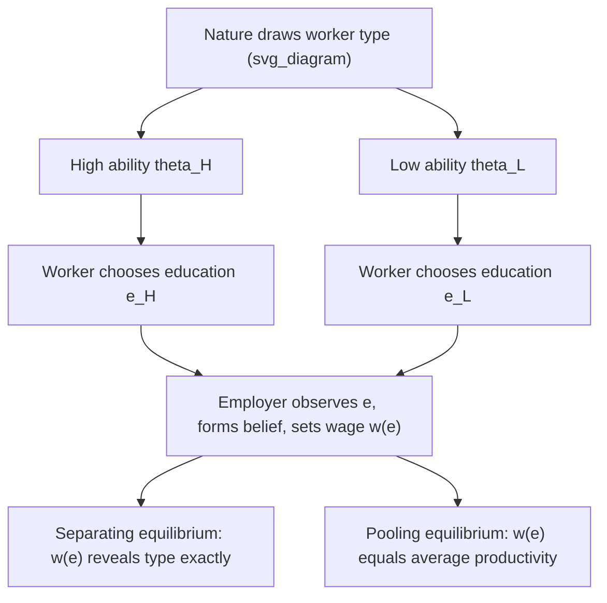
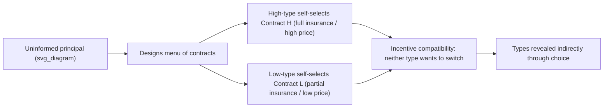

## Signaling, Screening, and Information Games

### Overview

Signaling, screening, and information games form the branch of game theory that studies strategic interaction under **asymmetric information** — where one party possesses private information (a "type") unknown to the other. This is central to negotiation theory because most real bargaining involves exactly this asymmetry: a seller knows more about product quality than a buyer, a job candidate knows more about their own ability than an employer, and a negotiating party knows its own reservation price/BATNA better than its counterpart does. Signaling and screening are the two complementary mechanisms by which such private information can be credibly communicated or extracted despite the incentive to misrepresent it.

### Core Distinction: Signaling vs. Screening

| Dimension | Signaling | Screening |
| --- | --- | --- |
| Who moves first | The **informed** party (the one with private information) | The **uninformed** party |
| Mechanism | Informed party takes a costly, observable action to credibly reveal type | Uninformed party designs a menu of options that induces self-selection by type |
| Classic example | Education as a signal of worker ability (Spence 1973) | Insurance contracts with deductible options that separate risk types (Rothschild-Stiglitz 1976) |
| Negotiation example | Offering a generous warranty to signal product quality | Offering a menu of price-quantity contracts to screen buyer valuations |

Both mechanisms address the same underlying problem — **adverse selection** — from opposite directions: signaling is *voluntary revelation by the informed*, screening is *induced revelation via mechanism design by the uninformed*.

### Formal Setup: Bayesian Games with Incomplete Information

Information games are modeled as **Bayesian games**, formalized by Harsanyi (1967-68). Key elements:

- **Types** $\theta_i \in \Theta_i$: private information held by player $i$ (e.g., high/low quality, high/low valuation)
- **Prior beliefs** $p(\theta_i)$: common-knowledge probability distribution over types, from which nature draws each player's actual type
- **Strategies** $s_i(\theta_i)$: a mapping from type to action, since a player's optimal action can depend on their private type
- **Bayesian Nash Equilibrium**: each player's strategy maximizes expected payoff given their type and given correct beliefs about other players' strategies-as-functions-of-type

$$s_i^*(\theta_i) \in \arg\max_{a_i} \; \mathbb{E}_{\theta_{-i}}\left[u_i(a_i, s_{-i}^*(\theta_{-i}), \theta_i, \theta_{-i})\right]$$

### The Spence Job-Market Signaling Model

**Setup**:

- Worker has innate productivity/ability $\theta \in \{\theta_L, \theta_H\}$ with $\theta_H > \theta_L$, known only to the worker
- Worker chooses education level $e \geq 0$ at cost $c(e, \theta)$, where crucially the **single-crossing property** holds: $\frac{\partial c}{\partial e} $ is lower for high-ability types (education is cheaper, in terms of effort, for the high-ability worker) — education itself need not raise actual productivity
- Employers observe only $e$ (not $\theta$) and set wages $w(e)$ equal to the expected productivity of workers who choose that education level, given competitive labor markets

**Separating equilibrium condition**: For a separating equilibrium to exist where $e_L = 0$ and $e_H = e^* > 0$, the education level $e^*$ must satisfy:

$$c(e^*, \theta_L) - c(0, \theta_L) > \theta_H - \theta_L > c(e^*, \theta_H) - c(0, \theta_H)$$

In words: the cost of acquiring education $e^*$ must be prohibitively high for the low type (deterring mimicry) but worthwhile for the high type (given the wage premium it secures), even though education adds **zero actual productivity** in the pure signaling model — its entire value is informational, not productive.

**Key result** [well-established]: multiple separating equilibria typically exist (any $e^*$ within a range satisfies the inequality), and the model exhibits **inefficiency**: the high type incurs real signaling costs purely to distinguish themselves, a pure deadweight loss relative to a full-information benchmark where types were directly observable.

### Diagram: Signaling Game Structure

### Pooling vs. Separating vs. Semi-Separating Equilibria

| Equilibrium type | Description | Characteristic |
| --- | --- | --- |
| **Separating** | Each type chooses a distinct action, fully revealing type | Uninformed party learns type exactly; may involve signaling costs (inefficiency) |
| **Pooling** | All types choose the identical action | No information is revealed; uninformed party's belief remains at the prior |
| **Semi-separating (partial pooling)** | Some types randomize or share actions while others separate | Partial information revelation; typically arises when strict separation is not incentive-compatible for all type combinations |

**Equilibrium refinement problem**: signaling games famously admit **multiple equilibria**, including pooling equilibria sustained purely by out-of-equilibrium beliefs (e.g., "if you deviate to any unexpected action, I'll believe you're the worst type"). Refinements such as the **Intuitive Criterion** (Cho-Kreps 1987) and **D1/D2 criteria** are used to eliminate equilibria supported by implausible off-path beliefs, narrowing the prediction set.

### Screening: The Rothschild-Stiglitz Insurance Model

**Setup**: An insurer (uninformed) faces a population of consumers with private accident probabilities — high-risk $p_H$ and low-risk $p_L$, with $p_H > p_L$. The insurer cannot observe individual risk type directly but can offer a **menu of contracts** (premium, coverage) pairs.

**Screening mechanism**: The insurer designs contracts so that each type **self-selects** into the contract intended for them, governed by incentive compatibility constraints:

$$U_H(\text{Contract}_H) \geq U_H(\text{Contract}_L) \quad \text{(high-risk prefers their own contract)}$$

$$U_L(\text{Contract}_L) \geq U_L(\text{Contract}_H) \quad \text{(low-risk prefers their own contract)}$$

**Typical solution structure**: high-risk types receive **full insurance** (since they're not tempted to mimic anyone), while low-risk types receive only **partial insurance** — a deliberately less attractive contract for high-risk types (via a lower coverage/higher deductible) that still separates the population, at the cost of the low-risk type being unable to fully insure even though they'd prefer to.

**Key result** [well-established for this class of model]: a **pooling equilibrium never exists** in the standard Rothschild-Stiglitz competitive setting — competition among insurers always allows a profitable "cream-skimming" contract to be offered that attracts only low-risk types away from any pooling contract, undermining it. In some parameter ranges, **no equilibrium exists at all** (a distinctive and much-discussed feature of this model), motivating extensions incorporating monopoly insurers, government mandates, or dynamic/repeated contracting.

### Diagram: Screening via Contract Menu

### Cheap Talk and Costless Signaling

Distinct from costly signaling (Spence), **cheap talk models** (Crawford-Sobel 1982) examine communication that is costless and non-binding — pure messages with no direct payoff consequence.

**Key finding**: informative communication is possible in equilibrium *only if* the sender's and receiver's interests are sufficiently aligned. The degree of information transmission is characterized by a **partition equilibrium**: the sender's type space is divided into a finite number of intervals, and the sender only reveals which interval their type falls into, not the exact type. As the conflict of interest between sender and receiver grows, the number of informative partitions shrinks — in the limit of sufficiently misaligned interests, **only babbling equilibria** survive (no information is credibly transmitted at all).

**Negotiation relevance**: this directly models pre-negotiation "positioning talk," non-binding indications of interest, and why purely verbal claims about reservation prices are generally not credible unless backed by costly signals or a demonstrated alignment of interests.

### Application to Negotiation Theory

| Mechanism | Negotiation Manifestation |
| --- | --- |
| Costly signaling | Offering a large upfront concession or a costly guarantee to signal genuine commitment or high-value information |
| Screening via menus | Offering a buyer a choice between multiple deal structures (e.g., price vs. royalty-based licensing) to reveal their true valuation or risk tolerance |
| Cheap talk / babbling | Unverifiable claims made during early-stage positioning ("we have another offer on the table") that rational counterparts should heavily discount absent corroborating signals |
| Separating equilibrium | A negotiator's willingness to accept a **contingent contract** (e.g., an earn-out) as a way to credibly signal confidence in their own private information (e.g., a seller's true belief about their firm's future performance) |
| Adverse selection unraveling | The **lemons problem** analog in negotiation: if only "bad deals" are willing to accept certain terms, rational counterparts unravel the market for that term entirely (Akerlof 1970 logic) |

### The Lemons Problem as the Unifying Adverse-Selection Frame

George Akerlof's "Market for Lemons" (1970) is the foundational adverse-selection result underlying both signaling and screening theory. If sellers know quality and buyers do not, and buyers can only offer a single price reflecting *average* quality, then sellers of above-average quality withdraw from the market (since the average price undervalues them), lowering the average quality of remaining sellers, which further lowers the price buyers are willing to pay — a downward unraveling that can eliminate the market for high-quality goods entirely, or in the extreme case, unravel the entire market.

$$\text{If } E[\theta \mid \text{market price } p] < \theta_{\min}^{\text{acceptable to sellers of type } \theta}, \text{ those sellers exit}$$

This unraveling logic explains why negotiation theorists emphasize mechanisms — warranties, inspections, staged payments, third-party certification, reputation — that either substitute for missing information or credibly generate it.

### Limitations and Critiques

- **Multiplicity of equilibria**: as noted, signaling games routinely have many equilibria supported by different off-path beliefs; equilibrium refinements (Intuitive Criterion, D1) narrow but do not always fully resolve this, and different refinements can select different equilibria.
- **Common knowledge of the game structure**: Bayesian games assume the type distribution, payoff structure, and rationality of all players are common knowledge — a strong assumption often violated in real negotiations where even the *structure* of private information is itself uncertain.
- **Static vs. dynamic tension**: real negotiations are dynamic and allow renegotiation of "contracts," which can undermine screening mechanisms designed for a one-shot setting; dynamic screening/signaling models are considerably more complex and less generally solved.
- **Behavioral deviations**: [Unverified — degree varies by context] Experimental evidence on cheap talk and signaling games finds people sometimes convey and use information beyond what strict equilibrium analysis predicts (e.g., overcommunication in cheap-talk experiments relative to Crawford-Sobel predictions), suggesting social preferences or bounded strategic reasoning affect real information transmission.

### Next Steps

- **Related Topics**: The Nash Bargaining Solution; Rubinstein's Alternating-Offers Model; Bargaining Under Incomplete Information (Myerson-Satterthwaite Theorem); The Lemons Problem and Market Unraveling (Akerlof); Cheap Talk and Crawford-Sobel Equilibria; Mechanism Design and the Revelation Principle; Reputation Effects in Repeated Negotiation; Auction Theory and Private Valuations