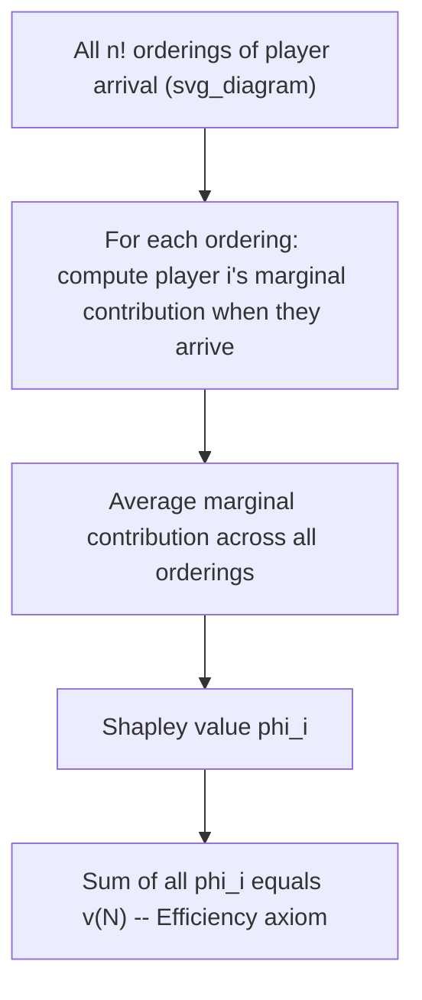
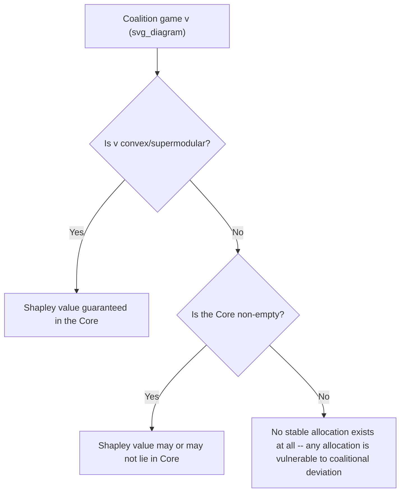

## Coalition Games and the Shapley Value

### Overview

Coalition games (cooperative games with transferable utility) extend bargaining theory beyond two parties to settings where any subset of a larger group of players can form a coalition and generate value jointly. The **Shapley Value** (Lloyd Shapley, 1953) is the most influential solution concept for this class of games: it provides a unique, axiomatically justified way to divide the total value created by the "grand coalition" (all players) among individual members, based on each member's average marginal contribution across all possible orders of coalition formation.

### Formal Setup: The Characteristic Function Game

A coalition game (also called a TU game — transferable utility game) is defined by:

- $N = \{1, 2, \ldots, n\}$: the set of players
- $v: 2^N \to \mathbb{R}$: a **characteristic function** mapping every possible coalition $S \subseteq N$ to the total value $v(S)$ that coalition can generate on its own, with $v(\emptyset) = 0$ by convention

The central question: given $v$, how should the value of the grand coalition $v(N)$ be divided among the $n$ individual players?

**Superadditivity** (a common but not universal assumption): $v(S \cup T) \geq v(S) + v(T)$ for disjoint $S, T$ — merging coalitions never destroys value, which is what makes forming the grand coalition attractive.

### The Shapley Value Formula

The Shapley value $\phi_i(v)$ for player $i$ is defined as:

$$\phi_i(v) = \sum_{S \subseteq N \setminus \{i\}} \frac{|S|!\,(n - |S| - 1)!}{n!} \Big[v(S \cup \{i\}) - v(S)\Big]$$

**Interpretation**: for every possible coalition $S$ that excludes player $i$, compute player $i$'s **marginal contribution** $v(S \cup \{i\}) - v(S)$ — how much value $i$ adds by joining $S$. Weight this marginal contribution by the probability that, if all $n!$ possible orderings of players joining the coalition sequentially were equally likely, player $i$ would arrive to find exactly the set $S$ already present. Sum across all possible $S$.

**Equivalent "random arrival order" formulation** (often more intuitive):

$$\phi_i(v) = \frac{1}{n!}\sum_{\pi \in \Pi(N)} \Big[v(P_i^\pi \cup \{i\}) - v(P_i^\pi)\Big]$$

where $\Pi(N)$ is the set of all $n!$ orderings (permutations) of the players, and $P_i^\pi$ is the set of players preceding $i$ in ordering $\pi$. In words: imagine players arrive one at a time in a uniformly random order; the Shapley value is each player's **expected marginal contribution** at the moment they arrive, averaged over all possible arrival orders.

### Worked Example: Three-Player Game

Consider a game with $N = \{1, 2, 3\}$ and characteristic function:

$$v(\emptyset) = 0, \quad v(\{1\}) = 0, \quad v(\{2\}) = 0, \quad v(\{3\}) = 0$$

$$v(\{1,2\}) = 90, \quad v(\{1,3\}) = 80, \quad v(\{2,3\}) = 70$$

$$v(\{1,2,3\}) = 120$$

Enumerate all $3! = 6$ orderings and compute Player 1's marginal contribution in each:

| Order | Player 1 joins after | Marginal contribution of Player 1 |
| --- | --- | --- |
| 1,2,3 | $\emptyset$ | $v(\{1\}) - v(\emptyset) = 0$ |
| 1,3,2 | $\emptyset$ | $v(\{1\}) - v(\emptyset) = 0$ |
| 2,1,3 | $\{2\}$ | $v(\{1,2\}) - v(\{2\}) = 90$ |
| 3,1,2 | $\{3\}$ | $v(\{1,3\}) - v(\{3\}) = 80$ |
| 2,3,1 | $\{2,3\}$ | $v(\{1,2,3\}) - v(\{2,3\}) = 50$ |
| 3,2,1 | $\{2,3\}$ | $v(\{1,2,3\}) - v(\{2,3\}) = 50$ |

$$\phi_1 = \frac{0+0+90+80+50+50}{6} = \frac{270}{6} = 45$$

By symmetry of the calculation (repeating for players 2 and 3):

$$\phi_2 = \frac{v(\{1,2\})-v(\{1\}) \text{ terms} \ldots}{6} = 40, \qquad \phi_3 = 35$$

**Verification (Efficiency check)**: $\phi_1 + \phi_2 + \phi_3 = 45 + 40 + 35 = 120 = v(\{1,2,3\})$ ✓ — the Shapley values exactly exhaust the total value created by the grand coalition.

### Diagram: Marginal Contribution Averaging

### The Shapley Axioms

Shapley proved his value is the **unique** allocation rule satisfying the following four axioms simultaneously:

**1. Efficiency (Pareto Efficiency)**

$$\sum_{i \in N} \phi_i(v) = v(N)$$

The entire value of the grand coalition is fully distributed among players — nothing is wasted, nothing is over-allocated.

**2. Symmetry**

If two players $i$ and $j$ are **interchangeable** — meaning $v(S \cup \{i\}) = v(S \cup \{j\})$ for every coalition $S$ containing neither — then $\phi_i(v) = \phi_j(v)$. Identical contributions imply identical allocations, regardless of arbitrary labeling.

**3. Null Player (Dummy Axiom)**

If player $i$ is a **null player** — meaning $v(S \cup \{i\}) = v(S)$ for every coalition $S$ (they add zero value no matter who they join) — then $\phi_i(v) = 0$. A player who contributes nothing receives nothing.

**4. Additivity (Linearity)**

For any two characteristic function games $v$ and $w$ defined on the same player set:

$$\phi_i(v + w) = \phi_i(v) + \phi_i(w)$$

If two independent games are combined (their values added), each player's allocation in the combined game equals the sum of their allocations in each separate game. This axiom has no direct bargaining-intuition analog but is essential for the uniqueness proof and reflects a strong form of consistency across unrelated value-generating activities.

### Alternative Characterization: Marginal Contribution via Random Order

An equivalent and often pedagogically clearer way to state the null-player and symmetry properties is that the Shapley value depends **only** on the pattern of marginal contributions defined by $v$, never on arbitrary player labels or how the game is described — a property sometimes emphasized as **anonymity**.

### Convex Games and Core Stability

A game is **convex** (supermodular) if for all $S \subseteq T \subseteq N \setminus \{i\}$:

$$v(S \cup \{i\}) - v(S) \leq v(T \cup \{i\}) - v(T)$$

i.e., a player's marginal contribution weakly increases as the coalition they're joining grows larger ("increasing returns to coalition size").

**Key result** [well-established, Shapley 1971]: in convex games, the Shapley value always lies in the **core** — the set of allocations where no coalition can profitably deviate and do better on its own:

$$\text{Core}(v) = \left\{ x \in \mathbb{R}^n : \sum_{i \in N} x_i = v(N), \; \sum_{i \in S} x_i \geq v(S) \; \forall S \subseteq N \right\}$$

This is significant because the core (unlike the Shapley value) can be **empty** in non-convex games — meaning no allocation is immune to coalitional deviation at all. When the core is non-empty but the game is not convex, the Shapley value is **not guaranteed** to lie within it. [Unverified — depends on specific game structure] Whether a given non-convex game's Shapley value happens to fall in a non-empty core must be checked case by case.

### Diagram: Core vs. Shapley Value Relationship

### Relationship to Two-Player Bargaining Concepts

| Concept | Relationship to Shapley Value |
| --- | --- |
| Nash Bargaining Solution | For a **2-player** TU game with disagreement point $d = (v(\{1\}), v(\{2\}))$, the Shapley value coincides exactly with the symmetric NBS split-the-difference rule: $\phi_i = v(\{i\}) + \frac{1}{2}\left[v(N) - v(\{1\}) - v(\{2\})\right]$ |
| Core | The core generalizes the "individually rational" region of bargaining to $n$ players and arbitrary coalitions, not just the grand coalition vs. individuals |
| Rubinstein alternating-offers | [Inference] No direct non-cooperative "implementation" as clean as the 2-player Nash program exists for the general Shapley value, though various non-cooperative bargaining protocols (e.g., Gul 1989, random-proposer models) have been shown under certain conditions to implement Shapley-value-like outcomes |

### Applications

- **Cost allocation**: dividing shared infrastructure costs (e.g., airport runway costs, utility grid costs) among users based on their marginal cost contribution — a classic and heavily used real-world Shapley value application
- **Revenue/profit sharing in joint ventures**: allocating profits among partners contributing different, complementary resources (capital, technology, distribution)
- **Cost/benefit allocation in supply chains**: dividing joint cost savings from coordinated logistics among multiple firms
- **Voting power indices**: the Shapley-Shubik power index applies the Shapley value framework to weighted voting games, measuring each voter's influence based on their frequency of being the "pivotal" voter across all orderings
- **Machine learning feature attribution**: [Well-documented modern application] SHAP (SHapley Additive exPlanations) values apply the Shapley framework to attribute a model's prediction across input features, treating each feature as a "player" contributing to the prediction "value"

### Limitations and Critiques

- **Computational complexity**: computing the exact Shapley value requires summing over $2^{n-1}$ coalitions (or equivalently $n!$ orderings) for each player, which becomes computationally intractable for even moderately large $n$; practical applications typically rely on Monte Carlo sampling approximations.
- **Requires full specification of $v(S)$ for every coalition**: in real multi-party negotiations, the value that *every possible subset* of parties could achieve together is often unknown or highly speculative to estimate, especially for coalitions unlikely to actually form.
- **Assumes transferable utility**: the standard Shapley framework requires that value can be freely transferred between players (e.g., via monetary side payments) — this doesn't hold when value is inherently non-transferable (e.g., non-monetary satisfaction, indivisible goods), requiring extensions to non-transferable-utility (NTU) games.
- **Additivity axiom is not always compelling**: unlike efficiency, symmetry, and the null-player property (all of which have direct fairness intuitions), the additivity axiom's justification is more technical/mathematical than normatively obvious, and some alternative solution concepts (e.g., the nucleolus) drop it in favor of different stability-focused criteria.
- **Ignores coalition formation process**: like the Nash Bargaining Solution, the Shapley value is a purely axiomatic/allocative concept — it says nothing about *how* the grand coalition actually forms, in what sequence, or under what negotiation protocol.

### Next Steps

- **Related Topics**: The Nash Bargaining Solution; The Core and Coalition Stability; The Nucleolus as an Alternative Solution Concept; Shapley-Shubik Power Index and Voting Games; Non-Transferable Utility (NTU) Games; SHAP Values in Machine Learning Interpretability; Multi-Party Negotiation and Coalition Formation Dynamics