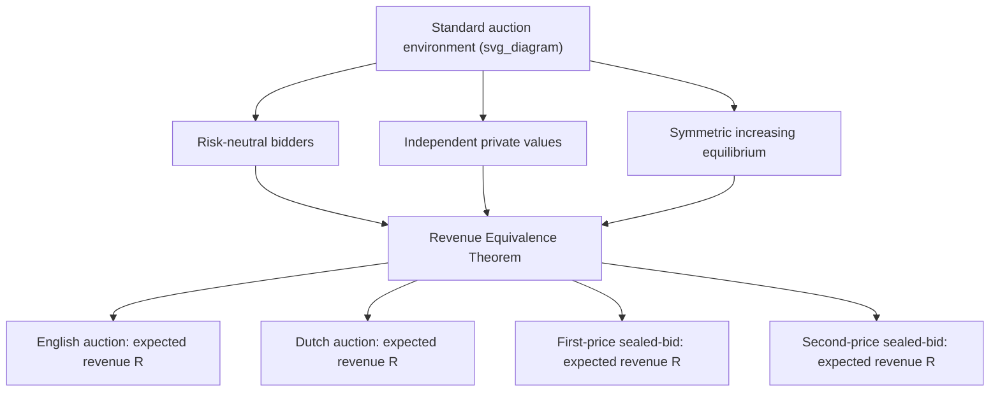
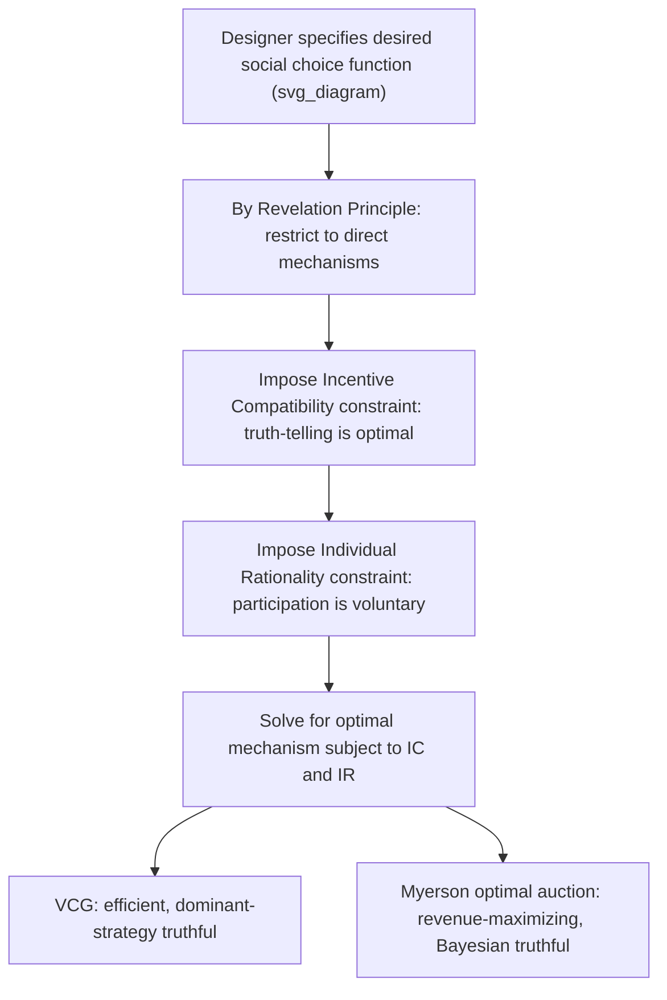

## Foundations of Auction Theory and Mechanism Design

### Overview

Auction theory and mechanism design study how to structure the **rules of interaction** (the "mechanism") among self-interested, privately-informed parties to achieve a desired outcome — efficiency, revenue maximization, or fairness — despite each party's incentive to misrepresent their private information. Where signaling and screening (covered separately) analyze behavior *within* a given informational structure, mechanism design **reverse-engineers the rules themselves**, asking: what game should the designer set up so that truthful, cooperative behavior becomes each participant's own rational best response? Auctions are the most thoroughly developed and empirically important special case of this broader theory, and both are foundational to negotiation theory because many negotiations are, structurally, unstructured or semi-structured auctions.

### Core Auction Formats

| Format | Rule | Winning bidder pays |
| --- | --- | --- |
| **First-Price Sealed-Bid** | All bidders submit sealed bids simultaneously; highest bid wins | Their own bid |
| **Second-Price Sealed-Bid (Vickrey)** | All bidders submit sealed bids simultaneously; highest bid wins | The **second-highest** bid |
| **English (Ascending)** | Auctioneer raises price continuously; bidders drop out; last remaining bidder wins | The price at which the second-to-last bidder dropped out |
| **Dutch (Descending)** | Auctioneer lowers price continuously from a high starting point; first bidder to accept wins | The price at which they accepted |

### The Vickrey Second-Price Auction and Dominant-Strategy Truthfulness

**Key result** [well-established, Vickrey 1961]: in a second-price sealed-bid auction with independent private values, **bidding one's true valuation is a weakly dominant strategy** — it is optimal regardless of what other bidders do.

**Proof sketch**: Let $v_i$ be bidder $i$'s true value and $b_i$ their bid. Let $B = \max_{j \neq i} b_j$ be the highest competing bid.

- If $b_i > B$: bidder wins and pays $B$, earning surplus $v_i - B$
- If $b_i < B$: bidder loses, earning 0

Compare bidding $v_i$ truthfully versus any $b_i \neq v_i$:

- If $v_i > B$: bidding truthfully wins (since $v_i > B$), earning $v_i - B > 0$. Underbidding below $B$ would lose this profitable win. Overbidding doesn't change the outcome (still wins, still pays $B$).
- If $v_i < B$: bidding truthfully loses (correctly, since winning at price $B > v_i$ would produce negative surplus). Overbidding above $B$ would force a loss-making win. Underbidding doesn't change the outcome (still loses).

In every case, deviating from $b_i = v_i$ either has no effect or makes the bidder strictly worse off — hence truthful bidding weakly dominates all other strategies.

### The Revenue Equivalence Theorem

**Statement** [well-established, Vickrey 1961; Myerson 1981; Riley-Samuelson 1981]: Under the standard auction environment — risk-neutral bidders, independent private values drawn from a common, strictly increasing, continuous distribution, and a symmetric equilibrium in which the highest-value bidder always wins — **all four standard auction formats (English, Dutch, first-price, second-price) yield the same expected revenue to the seller and the same expected payment from a bidder of any given valuation.**

**Intuition**: although the payment *rules* differ dramatically across formats, bidders adjust their bidding *strategies* in equilibrium to compensate. In a first-price auction, bidders shade their bids below their true value (since they pay what they bid); in a second-price auction, they bid truthfully (since they pay the second-highest bid, not their own) — and these offsetting adjustments produce identical expected outcomes.

**First-price sealed-bid equilibrium bidding function** (uniform values on $[0, \bar{v}]$, $n$ bidders): [Well-established closed-form result for this parametric case]

$$b(v) = \frac{n-1}{n} v$$

As $n \to \infty$, $b(v) \to v$: with many competitors, bid shading vanishes because the risk of losing by shading too aggressively dominates.

### Diagram: Auction Format Equivalence Under Standard Conditions

### Mechanism Design: The General Framework

Mechanism design inverts standard game-theoretic analysis: instead of taking the game's rules as given and solving for equilibrium behavior, the designer chooses the rules to induce a desired equilibrium outcome, subject to the constraint that participants cannot be forced to reveal information or participate — they must be given the right *incentives*.

**Core elements**:

- A set of possible **outcomes** $O$ (e.g., who wins an item, at what price)
- Each agent $i$ has private type $\theta_i$ determining their preferences over outcomes
- A **mechanism** $(M, g)$ consists of a message space $M_i$ for each agent and an outcome function $g: M_1 \times \cdots \times M_n \to O$

### The Revelation Principle

**Statement** [foundational result, Myerson 1979/1981; Gibbard 1973]: For any mechanism and any equilibrium of that mechanism, there exists an equivalent **direct mechanism** — one where each agent simply reports their type directly — in which **truthful reporting by every agent is itself an equilibrium**, and this direct mechanism achieves the exact same outcome as the original equilibrium.

**Significance**: this dramatically simplifies mechanism design theory. Rather than searching over the space of all conceivable (potentially arbitrarily complex) mechanisms, a designer can restrict attention to **direct, incentive-compatible mechanisms** without loss of generality — if a good outcome is achievable by *any* mechanism, it's achievable by a truthful direct one.

**Incentive compatibility (IC) constraint**, formally: for every agent $i$ and every possible misreport $\theta_i'$:

$$u_i(g(\theta_i, \theta_{-i}), \theta_i) \geq u_i(g(\theta_i', \theta_{-i}), \theta_i)$$

Truth-telling must yield at least as high a payoff as any lie, given everyone else reports truthfully.

### The VCG (Vickrey-Clarke-Groves) Mechanism

The VCG mechanism generalizes the Vickrey second-price auction's truthfulness property to arbitrary settings with multiple goods/outcomes and multiple agents with quasi-linear utility.

**Rule**:

1. Choose the outcome $o^*$ that maximizes total reported welfare: $o^* = \arg\max_o \sum_i v_i(o, \theta_i)$
2. Charge each agent $i$ a payment equal to the **externality** they impose on others — the reduction in others' total welfare caused by $i$'s presence:

$$p_i = \left[\max_{o} \sum_{j \neq i} v_j(o, \theta_{-i})\right] - \left[\sum_{j \neq i} v_j(o^*, \theta_{-i})\right]$$

**Key result** [well-established]: truthful reporting of $\theta_i$ is a **dominant strategy** for every agent under VCG, and the mechanism is **efficient** (it selects the welfare-maximizing outcome). This makes VCG the canonical solution whenever dominant-strategy truthfulness and efficiency are jointly desired, at the potential cost of the mechanism sometimes not being revenue-maximizing and, in some settings, running a budget deficit.

### Diagram: Mechanism Design Pipeline

### Myerson's Optimal Auction and Revenue Maximization

Myerson (1981) solved for the **revenue-maximizing** mechanism (not merely efficient one) under the standard independent-private-values environment, introducing the concept of **virtual valuation**:

$$\psi_i(v_i) = v_i - \frac{1 - F_i(v_i)}{f_i(v_i)}$$

where $F_i$ and $f_i$ are the CDF and PDF of bidder $i$'s value distribution.

**Key result**: the revenue-maximizing mechanism (under a "regularity" condition ensuring $\psi_i$ is increasing) allocates the good to the bidder with the **highest virtual valuation** (not simply the highest raw valuation), and sets an optimal **reserve price** below which the seller keeps the item unsold even if it's the only bid — this reserve price is generally *strictly positive* even for a monopolist selling to a single risk-neutral buyer with a certain, known valuation distribution, since some expected revenue from raising the floor outweighs the expected loss from occasionally failing to sell.

[Unverified — parametrized result specific to standard regularity assumptions] For symmetric bidders with identical, "regular" distributions, the optimal mechanism reduces to a standard second-price (or first-price, by revenue equivalence) auction with an appropriately chosen reserve price — no more exotic mechanism is needed to achieve the revenue-maximizing outcome in this symmetric case.

### Individual Rationality (Participation) Constraints

Alongside incentive compatibility, mechanisms typically must satisfy **individual rationality (IR)**: no agent should be made worse off by participating than by abstaining.

$$u_i(g(\theta_i, \theta_{-i}), \theta_i) \geq u_i(\text{outside option})$$

This constraint interacts with IC in mechanism design's central trade-off: extracting more surplus from informed agents (via cleverer mechanisms) is limited by the requirement that agents must still find it worthwhile to participate truthfully at all — this tension is the mechanism-design analog of the tension between bargaining power and deal feasibility in two-party negotiation.

### Relevance to Negotiation Theory

| Mechanism Design Concept | Negotiation Application |
| --- | --- |
| Revelation principle | Justifies designing structured negotiation processes (e.g., sealed best-and-final offers) that induce honest disclosure, rather than relying on open-ended haggling |
| VCG / dominant-strategy truthfulness | Basis for designing multi-party deal-allocation mechanisms (e.g., spectrum auctions, multi-item procurement) where honest bidding is each party's best strategy regardless of others' behavior |
| Reserve prices / optimal auction theory | Explains why sellers rationally set (and refuse to go below) a minimum acceptable price even when facing a single interested buyer — directly parallel to reservation price/BATNA logic in bilateral bargaining |
| Individual rationality constraints | Formalizes the requirement that any negotiated mechanism or deal structure must leave every party at least as well off as their outside option — the multi-party generalization of the two-party disagreement point |
| Incentive compatibility | Explains the value of structuring deal terms (e.g., earn-outs, staged payments, right of first refusal) so that each party's honest best interest aligns with revealing true information |

### Limitations and Critiques

- **Independent private values assumption**: much of the foundational theory (Revenue Equivalence, Myerson's optimal auction) assumes bidders' valuations are independently drawn; **common-value** or **interdependent-value** settings (e.g., oil-drilling rights, where the item's true worth is uncertain and correlated across bidders) introduce the **winner's curse** and require substantially different equilibrium analysis.
- **Risk neutrality assumption**: revenue equivalence breaks down under risk aversion; [well-established for this extension] risk-averse bidders bid more aggressively in first-price auctions than in second-price auctions, breaking the equivalence and typically making first-price format more profitable for a risk-neutral seller.
- **Collusion vulnerability**: real auction mechanisms, however theoretically elegant, remain vulnerable to bidder collusion (bid-rigging), which the base theory does not address without additional modeling of coalition/communication possibilities among bidders.
- **Computational and informational demands**: Myerson's optimal mechanism and VCG both require the designer to know (or estimate) the underlying value distributions or full preference structures — a strong informational requirement often unmet in real, ad hoc negotiation settings.
- **Complexity of real negotiations vs. idealized mechanisms**: real-world bilateral and multilateral negotiations rarely take the clean sealed-bid or ascending-price form assumed by the canonical models; applying these results requires substantial adaptation to messier, less formally structured bargaining environments.

### Next Steps

- **Related Topics**: The Nash Bargaining Solution; Signaling, Screening, and Information Games; Coalition Games and the Shapley Value; The Winner's Curse in Common-Value Auctions; Myerson-Satterthwaite Impossibility Theorem; Combinatorial Auctions and Spectrum Allocation; Collusion and Bid-Rigging in Auction Markets; Optimal Reserve Price Setting