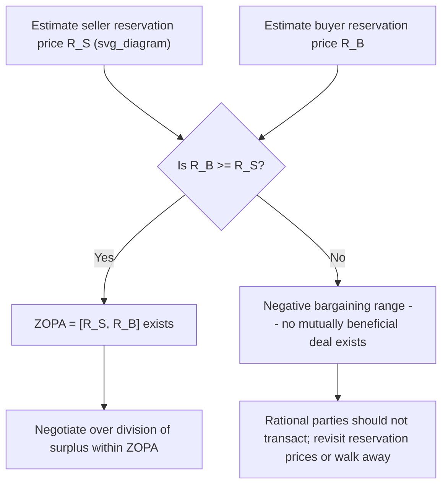
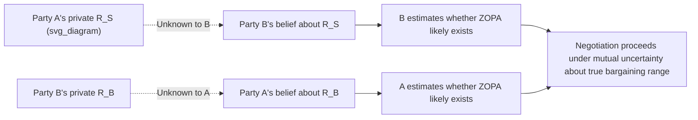

## The Zone of Possible Agreement and Bargaining Range

### Overview

The Zone of Possible Agreement (ZOPA), also called the bargaining range or contract zone, is the foundational concept of distributive (price/value) negotiation analysis. It defines the set of outcomes that both negotiating parties would prefer to reaching no agreement at all. Where game-theoretic models like the Nash Bargaining Solution formalize *which point* within this range will be selected, ZOPA analysis addresses the prior and more basic question: *does a mutually acceptable range even exist*, and if so, how wide is it. This makes ZOPA the practical, empirically operationalized counterpart to the more abstract feasible-set-and-disagreement-point formalism used in axiomatic bargaining theory.

### Formal Definition

For a simple single-issue (typically price) negotiation between a buyer and a seller:

- **Seller's reservation price** $R_S$: the minimum price the seller will accept — selling below this is worse than not selling at all
- **Buyer's reservation price** $R_B$: the maximum price the buyer will pay — paying more than this is worse than not buying at all

**ZOPA exists if and only if**:

$$R_B \geq R_S$$

When this holds, the Zone of Possible Agreement is the closed interval:

$$\text{ZOPA} = [R_S, R_B]$$

Any final price $p^* \in [R_S, R_B]$ makes both parties better off than disagreement (a "win" relative to their respective walk-away points), though the *distribution* of the resulting surplus between them still depends on relative bargaining power, information, and skill — exactly the question the Nash Bargaining Solution and Rubinstein's alternating-offers model are designed to answer.

**No-ZOPA condition (negative bargaining range)**:

$$R_B < R_S$$

In this case, no price simultaneously satisfies both parties' minimum requirements — there is no mutually improving trade, and rational parties (with accurate information about the situation) should not reach agreement. Persisting in negotiation when no ZOPA exists is a common source of wasted negotiation effort and can indicate that one or both parties hold inaccurate beliefs about the other's true reservation price.

### Worked Numerical Example

A seller lists a used car and privately will accept no less than $14,000 ($R_S = 14{,}000$). A buyer has a private budget ceiling of $16,500 ($R_B = 16{,}500$).

$$\text{ZOPA} = [14{,}000,\ 16{,}500\,]$$

The bargaining range spans $2,500 in **total surplus** available to be split between the parties. Any agreed price between $14,000 and $16,500 makes both parties better off than no deal; a final price of, say, $15,200 gives the seller a surplus of $1,200 over their reservation price and the buyer a surplus of $1,300 over theirs.

If instead the buyer's ceiling were $R_B = 13{,}000$, then since $13{,}000 < 14{,}000 = R_S$, no ZOPA exists, and a rational, fully-informed negotiation should end without a deal.

### Diagram: ZOPA on a Price Line

<svg xmlns="http://www.w3.org/2000/svg" viewBox="0 0 500 220" font-family="sans-serif">
<text x="250" y="20" text-anchor="middle" font-size="14" font-weight="bold">Zone of Possible Agreement (svg_diagram)</text>
<line x1="40" y1="120" x2="460" y2="120" stroke="black" stroke-width="1.5" />
<line x1="60" y1="110" x2="60" y2="130" stroke="black" />
<text x="40" y="150" font-size="11">Seller walks away</text>
<line x1="180" y1="105" x2="180" y2="135" stroke="#16a34a" stroke-width="2" />
<text x="130" y="170" font-size="11" fill="#16a34a" font-weight="bold">R_S = $14,000</text>
<rect x="180" y="112" width="180" height="16" fill="#bbf7d0" opacity="0.7" />
<text x="200" y="105" font-size="12" fill="#166534" font-weight="bold">ZOPA (mutual surplus zone)</text>
<line x1="360" y1="105" x2="360" y2="135" stroke="#2563eb" stroke-width="2" />
<text x="310" y="170" font-size="11" fill="#2563eb" font-weight="bold">R_B = $16,500</text>
<line x1="440" y1="110" x2="440" y2="130" stroke="black" />
<text x="400" y="150" font-size="11">Buyer walks away</text>
</svg>

### Diagram: Bargaining Range Decision Logic

### Relationship to Related Concepts

| Concept | Relationship to ZOPA |
| --- | --- |
| **BATNA** (Best Alternative to a Negotiated Agreement) | The reservation price is typically *derived from* the BATNA — a rational party will not accept terms worse than their best available alternative, so $R_S$ and $R_B$ are functions of each party's respective BATNA |
| **Reservation price / point** | Synonymous with the boundary values $R_S$, $R_B$ that define the ZOPA's edges |
| **Bargaining surplus / pie** | The total size of the ZOPA interval ($R_B - R_S$) represents the maximum joint value ("pie") available to be divided through agreement |
| **Nash disagreement point $d$** | In the two-party NBS formalism, $d = (u_1(R_S), u_2(R_B))$-equivalent utilities correspond to the reservation-price walk-away payoffs; the ZOPA interval is the utility-space projection of the feasible set $F$ restricted to individually rational outcomes |
| **Aspiration price / target price** | The price a party *hopes* to achieve, distinct from (and typically more ambitious than) their reservation price; aspiration prices anchor opening offers but do not define the true walk-away boundary |

### Multi-Issue ZOPA and Integrative Bargaining

The single-price ZOPA model extends naturally to negotiations involving multiple issues (price, delivery timeline, warranty terms, exclusivity, etc.), where the relevant concept becomes a **multi-dimensional feasible region** rather than a simple interval — directly analogous to the feasible set $F$ in the Nash Bargaining Solution framework.

**Key insight (integrative bargaining / logrolling)**: when parties place **different relative priorities** on different issues, the multi-issue ZOPA can be expanded (in the sense of reaching outcomes that are Pareto-superior to any single-issue-at-a-time compromise) by trading concessions across issues — one party conceding on the issue they value less in exchange for gains on the issue they value more. This is the formal underpinning of "expanding the pie" advice in negotiation practice, and connects directly to Pareto efficiency as an axiom of the Nash Bargaining Solution: a multi-issue agreement that fails to exploit differing priorities leaves unrealized joint surplus on the table, violating Pareto optimality.

### Information Asymmetry and ZOPA Estimation

In practice, neither party typically knows the other's true reservation price with certainty — reservation prices are **private information**, directly connecting ZOPA analysis to the signaling/screening framework covered elsewhere in this course. Key strategic implications:

- **Uncertainty about ZOPA existence**: a party may believe no ZOPA exists (and refuse to negotiate) due to inaccurate beliefs about the counterpart's true reservation price — information exchange, credible signals, and probing offers serve to narrow this uncertainty
- **Anchoring and first offers**: [Unverified — empirical magnitude varies by context and population] Behavioral negotiation research broadly finds that first offers exert an anchoring effect on final settlement prices, even when the offer conveys no genuine information about the ZOPA's true boundaries
- **Strategic misrepresentation risk**: since revealing one's true reservation price early can shift the ultimate split toward the counterpart's favor (an argument informally paralleling the game-theoretic logic that revealing private information can be exploited, per the Lemons Problem/signaling framework), parties often have an incentive to withhold or strategically misstate their true walk-away point

### Diagram: Estimating ZOPA Under Uncertainty

### Applications

- **Salary negotiations**: employer's budget ceiling and candidate's minimum acceptable compensation define the ZOPA; recruiters and candidates typically negotiate to avoid revealing exact reservation figures early
- **M&A and business sale negotiations**: buyer's maximum valuation and seller's minimum acceptable sale price, often informed by discounted cash flow models and comparable transaction benchmarks
- **Real estate transactions**: listing price and buyer's pre-approved budget or appraisal-based ceiling
- **Labor and union contract negotiations**: management's cost ceiling and union's minimum acceptable wage/benefit package, often estimated using strike-cost and replacement-cost models as BATNA proxies
- **International trade and diplomatic negotiations**: each party's minimum acceptable concession package relative to the status quo or unilateral action alternative

### Limitations and Critiques

- **Assumes fixed, known reservation prices**: real reservation prices can shift during negotiation itself (e.g., as new information emerges, deadlines approach, or relationships develop), making the ZOPA a moving target rather than a static interval fixed at the outset.
- **Single-dimension oversimplification**: the classic price-only ZOPA model, while pedagogically clear, understates the complexity of most real negotiations, which are typically multi-issue and where "surplus" cannot be reduced to a single scalar without further assumptions about how issues trade off.
- **Reservation prices are not always well-defined**: parties (especially in complex or novel negotiations) may not have a crisp, pre-computed walk-away number, and may instead form or revise their reservation price adaptively during the negotiation process itself, complicating the assumption of a fixed interval.
- **Does not by itself predict where within the range agreement lands**: ZOPA identifies *whether and how much* room for agreement exists, but (unlike the Nash Bargaining Solution or Rubinstein's model) offers no built-in prediction of the specific split — that requires supplementing ZOPA analysis with a bargaining-power or process model.

### Next Steps

- **Related Topics**: The Nash Bargaining Solution; Rubinstein's Alternating-Offers Model; BATNA and Reservation Value Analysis; Anchoring and First-Offer Effects in Negotiation; Integrative Bargaining and Multi-Issue Trade-Offs; Signaling, Screening, and Information Games; Distributive vs. Integrative Negotiation Strategy