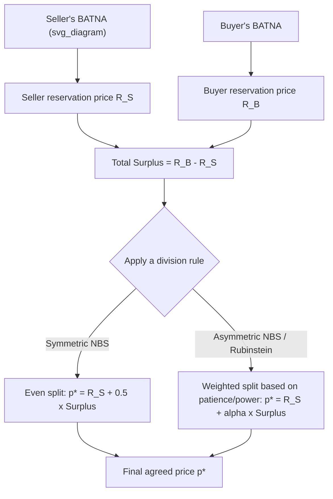

## Reservation Prices and Surplus Division

### Overview

Reservation prices are the individual walk-away thresholds that anchor every bargaining model covered in this course — they are the microfoundation from which the Nash disagreement point, Rubinstein's discounted continuation values, and the ZOPA boundaries are all constructed. This topic examines reservation prices in depth as objects in their own right: how they are formed, how they should rationally be derived from a party's outside options, and how the **total surplus** created by a deal — the gap between the parties' reservation prices — gets divided between them once a ZOPA is established. Surplus division is where the axiomatic (Nash), strategic (Rubinstein), and behavioral (anchoring, framing) strands of the course converge into a single applied question.

### Formal Definition of Reservation Price

A party's reservation price (also reservation value, or resistance point) is the value $R$ at which they are exactly indifferent between agreement and disagreement:

$$u(\text{agreement at } R) = u(\text{disagreement})$$

For a seller, $R_S$ is the minimum acceptable price; for a buyer, $R_B$ is the maximum acceptable price. Formally, each reservation price is derived from the party's **outside option** — most rigorously operationalized as their BATNA:

$$R_S = \text{value of Seller's BATNA}, \qquad R_B = \text{value of Buyer's BATNA}$$

This is the same $d = (d_1, d_2)$ disagreement point used in the Nash Bargaining Solution, expressed in price rather than abstract utility terms, and the same walk-away logic that defines the ZOPA interval $[R_S, R_B]$.

### Total Surplus and Its Division

**Total surplus (the "size of the pie")** created by an agreement at price $p^* \in [R_S, R_B]$:

$$\text{Total Surplus} = R_B - R_S$$

This quantity is fixed once reservation prices are set — it does not depend on where within the ZOPA the final price lands. What *does* depend on the final price is how that fixed surplus is **divided** between the two parties:

$$\text{Seller's surplus} = p^* - R_S$$

$$\text{Buyer's surplus} = R_B - p^*$$

$$\text{Seller's surplus} + \text{Buyer's surplus} = (p^* - R_S) + (R_B - p^*) = R_B - R_S = \text{Total Surplus}$$

This decomposition is the price-space equivalent of the utility-space decomposition $(u_1 - d_1) + (u_2 - d_2)$ that appears in the Nash product, and it is exactly what the Nash Bargaining Solution, split-the-difference rule, and Rubinstein equilibrium each propose to divide in a specific, model-dependent way.

### Worked Example: Linking Reservation Prices to Surplus Division Rules

Seller's reservation price $R_S = \$40{,}000$; buyer's reservation price $R_B = \$52{,}000$. Total surplus $= \$12{,}000$.

**Split-the-difference (symmetric Nash Bargaining Solution) prediction**:

$$p^* = R_S + \frac{1}{2}(R_B - R_S) = 40{,}000 + \frac{1}{2}(12{,}000) = \$46{,}000$$

Each party captures $6,000 of surplus — an even split of the total pie, consistent with the symmetry axiom of the NBS when neither party has a bargaining-power or patience advantage.

**Rubinstein-derived asymmetric prediction** (if, say, the seller is more patient, $\delta_S = 0.95$, and the buyer less so, $\delta_B = 0.75$):

Using the two-player alternating-offers formula with the seller as first proposer, the seller's *share of surplus* (not of the raw price, but of the $12,000 pie) is:

$$\text{Seller's share of surplus} = \frac{1-\delta_B}{1-\delta_S\delta_B} = \frac{1-0.75}{1-(0.95)(0.75)} = \frac{0.25}{1-0.7125} = \frac{0.25}{0.2875} \approx 0.870$$

$$p^* \approx R_S + 0.870 \times 12{,}000 = 40{,}000 + 10{,}435 = \$50{,}435$$

The more patient seller captures roughly 87% of the surplus, illustrating how the *same* reservation prices and total surplus can map to very different final prices depending on which bargaining-power model is assumed to govern the division rule.

### Diagram: From Reservation Prices to Final Price

<svg xmlns="http://www.w3.org/2000/svg" viewBox="0 0 500 220" font-family="sans-serif">
<text x="250" y="20" text-anchor="middle" font-size="14" font-weight="bold">Surplus Division Along the Bargaining Range (svg_diagram)</text>
<line x1="50" y1="120" x2="450" y2="120" stroke="black" stroke-width="1.5" />
<line x1="80" y1="105" x2="80" y2="135" stroke="#16a34a" stroke-width="2" />
<text x="35" y="155" font-size="11" fill="#16a34a">R_S = $40,000</text>
<line x1="420" y1="105" x2="420" y2="135" stroke="#2563eb" stroke-width="2" />
<text x="365" y="155" font-size="11" fill="#2563eb">R_B = $52,000</text>
<rect x="80" y="112" width="340" height="16" fill="#fef9c3" opacity="0.8" />
<line x1="250" y1="100" x2="250" y2="140" stroke="#a16207" stroke-width="2" stroke-dasharray="4,2" />
<text x="195" y="90" font-size="11" fill="#a16207" font-weight="bold">Even split: $46,000</text>
<line x1="376" y1="100" x2="376" y2="140" stroke="#dc2626" stroke-width="2" stroke-dasharray="4,2" />
<text x="330" y="180" font-size="11" fill="#dc2626" font-weight="bold">Patience-weighted: $50,435</text>
</svg>

### Determinants of Reservation Prices

| Determinant | Effect on Reservation Price |
| --- | --- |
| **Quality of BATNA** | A stronger outside option raises the reservation price (a seller with a better alternative buyer demands a higher $R_S$; a buyer with a better alternative seller accepts a lower $R_B$) |
| **Cost of delay / impatience** | Higher impatience (lower discount factor) effectively worsens a party's negotiating position, pulling their *achieved* price toward their reservation price rather than the full-surplus split — this is the direct link to Rubinstein's discounting mechanism |
| **Risk aversion** | [Inference — standard result from bargaining-under-uncertainty extensions] More risk-averse parties tend to accept worse terms to secure a certain agreement rather than risk protracted bargaining or breakdown, effectively softening their revealed reservation price |
| **Sunk costs already invested** | Rationally irrelevant to a correctly computed reservation price (sunk costs should not affect forward-looking BATNA comparisons), but behaviorally, parties frequently and incorrectly let sunk investment inflate their resistance point |
| **Private information about the good's true value** | In common-value or interdependent-value settings, reservation prices should be adjusted for the information conveyed by the other side's willingness to trade at all (the winner's-curse-adjacent logic from auction theory) |

### Reservation Prices Under Private Information

Because each party's reservation price is typically **private information** unknown to the counterpart, surplus division in practice is inseparable from the signaling/screening dynamics covered elsewhere in this course:

- A party's opening offer often functions as a (possibly cheap-talk, possibly costly) **signal** about their reservation price, subject to all the credibility problems the signaling framework identifies
- **Strategic misrepresentation incentive**: since revealing a true reservation price concedes the maximum possible surplus to the counterpart (if believed), rational parties have an incentive to overstate resistance in their own favor — up to the credibility limits imposed by the counterpart's ability to verify or walk away
- **Multiple equilibria / bargaining impasse risk**: [Well-established in bargaining-under-incomplete-information literature] When reservation prices are private and each side has an incentive to misrepresent, **inefficient impasse (failure to reach agreement despite a real ZOPA existing) becomes possible in equilibrium** — this is the substantive content of the Myerson-Satterthwaite impossibility result, which shows no mechanism can simultaneously guarantee efficiency, incentive compatibility, individual rationality, and budget balance when reservation prices are private

### Reservation Prices in Multi-Issue Negotiation

When negotiations span multiple issues, a single scalar reservation price generalizes to a **reservation utility level** over the full package of terms — a party is willing to accept any combination of price, timeline, warranty, etc., that delivers utility at least equal to their outside option, even if no single issue in isolation would clear their "reservation price" for that issue alone. This is what enables **integrative trade-offs**: a party may accept an inferior price term in exchange for a superior term on an issue they weight more heavily, so long as the overall package clears their aggregate reservation utility — directly extending the surplus-division logic from a single number to a multi-dimensional feasible-set problem, structurally identical to the Nash Bargaining Solution's treatment of $F$.

### Applied Estimation Methods

| Method | Application |
| --- | --- |
| **BATNA quantification** | Systematically pricing out the best realistically available alternative (e.g., competing offers, cost of in-house production vs. outsourcing) to anchor the reservation price in verifiable numbers rather than intuition |
| **Discounted cash flow / valuation modeling** | Used in M&A and business-sale contexts to derive a defensible reservation price range from projected cash flows |
| **Comparable transaction analysis** | Real estate, M&A, and licensing negotiations often anchor reservation prices to observed market comparables adjusted for deal-specific factors |
| **Sensitivity/scenario analysis** | Stress-testing the reservation price against uncertain future variables (e.g., market conditions, regulatory risk) to establish a defensible range rather than a single point estimate |

### Applications

- **Salary negotiation**: candidate's reservation wage derived from current compensation, competing offers, and cost of continued job search; employer's reservation wage derived from the cost of an alternative hire or leaving the position vacant
- **Supplier/procurement negotiations**: buyer's reservation price anchored to the cost of switching suppliers; supplier's reservation price anchored to marginal production cost plus minimum acceptable margin
- **Divorce and family law settlements**: reservation "prices" expressed in non-monetary terms (custody arrangements, asset division) derived from each party's realistic litigation outcome as the outside option
- **Post-merger integration and earn-out negotiation**: reservation prices dynamically shift as due diligence reveals new information, illustrating the non-static nature of resistance points in extended negotiations

### Limitations and Critiques

- **Assumes rational, stable BATNA computation**: real negotiators frequently miscalculate or fail to rigorously quantify their BATNA, leading to reservation prices that do not accurately reflect their true best alternative — a well-documented practical failure mode distinct from any deficiency in the theory itself.
- **Reservation prices can be endogenous to the negotiation itself**: information revealed during bargaining (e.g., learning the counterpart's true constraints) can legitimately and rationally shift a party's own reservation price mid-negotiation, complicating any model that treats $R_S$ and $R_B$ as exogenously fixed.
- **Anchoring and reference-dependence effects**: [Unverified — magnitude context-dependent] behavioral evidence suggests a party's stated or perceived reservation price can itself be influenced by the counterpart's opening offer (an anchoring effect on the resistance point, not just on the final settlement), which the purely rational model of a fixed, independently-derived reservation price does not accommodate.
- **Non-monetary and hard-to-quantify reservation values**: many real negotiations (custody, diplomatic, interpersonal) resist clean scalar reservation-price formalization, requiring reservation *utility* frameworks that are harder to estimate and communicate than a single price figure.

### Next Steps

- **Related Topics**: The Zone of Possible Agreement and Bargaining Range; The Nash Bargaining Solution; Rubinstein's Alternating-Offers Model; BATNA Analysis and Outside Option Valuation; Myerson-Satterthwaite Impossibility Theorem; Anchoring Effects and First-Offer Strategy; Integrative Bargaining and Multi-Issue Trade-Offs