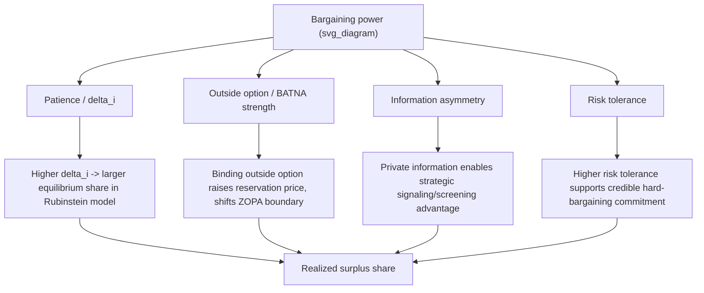

## Structural Determinants of Bargaining Power

### Overview

Bargaining power is the capacity to secure a disproportionate share of the surplus within the Zone of Possible Agreement. Rather than treating power as a vague or purely psychological attribute, this topic synthesizes the **structural** sources of bargaining power identified across the game-theoretic and economic models already covered — patience, outside options, information, and risk tolerance — into a unified analytical framework. Each of these determinants has already appeared as a formal parameter in an earlier model (the $\alpha_i$ weight in the generalized Nash Bargaining Solution, the $\delta_i$ discount factor in Rubinstein's model, the private type $\theta_i$ in signaling/screening games); this topic makes explicit how they combine and interact in practice.

### The Four Core Structural Determinants

| Determinant | Formal Origin | Mechanism |
| --- | --- | --- |
| **Relative patience / cost of delay** | Rubinstein's alternating-offers model ($\delta_1, \delta_2$) | The party who can better tolerate delay extracts a larger surplus share, since impatience is directly exploitable by the counterpart's willingness to wait |
| **Quality of outside options (BATNA)** | ZOPA and reservation-price framework | A stronger outside option raises a party's reservation price/effective disagreement payoff, shrinking the counterpart's achievable surplus and shifting the entire bargaining range in the stronger party's favor |
| **Information asymmetry** | Signaling/screening and mechanism design | Private information about one's own valuation, cost structure, or reservation price can be leveraged strategically, but also creates risk of costly signaling or impasse; controlling what the counterpart learns is itself a lever of power |
| **Risk tolerance** | Extensions to bargaining-under-uncertainty | A party more willing to risk negotiation breakdown (or better able to absorb the cost of an impasse) can credibly commit to harder positions, shifting the effective split in their favor |

### Formal Integration: Patience and Outside Options Combined

The cleanest formal synthesis combines Rubinstein's discounting mechanism with an explicit outside option, producing the **outside option principle**:

Let $o_1, o_2$ be each player's outside option payoff (available at any point during bargaining), and let $x^*_{\text{Rubinstein}}$ be the baseline alternating-offers equilibrium share absent any outside option. The equilibrium share becomes:

$$x^* = \begin{cases} x^*_{\text{Rubinstein}} & \text{if } o_1 \leq x^*_{\text{Rubinstein}} \text{ and } (1-o_2) \geq 1-x^*_{\text{Rubinstein}} \\ o_1 & \text{if } o_1 > x^*_{\text{Rubinstein}} \text{ (outside option binds for Player 1)} \end{cases}$$

**Key result** [well-established extension of Rubinstein's baseline model]: an outside option only affects the negotiated outcome if it exceeds what the player would obtain from the baseline bargaining process itself — a **weak** outside option (one below the baseline equilibrium share) has **zero effect** on the negotiated split. This is a frequently counter-intuitive but rigorously derived result: merely *having* an alternative does not, by itself, improve one's bargaining position unless that alternative is good enough to be binding.

### Diagram: Structural Power Determinants and Their Formal Channel

### Patience as a Structural Determinant: Formal Recap

As derived under Rubinstein's Alternating-Offers Model, for symmetric discounting $\delta_1 = \delta_2 = \delta$:

$$x^*_1 = \frac{1}{1+\delta}$$

Since this is strictly decreasing in $\delta$ when interpreted as *Player 2's* patience relative to fixed Player 1 patience, and by symmetry of the general formula $x^* = \frac{1-\delta_2}{1-\delta_1\delta_2}$, **Player 1's share is strictly increasing in $\delta_1$ and strictly decreasing in $\delta_2$**. Patience is a genuine structural determinant of power precisely because it is a primitive of the model, not a strategic choice made during the game — although in practice, parties may take costly actions specifically to *become* more patient (e.g., securing bridge financing to remove time pressure) or to convincingly signal impatience in the counterpart (e.g., publicizing a hard deadline).

### Outside Options as a Structural Determinant: Formal Recap

As established in the reservation-price framework, a stronger BATNA raises a party's effective reservation price, which mechanically:

1. Narrows the counterpart's achievable surplus share for any fixed total-surplus division rule
2. Under the outside-option-augmented Rubinstein model, can **directly** set the floor on that party's outcome if strong enough to bind

**Strategic implication**: since only binding outside options matter, a core piece of practical negotiation preparation is not merely "having options" but **actively cultivating and, where credible, disclosing an outside option strong enough to exceed the baseline bargaining equilibrium** — weak or unverifiable outside options provide no formal leverage.

### Information Asymmetry as a Structural Determinant

Drawing on the signaling/screening framework:

- A party holding **private favorable information** (e.g., a seller who knows their asset is higher-quality than the market believes) can potentially extract a premium via costly signaling, but bears the deadweight cost of the signal itself (per the Spence model)
- A party who can credibly **conceal** unfavorable private information (e.g., a weak BATNA) avoids having their reservation price effectively "screened out" by the counterpart's negotiation tactics (probing offers, structured concessions designed to elicit self-selection)
- **Asymmetric information can *reduce* total realized surplus** even while shifting its distribution, since (per Myerson-Satterthwaite) private information about reservation prices can cause bargaining impasse even when a real ZOPA exists — meaning information-based power plays carry genuine efficiency risk, not merely distributive consequences

### Risk Tolerance and Commitment as a Structural Determinant

[Inference — synthesis of established extensions to core bargaining models, not itself a single canonical theorem] A party more able to tolerate the risk of impasse or breakdown — whether due to genuinely lower risk aversion, a superior BATNA that makes breakdown less costly, or an ability to credibly commit to a hard position (e.g., via public commitments, delegated negotiators with limited authority, or contractual pre-commitment) — can shift the effective bargaining outcome in their favor by making their threats to walk away more credible. This connects to:

- **Schelling's commitment tactics**: deliberately reducing one's own future flexibility (e.g., publicly announced positions, burning bridges to alternatives) to make a hard bargaining stance credible, converting what would otherwise be an empty threat into one the counterpart must take seriously
- **Delegation as a commitment device**: appointing an agent/negotiator with limited or no authority to concede beyond a stated position, making one's own reservation price effectively non-negotiable in a verifiable way

### Diagram: How Structural Power Determinants Interact

<svg xmlns="http://www.w3.org/2000/svg" viewBox="0 0 500 300" font-family="sans-serif">
<text x="250" y="20" text-anchor="middle" font-size="14" font-weight="bold">Interaction of Power Determinants (svg_diagram)</text>
<rect x="40" y="50" width="150" height="50" rx="6" fill="#dbeafe" stroke="#2563eb" />
<text x="60" y="80" font-size="11">Patience (delta)</text>
<rect x="310" y="50" width="150" height="50" rx="6" fill="#dcfce7" stroke="#16a34a" />
<text x="330" y="80" font-size="11">Outside Option (BATNA)</text>
<rect x="40" y="150" width="150" height="50" rx="6" fill="#fef3c7" stroke="#a16207" />
<text x="55" y="180" font-size="11">Information Asymmetry</text>
<rect x="310" y="150" width="150" height="50" rx="6" fill="#fee2e2" stroke="#dc2626" />
<text x="345" y="180" font-size="11">Risk Tolerance</text>
<rect x="175" y="240" width="150" height="45" rx="6" fill="#e5e7eb" stroke="#374151" />
<text x="195" y="267" font-size="11" font-weight="bold">Realized Surplus Share</text>
<line x1="115" y1="100" x2="230" y2="240" stroke="#999" />
<line x1="385" y1="100" x2="270" y2="240" stroke="#999" />
<line x1="115" y1="200" x2="230" y2="240" stroke="#999" />
<line x1="385" y1="200" x2="270" y2="240" stroke="#999" />
</svg>

### Sources of Bargaining Power: A Consolidated Taxonomy

| Category | Examples | Formal Model Link |
| --- | --- | --- |
| **Time-based power** | Deadline pressure, cost of delay, financing runway | Rubinstein discounting ($\delta_i$) |
| **Alternative-based power** | Competing offers, in-house production capability, alternative trading partners | ZOPA / reservation price / outside-option-augmented Rubinstein |
| **Information-based power** | Private cost/valuation knowledge, market intelligence, verified vs. unverified claims | Signaling, screening, mechanism design |
| **Commitment-based power** | Public positions, limited-authority agents, contractual pre-commitments | Schelling-style credible commitment; connects to subgame-perfection refinements of simple Nash equilibrium reasoning |
| **Structural/positional power** | Market concentration, network effects, regulatory position, number of alternative counterparts (many-buyers-one-seller vs. bilateral monopoly) | [Inference] Extends bilateral bargaining models toward market-structure and matching-market theory (outside the two-party core models covered so far) |
| **Coalitional power** | Ability to form or threaten to form coalitions with third parties | Shapley value / core stability framework |

### Applications

- **Union-management wage negotiation**: strike funds (patience), alternative labor markets or automation options (outside options), private knowledge of firm profitability (information), and legal strike authorization thresholds (commitment) all function as identifiable structural power sources
- **Startup fundraising negotiations**: runway/burn rate (patience), competing term sheets (outside options), disclosed vs. undisclosed traction metrics (information), and pre-committed valuation floors (commitment)
- **International trade negotiations**: domestic political cycles creating deadline pressure (patience), alternative trade partners or blocs (outside options), classified economic data (information), and public negotiating mandates from legislatures (commitment)
- **Real estate transactions**: carrying costs of an unsold property or unmet housing need (patience), competing buyers/properties (outside options), private appraisal or inspection findings (information)

### Limitations and Critiques

- **Structural determinants interact non-additively**: the formal models above generally isolate one determinant at a time (patience *or* outside options); [Unverified — general closed-form results combining all four determinants simultaneously are not part of a single unified canonical model] real bargaining power reflects the joint, often non-linear interaction of multiple determinants at once, which the literature addresses piecemeal via targeted extensions rather than one comprehensive formal synthesis.
- **Perceived vs. actual power**: a party's *belief* about their own or the counterpart's patience, outside options, or resolve can diverge from the true structural reality, and negotiated outcomes often track perceived rather than actual power — reintroducing the signaling/information-asymmetry problem into the analysis of power itself.
- **Commitment tactics carry breakdown risk**: credible commitment strategies (per Schelling) that succeed in shifting the bargaining outcome also carry a genuine risk of mutual loss if both parties commit to incompatible positions simultaneously — the formal models generally do not fully price in this bilateral-commitment breakdown risk.
- **Static determinants in a dynamic reality**: most of the formal power determinants (particularly BATNA and information) can change materially over the course of an extended negotiation, meaning a structural analysis performed once at the outset may not remain accurate throughout a prolonged bargaining process.

### Next Steps

- **Related Topics**: The Nash Bargaining Solution; Rubinstein's Alternating-Offers Model; The Zone of Possible Agreement and Bargaining Range; Reservation Prices and Surplus Division; Signaling, Screening, and Information Games; Schelling's Theory of Commitment and Credible Threats; Coalition Games and the Shapley Value; Market Structure and Bilateral Monopoly Bargaining