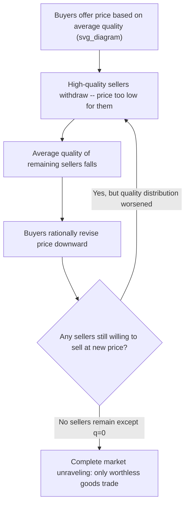

## Asymmetric Information and Adverse Selection

### Overview

Asymmetric information and adverse selection describe the family of problems that arise when one party to a potential transaction possesses relevant private information the other lacks, prior to the transaction taking place. This topic consolidates and deepens material touched on earlier under signaling/screening and reservation-price analysis, focusing specifically on the **market-unraveling** and **efficiency-loss** consequences of adverse selection — as distinct from the strategic mechanisms (signaling, screening) used to mitigate it. Where the earlier signaling/screening topic asked "how can private information be credibly communicated or extracted," this topic asks the prior question: "what goes wrong, structurally, when it isn't."

### Formal Definition and Timing

**Asymmetric information**: a strategic setting in which one party (the informed party) knows something relevant to the value of the transaction — quality, valuation, risk type, reservation price — that the other party (the uninformed party) does not know, and cannot costlessly verify.

**Adverse selection** refers specifically to asymmetric information that exists **before** the transaction/contract is agreed (a "hidden information" or "hidden type" problem), as distinct from **moral hazard**, which refers to asymmetric information about **actions taken after** a contract is signed (a "hidden action" problem). This chapter's focus — adverse selection — is the pre-contractual case most directly relevant to bargaining and surplus allocation, since it determines *who ends up transacting at all* and *at what terms*, before any post-agreement behavior comes into play.

$$\text{Adverse Selection: hidden type, occurs pre-contract} \qquad \text{Moral Hazard: hidden action, occurs post-contract}$$

### The Akerlof Lemons Model: Full Formal Treatment

**Setup**: A market for used cars. Sellers know their car's true quality $q \in [0, 1]$ (uniformly distributed); buyers cannot observe $q$ directly, only the market average.

- Seller's reservation value for a car of quality $q$: $v_S(q) = q$
- Buyer's valuation for a car of quality $q$ (assume buyers value cars more than sellers, generating potential gains from trade): $v_B(q) = \frac{3}{2}q$

If quality were observable, every car would trade (since $v_B(q) > v_S(q)$ for all $q > 0$), and price would simply track $q$.

**With asymmetric information**: buyers can only offer a price $p$ based on the **expected quality of cars actually offered for sale at that price** — not the full population average, but the average among the self-selected subset of sellers willing to sell at $p$.

**The unraveling mechanism**: Suppose buyers naively offer $p = \mathbb{E}[q] = 0.5$ (the population mean). Only sellers with $q \leq 0.5$ are willing to sell (since sellers with $q > 0.5$ value their car above the offered price). But then the *actual* average quality of cars on the market is $\mathbb{E}[q \mid q \leq 0.5] = 0.25$, not $0.5$. Rational buyers, anticipating this, will not actually offer $p = 0.5$ — they revise down to $p \approx \frac{3}{2}(0.25) = 0.375$. This in turn drives out sellers with $q \in (0.25, 0.5]$, further lowering the average quality of remaining sellers, triggering another downward price revision.

**Equilibrium result** [well-established for this specific parametrization]: this iterative unraveling continues until the only price/quality pair sustaining a market is $p = 0$, $q = 0$ — **the market for used cars of any positive quality collapses entirely**, even though gains from trade existed at every quality level under full information. This complete unraveling is a feature of this specific parametrization (where $v_B(q) = \frac{3}{2}q$ scales proportionally with $q$ and $\mathbb{E}[q\mid q\le p] $ shrinks proportionally); [Unverified — depends on functional form] other buyer/seller valuation functions can produce partial unraveling (some positive range of quality still trades) rather than complete market collapse.

### Diagram: The Unraveling Mechanism

### Adverse Selection in Insurance Markets (Rothschild-Stiglitz Recap)

As covered under signaling/screening, adverse selection in insurance arises because high-risk individuals are more eager to purchase insurance than low-risk individuals at any given pooled premium, so an insurer offering a single pooled contract based on the *average* population risk will disproportionately attract high-risk customers, worsening the insurer's actual risk pool relative to what the pooled premium assumed.

**Key adverse-selection-specific result** (distinct from the screening solution already covered): if insurers are **required** by regulation to offer only a single pooled contract (no risk-based screening menu allowed), the pooled premium must reflect the *self-selected* population of buyers who choose to purchase, not the full population — and if this self-selection is severe enough, the pooled market can **fail to clear at any premium low-risk types find acceptable**, a direct insurance-market analog of the lemons unraveling result.

### General Formalization: The Adverse Selection Condition

Adverse selection causes market failure (partial or complete unraveling) whenever the following holds: as the transaction price/premium decreases, the composition of the party willing to transact **worsens** for the uninformed party, such that:

$$\frac{\partial \, \mathbb{E}[\text{quality} \mid \text{willing to transact at } p]}{\partial p} > 0$$

Expected quality of the informed party's private type, conditional on being willing to transact, is **increasing in the price offered** — meaning a lower price doesn't just reduce quantity demanded/supplied in the standard way, it also degrades the *average quality* of what remains willing to transact. This is the formal signature that distinguishes adverse selection from an ordinary demand/supply response and is the reason adverse-selection markets can exhibit **discontinuous, cliff-edge unraveling** rather than smooth equilibrium price adjustment.

### Diagram: Adverse Selection vs. Standard Market Clearing

<svg xmlns="http://www.w3.org/2000/svg" viewBox="0 0 500 300" font-family="sans-serif">
<text x="250" y="20" text-anchor="middle" font-size="14" font-weight="bold">Standard vs. Adverse-Selection Market (svg_diagram)</text>
<line x1="50" y1="260" x2="230" y2="260" stroke="black" />
<line x1="50" y1="260" x2="50" y2="60" stroke="black" />
<text x="80" y="280" font-size="10">Standard Market</text>
<path d="M 60 80 L 220 220" stroke="#2563eb" stroke-width="2" fill="none" />
<text x="140" y="90" font-size="9" fill="#2563eb">Supply curve (upward)</text>
<line x1="270" y1="260" x2="450" y2="260" stroke="black" />
<line x1="270" y1="260" x2="270" y2="60" stroke="black" />
<text x="290" y="280" font-size="10">Adverse Selection Market</text>
<path d="M 280 250 L 340 150 L 320 100 L 280 70" stroke="#dc2626" stroke-width="2" fill="none" />
<text x="345" y="130" font-size="9" fill="#dc2626">Average quality falls as price falls -- unstable/backward-bending region</text>
</svg>

### Mitigating Mechanisms

| Mechanism | How It Addresses Adverse Selection |
| --- | --- |
| **Signaling** (Spence-type) | Informed party takes a costly action to credibly distinguish quality/type, restoring some information to the market at the cost of the signal itself |
| **Screening** (Rothschild-Stiglitz-type) | Uninformed party offers a menu of contracts inducing self-selection, at the cost of distorting the terms offered to at least one type relative to the full-information benchmark |
| **Warranties and guarantees** | A seller's willingness to offer a costly warranty is itself a credible quality signal, since low-quality sellers would find warranty costs prohibitive (a direct real-world instance of the Spence signaling logic) |
| **Third-party certification / inspection** | Directly resolves the informational asymmetry by introducing a verified, independent quality assessment (e.g., vehicle history reports, professional appraisals, credit ratings), sidestepping the signaling/screening apparatus by making $q$ observable at some verification cost |
| **Reputation mechanisms** | Repeated interaction (connecting to the repeated Prisoner's Dilemma framework) allows quality/honesty to be inferred from track record, substituting for direct information about a single transaction |
| **Mandatory disclosure regulation** | Legal requirements to disclose known defects/risks (e.g., real estate disclosure laws) directly shrink the informational gap rather than relying on voluntary signaling incentives |
| **Statistical discrimination / risk pooling with observables** | Insurers using observable correlates of risk type (age, driving record) to partially screen even without direct access to the true private risk type |

### Relevance to Negotiation Theory

| Concept | Negotiation Application |
| --- | --- |
| Lemons unraveling | Explains why negotiations over goods/services with unverifiable quality (e.g., freelance work, private company acquisitions, informal partnerships) are especially prone to breakdown or require costly verification mechanisms before a deal can proceed |
| Adverse selection condition | Diagnostic for when a counterpart's willingness to accept your offer is itself informative (and possibly bad news) — the "winner's curse" logic that a seller's eagerness to accept a low offer may signal the asset is worse than you think |
| Reputation as mitigation | Formal justification for why long-term business relationships and repeat-dealing sustain better terms than one-shot transactions with unknown counterparts, tying directly back to the repeated Prisoner's Dilemma's folk-theorem cooperation result |
| Mandatory disclosure / verification clauses | Explains the negotiation practice of building representations, warranties, and indemnification clauses into contracts specifically to reallocate the risk of undisclosed private information |

### Applications

- **Used goods and secondhand markets**: the original Akerlof domain — cars, real estate, secondhand equipment — where quality is costly for buyers to verify pre-purchase
- **Health and life insurance markets**: adverse selection is a central justification for mandatory universal enrollment policies (broadening the risk pool beyond self-selected high-risk applicants) in health insurance policy debates
- **Credit markets**: lenders face adverse selection when interest rates that are too high disproportionately attract the riskiest borrowers (those who know they are unlikely to repay), a phenomenon formally analyzed by Stiglitz-Weiss (1981) credit rationing models
- **Labor markets**: employers facing adverse selection when wage offers attract disproportionately lower-quality applicants at any given wage if higher-quality candidates have better outside options (connecting back to the Spence education-signaling resolution)
- **Mergers and acquisitions / venture financing**: due diligence processes exist substantially to counteract the adverse-selection risk that a company or founder seeking outside investment/acquisition may possess unfavorable private information about the business

### Limitations and Critiques

- **Complete unraveling is a knife-edge theoretical result**: [Unverified — sensitive to functional-form assumptions] real markets with known adverse-selection problems (e.g., used cars) do not typically collapse entirely, in practice sustained by the mitigating mechanisms above (warranties, certification, reputation) that the pure Akerlof model abstracts away.
- **Assumes fully rational, correctly-anticipating uninformed parties**: the unraveling logic requires buyers to correctly and fully anticipate the self-selection effect at every price step; [Unverified — behavioral economics literature] real market participants may underreact to adverse-selection dynamics, sustaining trade at prices the fully-rational model would predict should unravel.
- **Static, one-shot framing**: the canonical model is a single-period snapshot; dynamic and repeated-interaction settings (which enable reputation-based mitigation) substantially change the predicted severity of adverse selection, and most real markets are repeated rather than one-shot.
- **Requires a specific, often unverifiable, distributional assumption**: the degree and even existence of unraveling depends on the precise relationship between buyer and seller valuation functions and the underlying type distribution — assumptions that are analytically convenient but difficult to verify empirically in any specific real market.

### Next Steps

- **Related Topics**: Signaling, Screening, and Information Games; Reservation Prices and Surplus Division; Moral Hazard and Post-Contractual Opportunism; Myerson-Satterthwaite Impossibility Theorem; Foundations of Auction Theory and Mechanism Design (Winner's Curse); Reputation Effects and Repeated Games; Credit Rationing (Stiglitz-Weiss Model)