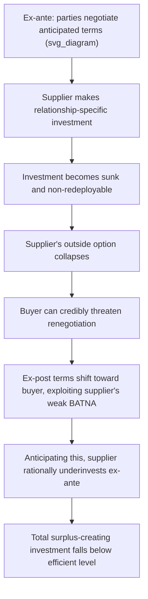

## Transaction Cost Perspectives on Negotiated Exchange

### Overview

Transaction cost economics (TCE), founded on the work of Ronald Coase (1937) and substantially developed by Oliver Williamson (1975, 1985), analyzes negotiated exchange not as a frictionless allocation of a fixed surplus but as a process burdened by real costs of searching, contracting, monitoring, and enforcing agreements. Where the earlier topics in this chapter (ZOPA, reservation prices, bargaining power, adverse selection) largely assume the *only* friction in exchange is strategic/informational, transaction cost theory adds a distinct and complementary lens: even with symmetric information and aligned incentives, exchange can fail or be structured very differently depending on the **costs of the exchange process itself** — and these costs, in turn, shape whether an exchange is negotiated in a market at all, or internalized within a firm to avoid negotiation altogether.

### The Coase Theorem and Its Negotiation Implications

**Coase's foundational insight** (1960, "The Problem of Social Cost"): in the absence of transaction costs, and regardless of the initial allocation of property rights, rational parties will bargain to the efficient (surplus-maximizing) outcome — because any inefficiency represents unrealized joint surplus that a costless negotiation would always find and capture.

$$\text{If transaction costs} = 0 \implies \text{parties negotiate to the efficient outcome, regardless of initial rights allocation}$$

**The critical corollary — and the actual point of the theorem**: this result is often invoked precisely to highlight that **real transaction costs are never zero**, and it is the *magnitude* of these costs, relative to the surplus at stake, that determines whether negotiation succeeds in reaching the efficient outcome, or breaks down, leaving inefficiency in place. This reframes every prior bargaining-failure result in this course (ZOPA absence, adverse-selection unraveling, Myerson-Satterthwaite impasse) as, in Coasean terms, instances where the effective transaction cost of achieving efficient exchange exceeds the available surplus.

### Taxonomy of Transaction Costs

| Category | Description | Example in Negotiation |
| --- | --- | --- |
| **Search and information costs** | Costs of finding a counterpart and determining the terms on which exchange is possible | Identifying a buyer/seller, conducting due diligence, market research |
| **Bargaining and decision costs** | Costs of the negotiation process itself, including time, effort, and any resources expended in reaching agreement | Legal fees, negotiator time, opportunity cost of delayed agreement, cost of a broken-down negotiation |
| **Policing and enforcement costs** | Costs of monitoring compliance with an agreement and enforcing it if violated | Litigation costs, contract-monitoring infrastructure, escrow/bonding arrangements |

Williamson's later refinement adds a focus on **asset specificity** as the key driver of these costs varying dramatically across different types of transactions.

### Williamson's Asset Specificity Framework

**Asset specificity**: the degree to which an investment made to support a specific transaction has significantly less value in any alternative use or with any alternative trading partner.

$$\text{Asset Specificity} \uparrow \implies \text{Hold-up Risk} \uparrow \implies \text{Transaction Costs of Market Exchange} \uparrow$$

**The hold-up problem**: once a party has made a relationship-specific investment (e.g., a supplier builds a factory adjacent to a single buyer's plant, tailored to that buyer's exact specifications), that party becomes vulnerable to **ex-post renegotiation** by the counterpart, who can now credibly threaten to walk away and impose the sunk, non-redeployable cost on the investing party unless terms are renegotiated in the counterpart's favor.

**Formal connection to the bargaining-power framework of this chapter**: asset specificity functions as a *structural power determinant* operating through the outside-option channel — once the specific investment is sunk, the investing party's outside option collapses (the specialized asset has little value elsewhere), which by the outside-option-augmented Rubinstein logic covered earlier **shifts negotiated terms decisively toward the non-investing party**, even though, ex ante (before the investment), both parties may have expected a fair split.

### Worked Example: Hold-Up as an Ex-Post Bargaining Power Shift

Suppose a supplier can build either a **general-purpose** factory (cost $10M, worth $8M if redeployed to any other buyer) or a **buyer-specific** factory (cost $10M, worth $1M if redeployed elsewhere, but $15M in value when serving this specific buyer).

**Ex-ante** (before investment), both options appear symmetric if the anticipated negotiated split is 50/50 of the created surplus.

**Ex-post** (after the specific investment is sunk), the supplier's outside option/BATNA has fallen from a general market value to just $1M (redeployment value). Applying the outside-option-augmented Rubinstein logic from the bargaining-power topic:

- If the baseline (no-outside-option) negotiated split of the $15M relationship value would give the supplier, say, $7.5M (symmetric split)
- But the supplier's now-collapsed outside option of $1M is *below* this baseline share, so per the outside option principle, **it does not bind** — the negotiated outcome remains at the baseline symmetric split *in this specific numerical case*

[Inference — the more commonly emphasized hold-up scenario] The classic hold-up problem becomes binding when the buyer can credibly threaten a *renegotiation* that pushes the supplier toward accepting a much smaller share of an already-reduced pie (e.g., renegotiating the price down toward the supplier's near-zero exit cost, since the supplier's realistic alternative to accepting harsh terms is abandoning $9M of sunk, non-redeployable investment) — this is what rational suppliers anticipate and **underinvest to avoid**, even when the specific investment would create more total value than the general-purpose alternative.

### Diagram: The Hold-Up Problem Sequence

### The Make-or-Buy Decision: Vertical Integration as a Transaction-Cost Response

Williamson's central prescriptive result: when asset specificity (and thus hold-up risk and negotiation/enforcement costs) is high enough, firms rationally choose to **internalize** the transaction — vertical integration — replacing repeated market negotiation with unified ownership and managerial fiat, precisely to eliminate the recurring hold-up-vulnerable negotiation entirely.

| Asset Specificity | Predicted Governance Structure |
| --- | --- |
| Low (general-purpose inputs, many alternative suppliers/buyers) | **Market exchange** — spot contracts, competitive bidding, minimal ongoing negotiation needed since switching partners is low-cost |
| Moderate | **Long-term relational contracts** — negotiated terms with built-in adjustment mechanisms, aiming to balance flexibility against contracting costs |
| High | **Vertical integration** — the transaction is removed from the negotiation/market domain entirely and resolved via internal hierarchy and authority |

This provides a distinct and important negotiation-theory insight: **the rational response to a bargaining problem that transaction costs make too costly to resolve is sometimes not a cleverer negotiation strategy, but restructuring the relationship so that a negotiation is no longer required at all.**

### Diagram: Governance Structure as a Function of Asset Specificity

<svg xmlns="http://www.w3.org/2000/svg" viewBox="0 0 500 260" font-family="sans-serif">
<text x="250" y="20" text-anchor="middle" font-size="14" font-weight="bold">Governance Choice vs. Asset Specificity (svg_diagram)</text>
<line x1="60" y1="220" x2="460" y2="220" stroke="black" stroke-width="1.5" />
<line x1="60" y1="220" x2="60" y2="50" stroke="black" stroke-width="1.5" />
<text x="380" y="240" font-size="11">Asset Specificity</text>
<text x="20" y="45" font-size="11">Governance Cost</text>
<path d="M 80 200 Q 250 190 300 100 Q 380 40 440 30" fill="none" stroke="#dc2626" stroke-width="2" />
<text x="330" y="60" font-size="9" fill="#dc2626">Market exchange cost (rises with hold-up risk)</text>
<path d="M 80 90 Q 250 100 440 130" fill="none" stroke="#2563eb" stroke-width="2" />
<text x="270" y="150" font-size="9" fill="#2563eb">Vertical integration cost (relatively flat)</text>
<line x1="245" y1="50" x2="245" y2="220" stroke="#16a34a" stroke-dasharray="4,3" />
<text x="195" y="45" font-size="10" fill="#16a34a">Crossover point</text>
</svg>

### Relational Contracting as an Intermediate Response

Between pure spot-market negotiation and full vertical integration, **relational contracts** — long-term agreements incorporating flexible adjustment clauses, dispute-resolution mechanisms, and reputation-based enforcement — allow parties to capture some specific-investment benefits while mitigating (though not eliminating) hold-up risk, without incurring the full costs of internalization (loss of market discipline, bureaucratic costs, reduced high-powered incentives). This connects directly to the **repeated-game cooperation** logic covered under the Prisoner's Dilemma: relational contracts function similarly to the "shadow of the future" mechanism that sustains cooperation in indefinitely repeated interactions, substituting for costly formal enforcement.

### Relevance to Negotiation Theory

| TCE Concept | Negotiation Application |
| --- | --- |
| Search costs | Explains why negotiators rationally limit the number of counterparts considered, and why intermediaries/brokers who reduce search costs command fees |
| Bargaining costs | Justifies structured negotiation processes (e.g., mediation, fixed-agenda protocols) that aim to minimize the direct cost of reaching agreement, independent of the split achieved |
| Enforcement costs | Explains the negotiated inclusion of arbitration clauses, performance bonds, and escrow arrangements as substitutes for costly litigation-based enforcement |
| Asset specificity / hold-up | Explains why parties negotiate protective contractual terms (exclusivity clauses, minimum purchase commitments, cost-sharing for specific investments) specifically to preempt anticipated ex-post renegotiation leverage |
| Vertical integration as an alternative to negotiation | Frames M&A and joint-venture decisions as, in part, a rational response to anticipated repeated negotiation costs that exceed the benefits of maintaining independent, negotiating parties |

### Applications

- **Supply chain contracting**: negotiated terms for specialized component suppliers routinely include long-term volume commitments and cost-sharing clauses specifically to address anticipated hold-up risk from relationship-specific tooling investments
- **Franchise agreements**: an intermediate governance form explicitly designed to capture some benefits of both market incentives (franchisee ownership) and hierarchical control (franchisor brand/quality standards), reducing the transaction costs that would arise from either pure market contracting or full corporate ownership of every outlet
- **Joint ventures and strategic alliances**: often structured specifically to enable relationship-specific investment (shared R&D, co-developed technology) while providing governance safeguards (board representation, exit clauses) against the resulting hold-up exposure
- **Employment contracts**: firm-specific human capital investment (specialized training) creates an employee-side hold-up-adjacent dynamic, which explains negotiated features like tenure protections, deferred compensation, and non-compete considerations

### Limitations and Critiques

- **Boundary of the firm is a discrete, coarse response**: [Inference] the market-vs-hierarchy dichotomy is a simplification; a large share of real economic activity occurs in hybrid governance forms (franchising, relational contracts, alliances) whose precise transaction-cost-minimizing structure the basic TCE framework predicts only qualitatively, not with quantitative precision.
- **Measurement difficulty**: transaction costs (search, bargaining, enforcement) are notoriously difficult to observe and quantify directly, making the theory's core predictions challenging to test rigorously and more often applied as an explanatory/qualitative framework than a precisely calibrated quantitative model.
- **Assumes bounded rationality and opportunism as behavioral primitives**: Williamson's framework explicitly assumes both bounded rationality (parties cannot write fully contingent contracts covering every future state) and opportunism (parties will exploit contractual gaps to their advantage); critics note this behavioral assumption set, while analytically productive, is itself a modeling choice rather than a universally validated description of negotiator behavior.
- **Understates non-cost motivations for governance choice**: firm boundaries and contracting choices are also shaped by considerations largely outside the pure transaction-cost lens (managerial risk aversion, capital market constraints, regulatory requirements, path-dependent organizational history), which the theory does not claim to fully explain on its own.

### Next Steps

- **Related Topics**: The Zone of Possible Agreement and Bargaining Range; Structural Determinants of Bargaining Power; Asymmetric Information and Adverse Selection; The Coase Theorem and Property Rights; Relational Contracting and Long-Term Agreements; Vertical Integration and Make-or-Buy Decisions; Reputation Effects in Repeated Negotiation