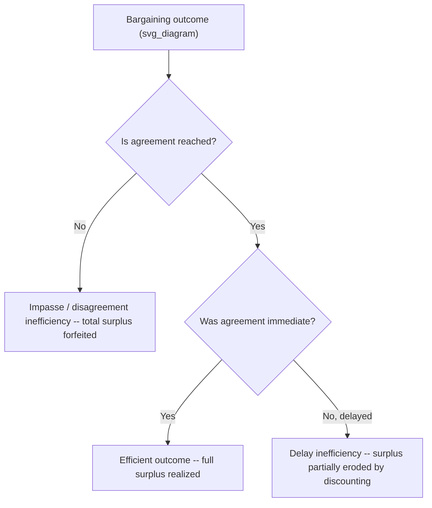
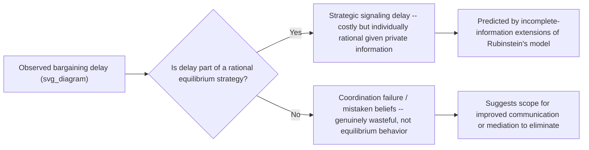

## Efficient Versus Inefficient Bargaining Outcomes

### Overview

This topic synthesizes the efficiency concept that has recurred, in different guises, across every model covered in this course — Pareto efficiency in the Nash Bargaining Solution, immediate agreement in Rubinstein's model, the Coase theorem's efficient benchmark, and the impasse risk implicit in adverse selection — into a single, unified framework distinguishing **efficient** from **inefficient** bargaining outcomes. The central organizing question is: under what conditions does rational, self-interested bargaining fail to realize the full available surplus, and what mechanisms explain each specific type of failure?

### Defining Efficiency in Bargaining

A bargaining outcome is **ex-post efficient** (or simply "efficient") if it is **Pareto optimal**: no alternative outcome exists that makes at least one party better off without making the other worse off. Formally, using the feasible-set notation from the Nash Bargaining Solution:

$$(u_1^*, u_2^*) \text{ is efficient} \iff \nexists (u_1', u_2') \in F \text{ s.t. } u_1' \geq u_1^*, \; u_2' \geq u_2^*, \text{ with at least one strict inequality}$$

**Two distinct dimensions of inefficiency** must be separated, since they arise from entirely different mechanisms:

1. **Delay inefficiency**: agreement is eventually reached, but later than immediately possible, wasting surplus to the discounting/time-cost of delay
2. **Impasse (disagreement) inefficiency**: no agreement is reached at all, despite a real ZOPA/positive surplus existing — the most severe form of inefficiency, since it forfeits the entire available gain from trade

### Diagram: Two Distinct Failure Modes

### Why Rubinstein's Baseline Model Predicts Immediate, Efficient Agreement

**Key recap result**: under complete information (both discount factors commonly known), Rubinstein's alternating-offers model yields **immediate agreement in equilibrium** — the unique SPE has the first proposer's offer accepted at $t=0$, with **zero actual delay** on the equilibrium path. This is a crucial and often under-appreciated feature: the *threat* of costly delay disciplines the offers made, but delay itself never needs to actually occur for the equilibrium to be efficient.

$$\text{Complete information} + \text{common knowledge of rationality} \implies \text{efficient (immediate) agreement in equilibrium}$$

This establishes complete information as a **sufficient condition for efficiency** in the baseline non-cooperative bargaining model — which sharpens the diagnostic question for real-world inefficient bargaining: if agreement is delayed or fails entirely, something beyond the baseline complete-information model must be present.

### The Central Driver of Inefficiency: Incomplete Information

**Myerson-Satterthwaite Impossibility Theorem** (1983) — the single most important formal result establishing that bargaining inefficiency is not merely a possibility but, under private information, an **unavoidable** feature of any mechanism satisfying a natural set of requirements:

**Setup**: A buyer with private valuation $v_B$ and seller with private valuation $v_S$, each independently drawn from overlapping, continuous distributions (so that gains from trade — $v_B > v_S$ — are possible but not certain).

**Theorem statement**: No bargaining mechanism can simultaneously satisfy all four of:

1. **Ex-post efficiency** — trade occurs whenever $v_B > v_S$
2. **Bayesian incentive compatibility** — truthful revelation of private valuations is optimal for both parties
3. **Individual rationality** — neither party is made worse off than not participating
4. **Budget balance** — no outside subsidy is required; payments between buyer and seller exactly cover the transaction (no money is destroyed or must be injected)

**Implication**: whenever both parties hold **private, overlapping-support valuations** — the generic bilateral trade setting — some **positive probability of costly impasse or trade failure is unavoidable** in any mechanism satisfying incentive compatibility, individual rationality, and budget balance. This is a genuine impossibility result, not merely a description of a poorly designed mechanism: even the *best possible* mechanism, correctly designed with full knowledge of the distributions, cannot eliminate this residual inefficiency.

### Diagram: The Myerson-Satterthwaite Trade-Off

<svg xmlns="http://www.w3.org/2000/svg" viewBox="0 0 480 260" font-family="sans-serif">
<text x="240" y="20" text-anchor="middle" font-size="14" font-weight="bold">Myerson-Satterthwaite Impossibility (svg_diagram)</text>
<circle cx="150" cy="140" r="80" fill="#dbeafe" opacity="0.6" stroke="#2563eb" />
<text x="95" y="100" font-size="10" fill="#2563eb">Ex-post Efficiency</text>
<circle cx="270" cy="140" r="80" fill="#dcfce7" opacity="0.6" stroke="#16a34a" />
<text x="280" y="100" font-size="10" fill="#16a34a">Incentive Compatibility</text>
<circle cx="210" cy="200" r="80" fill="#fef3c7" opacity="0.6" stroke="#a16207" />
<text x="175" y="245" font-size="10" fill="#a16207">Individual Rationality + Budget Balance</text>
<text x="195" y="150" font-size="11" font-weight="bold" fill="#dc2626">No mechanism satisfies all three regions</text>
</svg>

### Sources of Inefficiency: A Consolidated Taxonomy

| Source | Mechanism of Inefficiency | Connects To |
| --- | --- | --- |
| **Private information about valuations** | Bayesian incentive compatibility requires distorting allocation/payment rules away from the efficient benchmark, per Myerson-Satterthwaite | Signaling, screening, reservation-price privacy |
| **Adverse selection unraveling** | Self-selection based on price can eliminate trade in high-surplus segments of the market entirely | Asymmetric Information and Adverse Selection topic |
| **Strategic delay as costly signaling** | In incomplete-information bargaining, delay itself can serve as a credible (because costly) signal of a strong bargaining position, meaning some equilibria feature **deliberate, rational delay** as part of the informed party's optimal strategy | Extensions to Rubinstein's model with incomplete information |
| **Behavioral/psychological frictions** | Anchoring, overconfidence about one's bargaining position, or fairness-driven rejection of objectively surplus-positive offers (as in ultimatum-game experiments) | Reservation Prices; Prisoner's Dilemma behavioral deviations |
| **Transaction costs exceeding available surplus** | When search, bargaining, or enforcement costs exceed the total gains from trade, rational parties do not transact even absent any informational friction | Transaction Cost Perspectives topic |
| **Hold-up-driven underinvestment** | Anticipated ex-post inefficient renegotiation causes ex-ante inefficient (too-low) relationship-specific investment | Transaction Cost Perspectives — hold-up problem |

### Strategic Delay as a Signaling Device

[Well-established in the incomplete-information bargaining literature, extending Rubinstein's framework] When one party's bargaining strength (patience, cost structure, valuation) is private information, rational parties may sometimes find it optimal to **reject an early offer even though it exceeds their expected continuation value under complete information**, precisely because accepting quickly would reveal weakness, inviting worse subsequent treatment. This produces equilibria featuring costly, "wasteful" delay as a **rational** — though inefficient — strategic signal, distinct from delay caused merely by miscoordination or error. This is directly analogous to the Spence education-signaling result: a costly, otherwise-unproductive action (delay, or years of schooling) is undertaken purely for its informational value.

### Diagram: Delay as Costly Signal vs. Delay as Coordination Failure

### Measuring and Comparing Inefficiency

A useful summary metric, the **efficiency ratio**, compares realized surplus to the maximum available surplus:

$$\text{Efficiency Ratio} = \frac{\text{Realized Surplus (accounting for delay discounting and probability of impasse)}}{\text{Maximum Available Surplus (}R_B - R_S\text{ under immediate, full-information agreement)}}$$

For a bargaining outcome with probability $\pi$ of eventual agreement (versus impasse) and expected delay $t$ discounted at rate $\delta$:

$$\text{Efficiency Ratio} \approx \pi \cdot \delta^{t}$$

This makes explicit that impasse probability ($1-\pi$) and delay ($t$) are the two independently measurable components of any inefficiency diagnosis, directly operationalizing the two-failure-mode taxonomy introduced above.

### Mechanisms for Improving Efficiency

| Mechanism | How It Improves Efficiency |
| --- | --- |
| **Mediation / third-party facilitation** | Can improve information flow between parties, potentially narrowing (though, per Myerson-Satterthwaite, not eliminating) the impasse probability without directly changing either party's incentives |
| **Structured/sealed-offer processes (mechanism design)** | Approaches the Myerson-Satterthwaite frontier as closely as feasible for a given informational environment, even though full efficiency remains unattainable when private information is present |
| **Reputation and repeated interaction** | Reduces the incentive for strategic misrepresentation over time, since a party's track record substitutes for costly one-shot signaling |
| **Verification and disclosure mechanisms** | Directly shrinks the private-information gap that drives Myerson-Satterthwaite-style inefficiency, moving the environment closer to the complete-information case where Rubinstein's model predicts immediate efficient agreement |
| **Relational contracting / long-term agreements** | Spreads the cost of any single instance of inefficient bargaining across a longer relationship, reducing the *relative* stakes of any one negotiation's inefficiency |

### Relevance to Negotiation Theory: Synthesis

This topic functions as the natural capstone integration point for the course's economic-modeling chapter: efficiency (or its absence) is the outcome variable that every prior topic's mechanism ultimately acts upon —

- The **Nash Bargaining Solution** *assumes* efficiency as an axiom (Pareto optimality) and asks only about distribution
- **Rubinstein's model** *derives* efficiency as an equilibrium result, conditional on complete information
- **ZOPA and reservation prices** determine *whether* an efficient outcome is even possible in principle
- **Adverse selection and signaling/screening** identify the *specific informational mechanism* by which efficiency can fail
- **Transaction costs** identify a distinct, non-informational channel through which efficiency can fail
- **Myerson-Satterthwaite** proves that, once private information is present, some inefficiency is a **mathematical certainty**, not merely a risk to be managed away

### Limitations and Critiques

- **Myerson-Satterthwaite is a worst-case/impossibility result, not a point prediction**: [Unverified — theorem establishes that some inefficiency must exist under stated conditions, but does not by itself quantify how much inefficiency will occur in any specific real negotiation] the theorem's practical bite depends heavily on the specific distributions and mechanism actually used, which real-world calibration must estimate case by case.
- **Efficiency is not the only normatively relevant criterion**: this framework is silent on distributive fairness — an efficient outcome can still be highly unequal, and some negotiators/institutions may rationally accept some efficiency loss in exchange for a more equitable distribution (a value judgment outside the scope of the efficiency criterion itself).
- **Behavioral sources of inefficiency are harder to formally bound**: unlike the sharp, provable Myerson-Satterthwaite result for rational strategic behavior under private information, the magnitude of purely behavioral/psychological sources of bargaining failure (overconfidence, fairness-driven rejection, anchoring-induced impasse) is empirically variable and not derivable from a single unifying theorem.
- **Static single-negotiation framing**: this framework, like most in the chapter, primarily analyzes a single bargaining episode; in ongoing relationships, apparent "inefficiency" in one negotiation (e.g., a walked-away deal) may be part of an efficient long-run relational strategy (e.g., preserving a reputation for firmness), complicating any efficiency assessment confined to a single transaction in isolation.

### Next Steps

- **Related Topics**: The Nash Bargaining Solution; Rubinstein's Alternating-Offers Model; The Zone of Possible Agreement and Bargaining Range; Asymmetric Information and Adverse Selection; Transaction Cost Perspectives on Negotiated Exchange; Myerson-Satterthwaite Impossibility Theorem (deep dive); Mediation and Third-Party Facilitation Mechanisms; Behavioral Deviations from Rational Bargaining Predictions