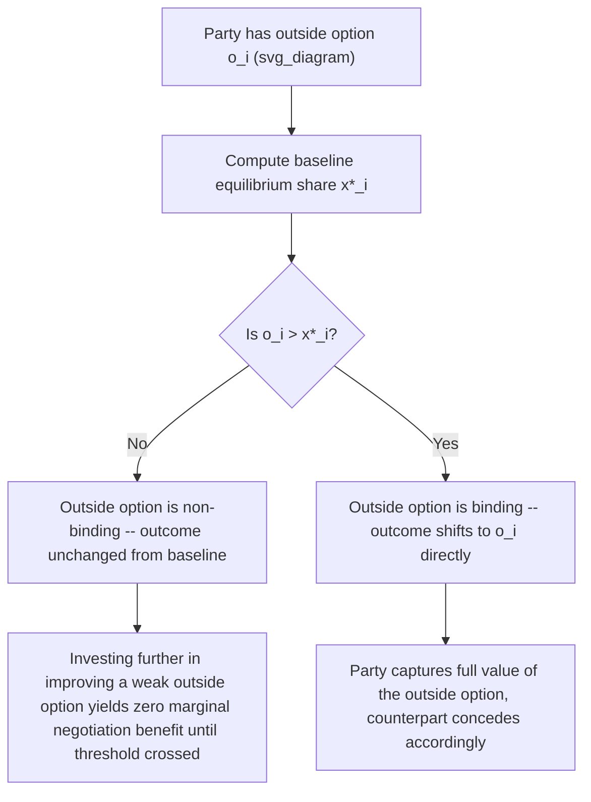

## Outside Options and Their Strategic Effects

### Overview

Outside options are the payoffs a party can secure by exiting a negotiation to pursue an alternative course of action, and this topic provides the formal deep-dive that earlier topics (ZOPA, reservation prices, structural bargaining power) referenced but did not fully derive: precisely how, why, and when an outside option affects a negotiated outcome. The central and most important result — already previewed under structural power determinants — is the **outside option principle**: an outside option only matters if it exceeds what a party would have received from the underlying bargaining process anyway. This topic works through the formal derivation, the conditions under which it holds, and its most important qualifications and extensions.

### Formalizing the Outside Option

Consider Rubinstein's alternating-offers model (baseline: no outside options, discount factors $\delta_1, \delta_2$) with equilibrium share $x^* = \frac{1-\delta_2}{1-\delta_1\delta_2}$ for Player 1.

Now introduce **outside options**: at any point where a player is called upon to respond to an offer, they may instead exit the negotiation permanently and receive a fixed payoff $o_1$ (for Player 1) or $o_2$ (for Player 2), normalized so the total pie is 1 and $o_1 + o_2 \leq 1$ (the outside options are not jointly more valuable than continued negotiation, otherwise negotiation itself would never occur).

**The Shaked-Sutton result (1984)** — the key formal extension of Rubinstein's model incorporating outside options:

$$x^{**} = \max\left(x^*, \, o_1\right) \quad \text{subject to compatibility with Player 2's outside option}$$

More precisely, the unique SPE payoff to Player 1 is:

$$x^{**} = \begin{cases} x^* & \text{if } o_1 \leq x^* \text{ and } o_2 \leq 1-x^* \\ o_1 & \text{if } o_1 > x^* \text{ (Player 1's outside option binds)} \\ 1-o_2 & \text{if } o_2 > 1-x^* \text{ (Player 2's outside option binds)} \end{cases}$$

### The Outside Option Principle, Stated Precisely

**An outside option changes the negotiated outcome if and only if it exceeds the share that party would have received from the baseline (no-outside-option) bargaining equilibrium.** An outside option below this threshold is termed a **non-binding** or **irrelevant** outside option — it has **exactly zero effect** on the negotiated split, even though the party genuinely possesses it and could, in principle, exercise it.

$$\text{Outside option } o_i \text{ affects outcome} \iff o_i > x^*_i \text{(baseline equilibrium share)}$$

This is one of the most important and frequently counter-intuitive results in bargaining theory: **merely having an alternative is not the same as having negotiating leverage.** A job candidate with a competing offer worth less than what they'd secure through negotiation anyway gains nothing from disclosing or invoking that offer, in this model's terms — although see the Limitations section for important qualifications to this stark prediction.

### Worked Numerical Example

Baseline setup: $\delta_1 = \delta_2 = 0.9$ (symmetric patience), so:

$$x^* = \frac{1}{1+0.9} = \frac{1}{1.9} \approx 0.526$$

**Case A — weak outside option**: Player 1 has an outside option $o_1 = 0.40$.

Since $0.40 < 0.526 = x^*$, the outside option does **not** bind. Player 1 still receives $x^{**} = 0.526$ — identical to the no-outside-option case. The outside option exists but confers zero strategic benefit.

**Case B — strong outside option**: Player 1 has an outside option $o_1 = 0.65$.

Since $0.65 > 0.526 = x^*$, the outside option **binds**. Player 1 now receives $x^{**} = 0.65$ — Player 2 must concede down to $1 - 0.65 = 0.35$ to keep Player 1 from exercising the outside option, a substantial improvement over the baseline for Player 1, driven entirely by the outside option's magnitude relative to the threshold.

### Diagram: The Binding/Non-Binding Threshold

<svg xmlns="http://www.w3.org/2000/svg" viewBox="0 0 500 260" font-family="sans-serif">
<text x="250" y="20" text-anchor="middle" font-size="14" font-weight="bold">Outside Option Binding Threshold (svg_diagram)</text>
<line x1="60" y1="130" x2="460" y2="130" stroke="black" stroke-width="1.5" />
<text x="465" y="135" font-size="11">o1 value</text>
<line x1="240" y1="100" x2="240" y2="160" stroke="#374151" stroke-width="2" />
<text x="180" y="90" font-size="11" font-weight="bold">x* = 0.526 (baseline share)</text>
<rect x="60" y="115" width="180" height="30" fill="#dcfce7" opacity="0.7" />
<text x="70" y="185" font-size="10" fill="#166534">Non-binding zone: o1 has zero effect on outcome</text>
<rect x="240" y="115" width="220" height="30" fill="#fee2e2" opacity="0.7" />
<text x="290" y="185" font-size="10" fill="#991b1b">Binding zone: x** = o1 directly</text>
<circle cx="150" cy="130" r="5" fill="#16a34a" />
<text x="130" y="220" font-size="10" fill="#16a34a">Case A: o1=0.40</text>
<circle cx="350" cy="130" r="5" fill="#dc2626" />
<text x="330" y="220" font-size="10" fill="#dc2626">Case B: o1=0.65</text>
</svg>

### Diagram: Decision Flow for Outside Option Effects

### Distinguishing Outside Options from the Disagreement Point

A crucial conceptual distinction, easily conflated:

| Concept | Definition | Timing |
| --- | --- | --- |
| **Disagreement point** ($d_i$, or the reservation price boundary) | Payoff if negotiation *never* reaches agreement — the permanent breakdown outcome | Relevant if bargaining fails entirely |
| **Outside option** ($o_i$) | Payoff available by *exiting* the negotiation at any point in favor of an alternative — a substitute for continuing to bargain, not merely for failing to agree | Available throughout the bargaining process, as an ongoing exit alternative |

In many models these coincide (the only alternative to agreement *is* permanent disagreement), but they are formally distinct whenever a party has a genuine **alternative transaction** available (e.g., a competing buyer, a different supplier) rather than simply "no deal at all." The Shaked-Sutton framework specifically models the outside-option case as distinct from, and generally more favorable to, the pure no-outside-option Rubinstein baseline.

### Strategic Implications: Investing in Outside Options

Because only *binding* outside options confer leverage, the model generates a sharp practical implication distinct from naive "always seek more alternatives" advice:

- **Below-threshold improvement is strategically wasted effort** (in terms of negotiation leverage specifically, though it may still have other value, e.g., risk diversification) — cultivating an outside option that remains below the baseline equilibrium share yields zero improvement in the negotiated outcome
- **The relevant threshold is a moving target**: since $x^*$ itself depends on both parties' patience ($\delta_1, \delta_2$), a party's outside option must be evaluated *relative to* the specific baseline that would otherwise apply — the same outside option might bind against an impatient counterpart but fail to bind against a very patient one
- **Disclosure strategy**: since a non-binding outside option changes nothing, and a binding one shifts the outcome substantially, parties have a strong incentive to disclose (and often credibly verify) outside options **only when they exceed the threshold** — connecting directly to the signaling/screening framework, since a party's willingness to disclose an alleged outside option is itself informative about whether it's likely to be binding

### Qualifications to the Strict Outside Option Principle

[Inference — well-established extensions and critiques of the baseline Shaked-Sutton result] Several important qualifications soften the stark "only binding outside options matter" prediction:

1. **Risk and uncertainty about the outside option's true value**: if the outside option's payoff is itself uncertain (e.g., a competing job offer might fall through), risk-averse parties may value certainty over the model's point-estimate comparison, giving even a nominally "non-binding" but low-risk outside option some real strategic weight
2. **Outside options as information, not just as threats**: even a non-binding outside option can convey information about a party's type (e.g., signaling that they are generally in-demand), with effects operating through the signaling channel rather than the direct bargaining-power channel modeled here
3. **Repeated interaction and reputation**: in a repeated bargaining relationship, cultivating outside options — even non-binding ones in any single instance — can matter for the party's reputation and hence their bargaining power in *future* negotiations, an effect entirely outside the single-shot Shaked-Sutton model's scope
4. **Multiple potential counterparts / competitive processes**: when a party can credibly threaten to negotiate with **several** alternative counterparts simultaneously (rather than a single fixed outside option value), the strategic dynamics shift toward auction-like competitive bidding, which can generate leverage effects not captured by the single-outside-option model

### Relevance to Negotiation Theory: Practical Synthesis

| Model Element | Practical Negotiation Guidance |
| --- | --- |
| Binding threshold $x^*$ | Before valuing any alternative as "leverage," compute (even informally) what the baseline negotiation would likely yield without it — the true test of a good outside option is whether it beats this baseline, not merely whether it exists |
| BATNA development advice | Refines the common negotiation-training advice to "always improve your BATNA" — the model shows this advice is correct only up to the binding threshold; effort spent improving an already-strong or already-weak BATNA past what changes the calculus yields diminishing or zero direct negotiation returns |
| Disclosure timing | Strategic disclosure of a genuinely strong outside option (verified, credible) can shift a negotiation immediately toward the outside-option value, while premature or unverifiable disclosure of a weak one risks revealing information for no strategic gain |
| Competing-offer negotiation tactics | Explains why real negotiators (e.g., job candidates, home sellers) actively cultivate *multiple simultaneous* competing processes rather than relying on a single alternative — approximating the auction-like leverage effects outside the basic single-outside-option model |

### Applications

- **Job offer negotiation**: a candidate's competing offer functions exactly as $o_1$ — its leverage depends entirely on whether it exceeds what the current employer would offer through ordinary negotiation, not merely on its existence
- **Real estate negotiations**: a seller's ability to credibly relist with another buyer, or a buyer's access to comparable available properties, function as outside options subject to the same binding/non-binding threshold logic
- **Supplier renegotiation**: a buyer's credible ability to switch suppliers (assuming low switching costs — connecting to the transaction cost/asset specificity framework) functions as an outside option that must exceed the negotiated baseline to matter
- **Union-management bargaining**: a firm's credible outside option of relocating production, or a union's credible strike threat and its resulting alternative income sources, are evaluated by both sides against the threshold logic before either changes bargaining behavior

### Limitations and Critiques

- **Requires common knowledge of the outside option's true value**: the sharp binding/non-binding threshold result assumes both parties correctly know $o_i$; under private information about the true value of an outside option, the clean threshold result breaks down into a more complex signaling problem.
- **Assumes a single, well-defined outside option value**: many real negotiations involve outside options that are themselves uncertain, multi-dimensional, or contingent on further negotiation (e.g., a "competing offer" that is itself still being negotiated), complicating the clean point-value comparison the model assumes.
- **Static single-negotiation framing understates dynamic/reputational value**: as noted, the strict model undervalues outside options that matter primarily for future negotiations or broader reputational signaling rather than the immediate bargaining outcome.
- **Behavioral evidence on outside option use**: [Unverified — context-dependent] experimental and field evidence on real negotiator behavior suggests parties do not always correctly calibrate the binding threshold, sometimes over-valuing weak outside options (irrational anchoring on "having options" per se) or under-utilizing genuinely strong ones due to disclosure reluctance or misjudgment of their own leverage.

### Next Steps

- **Related Topics**: The Zone of Possible Agreement and Bargaining Range; Reservation Prices and Surplus Division; Structural Determinants of Bargaining Power; Rubinstein's Alternating-Offers Model; Shaked-Sutton Extensions to Bargaining Theory; Signaling, Screening, and Information Games; BATNA Development and Negotiation Preparation Strategy