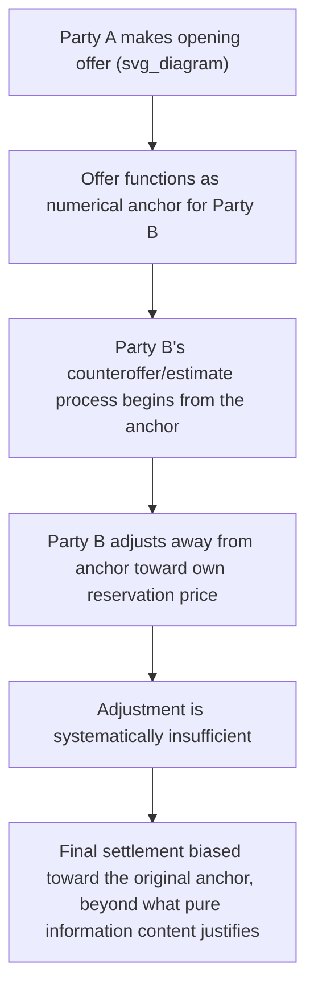

## Anchoring and Adjustment in Offer-Making

### Overview

Anchoring and adjustment is one of the most robust and heavily replicated findings in behavioral decision research (Tversky and Kahneman, 1974), and it applies with particular force to negotiation because negotiations require repeated numerical judgments — reservation price estimates, counteroffer sizing, valuation assessments — under exactly the conditions where anchoring effects are strongest. This chapter shifts the course's frame from the purely rational actors of the preceding game-theoretic and economic models to the **cognitive processes** that produce systematic, predictable deviations from those models' predictions. Anchoring is the natural starting point because it directly and measurably distorts the offer-making and reservation-price-formation processes that underlie every prior topic in this course.

### The Anchoring-and-Adjustment Heuristic: Core Mechanism

**Definition**: when making a numerical estimate or judgment under uncertainty, people tend to start from an initial value (the "anchor") — which may be arbitrary, self-generated, or provided by another party — and adjust away from it, but the adjustment is typically **insufficient**, leaving the final judgment biased toward the anchor.

$$\text{Final Judgment} = \text{Anchor} + \text{Adjustment}, \quad \text{where Adjustment is systematically too small}$$

**Original demonstration** (Tversky & Kahneman, 1974): participants asked to estimate the percentage of African countries in the United Nations first spun a rigged wheel of fortune landing on either 10 or 65, then were asked whether the true percentage was higher or lower than this number, and finally asked for their best estimate. [Well-documented original finding] Median estimates were substantially higher for participants who saw the anchor of 65 than for those who saw 10, despite the anchor being generated by a random wheel spin with **no informational content whatsoever** about the true answer.

### The Two Proposed Mechanisms

| Mechanism | Description | Distinguishing Feature |
| --- | --- | --- |
| **Insufficient adjustment** (original Tversky-Kahneman account) | The anchor is used as a starting point, and a deliberate but effortful adjustment process stops too early, typically at the first plausible value reached | Predicts anchoring effects should weaken with greater cognitive effort/incentive to adjust further |
| **Selective accessibility** (Strack & Mussweiler, 1997) | The anchor value activates anchor-consistent information in memory during the comparative judgment ("is it higher or lower than X"), biasing the subsequent absolute judgment even without any explicit adjustment process | Predicts anchoring effects can occur even for anchors known to be uninformative or randomly generated, since the bias operates via a different (semantic priming) pathway |

[Unverified — an active area of ongoing psychological research] The relative contribution of each mechanism in any given anchoring effect is not fully resolved, and modern treatments often regard both as contributing simultaneously depending on task structure.

### Anchoring in the Opening-Offer Context

**Core applied finding** [well-established across negotiation experiments, though the precise magnitude varies by study and context]: the first offer made in a negotiation functions as a powerful anchor on the final settlement price, with more aggressive (extreme) opening offers producing systematically more favorable final outcomes for the offering party, up to some limit where excessive extremity risks negotiation breakdown or reputational cost.

$$\text{Final Price} \approx \alpha \cdot (\text{First Offer}) + (1-\alpha) \cdot (\text{Counterpart's implicit reference point}), \quad 0 < \alpha < 1$$

This is directly distinguishable from the *rational* information-based effect of a first offer covered under the ZOPA/reservation-price topics — where a first offer can rationally update a counterpart's *beliefs* about the offering party's reservation price. **The anchoring effect operates in addition to, and independently of, any genuine informational content** — meaning even a first offer known (or strongly suspected) to be strategically inflated, with no real informational value, still measurably shifts final outcomes.

### Diagram: Anchoring's Effect on the Negotiated Outcome

<svg xmlns="http://www.w3.org/2000/svg" viewBox="0 0 500 260" font-family="sans-serif">
<text x="250" y="20" text-anchor="middle" font-size="14" font-weight="bold">Anchoring Pull on Final Settlement (svg_diagram)</text>
<line x1="50" y1="150" x2="450" y2="150" stroke="black" stroke-width="1.5" />
<line x1="120" y1="135" x2="120" y2="165" stroke="#16a34a" stroke-width="2" />
<text x="70" y="185" font-size="10" fill="#16a34a">R_S (seller reservation)</text>
<line x1="380" y1="135" x2="380" y2="165" stroke="#2563eb" stroke-width="2" />
<text x="335" y="185" font-size="10" fill="#2563eb">R_B (buyer reservation)</text>
<circle cx="250" cy="150" r="4" fill="#999" />
<text x="220" y="130" font-size="9" fill="#999">Rational midpoint (no anchor)</text>
<circle cx="350" cy="150" r="6" fill="#dc2626" />
<text x="305" y="220" font-size="10" fill="#dc2626" font-weight="bold">High anchor pulls settlement upward</text>
<path d="M 350 150 A 60 30 0 0 1 400 90" fill="none" stroke="#dc2626" stroke-dasharray="3,3" />
<text x="380" y="80" font-size="10" fill="#dc2626">Aggressive opening offer (anchor)</text>
</svg>

### Diagram: Anchoring Process Flow in Negotiation

### Moderating Factors: When Anchoring Effects Are Stronger or Weaker

| Factor | Effect on Anchoring Strength |
| --- | --- |
| **Ambiguity of the true value** | Anchoring effects are stronger when the negotiated item's true value is highly uncertain or has no clear market benchmark (e.g., unique assets, novel services) than when strong external reference points exist |
| **Expertise of the recipient** | [Unverified — mixed and context-dependent evidence] Some studies find that domain experts show reduced (though rarely eliminated) anchoring susceptibility for judgments within their expertise, but experts are not generally immune |
| **Plausibility/extremity of the anchor** | Extremely implausible anchors (far outside any reasonable range) tend to produce weaker anchoring effects than moderately aggressive but still plausible anchors, since highly implausible offers may be discounted or trigger reputational/relational costs rather than being processed as a genuine reference point |
| **Time pressure and cognitive load** | Anchoring effects are generally stronger under time pressure or high cognitive load, consistent with the insufficient-adjustment mechanism requiring effortful correction that degrades under load |
| **Multiple/repeated anchors** | Sequential anchors (e.g., a counteroffer that itself re-anchors the negotiation) can shift the reference point iteratively, compounding across a multi-round negotiation |

### Self-Generated Anchors: The Role of Preparation

A distinct and practically important anchoring channel involves **self-generated anchors** — a negotiator's own pre-negotiation target or aspiration price functions as an anchor on their own subsequent behavior, not only the counterpart's. [Inference — extension of the core anchoring mechanism to self-directed judgment, consistent with the broader anchoring literature] A negotiator who sets an ambitious personal target price before entering a negotiation tends to achieve better outcomes than one who does not, plausibly because the self-set target anchors the negotiator's own concession behavior and offer generation, not merely the counterpart's perception.

### Distinguishing Anchoring from Rational Bayesian Updating

This distinction is analytically important given the course's earlier emphasis on rational information transmission (signaling/screening):

| Rational Bayesian Updating | Anchoring Bias |
| --- | --- |
| A first offer updates beliefs about the offering party's reservation price *only to the extent the offer is informative* (e.g., costly to make, or consistent with observable market conditions) | A first offer shifts the final outcome *even when known to carry no genuine informational content* (e.g., in experiments using randomly generated anchors) |
| Predicts that transparently uninformative offers (e.g., a comically extreme "anchor" the counterpart knows is not credible) should have **zero** effect on final outcomes | Predicts that even transparently non-credible or randomly-generated anchors retain **measurable** effect, per the original wheel-of-fortune demonstration |
| Consistent with the game-theoretic signaling/screening framework covered earlier in the course | Represents a genuine departure from that framework's rationality assumptions, motivating this chapter's shift to behavioral analysis |

### Debiasing and Counter-Anchoring Strategies

| Strategy | Mechanism |
| --- | --- |
| **Consider-the-opposite technique** | Deliberately generating reasons the anchor might be too high or too low before responding, disrupting the selective-accessibility mechanism by activating anchor-inconsistent information |
| **Independent reservation-price pre-commitment** | Establishing one's own reservation price and target *before* hearing the counterpart's opening offer, reducing the anchor's influence on one's own subsequent judgments |
| **Immediate counter-anchoring** | Responding with one's own strong counteroffer promptly, rather than allowing extended deliberation anchored on the first offer, since (per the insufficient-adjustment account) more deliberation time anchored on a single reference point can entrench rather than reduce the bias |
| **External reference point introduction** | Actively introducing independently sourced, objective benchmarks (market comparables, appraisals) to compete with the counterpart's anchor as an alternative reference point |
| **Awareness/training interventions** | [Unverified — meta-analytic evidence on debiasing training effectiveness for anchoring specifically is mixed] Simply being warned about anchoring effects has shown inconsistent and generally modest success in fully eliminating the bias in experimental settings |

### Relevance to Negotiation Theory: Integration with Prior Topics

| Prior Concept | How Anchoring Modifies or Interacts With It |
| --- | --- |
| ZOPA and reservation prices | Anchoring can cause a party's *perceived* settlement range to shift even though the *true* underlying reservation prices (BATNA-derived) remain objectively unchanged — a wedge between the rational ZOPA framework and actual negotiated behavior |
| Nash Bargaining Solution / split-the-difference | Anchoring predicts systematic, offer-order-dependent deviations from the theory's prediction of a bargaining-power-determined (not first-offer-order-dependent) split |
| Structural bargaining power | Anchoring functions as an additional, non-structural lever on outcomes — a party with objectively weaker structural power (patience, BATNA) may nonetheless extract better terms purely through aggressive, well-anchored opening offers |
| Reservation price privacy / signaling | Anchoring provides a second, non-rational reason (beyond legitimate strategic information control) that parties benefit from making an assertive opening move, complicating a purely game-theoretic account of first-offer strategy |

### Applications

- **Salary negotiations**: candidates and employers who state a number first systematically shift the eventual settlement toward their stated figure, a widely cited practical implication in negotiation-skills training
- **Real estate listing and offer strategy**: initial list prices function as anchors on buyer offers and even on professional appraisers' subsequent valuations in some studies
- **Legal settlement negotiations**: initial settlement demands or damages estimates anchor subsequent negotiation and, in some studies, even jury damage awards
- **Procurement and vendor negotiations**: initial vendor quotes anchor buyer counteroffers, motivating buyer-side practices of soliciting multiple competing quotes specifically to generate independent reference points rather than anchoring on a single vendor's initial figure

### Limitations and Critiques

- **Effect size heterogeneity**: [Unverified — magnitude varies substantially across studies, populations, and stakes] while the *direction* of anchoring effects is highly robust, the *magnitude* in real high-stakes negotiations (as opposed to laboratory judgment tasks) is less precisely established, and some effects observed in low-stakes lab settings may attenuate under greater deliberation incentives and real financial stakes.
- **Mechanism debate remains unresolved**: as noted, the relative roles of insufficient adjustment versus selective accessibility are not fully settled, which limits precise theoretical prediction of exactly when debiasing strategies targeting one mechanism will succeed against effects actually driven by the other.
- **Interacts with, but does not replace, rational strategic behavior**: real negotiators are influenced by both legitimate rational-information effects (covered under signaling/ZOPA) and anchoring bias simultaneously, and disentangling the two in any specific observed negotiation outcome is empirically difficult.
- **Ethical and relational considerations understated**: purely tactical application of anchoring (e.g., extreme opening offers with no genuine basis) can damage trust and long-term relationships when discovered, a cost the narrow cognitive-bias literature does not itself model, though it connects back to the repeated-game/reputation considerations covered earlier in the course.

### Next Steps

- **Related Topics**: The Zone of Possible Agreement and Bargaining Range; Reservation Prices and Surplus Division; Structural Determinants of Bargaining Power; Framing Effects and Prospect Theory in Negotiation; Overconfidence and Miscalibration in Bargaining; Debiasing Strategies for Negotiators; Signaling, Screening, and Information Games