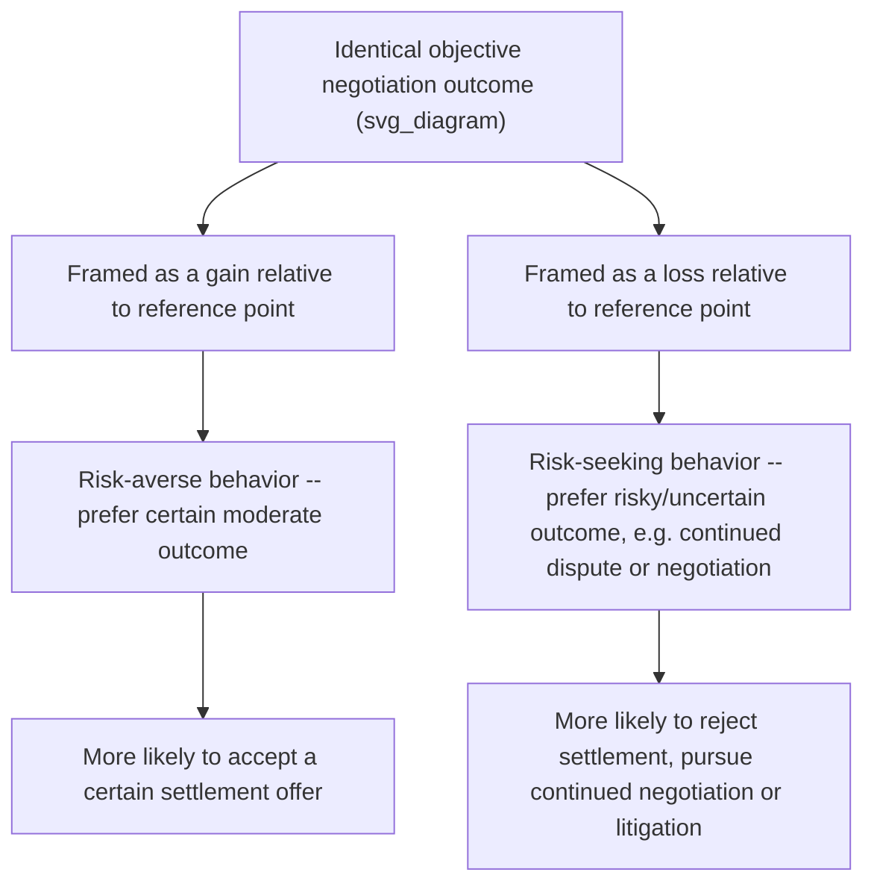
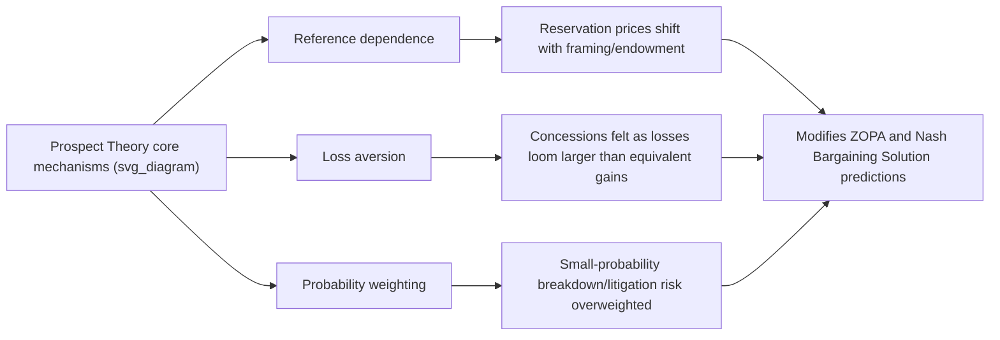

## Framing Effects and Prospect Theory

### Overview

Prospect Theory (Kahneman and Tversky, 1979) is the foundational descriptive model of decision-making under risk that replaced expected utility theory as the dominant behavioral account of how people actually evaluate uncertain outcomes — as opposed to how a fully rational expected-utility maximizer *should* evaluate them. Framing effects, its most direct and negotiation-relevant corollary, describe how logically equivalent descriptions of the same objective outcome (the same negotiated terms, expressed differently) can produce systematically different choices and evaluations. Together, these form the second pillar of this chapter's behavioral foundations, complementing anchoring by explaining not *where* a negotiator's reference point comes from, but *how* outcomes are evaluated once framed relative to that reference point.

### Expected Utility Theory: The Rational Benchmark Being Replaced

Under classical expected utility theory, a rational agent evaluates a risky prospect by the expectation of a utility function $u(\cdot)$ defined over **final wealth states**:

$$EU = \sum_i p_i \, u(w_i)$$

Crucially, this function depends only on **final absolute wealth levels** $w_i$, not on any reference point or how the outcome is framed — a rational expected-utility maximizer should be indifferent between logically identical descriptions of the same final-wealth distribution.

### Prospect Theory's Core Departures

Prospect Theory replaces this framework with a value function defined over **gains and losses relative to a reference point**, exhibiting three key properties:

**1. Reference Dependence**

Outcomes are evaluated as gains or losses relative to a reference point $r$ (often, but not always, the status quo), not as absolute final wealth states:

$$v(x) = v(x - r)$$

**2. Loss Aversion**

Losses loom larger than equivalent gains — the value function is steeper for losses than for gains of the same magnitude:

$$|v(-x)| > |v(x)| \quad \text{for } x > 0$$

The commonly cited loss-aversion coefficient $\lambda$ (the ratio of the slopes) is [Unverified — original and subsequent estimates vary by study and elicitation method, with early estimates around 2 to 2.5 being widely cited but not universally replicated at that exact magnitude] typically estimated in a range suggesting losses are felt roughly twice as intensely as equivalent gains, though the precise value is sensitive to methodology.

**3. Diminishing Sensitivity**

The value function is concave for gains (risk-averse in the gain domain) and convex for losses (risk-seeking in the loss domain) — the marginal psychological impact of an additional unit of gain or loss diminishes as one moves further from the reference point in either direction.

**Standard functional form** [as originally specified by Kahneman and Tversky, 1979; Tversky and Kahneman, 1992 for the cumulative version]:

$$v(x) = \begin{cases} x^{\alpha} & x \geq 0 \\ -\lambda(-x)^{\beta} & x < 0 \end{cases}$$

with $0 < \alpha, \beta < 1$ (diminishing sensitivity in both domains) and $\lambda > 1$ (loss aversion).

### Diagram: The Prospect Theory Value Function

<svg xmlns="http://www.w3.org/2000/svg" viewBox="0 0 500 320" font-family="sans-serif">
<text x="250" y="20" text-anchor="middle" font-size="14" font-weight="bold">Prospect Theory Value Function (svg_diagram)</text>
<line x1="60" y1="160" x2="460" y2="160" stroke="black" stroke-width="1.5" />
<line x1="260" y1="280" x2="260" y2="40" stroke="black" stroke-width="1.5" />
<text x="440" y="180" font-size="11">Gains</text>
<text x="70" y="180" font-size="11">Losses</text>
<text x="270" y="35" font-size="11">Value v(x)</text>
<path d="M 260 160 Q 340 120 430 90" fill="none" stroke="#16a34a" stroke-width="2.5" />
<text x="330" y="80" font-size="10" fill="#16a34a">Concave, risk-averse (gains)</text>
<path d="M 260 160 Q 150 250 90 275" fill="none" stroke="#dc2626" stroke-width="2.5" />
<text x="60" y="290" font-size="10" fill="#dc2626">Convex, risk-seeking (losses)</text>
<text x="230" y="150" font-size="10">Reference point (r)</text>
<circle cx="260" cy="160" r="4" fill="black" />
<text x="120" y="215" font-size="9" fill="#dc2626">Steeper slope: loss aversion</text>
</svg>

### The Probability Weighting Function

A second core departure from expected utility theory: people do not weight outcomes by their objective probabilities $p$, but by a **decision weight function** $\pi(p)$ that systematically:

- **Overweights small probabilities** — rare events (e.g., low-probability negotiation breakdown, or a rare favorable outcome) are given more psychological weight than their true probability warrants
- **Underweights moderate-to-high probabilities** — likely events are given somewhat less weight than their objective probability

$$\pi(p) \neq p, \quad \text{with } \pi(p) > p \text{ for small } p \text{ and } \pi(p) < p \text{ for moderate-to-large } p$$

This combination — overweighted small probabilities plus the loss/gain asymmetry — jointly explains the classic **fourfold pattern of risk attitudes**: risk-seeking for small-probability gains (lottery tickets) and large-probability losses (accepting a large near-certain loss to avoid an even larger low-probability one, e.g., litigation settlement dynamics discussed below), combined with risk-aversion for large-probability gains and small-probability losses (insurance purchase).

### Framing Effects: The Direct Negotiation-Relevant Corollary

**Core mechanism**: because evaluation is reference-dependent, describing the *same* objective outcome as a **gain** relative to one reference point or a **loss** relative to another reference point produces systematically different risk preferences and choice behavior, even though the underlying outcome is unchanged.

**Classic demonstration — the "Asian Disease Problem"** (Tversky & Kahneman, 1981): [Well-documented original finding] participants presented with an identical underlying set of outcomes (some people saved, some not, under either a certain or a probabilistic policy) made systematically different choices depending on whether the outcomes were described in terms of lives **saved** (a gains frame) versus lives **lost** (a losses frame) — preferring the certain option under a gains frame and the risky option under a losses frame, despite the two framings being mathematically identical.

### Gain-Frame vs. Loss-Frame in Negotiation Contexts

| Framing | Typical Effect on Negotiator Behavior |
| --- | --- |
| **Gain frame** (e.g., "you will receive $X") | Tends to induce **risk-averse** behavior — negotiators favor locking in a certain, moderate gain over risking a larger but uncertain gain |
| **Loss frame** (e.g., "you will forgo $Y") | Tends to induce **risk-seeking** behavior — negotiators favor gambling on a larger uncertain outcome (e.g., continued negotiation, litigation) over accepting a certain loss |

**Applied implication for concession framing**: [Inference — direct extension of the core gain/loss asymmetry to concession-sequencing advice, consistent with, though not a single specific canonical citation for, the underlying mechanism] a negotiator can potentially frame the *same* set of concessions differently to shift the counterpart's risk appetite — e.g., framing an offer relative to a demanding initial reference point (making the current offer look like a "gain" relative to what could have been demanded) versus relative to the counterpart's ideal outcome (making the same offer look like a "loss" relative to what they hoped for), predicting different acceptance/risk behavior for objectively identical terms.

### Diagram: Framing Effect on Negotiation Risk Preference

### Application: Litigation Settlement Framing

A frequently cited applied illustration [Inference — standard textbook application of the framing/risk-attitude asymmetry to litigation settlement decisions, consistent with the fourfold pattern described above, though specific settlement-rate findings vary by study population]:

- **Plaintiffs** typically evaluate a settlement offer against a reference point of the (uncertain, potentially larger) expected trial award — settling is thus framed as accepting a **certain gain**, and per the concave/risk-averse gain-domain shape of the value function, plaintiffs facing this frame tend toward risk-averse, settlement-favoring choices
- **Defendants** typically evaluate the same settlement offer against a reference point of avoiding the (uncertain, potentially larger) trial-loss exposure — paying the settlement is thus framed as accepting a **certain loss**, and per the convex/risk-seeking loss-domain shape of the value function, defendants facing this frame tend toward risk-seeking, trial-favoring choices

This asymmetry — plaintiffs relatively risk-averse (favoring settlement) and defendants relatively risk-seeking (favoring trial) purely due to the structural gain/loss framing of an economically symmetric bet — is a distinctive prediction of prospect theory not derivable from a standard expected-utility framework with a shared, symmetric risk-aversion parameter.

### The Endowment Effect: A Related Reference-Dependence Phenomenon

A closely related prospect-theory corollary: once a person possesses (or is framed as possessing, e.g., via a default allocation) an item or entitlement, the loss-aversion asymmetry causes them to demand substantially more compensation to give it up than they would have been willing to pay to acquire it in the first place — the **willingness-to-accept / willingness-to-pay gap**.

$$\text{WTA (compensation demanded to give up)} > \text{WTP (amount willing to pay to acquire)}$$

**Negotiation relevance**: this directly complicates the ZOPA/reservation-price framework covered earlier, since it implies a party's reservation price is not a fixed, endowment-independent number but can shift depending on which side of a default allocation they occupy — a seller's reservation price for an item they currently possess is systematically higher than their own hypothetical buying price for the identical item, purely due to the loss-aversion-driven endowment effect, independent of any genuine information about the item's value.

### Diagram: Prospect Theory's Modification of Standard Negotiation Concepts

### Relevance to Negotiation Theory: Integration with Prior Topics

| Prior Concept | Prospect Theory Modification |
| --- | --- |
| ZOPA and reservation prices | Reservation prices are not fixed but shift with reference point and endowment status, per the endowment effect |
| Nash Bargaining Solution surplus division | The theory's assumption of a stable, reference-independent utility function is directly challenged; a party's evaluated "surplus" depends on the framing of the reference point, not merely the objective payoff |
| Structural bargaining power / patience | Loss-averse framing of the cost of delay can make waiting feel disproportionately costly if framed as a loss (e.g., "losing" the current offer) versus a foregone gain, altering effective willingness to hold out beyond what pure discount-factor patience would predict |
| Anchoring and adjustment | Complementary rather than competing mechanism — anchoring explains where a numeric reference point comes from; prospect theory explains how outcomes are evaluated once framed relative to that (or any other) reference point |

### Practical Framing Strategies in Negotiation

| Strategy | Mechanism |
| --- | --- |
| **Frame concessions as gains relative to a demanding baseline** | Leverages the concave gains-domain value function to make an offer appear more attractive and induce risk-averse acceptance |
| **Frame the cost of impasse as a loss, not a foregone gain** | Leverages loss aversion to increase the counterpart's motivation to avoid breakdown, though this carries an ethical/relational dimension (see Limitations) |
| **Be aware of one's own susceptibility to loss-frame-induced risk-seeking** | Recognizing when one's own reluctance to "lock in a loss" (e.g., accepting a settlement below an anchored expectation) is driving irrational risk-seeking behavior (e.g., prolonging costly litigation) rather than a genuine expected-value-maximizing calculation |
| **Neutralize endowment-effect inflation** | Deliberately evaluating one's own reservation price as if approaching the transaction fresh (via the WTP frame) rather than the inflated WTA frame associated with current possession |

### Limitations and Critiques

- **Parameter estimates vary substantially across studies**: the specific curvature parameters ($\alpha, \beta$) and loss-aversion coefficient ($\lambda$) originally estimated by Kahneman and Tversky have been subject to considerable subsequent variation in replication and re-estimation across different populations, elicitation methods, and stakes; [Unverified] the qualitative pattern (loss aversion, diminishing sensitivity, probability weighting) is far more robust than any specific numerical parameter value.
- **Reference point determination is itself underspecified**: the theory does not fully specify, ex ante, what reference point a given negotiator will adopt in any particular context (status quo, expectations, a salient anchor, a counterpart's offer) — this is a genuine theoretical gap that limits precise a priori prediction, even though the theory is highly successful in explaining framing effects once the reference point is identified.
- **Loss aversion magnitude debate**: [Unverified — an active area of methodological debate] some recent research has questioned whether the classically cited loss-aversion coefficient is inflated by measurement artifacts in certain elicitation procedures, suggesting the "true" degree of loss aversion may be more modest or more context-dependent than early estimates suggested.
- **Ethical considerations of strategic framing**: deliberately exploiting a counterpart's framing susceptibility (rather than transparent, substantively-grounded persuasion) raises questions of manipulation that, like the anchoring tactics discussed previously, can undermine trust and long-term relational value if perceived as manipulative once recognized by the counterpart.

### Next Steps

- **Related Topics**: Anchoring and Adjustment in Offer-Making; The Zone of Possible Agreement and Bargaining Range; Reservation Prices and Surplus Division; The Endowment Effect and Ownership Bias; Overconfidence and Miscalibration in Bargaining; Loss Aversion in Concession-Making; Litigation Settlement Decision Modeling