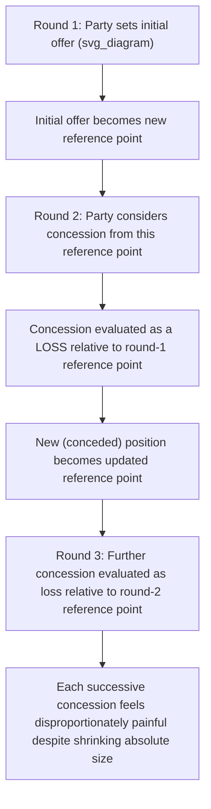
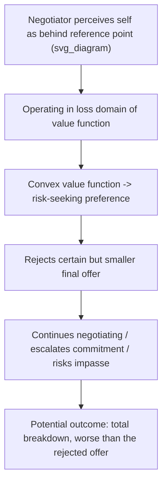

## Loss Aversion and Risk Preferences at the Table

### Overview

This topic provides a focused, applied deep-dive into loss aversion specifically as it manifests in live, at-the-table negotiation behavior — extending the general Prospect Theory foundation already established to the concrete moment-to-moment dynamics of concession-making, counteroffer evaluation, and the perceived pain of movement away from a negotiator's own prior offers. Where the previous topic built the formal value-function and framing apparatus, this topic asks: what specifically happens, psychologically and behaviorally, at each point where a negotiator must decide whether to concede, hold, or walk away — and how does loss aversion systematically distort these moment-to-moment choices relative to a rational, reference-independent benchmark.

### Loss Aversion Recap and the Concession-Specific Reference Point

Recall the core loss-aversion property of the Prospect Theory value function:

$$|v(-x)| > |v(x)| \quad \text{for } x > 0, \quad \text{with ratio } \lambda = \frac{|v(-x)|}{v(x)} > 1$$

**Applied to negotiation specifically**: the critical insight is that in an ongoing negotiation, the relevant reference point is frequently **not** the original status quo or the ultimate reservation price, but the party's **own most recent offer or concession**. Each concession a negotiator makes shifts their own internal reference point, meaning subsequent movement away from that new position is evaluated as a **loss relative to the just-established reference point** — not merely as a smaller-than-hoped-for gain relative to the original starting position.

$$\text{Reference point at round } t = \text{Party's own offer at round } t-1$$

This reference-point-updating dynamic is what produces the well-documented experience of concessions becoming **progressively more psychologically painful** as a negotiation proceeds, even when each successive concession is objectively smaller in absolute terms than the concessions that preceded it.

### Diagram: The Shifting Reference Point Across Rounds

### Formal Consequence: Concession Aversion and Negotiation Impasse Risk

Combining the shifting-reference-point mechanism with the loss-aversion coefficient $\lambda$ produces a testable behavioral prediction distinct from a rational, fixed-reservation-price bargaining model:

$$\text{Perceived cost of conceding amount } \Delta \approx \lambda \cdot \Delta, \quad \text{rather than} \quad \Delta$$

**Consequence for the models covered earlier in this course**: this inflates the effective "cost" side of any concession relative to what the rational Nash Bargaining Solution or Rubinstein alternating-offers framework assumes, which — holding true underlying reservation prices and patience constant — predicts:

1. **Smaller equilibrium concessions per round** than a purely rational, non-loss-averse model would predict, since each unit of concession carries amplified subjective cost
2. **Elevated impasse risk**, connecting directly to the efficiency framework covered earlier — loss-averse negotiators may reject an objectively surplus-positive final offer because the required concession from their current (already-shifted) reference point feels disproportionately costly, even when the resulting outcome would exceed their true underlying reservation price

### Diagram: Loss-Averse Concession Cost vs. Rational Concession Cost

<svg xmlns="http://www.w3.org/2000/svg" viewBox="0 0 480 280" font-family="sans-serif">
<text x="240" y="20" text-anchor="middle" font-size="14" font-weight="bold">Perceived vs. Actual Concession Cost (svg_diagram)</text>
<line x1="60" y1="240" x2="440" y2="240" stroke="black" stroke-width="1.5" />
<line x1="60" y1="240" x2="60" y2="40" stroke="black" stroke-width="1.5" />
<text x="450" y="245" font-size="11">Concession size</text>
<text x="20" y="35" font-size="11">Perceived cost</text>
<line x1="60" y1="240" x2="380" y2="80" stroke="#2563eb" stroke-width="2" />
<text x="300" y="70" font-size="10" fill="#2563eb">Rational cost (slope = 1)</text>
<line x1="60" y1="240" x2="280" y2="55" stroke="#dc2626" stroke-width="2" />
<text x="200" y="45" font-size="10" fill="#dc2626">Loss-averse perceived cost (slope = lambda &gt; 1)</text>
</svg>

### The Sunk-Cost Fallacy as a Related Distortion

Closely connected to loss aversion in prolonged negotiations: negotiators who have already invested significant time, resources, or emotional commitment in reaching a deal exhibit a documented tendency to continue pursuing agreement (or continue holding a hard line) **beyond the point a fully rational forward-looking calculation would justify**, in order to avoid "wasting" the already-sunk investment.

[Well-documented behavioral finding, though the precise boundary between rational reputational/relational concerns and pure sunk-cost fallacy is not always cleanly separable in field settings] This connects to loss aversion because abandoning a negotiation after substantial investment is itself framed as a **loss** (of the invested time/resources) rather than correctly treated as a bygone, non-recoverable cost that should not factor into the forward-looking accept/reject decision — a distinct manifestation of the same underlying asymmetric sensitivity to losses versus foregone gains.

### Risk Preferences at Different Stages of Negotiation: The Fourfold Pattern Applied

Recall the fourfold pattern from Prospect Theory's combination of loss aversion and probability weighting. Applied specifically to at-the-table risk preferences during active bargaining:

| Situation | Domain | Predicted Risk Preference |
| --- | --- | --- |
| Evaluating a certain, moderate final offer versus continued (uncertain) negotiation, when currently ahead of initial expectations | Gains domain, moderate-to-high probability of a good outcome | **Risk-averse** — inclined to accept the certain offer rather than risk further negotiation |
| Evaluating a certain, moderate concession versus continued (uncertain) negotiation, when currently behind the original reference point | Losses domain, moderate-to-high probability of continued loss | **Risk-seeking** — inclined to reject the certain (smaller) loss and gamble on continued negotiation or breakdown, hoping to recover the reference-point loss |
| Evaluating a small-probability, high-value breakthrough outcome (e.g., a long-shot favorable ruling or deal term) | Gains domain, small probability | **Risk-seeking** due to probability overweighting — disproportionate willingness to hold out for the long-shot favorable outcome |
| Evaluating a small-probability but catastrophic breakdown risk (e.g., total deal collapse) | Losses domain, small probability | **Risk-averse** due to probability overweighting of the rare bad outcome — disproportionate willingness to concede to avoid even a small chance of total breakdown |

**Key applied implication**: a negotiator who perceives themselves as currently "losing" relative to their reference point (e.g., behind their initial aspiration, or having made more concessions than the counterpart) is, per this framework, systematically **more likely to take on excessive risk** — prolonging a negotiation past its rational stopping point, escalating commitment, or rejecting objectively favorable final offers — precisely because they are operating in the risk-seeking loss domain of the value function.

### Diagram: Risk-Seeking Escalation in the Loss Domain

### Loss Aversion in Multi-Issue Negotiation: Issue-by-Issue Reference Points

[Inference — extension of the core reference-dependence mechanism to the multi-issue negotiation setting covered earlier under the ZOPA topic] When a negotiation spans multiple issues (price, timeline, terms), loss aversion can apply **separately to each issue** if each has its own salient reference point, rather than only to the aggregate deal value. This has a significant practical implication for integrative bargaining: a party may resist a concession on a low-priority issue more than the aggregate-utility framework would predict, simply because that specific issue has become a salient loss-domain reference point in its own right — meaning skilled negotiators can sometimes reduce perceived loss by **bundling** concessions (presenting a package that reframes the reference point at the deal level, rather than issue by issue) rather than trading concessions issue by issue in a way that repeatedly triggers separate loss-domain evaluations.

### Practical Strategies for Managing Loss Aversion at the Table

| Strategy | Mechanism |
| --- | --- |
| **Present final packages rather than sequential single-issue concessions** | Reduces the number of distinct loss-domain reference-point triggers by consolidating evaluation into a single gain/loss judgment at the package level |
| **Anchor the counterpart's reference point early and deliberately** | Since the reference point (not merely the final outcome) drives the gain/loss framing, shaping which reference point the counterpart adopts (e.g., the pre-negotiation status quo versus their own aspiration) can shift whether a given offer is perceived as a gain or a loss |
| **Recognize one's own risk-seeking behavior as a possible loss-domain artifact** | A negotiator prone to escalating commitment or rejecting reasonable final offers late in a negotiation should explicitly check whether this reflects genuine updated information about the ZOPA, or a loss-domain risk-seeking distortion relative to an internally shifted reference point |
| **Separate sunk costs explicitly from forward-looking evaluation** | Deliberately reframing the accept/reject decision purely in terms of future consequences, disregarding time/resources already invested, to counteract the sunk-cost-driven inflation of perceived stakes |
| **Use cooling-off periods before high-stakes final decisions** | [Unverified — general debiasing literature suggests, though does not conclusively establish for this specific application, that reduced time pressure and emotional intensity can attenuate acute loss-domain risk-seeking] allowing time between an emotionally charged rejection and a final decision may reduce the influence of an acutely activated loss frame |

### Relevance to Negotiation Theory: Integration with Prior Topics

| Prior Concept | Loss-Aversion-Specific Modification |
| --- | --- |
| Rubinstein's alternating-offers model | Predicts smaller real-world concessions per round, and greater apparent "stubbornness," than the pure discount-factor-driven model would predict, since perceived concession cost is inflated by $\lambda$ |
| Efficient vs. inefficient bargaining outcomes | Adds a distinct, non-informational source of inefficient impasse: rejection of surplus-positive final offers driven by loss-domain risk-seeking rather than genuine private information or transaction costs |
| Framing effects and Prospect Theory (general) | This topic is the applied, round-by-round specialization of the general framing mechanism, focused specifically on the concession process rather than one-time outcome descriptions |
| Structural bargaining power / patience | Loss aversion interacts with patience: a party who *feels* they are losing ground may become effectively less "patient" in the Rubinstein sense — not due to any change in their true discount factor, but due to the amplified subjective cost of continued concession |

### Applications

- **Labor contract negotiations**: union negotiators who have already conceded on several provisions may resist further concessions disproportionately as the negotiation progresses, even on issues of comparatively lower objective importance, consistent with the shifting-reference-point mechanism
- **M&A deal negotiations**: late-stage deal renegotiation (e.g., post-due-diligence price adjustments) often encounters disproportionate resistance from the party asked to accept worse terms than an already-agreed term sheet, since the term sheet itself has become the operative loss-domain reference point
- **Litigation settlement timing**: parties who have invested substantial resources in litigation may escalate commitment to trial (a risk-seeking loss-domain response) even when settlement would be objectively superior in expected-value terms
- **International conflict negotiation and diplomacy**: [Inference — commonly cited but harder-to-rigorously-test real-world extension of the theory] loss-domain risk-seeking has been informally invoked to explain why parties perceiving themselves as "losing" a conflict or negotiation sometimes escalate rather than seek a lower-cost settlement, though real-world diplomatic cases are difficult to cleanly isolate from other explanatory factors

### Limitations and Critiques

- **Reference point identification remains empirically difficult in real time**: while the shifting-reference-point mechanism is theoretically well-motivated, precisely identifying which reference point (original position, most recent offer, aspiration level) is operative for a given negotiator at a given moment is difficult to observe or measure directly in live negotiations, limiting precise predictive application.
- **Individual differences in loss aversion magnitude**: [Unverified — degree of individual variation and its stability across contexts is an active empirical question] the loss-aversion coefficient $\lambda$ is not a universal constant; substantial individual and cultural variation has been documented, meaning this framework's predictions are probabilistic tendencies rather than uniform laws applicable to every negotiator.
- **Difficult to disentangle from legitimate strategic hardball**: apparent loss-averse "stubbornness" in a real negotiation may reflect genuine, rational strategic positioning (e.g., a costly signal of resolve, per the signaling framework) rather than a true psychological distortion, and distinguishing the two from external observation alone is often not possible.
- **Overextension risk in application**: some popular negotiation-training material applies loss-aversion concepts somewhat loosely to explain a wide range of stubborn or escalatory negotiator behavior without rigorous verification that loss aversion, specifically, rather than other factors (ego, reputation, genuine private information), is the operative mechanism in any particular case.

### Next Steps

- **Related Topics**: Framing Effects and Prospect Theory; Anchoring and Adjustment in Offer-Making; Efficient Versus Inefficient Bargaining Outcomes; The Endowment Effect and Ownership Bias; Sunk Cost Fallacy in Escalation of Commitment; Overconfidence and Miscalibration in Bargaining; Rubinstein's Alternating-Offers Model