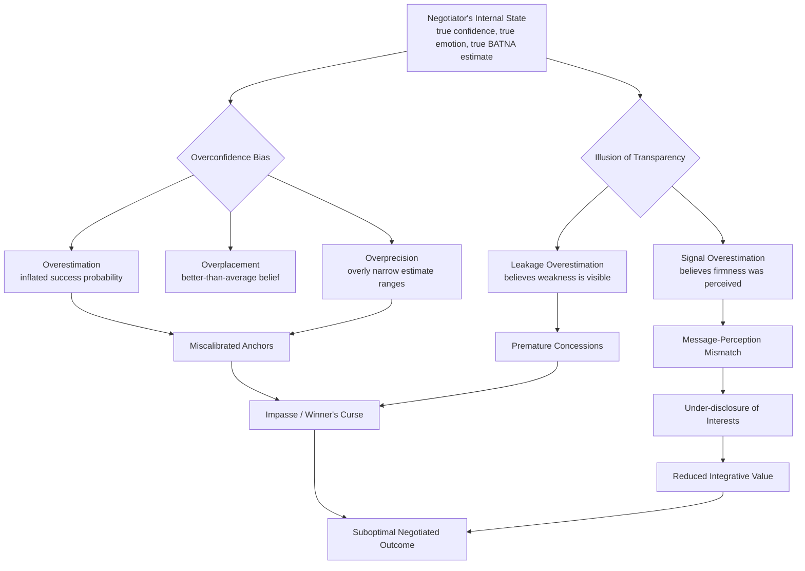

## Overconfidence and the Illusion of Transparency

### Definitions

**Overconfidence** is a well-documented cognitive bias in which an individual's subjective confidence in their own judgments, predictions, or abilities is systematically greater than the objective accuracy of those judgments. In negotiation, this manifests as inflated certainty about one's BATNA (Best Alternative to a Negotiated Agreement), the other party's reservation price, the likelihood of a favorable outcome, or the correctness of one's own valuation of the deal.

The **Illusion of Transparency** is a related but distinct bias: the tendency to overestimate the degree to which one's internal states — emotions, intentions, knowledge, or discomfort — are accurately perceived by others. A negotiator experiencing this illusion believes their bluffs, anxieties, or true reservation values are more "visible" to the counterpart than they actually are, and conversely may also overestimate how well they can read the counterpart's hidden state.

Both biases are studied primarily under the umbrella of **behavioral decision theory**, drawing on the heuristics-and-biases research program associated with Daniel Kahneman and Amos Tversky, and applied to negotiation contexts by scholars such as Max Bazerman, Margaret Neale, and Thomas Gilovich (the latter being central to illusion-of-transparency research alongside Kenneth Savitsky and Victoria Husted Medvec).

### Theoretical Foundations

#### Overconfidence: Three Distinct Forms

Negotiation and judgment-and-decision-making literature typically decompose overconfidence into three related but empirically separable components:

1. **Overestimation** — believing one's actual performance, ability, or chance of success is higher than it truly is (e.g., "I have an 80% chance of winning this arbitration" when the base rate is 50%).
2. **Overplacement** (the "better-than-average" effect) — believing one is better than others in relative terms (e.g., "I am a better negotiator than most of my peers").
3. **Overprecision** — excessive certainty that one's beliefs are correct, typically measured via confidence intervals that are too narrow (e.g., stating "the other side's reservation price is definitely between $90,000 and $95,000" when the true range is far wider).

[Inference] Overprecision is generally considered the most robust and consequential form of overconfidence in negotiation settings, because it directly affects how negotiators calibrate concessions and anchor points, though the relative severity of each form can vary by task and population studied.

#### Illusion of Transparency: Mechanism

The illusion of transparency arises from an **anchoring-and-adjustment** failure applied to self-knowledge. Because a person has privileged, vivid access to their own internal state, they anchor on that internal experience and adjust insufficiently when estimating how much of it "leaks out" to an external observer. The classic demonstration (Gilovich, Savitsky, & Medvec, 1998) involved participants tasting drinks — some laced with an unpleasant-tasting liquid — and lying about the taste to observers; the liars significantly overestimated how many observers could detect their deception.

Applied to negotiation, this produces two symmetric failure modes:

- **Leakage overestimation**: A negotiator believes their poker face has failed and that the counterpart has detected their weak position, prompting premature concessions.
- **Signal overestimation**: A negotiator believes they have successfully signaled firmness or urgency (e.g., through tone or body language) when the counterpart perceived nothing unusual, leading to a mismatch between intended and received messages.

### Mechanisms Linking the Two Biases

Overconfidence and the illusion of transparency compound each other through several interaction pathways:

- **Confidence in mind-reading**: Overconfident negotiators tend to also be overconfident in their ability to accurately read the counterpart's emotional and cognitive state, which is itself a form of overprecision applied interpersonally.
- **False consensus effects**: Related to the illusion of transparency is the **false consensus effect**, where negotiators assume the other party shares their perspective on what is "fair" or "obvious," reducing perceived need to explain reasoning explicitly.
- **The "curse of knowledge"**: A structurally adjacent bias in which a negotiator who possesses private information (e.g., true costs, true walk-away point) finds it cognitively difficult to simulate what the counterpart does *not* know, leading them to under-explain or assume shared understanding.

### Empirical and Experimental Evidence

- Bazerman and Neale's classic negotiation simulations (e.g., the "New Recruit" exercise and related MBA-classroom paradigms) repeatedly find that a majority of negotiators overestimate their likelihood of "winning" a negotiation and misjudge the size of the bargaining zone.
- Overconfidence has been shown experimentally to reduce the propensity to reach efficient, integrative agreements, because overconfident parties underinvest in information exchange — they believe they already understand the counterpart's priorities well enough.
- The original Gilovich et al. (1998) illusion-of-transparency studies found that liars estimated roughly twice as many observers detected their lies as actually did, establishing the core overestimation effect that later negotiation research extended to bluffing and concealment behavior.

[Unverified] Precise effect sizes for illusion-of-transparency studies conducted specifically within live, incentivized bilateral negotiation settings (as opposed to laboratory deception-detection paradigms) are less standardized across the literature, and figures should be checked against the specific study cited before being used as a benchmark.

### Consequences in Negotiation Practice

**Key Points**

- **Impasse risk**: Overconfident parties overestimate their BATNA or underestimate the counterpart's BATNA, causing both sides to hold out for terms the other cannot rationally accept, increasing the probability of negotiation breakdown even when a positive bargaining zone (ZOPA) exists.
- **Under-disclosure**: Believing their reasoning is "obvious," negotiators under-explain interests and priorities, which — ironically, given the illusion of transparency — actually *reduces* the information the counterpart has to work with, undermining integrative ("win-win") trade-offs.
- **Emotional misjudgment**: A negotiator who believes their frustration or anxiety is visible may prematurely signal weakness to themselves internally (self-fulfilling anxiety) or unnecessarily escalate defensiveness in response to a perceived "tell" that was never actually seen.
- **Miscalibrated anchoring**: Overprecision leads to anchors and counteroffers set with unwarranted confidence, which can backfire if the counterpart's actual range differs substantially from the negotiator's narrow estimate.
- **Post-negotiation regret and the "winner's curse"**: Overconfident bidders in auctions and overconfident negotiators in deal-making are prone to the winner's curse — winning a negotiation precisely because they overvalued the asset relative to more accurate competing estimates.

### Illustrative Example

**Example**

A hiring manager (Party A) believes the candidate (Party B) is "clearly" anxious to accept the job because Party A perceives the candidate's enthusiasm in the interview as an obvious, transparent signal of a low reservation salary. Party A anchors low in the first offer, confident this reflects accurate mutual understanding (illusion of transparency: assuming the candidate's enthusiasm signal was received and correctly weighted, and assuming the low anchor's justification is equally "obvious" to the candidate).

Simultaneously, Party A is overconfident (overprecision) that the candidate's outside offers cap at a specific number, based on limited market research, and anchors as if this were a near-certainty rather than a rough estimate.

The candidate, who does not perceive their own enthusiasm as having "given away" their reservation price, and who has an outside offer well above Party A's confident estimate, rejects the offer as insultingly low. The negotiation stalls not because a ZOPA did not exist, but because both the overconfidence in private valuation and the illusion of transparency in signal-reading led Party A to misjudge the situation.

### Mitigation Strategies

**Next Steps** (Debiasing Techniques)

1. **Consider-the-opposite technique**: Deliberately generate reasons one's estimate (of BATNA, counterpart's reservation price, or perceived transparency) could be wrong; this is one of the most empirically supported debiasing interventions for overconfidence.
2. **Explicit confidence intervals**: Rather than point estimates, require ranges (e.g., 90% confidence intervals) for key unknowns, which surfaces overprecision directly.
3. **Perspective-taking exercises**: Actively simulating the counterpart's information set (distinct from empathy) counteracts both the curse of knowledge and the illusion of transparency by forcing explicit modeling of what the other party does *not* know.
4. **Structured information exchange**: Use explicit question-asking protocols and multi-issue proposals (bundling) to surface priorities rather than relying on assumed "obvious" signals.
5. **Outside-view calibration**: Compare one's own predicted outcome to base rates from comparable past negotiations or third-party benchmarks, rather than relying solely on internal (inside-view) confidence.
6. **Post-negotiation calibration training**: Systematic feedback on past prediction accuracy (e.g., tracking predicted vs. actual settlement points) has been shown in broader judgment-and-decision-making research to improve calibration over repeated trials, though durability of such training effects over time is [Inference] generally considered to require reinforcement rather than a single session.

### Conceptual Diagram

### Relationship Diagram (svg_diagram)

<svg xmlns="http://www.w3.org/2000/svg" viewBox="0 0 720 320">
<text x="360" y="30" font-size="16" font-weight="bold" text-anchor="middle" fill="#1a1a1a">Overconfidence vs. Illusion of Transparency (svg_diagram)</text>
<rect x="30" y="70" width="280" height="150" rx="10" fill="#eef4fb" stroke="#3b6ea5" stroke-width="2" />
<text x="170" y="95" font-size="14" font-weight="bold" text-anchor="middle" fill="#1a1a1a">Overconfidence</text>
<text x="170" y="120" font-size="11" text-anchor="middle" fill="#333">Miscalibration about</text>
<text x="170" y="136" font-size="11" text-anchor="middle" fill="#333">one's OWN judgment accuracy</text>
<text x="170" y="160" font-size="11" text-anchor="middle" fill="#333">• Overestimation</text>
<text x="170" y="178" font-size="11" text-anchor="middle" fill="#333">• Overplacement</text>
<text x="170" y="196" font-size="11" text-anchor="middle" fill="#333">• Overprecision</text>
<rect x="410" y="70" width="280" height="150" rx="10" fill="#fbeeee" stroke="#a53b3b" stroke-width="2" />
<text x="550" y="95" font-size="14" font-weight="bold" text-anchor="middle" fill="#1a1a1a">Illusion of Transparency</text>
<text x="550" y="120" font-size="11" text-anchor="middle" fill="#333">Miscalibration about how</text>
<text x="550" y="136" font-size="11" text-anchor="middle" fill="#333">VISIBLE one's state is to others</text>
<text x="550" y="160" font-size="11" text-anchor="middle" fill="#333">• Leakage overestimation</text>
<text x="550" y="178" font-size="11" text-anchor="middle" fill="#333">• Signal overestimation</text>
<text x="550" y="196" font-size="11" text-anchor="middle" fill="#333">• False consensus</text>
<line x1="310" y1="145" x2="410" y2="145" stroke="#555" stroke-width="2" marker-end="url(#arrow)" />
<line x1="410" y1="165" x2="310" y2="165" stroke="#555" stroke-width="2" marker-end="url(#arrow)" />
<text x="360" y="130" font-size="10" text-anchor="middle" fill="#333">shared root:</text>
<text x="360" y="250" font-size="11" text-anchor="middle" fill="#333">Both stem from anchoring on privileged internal information</text>
<text x="360" y="268" font-size="11" text-anchor="middle" fill="#333">and insufficient adjustment for the outside observer's limited access to it.</text>
</svg>

### Related Topics

- Anchoring and Adjustment in Opening Offers
- The Winner's Curse in Competitive Bidding and Deal-Making
- False Consensus Effect and Egocentric Bias in Perspective-Taking
- The Curse of Knowledge in Information Asymmetry
- BATNA and Reservation Price Estimation Under Uncertainty
- Calibration Training and Confidence Interval Elicitation Techniques
- Emotional Leakage and Nonverbal Deception Cues in Bargaining
- Integrative vs. Distributive Bargaining and the Role of Information Exchange