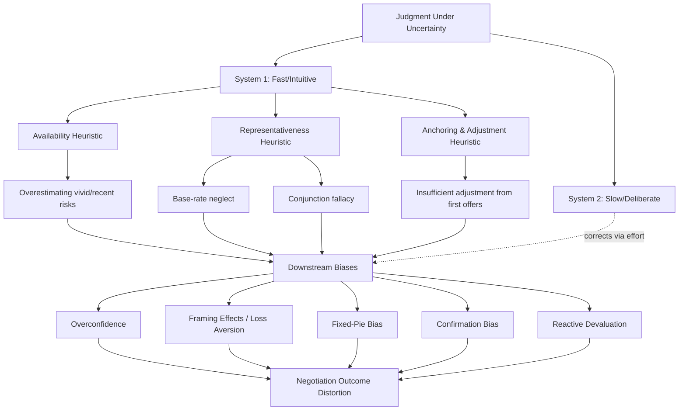

## Heuristics and Biases in Judgment Under Uncertainty

### Overview

The **heuristics-and-biases program**, founded by Daniel Kahneman and Amos Tversky beginning in the early 1970s, describes how humans make judgments under uncertainty using mental shortcuts (**heuristics**) rather than exhaustive rational-actor calculation. While heuristics are often adaptive and efficient, they produce systematic, predictable errors (**biases**) that deviate from normative models of probability and rational choice (e.g., Bayesian updating, expected utility theory). This framework underlies **behavioral decision theory** and forms the psychological foundation for behavioral negotiation research, most prominently synthesized for negotiation contexts by Max Bazerman and Margaret Neale in *Negotiating Rationally*.

Negotiation is fundamentally a decision-making activity conducted under uncertainty — about the counterpart's true interests, reservation price, alternatives, and truthfulness — making this body of theory directly foundational to the study of bargaining behavior.

### Theoretical Foundations

#### Dual-Process Theory

The heuristics-and-biases framework is commonly situated within **dual-process theory**, popularized by Kahneman in *Thinking, Fast and Slow* (2011):

- **System 1**: Fast, automatic, intuitive, associative processing. Generates heuristic judgments effortlessly but is prone to systematic biases.
- **System 2**: Slow, deliberate, effortful, rule-based reasoning. Capable of correcting System 1 errors but requires cognitive resources, motivation, and time — all of which are often constrained in live negotiation settings.

[Inference] Negotiations conducted under time pressure, high cognitive load, or emotional arousal are generally considered more susceptible to System 1-driven heuristic errors, since these conditions reduce the capacity or motivation for System 2 correction, though the degree of susceptibility varies by individual and context.

#### Bounded Rationality

The program builds on Herbert Simon's concept of **bounded rationality** — the idea that human decision-making is constrained by limited information, limited cognitive processing capacity, and limited time, such that people "satisfice" (seek satisfactory, not optimal, solutions) rather than optimize.

### The Core Heuristics

#### 1. Availability Heuristic

Judging the probability or frequency of an event by the ease with which relevant instances come to mind, rather than by actual statistical frequency.

- **Negotiation application**: A negotiator who recently experienced a counterpart walking away from a deal may overestimate the probability of impasse in a current, unrelated negotiation, because that vivid memory is more cognitively "available" than base-rate statistics on deal completion.
- **Mechanism**: Vividness, recency, and emotional salience increase availability independent of actual frequency.

#### 2. Representativeness Heuristic

Judging the probability that an object or event belongs to a category based on how similar it is to a prototype of that category, while ignoring base rates and sample size.

- **Negotiation application**: Assuming a counterpart negotiating aggressively on the first issue is a "hardball negotiator" overall (stereotype match), and calibrating strategy to that assumed type rather than updating based on subsequent behavior.
- **Related sub-biases**:
  - **Base-rate neglect**: Ignoring prior probabilities in favor of specific, vivid case information.
  - **Conjunction fallacy**: Judging a conjunction of two events as more probable than either event alone (e.g., "the supplier is late AND covering it up" seeming more plausible than "the supplier is late," despite the logical impossibility of a conjunction exceeding its component probability).
  - **Insensitivity to sample size**: Drawing strong conclusions about a counterpart's typical behavior from a small number of observed interactions.

#### 3. Anchoring and Adjustment Heuristic

Starting from an initial reference point (the "anchor") and making insufficient adjustments away from it when forming a final judgment, even when the anchor is arbitrary or irrelevant.

- **Negotiation application**: This is arguably the single most heavily researched heuristic in negotiation science. The first offer in a negotiation systematically influences the final settlement point, correlating with it even when the opening offer is extreme or non-diagnostic of true value.
- **Mechanism**: [Inference] Two mechanisms are generally proposed in the literature — *insufficient adjustment* (starting at the anchor and adjusting too little via effortful System 2 correction) and *selective accessibility* (the anchor primes anchor-consistent information, biasing the search for relevant comparison information itself) — with the relative contribution of each considered context-dependent.

### Core Biases Derived From These Heuristics

**Key Points**

- **Overconfidence**: Excessive certainty in the accuracy of one's own judgments, forecasts, and abilities (see related topic: *Overconfidence and the Illusion of Transparency*).
- **Framing effects**: Judgments and choices shift depending on whether logically equivalent information is presented as a gain or a loss (Prospect Theory; Kahneman & Tversky, 1979/1981), directly relevant to how negotiators frame concessions ("you're saving $500" vs. "you're losing $500 off the original price").
- **Loss aversion**: Losses loom psychologically larger than equivalent gains (typically estimated at roughly a 2:1 subjective weighting in the original prospect theory formulation), which drives negotiators to resist concessions framed as losses more than they pursue equivalent gains.
- **Escalation of commitment (sunk cost effect)**: Continuing to invest resources in a failing course of negotiation or deal because of prior investment, rather than because of the marginal expected value of continuing.
- **Endowment effect**: Overvaluing an asset or position simply because one currently possesses or has proposed it, complicating concession-making.
- **Reactive devaluation**: Devaluing a proposal specifically *because* it originated from an adversarial counterpart, independent of its actual merits.
- **Fixed-pie bias (mythical fixed-pie assumption)**: Assuming a negotiation is inherently zero-sum, causing negotiators to miss integrative, value-creating trade-offs across differently prioritized issues.
- **Confirmation bias**: Selectively searching for, interpreting, and recalling information that confirms pre-existing beliefs about the counterpart's position or intentions.
- **Illusion of transparency and false consensus**: See dedicated related topic; both stem from egocentric anchoring on one's own perspective.
- **Curse of knowledge**: Difficulty simulating what a less-informed counterpart does not know, once one possesses private information oneself.
- **Self-serving bias / egocentric fairness judgments**: Individuals with the same objective information about a fair outcome tend to interpret "fairness" in a way that favors their own side, a well-replicated finding in negotiation-specific experimental economics (e.g., ultimatum and dictator game variants).

### Prospect Theory: The Formal Backbone

Prospect Theory (Kahneman & Tversky, 1979) provides the formal decision-theoretic model underlying framing and loss-aversion effects. Its key structural claim is that the value function $v(x)$ is defined over gains and losses relative to a **reference point**, rather than over absolute final wealth states, and is:

- Concave for gains (risk-averse in the gain domain)
- Convex for losses (risk-seeking in the loss domain)
- Steeper for losses than for equivalent gains (loss aversion)

$$v(x) = \begin{cases} x^{\alpha} & x \geq 0 \\ -\lambda(-x)^{\beta} & x < 0 \end{cases}$$

where $\lambda > 1$ represents the loss-aversion coefficient (commonly estimated near 2.25 in the original empirical calibration), and $\alpha, \beta$ are curvature parameters typically estimated below 1.

**Negotiation implication**: A negotiator who perceives themselves as currently "above" their reference point (e.g., already ahead of their opening target) becomes risk-averse and concession-prone to lock in the gain, whereas a negotiator who perceives themselves as "below" reference (behind their target) becomes risk-seeking, willing to gamble on impasse or aggressive tactics to recover the perceived loss. This has direct implications for how negotiators should strategically set and communicate reference points and reservation values.

### Illustrative Example

**Example**

Two procurement negotiators are estimating the probability that a supplier will fail to meet a delivery deadline.

- Negotiator A recently had a *different* supplier fail dramatically and vividly (a shipment lost at sea, requiring emergency sourcing). Using the **availability heuristic**, Negotiator A estimates an 80% chance of failure for the *current* supplier, despite the current supplier's actual historical on-time rate being 92% (a base-rate that A neglects — **base-rate neglect**).
- Negotiator A also recalls a stereotype that suppliers from a certain region are "unreliable" (**representativeness heuristic**, stereotype-driven), further inflating the estimate independent of actual firm-level performance data.
- When negotiating contract terms, Negotiator A opens with an extremely low anchor price to "hedge" against this perceived risk. Negotiator B, unaware of A's flawed risk model, treats the anchor as informative and adjusts their own counteroffer expectations closer to it (**anchoring and adjustment** operating on B).
- The final contract price is inefficiently low relative to the supplier's true reliability, illustrating how a chain of heuristic-driven judgment errors compounds through the negotiation into a real economic outcome.

### Debiasing Strategies

**Next Steps**

1. **Statistical/base-rate training**: Explicit instruction in Bayesian reasoning and base-rate application has shown [Inference] generally positive but incomplete effects on reducing representativeness-driven errors in experimental settings; complete elimination of the bias is not typically observed.
2. **Consider-the-opposite**: Generating explicit counter-arguments to one's initial judgment is one of the most consistently supported general-purpose debiasing techniques across the heuristics-and-biases literature.
3. **Structured decision protocols**: Using checklists, decision matrices, or formal multi-attribute utility analysis reduces reliance on intuitive System 1 shortcuts by imposing System 2 structure.
4. **Anchor awareness and counter-anchoring**: Explicitly disclosing or flagging that an opening offer is an anchor, and independently generating a reservation-price estimate *before* hearing the counterpart's opening offer, reduces anchoring's influence.
5. **Devil's advocacy and red-teaming**: Assigning a team member to argue against the prevailing assessment of the counterpart's position surfaces confirmation-bias blind spots.
6. **Slowing down (System 2 activation)**: Deliberately introducing pauses, caucuses, or "sleep on it" delays before finalizing high-stakes offers allows System 2 deliberation to override System 1 heuristic snap judgments.
7. **Outside-view / reference-class forecasting**: Comparing the current negotiation to a reference class of similar past negotiations, rather than relying solely on inside-view intuition about this specific case.

### Conceptual Map

### Related Topics

- Overconfidence and the Illusion of Transparency
- Prospect Theory: Framing Effects and Reference Dependence
- Anchoring Effects in Opening Offers and Counteroffers
- The Fixed-Pie Bias and Integrative Bargaining
- Loss Aversion and Concession-Making Behavior
- Escalation of Commitment and Sunk Cost Effects in Deal-Making
- Reactive Devaluation and Source-Based Discounting of Proposals
- Debiasing Techniques: Consider-the-Opposite and Structured Decision Protocols
- Dual-Process Theory (System 1 / System 2) in Real-Time Bargaining