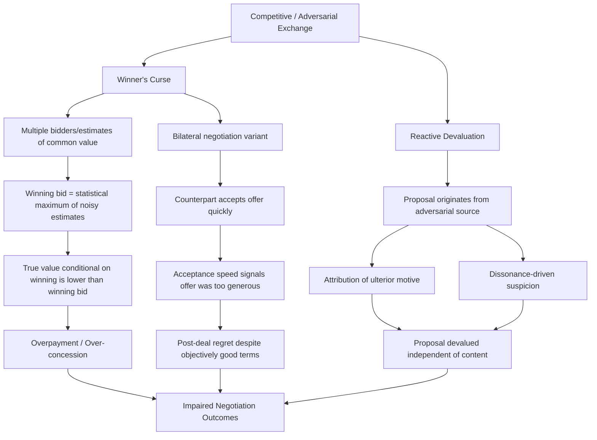

## The Winner's Curse and Reactive Devaluation

### Definitions

**The Winner's Curse** is a phenomenon in which the winning bidder in a competitive bidding process — or, by extension, the "winning" party in a negotiation — tends to have overpaid or over-conceded relative to the asset's or deal's true value, precisely *because* winning is systematically correlated with having made the most optimistic (and often most inaccurate) valuation estimate among all participants. In negotiation specifically, an adapted form of the winner's curse describes the discomfort or regret a negotiator feels when a counterpart accepts an offer *too quickly* — a fast acceptance that retroactively signals the offer was more generous than necessary.

**Reactive Devaluation** is a judgmental bias in which a proposal, concession, or piece of information is devalued specifically *because* of its source — typically because it originates from an adversarial or opposing party — independent of the proposal's actual objective merits. The same concession offered by a neutral third party is often rated as more attractive than when offered directly by an adversary.

Both concepts originate from distinct research traditions — the winner's curse from auction theory and experimental economics (Capen, Clapp, & Campbell, 1971, in the petroleum industry context; later formalized by Richard Thaler and others), and reactive devaluation from Lee Ross's work in social and negotiation psychology (Stanford, 1990s) — but both are commonly grouped under **judgment-under-uncertainty biases specific to competitive/adversarial exchange contexts** in negotiation curricula.

### Theoretical Foundations

#### The Winner's Curse: Origins in Auction Theory

The winner's curse was first formally documented in **common-value auctions**, where the item being bid on (e.g., an oil lease, a mineral rights tract) has an objective, if uncertain, true value that is the same for all bidders, but each bidder possesses only a noisy, independent estimate of it.

**Core statistical logic**:

- Each bidder $i$ forms an estimate $\hat{v}_i$ of the true value $v$, where $\hat{v}_i = v + \epsilon_i$ and $\epsilon_i$ is bidder-specific estimation error (assumed mean-zero across the population of bidders).
- The bidder who wins the auction is, by construction, the one with the highest $\hat{v}_i$ — which, precisely because it is the maximum of a set of noisy estimates, is statistically likely to be an estimate with a large *positive* error term, not merely an accurate reading of high true value.
- Therefore, $E[v \mid \text{win}] < E[\hat{v}_{\text{winner}}]$ — the true expected value conditional on winning is lower than the winning bid itself, unless bidders rationally adjust their bids downward to account for this selection effect ex ante.

[Inference] The severity of the winner's curse is generally considered to increase with the number of bidders (more bidders means the maximum of the sample is drawn from further in the tail of the error distribution) and with the degree of uncertainty in the common value, though exact magnitudes are context- and market-specific.

#### The Winner's Curse: Adaptation to Bilateral Negotiation

In a **bilateral negotiation** (not a multi-party auction), the "winner's curse" analog concerns the informational content of the *counterpart's acceptance speed*. If a negotiator proposes an offer and the counterpart accepts almost immediately, this rapid acceptance is itself a data point: it suggests the counterpart's true reservation value was likely more favorable to the proposer than the proposer estimated, meaning the offer "left money on the table."

- **Diagnostic signal**: Acceptance speed and ease function as a revealed-preference signal about the counterpart's private reservation price — information that only becomes available *after* the offer is locked in, when it can no longer be used to improve the deal.
- **Psychological consequence**: This produces a documented phenomenon where negotiators report *lower* satisfaction with a deal that was accepted quickly than with a deal that required protracted back-and-forth to close, even when the final terms are objectively identical or better in the quick-acceptance case. This is a well-established finding in negotiation satisfaction research (e.g., studies by Galinsky, Diane, and others examining post-negotiation subjective value).

#### Reactive Devaluation: Origins in Social Psychology

Lee Ross's foundational reactive devaluation research examined how proposals in politically and socially charged contexts (notably U.S.–Soviet arms control proposals during the Cold War) were rated as less fair or less desirable when attributed to an adversarial source, compared to identical proposals attributed to a neutral party.

**Proposed mechanisms**:

1. **Attribution of ulterior motive**: If an adversary offers a concession, the recipient assumes the adversary must have hidden reasons for offering it that are unfavorable to the recipient ("if they're offering this, it must secretly benefit them more than me").
2. **Contrast/anchoring against expected hostility**: Because negotiators expect adversaries to act in self-interested, low-concession ways, any offer is filtered through a lens of suspicion, and its face-value merit is discounted accordingly.
3. **Cognitive dissonance avoidance**: Accepting that "the enemy" has made a genuinely fair or generous offer can create dissonance with a negotiator's prior belief that the counterpart is untrustworthy or adversarial; devaluing the offer resolves this dissonance by preserving the prior belief.

### Distinctions and Relationship Between the Two Concepts

**Key Points**

- Both biases operate on **information embedded in the negotiation process itself** — the winner's curse on the *speed/ease of acceptance*, reactive devaluation on the *source* of a proposal — rather than on the proposal's objective content.
- The winner's curse is fundamentally a **statistical/inferential** bias (a failure to correctly condition on a selection effect), whereas reactive devaluation is fundamentally an **attributional/motivational** bias (a failure to separate source-based suspicion from content-based evaluation).
- They can interact: a negotiator who receives a *quick, easy concession* from an adversarial counterpart may simultaneously experience winner's-curse regret ("I could have gotten a better deal") and reactive devaluation ("this concession must be hiding something"), compounding suspicion and potentially destabilizing an otherwise efficient agreement.
- [Inference] Both biases are generally considered to impede integrative, value-maximizing negotiation, because they discourage parties from taking proposals and quick agreements at face value, encouraging either excessive re-negotiation, prolonged conflict, or the sabotage of efficient early settlements — though the specific behavioral pathway differs between the two.

### Empirical Evidence

- Bazerman and Samuelson's classic experimental work (1983) on the "acquiring a company" game demonstrated that a majority of participants systematically failed to adjust their bids for the winner's-curse selection effect, continuing to overbid even after being warned about the phenomenon and given multiple trials.
- Larrick and Wu, along with other behavioral negotiation researchers, extended the winner's-curse logic explicitly into bilateral negotiation settings, documenting the "too-quick-acceptance" regret pattern in MBA and executive-education negotiation simulations.
- Ross and Stillinger's (1991) work on reactive devaluation is the most frequently cited original source for the phenomenon; subsequent replications have extended the effect from geopolitical arms-control contexts to labor-management bargaining and everyday commercial negotiation.

[Unverified] Specific quantitative effect sizes for reactive devaluation (e.g., the average percentage-point drop in perceived fairness attributable purely to source identity) vary across studies and populations, and should be verified against the specific paper being cited rather than treated as a single fixed constant.

### Illustrative Examples

**Example**

*Winner's Curse in Bilateral Negotiation*: A homebuyer offers $450,000 for a house listed at $475,000, expecting a counteroffer and further back-and-forth. The seller accepts immediately. Rather than feeling triumphant, the buyer experiences a documented "winner's curse" reaction: "If they accepted that fast, I probably could have gotten it for $420,000." This regret occurs regardless of whether $450,000 was objectively a good price, because the *speed* of acceptance is interpreted as a signal that the buyer's estimate of the seller's true reservation price was miscalibrated (too generous).

**Example**

*Reactive Devaluation*: A union negotiating team receives a proposal from management offering a 4% wage increase alongside expanded remote-work flexibility. If the team believes management to be fundamentally adversarial, their first reaction may be suspicion: "Why would they offer this unless it secretly benefits them more — perhaps the remote-work flexibility is a cost-cutting measure in disguise (reduced office overhead) rather than a genuine accommodation." An identical proposal, if introduced by a neutral mediator as "a possible compromise position," is more likely to be evaluated on its objective merits rather than filtered through adversarial suspicion.

### Mitigation Strategies

**Next Steps**

For the **Winner's Curse**:

1. **Ex ante downward adjustment**: In competitive bidding contexts, formally adjust bids downward according to the expected magnitude of the selection effect (a function of the number of competing bidders and estimate uncertainty), rather than bidding one's raw point estimate.
2. **Reframe acceptance speed as noisy, not diagnostic of a bad deal**: Recognize that quick acceptance is *some* signal of a favorable-to-counterpart deal, but that this does not retroactively make the deal itself worse in absolute terms — the deal's value should be judged against pre-negotiation reservation values and market benchmarks, not counterpart reaction time.
3. **Use resistance point verification**: Where feasible, gather independent information about the counterpart's likely reservation range *before* finalizing an offer, reducing reliance on post hoc acceptance-speed inference.

For **Reactive Devaluation**:

1. **Blind or third-party proposal framing**: Where structurally possible, route proposals through a neutral mediator or present them without immediately revealing the proposing party, to allow evaluation on merits.
2. **Explicit merit-based checklists**: Require negotiators to list objective pros/cons of a proposal *before* considering its source, to separate content evaluation from source-based suspicion.
3. **Building integrative trust incrementally**: Establishing a track record of good-faith small concessions early in a negotiation can reduce the baseline suspicion that fuels reactive devaluation of larger concessions later.
4. **Explicit bias-naming**: Simply informing negotiation teams about the existence and mechanism of reactive devaluation has been used as a training intervention, on the general debiasing logic that awareness of a specific bias can partially (though [Inference] typically not fully) reduce its influence.

### Conceptual Diagram

### Related Topics

- Auction Theory and Common-Value vs. Private-Value Bidding
- Anchoring Effects in Opening Offers and Counteroffers
- Overconfidence and the Illusion of Transparency
- Trust-Building and Incremental Concession Strategies
- Post-Negotiation Subjective Value and Satisfaction Research
- Fixed-Pie Bias and Integrative (Value-Creating) Bargaining
- Mediator Roles in Reframing and Neutralizing Proposal Source Bias
- Behavioral Game Theory: Common-Value vs. Independent-Private-Value Models