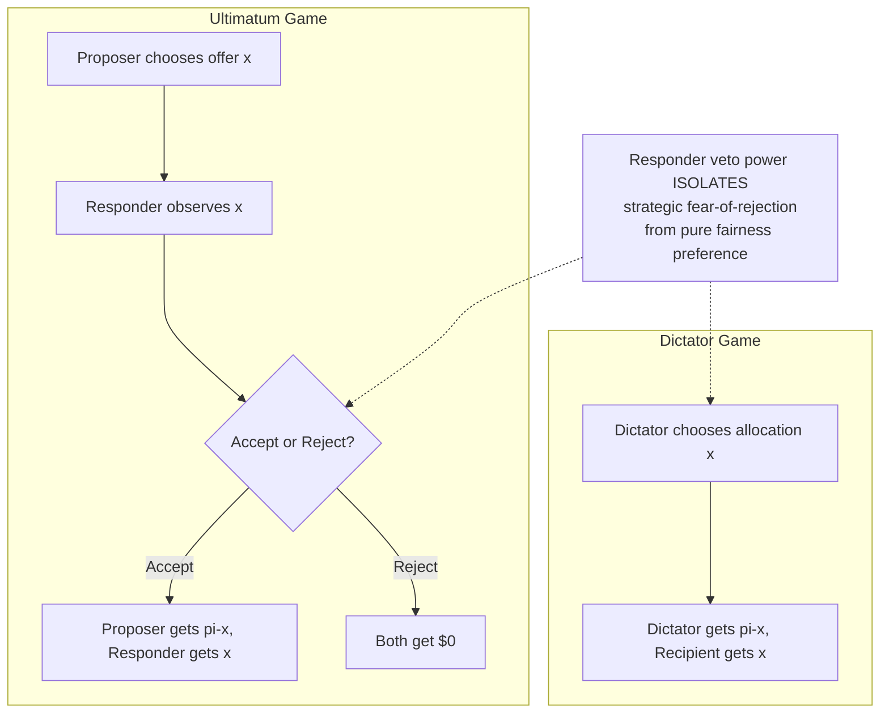

## Behavioral Game Theory: Ultimatum and Dictator Games

### Definitions

**Behavioral game theory** is the empirical study of how real human beings actually behave in strategic interactions, in contrast to **classical game theory**, which derives predictions from the assumption that all players are perfectly rational, self-interested expected-utility maximizers with common knowledge of rationality. Behavioral game theory uses controlled experiments — most famously the **ultimatum game** and the **dictator game** — to document systematic, reproducible departures from classical predictions, and to build descriptive models (e.g., incorporating fairness preferences, inequity aversion, and reciprocity) that better predict actual behavior.

Both games are two-player, one-shot (or repeated), monetary allocation experiments involving a fixed "pie" of money, but they differ critically in the *strategic structure* given to the responding player, which isolates different psychological drivers.

### The Ultimatum Game

#### Formal Structure

1. A fixed sum of money (the "pie"), $\pi$, is to be divided between two players: the **Proposer** and the **Responder**.
2. The Proposer offers a split — proposing to keep $\pi - x$ for themselves and give $x$ to the Responder.
3. The Responder observes the offer $x$ and chooses to either **Accept** (both players receive the proposed split) or **Reject** (both players receive $0).
4. The game is typically played once, anonymously, with real monetary stakes.

#### Classical (Subgame-Perfect) Prediction

Under the standard assumption of self-interested rationality, the game is solved by **backward induction**:

- A rational Responder should accept *any* positive offer $x > 0$, since $x > 0$ is strictly better than the $0 received upon rejection.
- Anticipating this, a rational, self-interested Proposer should offer the smallest possible positive amount (e.g., $x = \epsilon$, a trivial sum), keeping nearly the entire pie.

#### Empirical Findings

Actual behavior across hundreds of replications (beginning with Güth, Schmittberger, & Schwarze, 1982) departs sharply from this prediction:

- **Modal offers** typically cluster around a 50/50 split, or somewhat below (commonly in the 40–50% range of the pie offered to the Responder).
- **Rejection rates**: Offers below approximately 20–30% of the pie are rejected at substantial rates — [Inference] commonly cited in the range of 40–60% rejection for very low offers, though exact rejection thresholds vary considerably across studies, cultures, and stake sizes, and specific percentages should be verified against the particular study cited.
- **Cross-cultural robustness with variation**: The landmark cross-cultural study by Henrich et al. (2001), sampling small-scale societies across multiple continents, found that both modal offers and rejection thresholds vary meaningfully by culture and are correlated with the society's degree of market integration and cooperative production norms — establishing that the "50/50 norm" observed in industrialized-country student samples is not a human universal in its precise parameters, even though the *general* tendency to reject low offers and to offer above the game-theoretic minimum was widely (though not universally) observed.

#### Theoretical Interpretations

Several descriptive models have been developed to explain ultimatum-game behavior:

- **Inequity aversion models** (Fehr & Schmidt, 1999; Bolton & Ockenfels, 2000): Individuals derive negative utility from both disadvantageous inequity (getting less than the other party) and, to a lesser degree, advantageous inequity (getting more), motivating both offer generosity and rejection of unfair offers.
- **Reciprocity and intention-based fairness** (Rabin, 1993; Falk & Fischbacher): Rejections are interpreted not merely as inequity aversion but as *costly punishment* of a perceived intentionally unfair action by the Proposer — evidence includes findings that identical low offers generated by a random process (rather than a human Proposer's choice) are rejected less often than the same low offer chosen deliberately by a human.
- **Emotional/spite-based accounts**: Neuroeconomic studies (e.g., using fMRI, notably Sanfey et al., 2003) have found that unfair offers activate brain regions associated with disgust and negative emotion (e.g., anterior insula), and that the magnitude of this neural response correlates with rejection likelihood — supporting an affect-driven, not purely cold-cognitive, account of rejection behavior.

### The Dictator Game

#### Formal Structure

The dictator game is a simplified variant of the ultimatum game that **removes the Responder's veto power**:

1. A fixed pie $\pi$ is again to be allocated between a **Dictator** and a passive **Recipient**.
2. The Dictator unilaterally decides the split $x$ to give to the Recipient (keeping $\pi - x$).
3. The Recipient has no choice — whatever the Dictator allocates is final; there is no accept/reject decision.

#### Purpose: Isolating Pure Fairness Preferences

Because the Recipient cannot punish an unfair allocation, **any positive amount given by the Dictator cannot be explained by strategic fear of rejection** — it can only be attributed to the Dictator's own social preferences (altruism, fairness concerns, warm-glow giving, or aversion to appearing selfish). This makes the dictator game the key experimental tool for isolating **other-regarding preferences** from **strategic behavior**.

#### Empirical Findings

- Classical rationality predicts Dictators should keep the entire pie ($x = 0$).
- In practice, most experimental studies find that a substantial share of Dictators give a positive, non-trivial amount, with average allocations to the Recipient commonly falling in a lower range than ultimatum-game offers — [Inference] typically cited as roughly 10–20% of the pie on average across many replications, though this figure varies considerably depending on experimental design (e.g., double-blind protocols, framing, stakes size, and social distance manipulations), and precise averages should be checked against the specific study in question.
- **Design sensitivity**: Dictator-game giving has been shown to be highly sensitive to experimental framing — for example, giving decreases substantially under **double-blind protocols** (where even the experimenter cannot observe individual choices), suggesting that a meaningful component of "generosity" in less anonymous versions reflects **social image concerns** or experimenter-observation effects rather than pure altruism.

### Comparative Analysis: Ultimatum vs. Dictator Game

**Key Points**

| Dimension | Ultimatum Game | Dictator Game |
| --- | --- | --- |
| Responder power | Can reject (both get $0) | No power (passive recipient) |
| Isolates | Fairness preferences *and* strategic anticipation of rejection | Pure other-regarding preferences (no strategic component) |
| Typical offer/allocation | ~40–50% of pie | ~10–20% of pie (generally lower) |
| Rejection possible | Yes | No |
| Primary theoretical use | Testing reciprocity, punishment, inequity aversion under strategic threat | Testing baseline altruism/fairness absent strategic incentive |

The **gap between ultimatum offers and dictator-game allocations** is itself a key empirical finding: it demonstrates that a substantial portion of the generosity observed in the ultimatum game is **strategic** (Proposers anticipating and avoiding rejection) rather than purely altruistic, since that strategic pressure is absent in the dictator game and average giving drops accordingly.

### Relevance to Negotiation Theory

**Key Points**

- **Fairness as a real, costly constraint on rational self-interest**: These games provide the foundational experimental evidence that negotiators are not purely economically rational; they will sacrifice material payoff to punish perceived unfairness (ultimatum rejection) and will sometimes concede value even absent any strategic necessity (dictator-game giving), both of which classical negotiation models built on pure self-interest fail to predict.
- **Reference points and fairness norms as anchors**: The clustering of offers around a 50/50 split illustrates how salient, focal fairness norms function as psychological anchors in the absence of other coordinating information — directly relevant to how negotiators use "even splits" or "meeting in the middle" heuristics in real bargaining.
- **Costly punishment and impasse**: Ultimatum-game rejection behavior provides a direct experimental analog to real-world negotiation impasse: parties will walk away from objectively positive-value deals (any $x > 0$) if the *proposed distribution* of that value is perceived as sufficiently unfair, a finding directly relevant to explaining seemingly "irrational" negotiation breakdowns.
- **Distinguishing strategic concessions from genuine fairness concerns**: In real negotiation, this distinction matters practically — the dictator-game evidence suggests that a portion of a counterpart's apparent generosity may reflect genuine social preference, while ultimatum-game evidence suggests another portion is purely defensive anticipation of rejection or retaliation; correctly attributing which is which affects trust-building strategy.

### Illustrative Example

**Example**

*Ultimatum game applied to a real deal*: A supplier and a small retailer are negotiating how to split a $100,000 cost savings identified in a renegotiated logistics contract. Classical game theory would predict the supplier (as first-mover proposer) should offer the retailer close to $0 and keep the rest, since any positive amount is technically an improvement for the retailer. In practice, if the supplier proposes keeping $90,000 and offering the retailer only $10,000 (a 90/10 split), the retailer — even though $10,000 is a pure gain relative to the status quo — may reject the arrangement, walk away from the renegotiation, or retaliate in future contract terms, motivated by the perceived unfairness of the split rather than by the absolute magnitude of the gain. This mirrors documented ultimatum-game rejection behavior at analogous low-offer percentages.

*Dictator-game logic applied to voluntary concessions*: A landlord renegotiating a struggling tenant's lease has no strategic reason to reduce rent (the tenant has no comparable "rejection" option that would cost the landlord anything immediately). If the landlord nonetheless voluntarily reduces the rent by a modest amount, this mirrors dictator-game giving — a genuine other-regarding preference (fairness concern, reputational/image concern, or altruism) operating absent strategic necessity, distinct from the fear-of-rejection logic that drives ultimatum-game generosity.

### Diagrammatic Representation of Game Structures

### Limitations and Ongoing Debates

- **External validity**: [Inference] Whether one-shot, anonymous, stranger-to-stranger laboratory games with typically modest stakes generalize to high-stakes, relationship-embedded, repeated real-world negotiations is a matter of ongoing methodological debate in the field, and results should not be uncritically extrapolated to all negotiation contexts without considering these structural differences.
- **Stakes effects**: Some studies have examined whether raising the absolute size of the pie (to amounts representing substantial real income in a given context) reduces rejection rates or offer generosity as a percentage, with [Unverified] mixed findings across different studies regarding the degree to which higher stakes shift behavior toward the classical rational prediction; specific results should be verified against the relevant study.
- **Cultural and demographic moderators**: As established by Henrich et al. (2001) and subsequent work, offer size, rejection thresholds, and dictator-game giving are not culturally invariant constants but are shaped by social norms, market integration, and other demographic/cultural variables, cautioning against treating any single numeric benchmark as universal.

### Related Topics

- Inequity Aversion Models (Fehr–Schmidt, Bolton–Ockenfels)
- Prospect Theory and Reference-Dependent Preferences
- Costly Punishment and Third-Party Sanctioning in Cooperation Games
- Trust Game and Reciprocity in Repeated Negotiation Relationships
- Neuroeconomics of Fairness Perception and Rejection Behavior
- Cross-Cultural Variation in Fairness Norms (Henrich et al. Small-Scale Societies Study)
- Fixed-Pie Bias and Integrative Bargaining
- Reactive Devaluation and the Winner's Curse in Adversarial Exchange