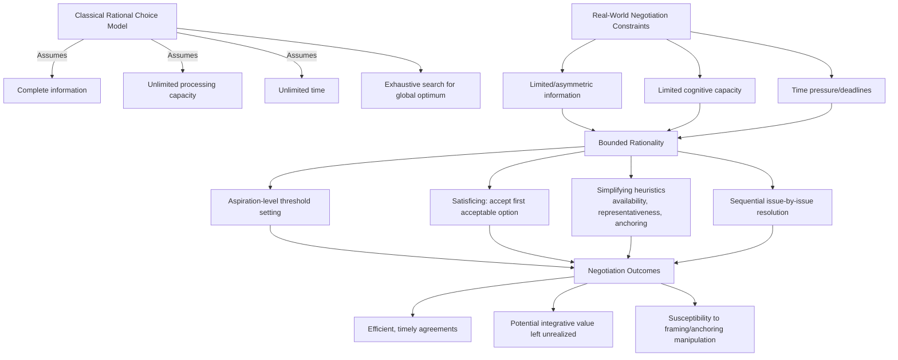

## Bounded Rationality in Negotiated Decisions

### Definition

**Bounded rationality** is a model of human decision-making, originated by Herbert A. Simon (1955, 1957), which holds that decision-makers do not — and cannot — achieve the full, unlimited optimization assumed by classical rational-choice theory (i.e., exhaustive information search, complete preference ordering, and utility-maximizing selection among all possible alternatives). Instead, decision-makers operate within genuine constraints on **information availability, cognitive processing capacity, and time**, and consequently adopt simplified decision strategies that yield *satisfactory*, rather than *optimal*, outcomes. Simon termed this process **"satisficing"** — a portmanteau of "satisfy" and "suffice."

Bounded rationality is the foundational meta-theory underlying the entire behavioral-decision-theory research program (including the heuristics-and-biases literature) as applied to negotiation: it explains *why* negotiators rely on heuristics and exhibit systematic biases in the first place — not because they are irrational in a pejorative sense, but because full rationality is computationally and practically infeasible under real-world constraints.

### Theoretical Foundations

#### Simon's Original Formulation

Simon's critique of neoclassical rational-choice models rested on three core constraints:

1. **Limited information**: Decision-makers rarely, if ever, possess complete information about all available alternatives, their consequences, and their probabilities.
2. **Limited cognitive capacity**: Even given complete information, human working memory and processing capacity are insufficient to evaluate all alternatives simultaneously against all relevant criteria.
3. **Limited time**: Real decisions, including negotiations, are typically made under deadlines or time pressure that preclude exhaustive deliberation.

Given these constraints, Simon argued that decision-makers set an **aspiration level** (a threshold of acceptability) and search sequentially through alternatives until one meeting or exceeding that threshold is found, at which point search terminates — even if superior alternatives might exist but remain undiscovered.

#### Relationship to Dual-Process Theory and Heuristics

Bounded rationality provides the *rationale* for why System 1 heuristic processing (availability, representativeness, anchoring — see related topic) is functionally adaptive rather than simply defective: given genuine cognitive and informational constraints, heuristics are efficient approximations that perform reasonably well across most everyday situations, even though they produce systematic, predictable errors in specific circumstances (particularly those that violate the ecological conditions under which the heuristic evolved or was learned).

[Inference] This "ecological rationality" perspective — most associated with Gerd Gigerenzer's research program — is generally considered a complementary, though at times contested, counterpoint to the heuristics-and-biases tradition's emphasis on bias as deviation from a normative ideal; the degree to which heuristics should be framed primarily as "adaptive" versus primarily as "error-prone" is an ongoing point of theoretical debate rather than a settled consensus.

#### Cognitive Load and Negotiation-Specific Constraints

Negotiation environments impose distinctive bounded-rationality pressures beyond generic decision contexts:

- **Multi-issue complexity**: Real negotiations frequently involve multiple issues (price, timeline, quality specifications, warranty terms, exclusivity clauses) with interdependent trade-offs, exceeding the capacity for exhaustive multi-attribute utility calculation in real time.
- **Strategic interdependence**: Unlike single-agent decisions, negotiation requires modeling a counterpart's likely responses, their model of *your* likely responses, and so on recursively — a computationally explosive task that classical game theory handles via idealized common-knowledge-of-rationality assumptions, but which real negotiators cannot execute beyond a few levels of recursive reasoning (see: **level-k / cognitive hierarchy models** in behavioral game theory).
- **Real-time social and emotional load**: Live negotiation involves simultaneous demands on attention — reading nonverbal cues, managing one's own emotional state, formulating offers, and tracking prior concessions — compounding the generic cognitive-capacity constraints Simon described.
- **Time pressure and deadlines**: Negotiation deadlines (contractual, external, or self-imposed) directly instantiate Simon's "limited time" constraint, and are well-documented in negotiation research to shift behavior toward more heuristic-driven, satisficing strategies as deadlines approach.

### Satisficing in Negotiation Practice

**Key Points**

- **Aspiration-level-based concession behavior**: Rather than computing an optimal concession schedule, negotiators commonly set a target/aspiration point and a reservation point (walk-away threshold), and evaluate incoming offers against this threshold using a simple accept/reject/counter heuristic rather than continuous optimization.
- **Early acceptable-offer acceptance**: Consistent with satisficing, negotiators frequently accept the *first* offer that clears their aspiration threshold, rather than continuing to search for a possibly superior offer — this is functionally identical to Simon's original sequential-search-with-threshold model.
- **Reliance on simplifying heuristics for multi-issue trade-offs**: Rather than computing formal utility trade-off ratios across all issues, negotiators commonly use simplifying strategies such as issue-by-issue sequential resolution (resolving one issue before moving to the next, rather than holistic package evaluation) — a strategy that is easier to execute but can produce suboptimal, non-Pareto-efficient outcomes relative to full package-based (holistic) bargaining.
- **Standard form / template reliance**: The widespread real-world use of standardized contract templates, term sheets, and boilerplate clauses in commercial negotiation is itself an institutional embodiment of bounded rationality — a satisficing solution that avoids the (impossible) task of custom-optimizing every clause from first principles for every transaction.

### Consequences for Negotiated Outcomes

**Key Points**

- **Suboptimal integrative outcomes**: Because exhaustive search for value-creating (integrative) trade-offs across multiple issues is cognitively demanding, bounded rationality is a key explanatory factor (alongside the related **fixed-pie bias**) for why real negotiators frequently settle on **compromise agreements** that leave unrealized joint value on the table, rather than discovering Pareto-superior integrative solutions.
- **Sequential, not holistic, issue resolution**: Resolving issues one at a time (a bounded-rationality-consistent simplification) can create **sequencing effects**, where early concessions on one issue constrain or anchor later negotiation on interdependent issues, again potentially foreclosing superior overall packages that would have been visible under holistic evaluation.
- **Vulnerability to framing and heuristic manipulation**: Because bounded-rational negotiators rely on simplified decision rules rather than exhaustive evaluation, they are more susceptible to the various framing, anchoring, and heuristic-based influence tactics documented throughout the behavioral negotiation literature (see related topics).
- **Adaptive value under genuine constraints**: [Inference] It is generally recognized in the literature that satisficing strategies are not simply "worse" than optimization in an unqualified sense — under genuine real-world time and information constraints, the computational cost of attempting full optimization can itself produce worse outcomes (through decision paralysis or missed deadlines) than a "good enough" satisficing strategy executed promptly, making bounded rationality a rational adaptation to constraint rather than a pure deficiency.

### Illustrative Example

**Example**

A hiring manager is negotiating a job offer involving five interdependent variables: base salary, signing bonus, vacation days, remote-work flexibility, and job title. A fully rational, unbounded optimization would require the manager to construct a complete multi-attribute utility function, estimate the candidate's utility function across all five variables and their interactions, and solve for the Pareto-efficient frontier of possible packages — a task that is computationally intensive even with full information, and the manager does not have full information about the candidate's true priorities.

Instead, consistent with bounded rationality, the manager satisfices: they set an aspiration level for total compensation cost, and negotiate salary first in isolation until it "seems reasonable," then move sequentially to vacation days, then remote-work flexibility, treating each largely as a separate sub-negotiation rather than jointly optimizing across all five. When the candidate proposes a package trading a lower base salary for additional remote-work days — a trade-off that might represent a genuinely superior integrative solution for both parties, since the manager values salary predictability more than office presence, and the candidate values flexibility more than marginal salary — the sequential, issue-by-issue satisficing process makes this trade-off harder to surface, because salary was already "settled" in an earlier, isolated sub-negotiation round.

This illustrates the classic bounded-rationality-driven **integrative loss**: not because either party is unintelligent or ill-intentioned, but because genuine cognitive and time constraints make holistic optimization impractical, and the simplifying heuristic (sequential issue resolution) that replaces it has systematic blind spots.

### Strategies for Managing Bounded Rationality in Negotiation

**Next Steps**

1. **Package/holistic bargaining over sequential issue-by-issue negotiation**: Explicitly negotiating multiple issues as a single combined package (rather than resolving them one at a time) is a well-established technique for surfacing integrative trade-offs that sequential satisficing tends to miss.
2. **Pre-negotiation preparation and priority-ranking**: Explicitly ranking one's own priorities across issues *before* entering the negotiation reduces in-the-moment cognitive load, freeing capacity for real-time strategic reasoning during the negotiation itself.
3. **Structured multi-issue proposals ("if-then" packages)**: Presenting contingent, multi-issue offers (e.g., "If we can move remote days from 2 to 3, we could adjust base salary by X") externalizes trade-off reasoning into explicit proposals, reducing the cognitive burden of mentally simulating trade-offs.
4. **Decision aids and checklists**: Using structured negotiation-planning worksheets, decision matrices, or (in more complex/high-stakes contexts) formal multi-attribute utility software, offloads some of the computational burden that bounded rationality would otherwise force onto unaided intuitive judgment.
5. **Deliberate deadline management**: Since time pressure is a core driver of satisficing (and its associated heuristic vulnerabilities), negotiators can mitigate its effects by building in deliberate pauses, caucus breaks, or by avoiding self-imposed artificial urgency that is not externally required.
6. **Recognizing when "good enough" is appropriate**: [Inference] Because full optimization is often genuinely infeasible, it is generally considered good practice to explicitly distinguish negotiations where the stakes justify additional deliberative investment (e.g., complex, high-value, long-term contracts) from lower-stakes negotiations where reasonable satisficing is an appropriate and efficient strategy, rather than treating every negotiation as warranting maximal cognitive investment.

### Conceptual Diagram

### Related Topics

- Heuristics and Biases in Judgment Under Uncertainty
- The Fixed-Pie Bias and Integrative (Value-Creating) Bargaining
- Aspiration Levels, Reservation Points, and BATNA Estimation
- Level-k and Cognitive Hierarchy Models in Strategic Reasoning
- Package Bargaining vs. Sequential Issue-by-Issue Negotiation
- Time Pressure and Deadline Effects on Concession Behavior
- Ecological Rationality and the Adaptive-Heuristics Perspective (Gigerenzer)
- Multi-Attribute Utility Analysis in Negotiation Preparation