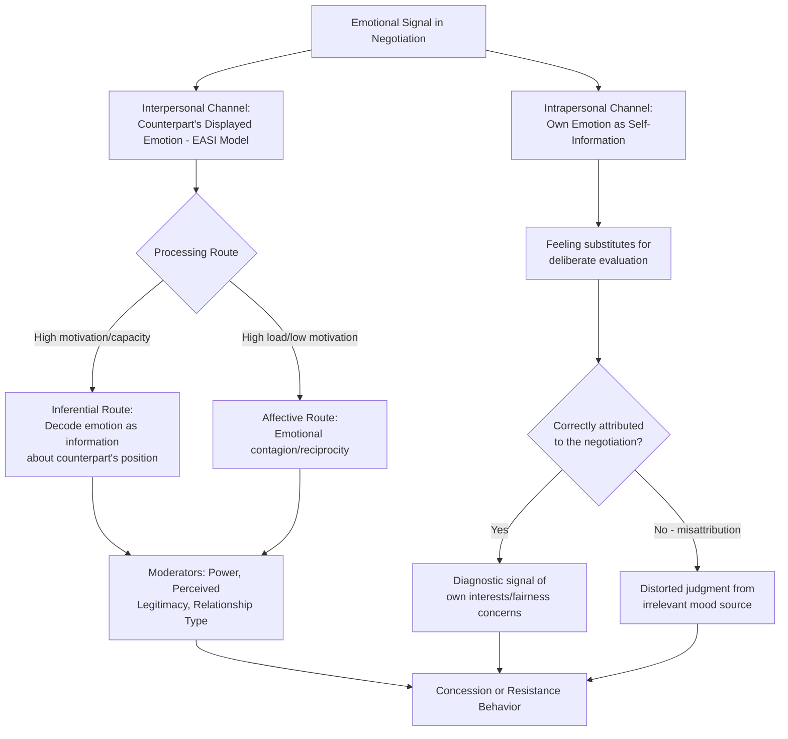

## Emotion as Information in Negotiation

### Definition

**Emotion as Information (EAI)**, also known as the **Affect-as-Information** framework, is a theoretical model in social and cognitive psychology holding that emotional states are not merely epiphenomenal or disruptive to rational judgment, but function as a genuine **data source** that decision-makers consult — often unconsciously — when forming judgments and choices. In negotiation, this framework holds that a negotiator's own emotional reactions (and the perceived emotional expressions of a counterpart) carry diagnostic informational content about the state of the negotiation: perceived fairness, threat, progress, and the counterpart's underlying priorities and intentions.

The foundational theoretical work is Schwarz and Clore's **Affect-as-Information theory** (1983, 1988), originally developed in general judgment-and-decision-making contexts, and subsequently extended specifically to negotiation by researchers including Gerben van Kleef, Keith Allred, and Larissa Tiedens, among others.

### Theoretical Foundations

#### Core Mechanism: Emotions as a Heuristic Cue

The central claim of Affect-as-Information theory is that people often use the simple question **"How do I feel about this?"** as a heuristic proxy for the more complex evaluative question **"What do I think about this?"** — substituting an immediately accessible internal signal (mood/emotion) for effortful, deliberate assessment.

- **Misattribution vulnerability**: Because affect-as-information relies on a feeling as a proxy, the source of that feeling can be **misattributed**. A classic demonstration (Schwarz & Clore, 1983) found that people reported higher life satisfaction on sunny days than rainy days, *unless* they were first asked about the weather, which correctly re-attributed the mood to its actual (irrelevant) source and eliminated the effect. Applied to negotiation, this implies that incidental mood states — e.g., frustration from a prior meeting, or elevated mood from good news unrelated to the negotiation — can be misattributed to the negotiation itself, distorting judgments about the counterpart or the deal.

#### Two Distinct Channels: Intrapersonal and Interpersonal Emotion-as-Information

Negotiation research typically distinguishes two related but separable channels through which emotion functions as information:

1. **Intrapersonal channel (one's own emotions as self-information)**: A negotiator's own emotional reactions to an offer or event in the negotiation provide diagnostic information about their own underlying appraisal — e.g., feeling anger at a low offer signals (to oneself) that the offer violates a fairness norm or threatens an important interest, even before this is consciously articulated.
2. **Interpersonal channel (perceived counterpart emotion as information, or "Emotions as Social Information," EASI)**: A negotiator's *perception* of the counterpart's displayed emotion is treated as informative about the counterpart's underlying position, limits, and intentions. This channel is the focus of van Kleef's **Emotions as Social Information (EASI) model** (van Kleef, De Dreu, & Manstead, 2004 onward), which is the dominant contemporary framework for interpersonal emotional effects in negotiation.

#### The EASI Model: Two Processing Routes

Van Kleef's EASI model proposes that a counterpart's displayed emotion (e.g., anger, happiness, disappointment) influences a negotiator's behavior via two distinct processing pathways, moderated by the observer's information-processing capacity and motivation:

1. **Inferential (cognitive) route**: The observer decodes the emotional display as **information** about the counterpart's position — e.g., counterpart anger is interpreted as signaling "my offer is unacceptable to them, and their limit is higher than I estimated," prompting the observer to make larger concessions. This route dominates when the observer has sufficient cognitive capacity and motivation to process information carefully (high epistemic motivation, low cognitive load).
2. **Affective (reciprocal/emotional contagion) route**: The observer's own emotional state shifts in response to the counterpart's displayed emotion — often reciprocally (anger begets anger, a "tit-for-tat" emotional response) — and this shifted emotional state then drives behavior somewhat independently of any inferential content. This route tends to dominate under high cognitive load, low motivation to process information carefully, or in communal/relational contexts where reciprocal emotional matching is normatively expected.

[Inference] Because these two routes can produce *opposite* predictions from the same displayed emotion (e.g., counterpart anger sometimes yielding larger concessions via the inferential route, but sometimes yielding retaliatory hardening via the affective route), the EASI model is generally considered to require attention to moderating conditions — the observer's power, cognitive load, and relational orientation — rather than predicting a single universal effect of any given emotional display.

### Specific Emotions and Their Documented Negotiation Effects

**Key Points**

- **Anger**:
  - Van Kleef and colleagues' foundational studies found that a negotiator facing a counterpart who displayed anger (versus happiness or a neutral emotional expression) tended to make **larger concessions**, consistent with the inferential route interpretation that anger signals a high limit or a strongly held position.
  - However, this effect is [Inference] generally considered to be moderated by power and alternatives: a negotiator with a strong BATNA or comparable power is more likely to respond to counterpart anger with reciprocal anger or hardened resistance (the affective/reciprocal route) rather than concession, and perceived *appropriateness* of the anger display (whether it seems justified given context) also moderates the response.
  - Anger displays perceived as inappropriate or excessive have been documented to backfire, reducing trust and willingness to work with the counterpart in future interactions, and reducing joint gains in integrative contexts.
- **Happiness/Positive Emotion Display**:
  - Displayed happiness is generally interpreted as signaling satisfaction with the current offer or a lower/more accommodating limit, which can lead counterparts to demand *less* additional concession (interpreting the happy party as "already satisfied").
  - [Inference] In some study designs, displaying happiness has therefore been found to elicit smaller concessions from the counterpart than displaying anger, since it signals less urgency for the counterpart to move — though this depends on context and the specific comparison condition used.
- **Disappointment**: Often studied as distinct from anger; disappointment displays tend to signal a violated expectation without the same implied threat as anger, and have been found in some studies to elicit cooperative, relationship-repairing responses rather than the concession-extraction or retaliation dynamics associated with anger.
- **Guilt**: Displaying guilt (e.g., over a demanding position) has been studied as a potential lever for eliciting reciprocal concessions, operating through a norm of fairness restoration.
- **Anxiety**: Generally associated with lower aspirations, faster concession-making, and lower final outcomes for the anxious party — anxiety appears to function primarily through the intrapersonal channel, degrading the anxious negotiator's own confidence and aspiration level, distinct from its interpersonal signaling effects. [Inference] This finding, notably associated with research by Alison Wood Brooks and colleagues, is generally treated as one of the more robust results in the emotion-and-negotiation literature, though as with all such findings, effect magnitude varies by study design and context.

### Boundary Conditions and Moderators

**Key Points**

- **Power and alternatives (BATNA strength)**: A negotiator's own power position moderates whether they respond to counterpart emotional displays via the inferential or affective route — those with strong alternatives are less dependent on the interaction and more likely to react to provocation (e.g., anger) with reciprocal resistance rather than concession.
- **Perceived appropriateness/legitimacy of the emotional display**: Emotional expressions perceived as manipulative, excessive, or contextually unwarranted tend to produce backlash rather than the intended concession-eliciting effect — the informational value of an emotional display depends partly on the perceiver's judgment of its authenticity and proportionality.
- **Relationship type (communal vs. exchange orientation)**: In relationships governed by communal norms (ongoing, relationally invested), emotional expression is more likely to be processed and reciprocated according to relational norms (the affective/contagion route); in purely transactional exchange relationships, the inferential/strategic route is more likely to dominate.
- **Cognitive load and motivation to process**: Time pressure, distraction, or low stakes reduce the likelihood of careful inferential processing of a counterpart's emotional display, pushing behavior toward the more automatic affective/reciprocal route.
- **Authenticity vs. strategic display**: A separate but related research question concerns whether negotiators can effectively *feign* emotional displays for strategic advantage, and whether counterparts can detect insincere displays — connecting this topic to the **illusion of transparency** and to research on emotional labor and deception detection in negotiation.

### Illustrative Example

**Example**

Two colleagues are negotiating the division of responsibilities on a joint project. Colleague A proposes taking the more prestigious, client-facing tasks while assigning Colleague B the administrative back-end work.

- If Colleague B responds with a **visible flash of anger** ("That's not fair — I did the client-facing work last time too"), and Colleague A has weaker outside options (few alternative collaborators, strong dependence on this partnership), Colleague A is likely to process this via the **inferential route**: interpreting the anger as diagnostic information that the current proposal seriously violates B's fairness expectations, and revising the offer toward a more even split.
- If instead Colleague A has strong outside options (multiple potential collaborators, low dependence on B) and interprets B's anger as an illegitimate, manipulative attempt at pressure, Colleague A may instead process it via the **affective/reciprocal route**, responding with defensive irritation of their own ("Don't take that tone with me") and hardening their position rather than conceding — despite the *objective content* of B's complaint being identical in both scenarios.

This illustrates how the same emotional display produces divergent behavioral outcomes depending on power, perceived legitimacy, and processing route — the central moderating logic of the EASI model.

### Practical Applications and Strategic Implications

**Next Steps**

1. **Diagnostic use of one's own emotions**: Negotiators can use their own emotional reactions (e.g., sudden frustration or discomfort at a specific proposal) as a diagnostic signal pointing to an underlying interest or fairness concern that may not yet be consciously articulated, prompting more explicit reflection on *why* the reaction occurred (intrapersonal EAI).
2. **Source-checking one's own mood**: Because incidental, negotiation-irrelevant moods can be misattributed to the negotiation itself (per the original Schwarz & Clore misattribution logic), negotiators benefit from explicitly asking "is this reaction about the deal, or about something unrelated (traffic, a prior meeting, hunger)?" before acting on an emotional judgment.
3. **Calibrated, intentional emotional expression**: Because displayed emotion functions as a genuine signal to counterparts, deliberate (not merely reactive) use of emotional expression — e.g., measured, justified expressions of firmness or disappointment — can be a legitimate strategic tool, though [Inference] excessive or perceived-as-manipulative displays generally risk the documented backlash effects noted above, making calibration and perceived authenticity important considerations.
4. **Attending to power dynamics when interpreting counterpart emotion**: Since the same displayed emotion can be encoded very differently depending on relative power and relationship type, negotiators should consider their own power position and relational context when deciding how to interpret and respond to a counterpart's emotional display, rather than applying a one-size-fits-all response rule.
5. **Managing anxiety proactively**: Given the documented link between anxiety and lowered aspirations/faster concessions, negotiators anticipating high-anxiety situations may benefit from anxiety-management preparation (e.g., structured preparation, reframing, or practice) to avoid degraded outcomes driven by intrapersonal emotional information rather than the actual merits of the deal.

### Conceptual Diagram

### Related Topics

- Affect-as-Information Theory (Schwarz & Clore) in General Judgment
- Emotions as Social Information (EASI) Model — van Kleef et al.
- Anxiety, Aspiration Levels, and Concession-Making Behavior
- Emotional Contagion and Reciprocity in Interpersonal Exchange
- Overconfidence and the Illusion of Transparency
- Power and BATNA as Moderators of Emotional Response
- Strategic Emotional Displays and Deception Detection in Bargaining
- Relational vs. Transactional Negotiation Contexts