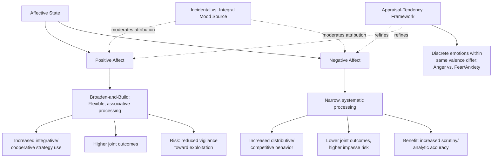

## Positive and Negative Affect and Their Strategic Effects

### Definitions

**Affect** is the general psychological term encompassing moods and emotions — subjective feeling states that vary along a valence dimension (positive/pleasant vs. negative/unpleasant) and, in most dimensional models, an arousal dimension (activated/high-energy vs. deactivated/low-energy). In negotiation research, **positive affect** and **negative affect** are studied as broad valence categories whose *strategic effects on cognition and behavior* are distinct from — and in some respects independent of — the effects of any single discrete emotion (such as anger or happiness specifically; see related topic on emotion as information).

This body of research draws primarily on **mood-congruent cognition theory**, **affect-as-information theory** (Schwarz & Clore), and the broader **broaden-and-build theory** of positive emotion (Barbara Fredrickson), applied to negotiation contexts largely through the work of researchers including Alice Isen, Peter Carnevale, Sara Kiesler, Gerben van Kleef, and Alison Wood Brooks.

### Theoretical Foundations

#### Mood-Congruent Processing and Cognitive Style

A central organizing distinction in this literature is between the **cognitive-style effects** of affect (how positive/negative mood changes the *manner* of information processing, independent of specific content) and **content-specific signaling effects** (what a specific mood or emotion communicates about a specific situation — covered under the related "Emotion as Information" topic).

- **Positive affect and cognitive flexibility**: A substantial body of research, notably associated with Alice Isen's foundational work, finds that induced positive affect is associated with more **flexible, creative, and integrative cognitive processing** — a broader, more associative search through possible solutions, and less rigid, categorical thinking.
- **Negative affect and analytic/systematic processing**: Correspondingly, negative affect (particularly sadness or general negative mood, distinct from anger specifically) has often been associated with more **systematic, detail-oriented, analytic processing**, consistent with affect-as-information logic in which negative mood signals "something is wrong, the current situation requires careful scrutiny," prompting more effortful, bottom-up processing.

[Inference] This broad affect-cognition mapping (positive → flexible/heuristic, negative → systematic/analytic) is generally treated in the literature as a robust *tendency* rather than a strict law, since discrete negative emotions (such as anger, distinct from sadness or anxiety) can produce quite different — sometimes opposite — processing effects, meaning the valence-only framing is a simplification that the discrete-emotion literature (see related "Emotion as Information" topic) complicates and refines.

#### Broaden-and-Build Theory (Fredrickson)

Fredrickson's broaden-and-build theory proposes that positive emotions, in contrast to the narrow, action-specific response tendencies associated with negative emotions (e.g., fear narrows attention toward escape), **broaden** an individual's momentary thought-action repertoire, promoting exploratory, playful, and integrative cognition. Over time, this broadened cognitive-behavioral repertoire helps **build** durable personal and social resources (skills, relationships, resilience). Applied to negotiation, this theory provides a mechanism for why positive affect is empirically associated with more integrative (value-creating), rather than purely distributive (value-claiming), negotiation behavior.

### Empirical Effects of Positive Affect on Negotiation

**Key Points**

- **Increased use of integrative (cooperative) strategies**: Multiple experimental studies (building on Carnevale & Isen, 1986, and subsequent replications) find that negotiators induced into a positive mood are more likely to identify and pursue integrative, mutually beneficial trade-offs, rather than defaulting to purely distributive, positional bargaining.
- **Higher joint outcomes / greater likelihood of reaching agreement**: Positive affect has been associated in various studies with a higher likelihood of successfully reaching an agreement (versus impasse) and with higher **joint** (combined) outcome value when agreement is reached, consistent with the flexible/integrative-processing mechanism.
- **More creative option-generation**: Positive-affect conditions have been associated with generating a greater number and greater novelty of potential solutions during brainstorming-like phases of negotiation.
- **Increased trust and cooperative attributions**: Positive mood tends to bias interpretation of ambiguous counterpart behavior in a more charitable, trust-consistent direction (mood-congruent judgment), which can facilitate cooperative dynamics but also carries a risk of insufficient vigilance toward genuinely exploitative counterpart behavior.
- **Risk of superficial/less vigilant processing**: [Inference] Because positive affect is generally associated with more heuristic, less effortful processing under some theoretical accounts (i.e., the "happy = trusting the situation, don't need to scrutinize" logic of affect-as-information), a documented risk is reduced vigilance toward deceptive or exploitative tactics under positive mood conditions in certain study designs — meaning positive affect's benefits for integrative creativity may trade off against reduced critical scrutiny of counterpart behavior in some contexts.

### Empirical Effects of Negative Affect on Negotiation

**Key Points**

- **Increased distributive/competitive behavior**: General negative affect (again, distinct from specific emotions like anger, which have their own distinct dedicated literature — see related topic) has often been associated with more rigid, positional, distributive bargaining behavior and reduced willingness to explore integrative trade-offs.
- **Reduced joint gains and higher impasse rates**: Negative-affect conditions have generally been associated with lower likelihood of reaching agreement and lower joint value when agreement is reached, mirroring the inverse pattern found for positive affect.
- **Increased scrutiny/reduced trust**: Consistent with mood-congruent judgment, negative affect tends to bias interpretation of ambiguous counterpart signals in a more suspicious, threat-consistent direction, which can increase vigilance against genuine exploitation but can also generate unwarranted mistrust and defensive escalation even absent actual adversarial intent from the counterpart.
- **Analytic processing benefits in specific contexts**: [Inference] Some research suggests negative affect's association with more systematic, detail-oriented processing can, in certain narrow contexts (e.g., contract review, careful verification of factual claims), produce *more accurate* judgments than positive affect's more heuristic processing style — meaning negative affect's effects are not uniformly detrimental to negotiation performance, but rather trade a reduction in integrative creativity for an increase in analytic scrutiny.

### Distinguishing Mood From Discrete Emotion Effects

**Key Points**

- **Valence is not the whole story**: A key methodological and theoretical point in this literature is that a purely valence-based (positive/negative) framework is a simplification. Discrete emotions sharing the same valence can have opposite strategic effects — for example, **anger** (negative valence, high arousal, approach-oriented) and **fear/anxiety** (negative valence, but avoidance-oriented) produce different, sometimes opposite, negotiation behaviors despite both being "negative affect."
- **Appraisal-tendency framework**: This distinction is formalized in the **appraisal-tendency framework** (Lerner & Keltner, 2000), which holds that discrete emotions carry specific appraisal dimensions (e.g., certainty, control, other-responsibility) that generalize into subsequent, even unrelated, judgments — e.g., anger is associated with appraisals of certainty and other-blame, and correspondingly generalizes into more risk-seeking, other-blaming judgments in subsequent unrelated decisions, whereas fear is associated with appraisals of uncertainty and situational (not other-)control, generalizing into more risk-averse judgments.
- **Practical implication**: Negotiation analysis and training that treats "negative mood" as a single undifferentiated category risks conflating quite different strategic dynamics (e.g., an anxious counterpart's likely concession-proneness vs. an angry counterpart's likely resistance and demand-escalation), underscoring the value of the more granular, discrete-emotion literature alongside the broader valence-based mood literature.

### Illustrative Example

**Example**

A sales team is preparing for two separate contract renewal negotiations scheduled on the same day.

- Before the first negotiation, the lead negotiator receives unexpected good news (a major unrelated deal closed successfully), inducing incidental positive affect. Going into the renewal negotiation, this positive mood — via mood-congruent processing — makes the negotiator more receptive to a counterpart's proposal to bundle a service upgrade with a modest price increase, seeing it as a creative, mutually beneficial trade-off (integrative framing) rather than scrutinizing it skeptically. The negotiation concludes efficiently with a jointly beneficial bundled agreement.
- Before the second negotiation, the same negotiator receives frustrating news (a shipment delay affecting an unrelated client), inducing incidental negative affect. Entering the second renewal negotiation, this negative mood increases scrutiny and suspicion: the negotiator interprets a similar bundling proposal from this counterpart more skeptically, engaging in more systematic, detail-oriented review of the proposed terms (a potential benefit, catching an unfavorable clause) but also displaying more rigid, distributive positioning on price and being less willing to explore the underlying trade-offs that might have produced a superior joint outcome (a potential cost).

In both cases, the driving mood was **incidental** — unrelated to the actual counterpart or deal — illustrating the misattribution risk central to affect-as-information theory (see related topic) and the distinct strategic-behavior consequences of positive versus negative affect independent of any actual signal about the counterpart's true position.

### Practical Applications and Strategic Implications

**Next Steps**

1. **Pre-negotiation mood awareness and source-checking**: Given the well-documented influence of *incidental* (negotiation-irrelevant) mood on negotiation behavior, negotiators benefit from briefly checking their own affective state before entering high-stakes negotiations and explicitly identifying whether that mood originates from the negotiation itself or from an unrelated prior event.
2. **Leveraging positive affect for integrative-stage work**: Given the documented association between positive affect and creative, integrative option-generation, negotiators may deliberately schedule or structure the exploratory, option-generating (brainstorming) phase of a negotiation for moments or contexts more conducive to positive affect, reserving more careful, systematic scrutiny of specific proposed terms for a separate phase.
3. **Leveraging negative affect (in moderation) for verification-stage work**: Conversely, the analytic-processing benefits associated with negative affect suggest that careful contract review, term verification, and risk-assessment tasks may benefit from a more systematically vigilant (though not necessarily distressed) mindset, distinct from the exploratory phase.
4. **Guarding against affect-driven trust miscalibration**: Because positive mood can reduce vigilance toward genuinely exploitative counterpart behavior, and negative mood can generate unwarranted suspicion toward genuinely good-faith proposals, negotiators benefit from explicitly cross-checking mood-driven trust judgments against objective, verifiable information (e.g., independent verification of claims, written documentation) rather than relying solely on affect-driven impressions.
5. **Distinguishing discrete emotions within "negative affect"**: Given the appraisal-tendency findings, practitioners are advised against treating all "negative mood" counterpart signals identically — anger-driven negative affect in a counterpart generally warrants a different strategic response (addressing a perceived fairness violation) than anxiety-driven negative affect (which may call for reassurance and confidence-building) despite both being negatively valenced.

### Conceptual Diagram

### Related Topics

- Emotion as Information in Negotiation (EASI Model)
- Appraisal-Tendency Framework (Lerner & Keltner)
- Broaden-and-Build Theory of Positive Emotions (Fredrickson)
- Anxiety, Aspiration Levels, and Concession-Making Behavior
- Fixed-Pie Bias and Integrative Bargaining
- Trust, Vigilance, and Deception Detection in Negotiation
- Mood-Congruent Judgment and Misattribution Effects
- Overconfidence and the Illusion of Transparency