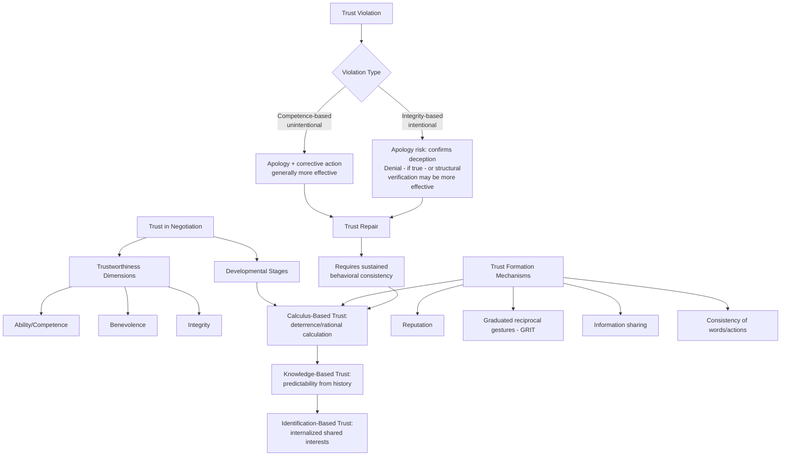

## Trust Formation, Maintenance, and Repair

### Definition

**Trust** in negotiation research is commonly defined as the willingness of one party to accept vulnerability to another party's actions, based on positive expectations regarding that party's intentions or behavior, under conditions of interdependence and uncertainty (drawing on the widely cited integrative definition by Rousseau, Sitkin, Burt, & Camerer, 1998, and the earlier organizational-trust framework of Mayer, Davis, & Schoorman, 1995). Trust is a central mediating construct in negotiation because it directly governs a party's willingness to share information, make concessions, rely on the counterpart's commitments, and pursue integrative (value-creating) rather than purely defensive, distributive strategies.

### Theoretical Foundations

#### The Three-Dimensional Model of Trustworthiness

Mayer, Davis, and Schoorman's influential model identifies three distinct antecedents of perceived **trustworthiness** in a counterpart, which combine to determine the level of trust a party is willing to extend:

1. **Ability (competence)**: The perceived skill, competence, and track record of the counterpart within the specific domain relevant to the negotiation (e.g., a supplier's demonstrated capacity to deliver on technical specifications).
2. **Benevolence**: The perceived degree to which the counterpart is believed to care about the trustor's welfare, beyond a purely self-interested, exploitative motive.
3. **Integrity**: The perceived adherence of the counterpart to a set of principles the trustor finds acceptable — consistency between the counterpart's words and actions, honesty, and fairness.

[Inference] These three dimensions are generally treated in the literature as conceptually separable and differently diagnostic — for instance, a counterpart might be judged high in ability but low in benevolence (a competent but self-interested party), producing a qualitatively different trust profile and negotiation dynamic than a counterpart judged low in ability but high in benevolence — though empirically the three dimensions are often correlated in practice.

#### Types of Trust in Negotiation: Calculus-Based, Knowledge-Based, and Identification-Based

A widely used complementary typology (Lewicki & Bunker, 1996) distinguishes trust by its **developmental stage and underlying basis**:

1. **Calculus-based trust (CBT)**: The earliest and most fragile form, grounded in the rational calculation that the counterpart will act consistently because the deterrent costs of violating trust (reputational damage, legal consequence, loss of future business) outweigh the benefits of defection. This form of trust is essentially a **rational-deterrence** mechanism rather than genuine relational confidence.
2. **Knowledge-based trust (KBT)**: Develops through repeated interaction over time, as parties accumulate sufficient information about each other's patterns of behavior to reliably predict how the other will act. This form of trust is grounded in **predictability** born of accumulated shared history, rather than deterrence.
3. **Identification-based trust (IBT)**: The deepest and most robust form, in which parties have internalized each other's preferences and values to the point of mutual identification — each party can act on the other's behalf because they have genuinely internalized the other's interests as partially their own. This form is most characteristic of long-term partnerships, joint ventures, or deeply embedded professional relationships, and is comparatively rare in most transactional negotiation contexts.

#### Trust and the Negotiator's Dilemma

Trust formation in negotiation is complicated by the **negotiator's dilemma** (a term associated with Lax & Sebenius): the strategic tension between **claiming value** (competitive, distributive behavior that benefits from information concealment and firm positioning) and **creating value** (cooperative, integrative behavior that requires genuine information-sharing, which is only rational if the other party can be trusted not to exploit that disclosed information). Low trust rationally incentivizes defensive, information-withholding behavior, which in turn forecloses the integrative trade-offs that could produce superior joint outcomes — a form of **suboptimal equilibrium** driven by trust scarcity rather than by an actual absence of integrative potential.

### Trust Formation Mechanisms

**Key Points**

- **Reputation and prior track record**: Pre-negotiation reputational information (from direct past experience, mutual contacts, or public/market reputation) provides an initial trust baseline before any direct interaction occurs, functioning largely at the calculus-based level initially.
- **Small, incremental reciprocal concessions**: Trust-building through negotiation is frequently modeled on a **tit-for-tat / graduated reciprocation** logic (drawing on Robert Axelrod's iterated prisoner's dilemma research and Charles Osgood's GRIT — Graduated and Reciprocated Initiatives in Tension-reduction — strategy): small, unilateral cooperative gestures, offered with an implicit or explicit invitation for reciprocation, allow trust to be tested and built incrementally without excessive initial vulnerability.
- **Information-sharing and transparency**: Voluntary disclosure of genuine interests and constraints (calibrated to avoid pure exploitability) signals good faith and, if reciprocated, accelerates the shift from calculus-based to knowledge-based trust.
- **Consistency between words and actions**: Direct behavioral demonstration of integrity — following through on stated commitments, even small ones — is a primary mechanism for building the integrity component of trustworthiness perception over repeated interaction.
- **Perspective-taking and rapport-building**: Explicit efforts to understand and acknowledge a counterpart's underlying interests (beyond positions) have been associated in negotiation research with increased perceived benevolence and improved relational trust trajectories.
- **Third-party endorsement and structural safeguards**: Trusted intermediaries, escrow arrangements, staged/milestone-based contract structures, and formal verification mechanisms can substitute for, or accelerate the effective functioning of, interpersonal trust, particularly in calculus-based-trust-stage relationships where direct experience is limited.

### Trust Maintenance

**Key Points**

- **Consistency over time**: Sustained trust, particularly the transition from calculus-based to knowledge-based trust, depends on the accumulation of a consistent behavioral track record across multiple interactions rather than any single positive event.
- **Communication during ambiguous or adverse events**: Proactive, transparent communication when circumstances threaten to violate an expectation (e.g., a delayed delivery, an unexpected cost overrun) tends to preserve trust more effectively than silence or discovery by the counterpart, since unexplained deviations are more readily interpreted as evidence of low integrity or benevolence.
- **Fairness in ongoing adjustments**: Because perceptions of trustworthiness are closely linked to perceived fairness (see related ultimatum-game and inequity-aversion literature), maintaining trust in an ongoing relationship requires attentiveness to whether adaptations to the original agreement (renegotiations, scope changes) are perceived as equitably handled.
- **Asymmetry of trust-building versus trust-destruction**: [Inference] A well-established general finding across trust research (not exclusively negotiation-specific) is that trust is typically built slowly through incremental positive interactions but can be severely damaged by a single significant violation — an asymmetry sometimes summarized as trust following a "slow to build, fast to break" pattern, though the precise asymmetry ratio is context-dependent rather than a fixed universal constant.

### Trust Repair After Violation

#### Types of Trust Violations

Trust-repair research (notably associated with Kim, Dirks, and Cooper, and with Roy Lewicki's extended work) commonly distinguishes trust violations along two dimensions:

1. **Competence-based violation**: A failure attributable to an ability/competence shortfall (e.g., an honest mistake, a missed deadline due to genuine capacity limitations) — generally perceived as *unintentional*.
2. **Integrity-based violation**: A failure attributable to a deliberate act of dishonesty, deception, or bad faith (e.g., a knowing misrepresentation) — generally perceived as *intentional*.

#### Differential Repair Effectiveness by Violation Type and Response Strategy

A key and frequently cited finding (Kim, Ferrin, Cooper, & Dirks, 2004) is that the effectiveness of a given repair strategy interacts with the *type* of violation:

- **Apologies tend to be more effective for competence-based violations**: Acknowledging an honest mistake and expressing regret helps repair trust when the underlying issue is perceived as an ability failure, because an apology signals awareness and commitment to improvement without contradicting the (still-intact) perception of integrity.
- **Denials (when the party is genuinely not at fault) tend to be more effective for integrity-based violations in some circumstances, while apologies can be less effective or even counterproductive**: Counterintuitively, some research finds that for allegations specifically implicating integrity (dishonesty), an apology can be interpreted as an admission of the very dishonesty being alleged, potentially deepening rather than repairing the trust deficit, whereas a firm, credible denial (when accurate) can be more effective at preserving the integrity dimension. [Inference] This finding is one of the more counterintuitive and debated results in the trust-repair literature, and its generalizability across different relationship types, cultures, and evidentiary contexts should be treated with appropriate caution rather than as a universal prescriptive rule — the appropriateness of denial obviously also depends heavily on whether the denial is actually truthful.
- **Consistent, verifiable behavioral change over time**: Across violation types, sustained behavioral consistency following a repair attempt is generally considered necessary to convert a repaired *stated* trust into durable, demonstrated trust — words alone (apology or denial) are typically treated in the literature as necessary but insufficient for full trust restoration absent a track record of subsequent consistent behavior.

#### Additional Repair Mechanisms

- **Third-party mediation and structural interventions**: External mediators or formal accountability structures (audits, revised contract terms with stronger verification clauses) can help re-establish a functional working relationship even where interpersonal trust has been severely damaged, effectively substituting structural safeguards for interpersonal confidence during the repair period.
- **Transparency and voluntary disclosure post-violation**: Proactively disclosing relevant information beyond what is minimally required, following a violation, can serve as a costly signal of renewed good faith, since voluntary vulnerability is harder to fake than verbal reassurance alone.
- **Time and incremental re-testing**: Consistent with the calculus-based-to-knowledge-based trust progression, post-violation trust often needs to be effectively rebuilt starting from a calculus-based (deterrence-oriented, verification-heavy) stage even if the relationship had previously reached knowledge-based or identification-based trust, since the violation resets the accumulated predictability record.

### Illustrative Example

**Example**

A manufacturer and a long-standing distributor have built **knowledge-based trust** over several years of reliable, on-time deliveries. A significant shipment arrives three weeks late, damaging the distributor's ability to fulfill its own retail commitments.

- **If the manufacturer attributes the delay to a genuine, unavoidable supply-chain disruption** (a competence-based framing) and responds with a prompt, transparent explanation, a sincere apology, and a concrete corrective plan (e.g., expedited future shipments, partial compensation), research on trust repair would suggest this apology-plus-corrective-action approach is likely to be relatively effective at repairing trust, because the violation is being processed as an ability lapse rather than a character/integrity failure.
- **If the distributor instead discovers that the manufacturer secretly prioritized a higher-paying client's order ahead of the distributor's contractually earlier order** (an integrity-based framing — a deliberate, undisclosed act), a simple apology risks being read as confirming the deception, and may be less effective than it would be for the competence-based scenario; a more credible response would likely require verifiable structural change (e.g., contractual penalty clauses, third-party order-verification audits) alongside any apology, and would likely require a substantially longer track record of demonstrated consistency before knowledge-based trust could be considered restored — effectively resetting the relationship toward a calculus-based, deterrence-monitored trust stage.

### Practical Strategies for Trust Formation, Maintenance, and Repair

**Next Steps**

1. **Start with calibrated, small reciprocal gestures**: Rather than either withholding all information defensively or fully disclosing all vulnerabilities immediately, use graduated, reciprocity-tested disclosures (GRIT-style) to build trust incrementally while managing exploitation risk.
2. **Separate positions from underlying interests early**: Explicit interest-based (rather than purely positional) discussion supports the perception of benevolence, a key trustworthiness dimension, and helps distinguish genuine value-creation opportunities from purely distributive claims.
3. **Communicate proactively around deviations from expectations**: Address foreseeable or emerging problems before the counterpart discovers them independently, since proactive disclosure protects the integrity dimension of trustworthiness even when the underlying news is unfavorable.
4. **Match repair strategy to violation type**: Distinguish, as accurately as possible, whether a given breach is more plausibly a competence failure or an integrity failure before selecting a repair strategy, given the differential effectiveness findings noted above — and recognize that misjudging this distinction risks selecting a counterproductive repair approach.
5. **Pair verbal repair with structural/behavioral verification**: Especially following integrity-based violations, supplement apologies or explanations with concrete, verifiable structural changes (audits, revised terms, staged deliverables) rather than relying on verbal reassurance alone.
6. **Expect and plan for a longer rebuilding timeline post-violation**: Given the generally recognized asymmetry between the speed of trust-building and trust-destruction, negotiators and organizations should calibrate expectations for how quickly a damaged relationship can return to its prior trust level, rather than expecting rapid full restoration.

### Conceptual Diagram

### Related Topics

- The Negotiator's Dilemma: Claiming vs. Creating Value
- GRIT (Graduated and Reciprocated Initiatives in Tension-Reduction) Strategy
- Reactive Devaluation and the Winner's Curse
- Ultimatum and Dictator Games: Fairness and Inequity Aversion
- Emotion as Information and the EASI Model
- Third-Party Mediation and Structural Safeguards in Deal Design
- Reputation Systems and Repeated-Game Dynamics in Negotiation
- Integrative vs. Distributive Bargaining Strategies