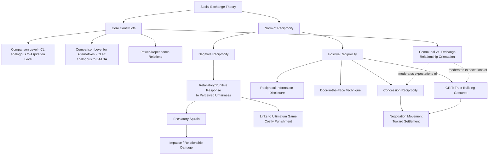

## Reciprocity and Social Exchange Theory

### Definitions

**Social Exchange Theory (SET)** is a foundational framework in sociology and social psychology, developed principally by George Homans (1958), Peter Blau (1964), and John Thibaut and Harold Kelley (1959), which conceptualizes social interactions — including negotiations — as exchanges of resources (material, informational, or socioemotional) in which parties act to maximize rewards and minimize costs, while remaining embedded in an ongoing relational structure of obligation, trust, and reciprocal expectation. Unlike purely economic exchange theory, SET emphasizes that exchanges in social relationships involve **unspecified, diffuse obligations** rather than the fully specified, simultaneous, contractually enforced terms characteristic of pure market transactions.

**Reciprocity** is the central normative mechanism that regulates social exchange: the widely observed and cross-culturally documented expectation that a benefit received creates an obligation to return a comparable benefit, and, correspondingly, that a cost or harm inflicted creates a license (or perceived obligation) to retaliate in kind. Alvin Gouldner's classic sociological analysis (1960) identified the **norm of reciprocity** as a near-universal moral norm functioning to stabilize social exchange relationships by discouraging exploitation of unilateral trust-extension.

### Theoretical Foundations

#### Economic Exchange vs. Social Exchange

A foundational distinction in this literature contrasts:

- **Economic exchange**: Terms are explicit, negotiated in advance, and simultaneously discharged (e.g., a cash purchase) — obligations are fully specified and the exchange is considered complete upon transaction.
- **Social exchange**: Terms are typically implicit, obligations are diffuse and unspecified in advance, and reciprocation is often deferred and open-ended in form and timing (e.g., "I'll do this for you now, trusting that you will reciprocate at some future point, in some form")

[Inference] Most real-world negotiations are generally considered to contain elements of both economic exchange (explicit, contractually specified terms) and social exchange (implicit relational obligations, goodwill, and reciprocal expectations that extend beyond the letter of the agreement), and the relative balance between these two logics is thought to shift depending on the transactional versus relational character of the specific negotiation context.

#### Positive and Negative Reciprocity

Social exchange and reciprocity research generally distinguishes:

1. **Positive reciprocity**: The tendency to respond to a perceived kindness, concession, or cooperative act with a comparable or proportionate cooperative response.
2. **Negative reciprocity**: The tendency to respond to a perceived harm, unfair treatment, or competitive/exploitative act with a comparable or proportionate retaliatory response — this mechanism is directly relevant to explaining costly punishment behavior documented in the ultimatum game (see related topic) and to escalatory spirals in adversarial negotiation.

Experimental economics research (notably associated with Ernst Fehr, Simon Gächter, and Armin Falk) has documented that both forms of reciprocity are frequently **stronger than pure self-interested rational-choice models would predict** — people incur real personal costs to reciprocate both kindness and unkindness, a finding closely linked to the inequity-aversion and reciprocity-based interpretations of ultimatum-game rejection behavior discussed in the related dedicated topic.

#### The Norm of Reciprocity as a Stabilizing Social Mechanism

Gouldner's classic formulation proposed that the norm of reciprocity serves two interrelated stabilizing functions in social systems:

1. It discourages the exploitation of parties who initiate cooperative or trust-extending behavior, since the norm creates social pressure on the recipient to reciprocate rather than free-ride.
2. It reduces the risk inherent in extending unilateral trust or making a first concession, since the reciprocity norm makes the counterpart's cooperative response more predictable than a purely self-interested model would suggest.

### Reciprocity as a Negotiation Mechanism

**Key Points**

- **Concession reciprocity**: One of the most robustly documented patterns in negotiation research is that concessions tend to be reciprocated — a party who makes a concession activates a normative and social-psychological pressure on the counterpart to respond with a comparable concession, a dynamic sometimes explicitly modeled in negotiation-strategy frameworks as the basic engine driving movement toward settlement.
- **Reciprocal information exchange**: Voluntary disclosure of interests or constraints by one party frequently prompts reciprocal disclosure by the counterpart, functioning as a trust-building mechanism (see related "Trust Formation" topic) grounded in the same underlying reciprocity norm.
- **The "door-in-the-face" technique**: A well-documented influence tactic (Cialdini et al., 1975) directly exploiting **reciprocal concession-making**: an initial large, likely-to-be-rejected request is followed by a smaller, more reasonable request, which is perceived as a concession from the requester, triggering a reciprocal concession from the target (increased likelihood of compliance with the smaller request) relative to presenting the smaller request alone.
- **Reciprocal trust-extension**: Building on the GRIT strategy (Graduated and Reciprocated Initiatives in Tension-reduction; see related "Trust Formation" topic), unilateral small cooperative gestures function specifically by invoking the reciprocity norm — the gesture is calibrated to create a socially and psychologically salient obligation for the counterpart to respond in kind.
- **Negative reciprocity and escalatory spirals**: Competitive tactics, perceived slights, or unfair offers can trigger negative reciprocity, in which the disadvantaged party responds with proportionate or even disproportionate retaliation (see related "Reactive Devaluation" and "Ultimatum Game" topics on costly punishment), a dynamic that can drive negotiations into destructive escalatory spirals absent a deliberate circuit-breaking intervention.

### Social Exchange Theory's Broader Constructs Relevant to Negotiation

**Key Points**

- **Comparison level (CL)**: An individual's internal standard for what constitutes an acceptable outcome in an exchange relationship, formed based on prior experience and expectations — analogous to, and often integrated with, the negotiation concept of an **aspiration level**.
- **Comparison level for alternatives (CLalt)**: The standard against which a current relationship or exchange is compared to the best available alternative — directly analogous to the negotiation concept of **BATNA** (Best Alternative to a Negotiated Agreement), and in fact widely recognized in the negotiation literature as a close conceptual precursor to Fisher and Ury's later, more negotiation-specific formalization of BATNA.
- **Relational versus transactional exchange orientation**: Building on Clark and Mills' (1979) distinction between **communal relationships** (where benefits are given based on the other's needs, without expectation of proportionate immediate repayment) and **exchange relationships** (where benefits are given with the expectation of comparable, often prompt, repayment), this distinction is directly relevant to how reciprocity operates differently in relational (e.g., long-term joint-venture) versus purely transactional (e.g., one-off spot-market) negotiation contexts. [Inference] Applying an exchange-relationship reciprocity logic within a counterpart's communal-relationship frame (or vice versa) is generally considered a source of relational friction and misunderstanding in negotiation, since the two parties may hold incompatible expectations about what "counts" as an appropriately reciprocated gesture and on what timeline.
- **Power-dependence relations**: Social exchange theory (particularly Richard Emerson's power-dependence formulation, 1962) frames power in an exchange relationship as a function of the *relative dependence* of each party on the relationship — the party less dependent on the continuation of the relationship (i.e., possessing better alternatives, analogous to a stronger BATNA/CLalt) holds structural power advantage, directly linking social exchange theory to bargaining-power analysis in negotiation.

### Illustrative Example

**Example**

A software vendor is negotiating a multi-year enterprise contract with a client. Early in the negotiation, the vendor voluntarily agrees to a minor, low-cost contractual accommodation the client requested (a slightly extended payment window) without demanding anything in direct, explicit return.

- Consistent with **positive reciprocity** and the **norm of reciprocity**, the client subsequently feels a social and psychological pull to reciprocate — even absent any explicit quid pro quo agreement — and voluntarily agrees to a longer contract term than originally planned, which benefits the vendor's revenue predictability.
- This dynamic illustrates the core **social exchange** logic: the vendor's initial concession was not economically "priced" or explicitly negotiated as a trade (an economic-exchange logic would require: "we'll extend your payment window IF you commit to a longer term"), but rather functioned as a diffuse, socially embedded gesture of goodwill that activated an unspecified reciprocal obligation, later discharged in a different (and not pre-negotiated) form.
- Suppose instead the vendor's account representative, midway through the relationship, is perceived by the client to have misrepresented a technical capability. Consistent with **negative reciprocity**, the client may respond not merely by addressing that specific issue narrowly, but by adopting a more generally adversarial, distributive stance across *all* subsequent negotiation points in the contract renewal — a disproportionate, spillover retaliatory response consistent with documented negative-reciprocity and reactive-devaluation dynamics.

### Practical Applications and Strategic Implications

**Next Steps**

1. **Deploy calibrated small concessions to activate positive reciprocity**: Strategic use of modest, genuine unilateral concessions early in a negotiation can leverage the reciprocity norm to build momentum toward agreement, functioning as a lower-risk alternative to demanding explicit, fully specified quid pro quo terms for every gesture.
2. **Distinguish relational from transactional contexts before applying reciprocity strategy**: Because communal and exchange relationship norms differ in what constitutes appropriate reciprocation and timing, negotiators should assess whether a counterpart is operating from a relational (long-term, diffuse-obligation) or transactional (short-term, explicit quid pro quo) frame before selecting a reciprocity-based tactic, since a mismatch can create the perception of either stinginess (applying exchange-logic in a communal context) or being taken advantage of (applying communal-logic in a purely transactional context).
3. **Actively interrupt negative reciprocity spirals**: Given the well-documented tendency for negative reciprocity to escalate disproportionately (a perceived slight generating a retaliatory response exceeding the original harm), negotiators and mediators benefit from explicit de-escalation techniques (e.g., explicit acknowledgment of the perceived harm, structured cooling-off periods, or third-party mediation) to break the reciprocal-retaliation cycle before it compounds.
4. **Use comparison-level/BATNA framing to anticipate reciprocity dynamics**: Understanding a counterpart's likely comparison level for alternatives (their BATNA-equivalent) helps predict how much their behavior will be governed by power-dependence dynamics versus pure reciprocity-norm-driven goodwill, since a counterpart with strong alternatives is structurally less dependent on maintaining the reciprocal relationship and may weight reciprocity norms less heavily in their decision-making.
5. **Be alert to strategic exploitation of the reciprocity norm (e.g., door-in-the-face tactics)**: Because the reciprocity norm can be deliberately triggered through manufactured "concessions" (an inflated initial demand designed purely to make a subsequent, still-favorable demand appear as a genuine concession), negotiators benefit from evaluating whether an apparent counterpart concession reflects genuine movement from a credible initial position or a manufactured anchor-and-concession sequence designed to exploit reciprocity psychology.

### Conceptual Diagram

### Related Topics

- Trust Formation, Maintenance, and Repair
- GRIT (Graduated and Reciprocated Initiatives in Tension-Reduction) Strategy
- Ultimatum and Dictator Games: Fairness and Costly Punishment
- Reactive Devaluation and the Winner's Curse
- BATNA and Reservation Price as Comparison-Level Constructs
- Power-Dependence Theory and Bargaining Power Analysis
- Compliance Tactics: Door-in-the-Face and Foot-in-the-Door Techniques
- Communal vs. Exchange Relationship Orientations in Long-Term Contracting