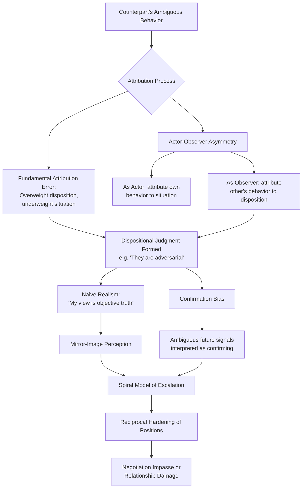

## Perception, Misperception, and Attribution Bias

### Definitions

**Social perception** in negotiation refers to the processes by which negotiators form impressions of a counterpart's traits, intentions, priorities, and likely future behavior based on available (often limited and ambiguous) information. **Misperception** occurs when these impressions systematically diverge from the counterpart's actual traits, intentions, or priorities, in ways that are not random but follow predictable psychological patterns. **Attribution theory**, originating with Fritz Heider (1958) and substantially developed by Harold Kelley (1967, 1973) and Edward Jones and Keith Davis, studies the systematic rules and biases people use when inferring the *causes* of behavior — specifically, whether a given action is attributed to stable internal dispositions (personality, character, intent) or to external situational factors (circumstance, constraint, context).

This cluster of theory is foundational to understanding why negotiators frequently misjudge counterparts' motives, escalate conflict based on inaccurate inferences, and fail to identify genuinely available integrative solutions — problems that stem not from a lack of information per se, but from systematic distortions in how available information is interpreted.

### Theoretical Foundations

#### The Fundamental Attribution Error

The **fundamental attribution error (FAE)**, a term coined by Lee Ross (1977), describes the pervasive tendency to **overattribute other people's behavior to their stable internal dispositions while underweighting situational or contextual explanations**, even when strong situational factors are present and, in principle, observable.

- **Negotiation application**: If a counterpart makes an aggressive opening demand, the FAE predicts the observer will readily attribute this to the counterpart's disposition ("they are a greedy, unreasonable person") rather than to situational pressures the counterpart may be facing (e.g., pressure from their own principal/organization, a genuinely constrained cost structure, or standard opening-anchor convention in their industry) — even when such situational factors, if surfaced, would provide an equally or more plausible explanation.

#### The Actor-Observer Asymmetry

Closely related to the FAE, the **actor-observer asymmetry** (Jones & Nisbett, 1971) describes a systematic *directional* difference in attribution depending on whether one is the actor or the observer of a given behavior:

- **As an actor**, individuals tend to attribute their *own* behavior to situational factors ("I made an aggressive opening offer because the market conditions forced my hand").
- **As an observer**, individuals tend to attribute the *same category* of behavior in others to dispositional factors ("They made an aggressive opening offer because they are inherently unreasonable/aggressive").

[Inference] This asymmetry is generally explained in the literature by differences in perceptual salience (the actor's attention is on the situation surrounding them, while the observer's attention is focused on the actor as the most visually/cognitively salient element of the scene) combined with differential access to private information (the actor has access to their own situational constraints and internal states, which the observer typically lacks) — though the relative contribution of each mechanism remains a subject of ongoing theoretical discussion.

- **Direct negotiation consequence**: This asymmetry produces a systematic, bidirectional misperception pattern: each party in a negotiation tends to see their *own* competitive or defensive tactics as reasonable responses to circumstance, while simultaneously interpreting the *counterpart's* structurally similar tactics as evidence of the counterpart's inherently difficult or untrustworthy character — a dynamic that can drive escalatory misunderstanding even when both parties are, in fact, behaving in functionally similar, situationally constrained ways.

#### Kelley's Covariation Model

Kelley's covariation model formalizes the cues observers use (often unconsciously) to determine whether to make a dispositional or situational attribution, based on three types of covariation information:

1. **Consensus**: Do other people behave the same way in this situation? (High consensus → situational attribution more likely; low consensus → dispositional attribution more likely.)
2. **Distinctiveness**: Does this person behave this way only in this specific situation, or across many situations? (High distinctiveness → situational; low distinctiveness → dispositional.)
3. **Consistency**: Does this person behave this way consistently over time in this situation? (High consistency strengthens whichever attribution the consensus/distinctiveness information points toward.)

**Negotiation application**: A negotiator judging whether a counterpart's hardball tactic reflects a stable disposition ("this is just how they always negotiate") or a situational response ("this is unusual for them, and other counterparts in similar deals behave the same way") is implicitly applying covariation logic — and misjudging any of the three cues (e.g., lacking accurate information about how the counterpart behaves in *other* negotiations, i.e., distinctiveness) can lead to systematically incorrect attributions.

### Motivated Reasoning and Self-Serving Attribution Bias

**Key Points**

- **Self-serving bias**: The well-documented tendency to attribute one's own successes to internal, dispositional factors (skill, effort, competence) while attributing one's own failures to external, situational factors (bad luck, an unreasonable counterpart, unfair circumstances) — a pattern that, applied to negotiation, contributes to the egocentric fairness judgments documented in the ultimatum-game and inequity-aversion literature (see related topics), since each party's self-serving construal of "what is fair" is itself a form of self-serving attribution about the causes and deservingness underlying the current situation.
- **Confirmation bias in attribution**: Once an initial dispositional judgment about a counterpart is formed (e.g., "they are a difficult, adversarial negotiator"), subsequent ambiguous behavior tends to be interpreted in a manner that confirms this prior judgment, while disconfirming evidence is more readily dismissed or explained away — a self-reinforcing perceptual cycle that can be highly resistant to correction through ordinary negotiation interaction.
- **Naive realism**: The tendency to believe that one's own perception of a situation is the objective, unbiased truth, while any counterpart who perceives the situation differently must be either uninformed, irrational, or motivated by bias or self-interest — a construct closely associated with Lee Ross's broader research program (alongside reactive devaluation, see related topic) and directly implicated in escalatory perceptual spirals, since each party in a disagreement can simultaneously and sincerely believe the other party is the one being unreasonable.

### Misperception Patterns in Conflict and Escalation

**Key Points**

- **Mirror-image perceptions**: A well-documented pattern, particularly studied in the context of international conflict (Ralph White's and Urie Bronfenbrenner's Cold War-era research) but generalizable to interpersonal and organizational negotiation, in which each party in a conflict perceives itself as reasonable, defensive, and acting in good faith, while perceiving the other party as aggressive, untrustworthy, and acting in bad faith — a symmetric, mirror-image distortion that can occur even when both parties' underlying behavior is objectively quite similar.
- **Spiral model of conflict escalation**: Building on attribution asymmetries and mirror-image perception, the **spiral model** describes how each party's defensively-motivated action (attributed by that party to legitimate situational necessity) is perceived by the counterpart as unprovoked dispositional aggression, prompting a proportionate or disproportionate "defensive" response from the counterpart — which is then, in turn, perceived by the first party as confirming their original suspicion, in a self-reinforcing escalatory cycle.
- **Selective perception and information processing**: Ambiguous counterpart signals (a delayed response, a terse email, a hesitant tone) are especially susceptible to being interpreted through the lens of prior dispositional judgments, since ambiguous information provides maximal latitude for confirmation-biased interpretation.

### Illustrative Example

**Example**

During a tense contract renegotiation, Party A submits a counteroffer three days later than the informally expected timeline.

- **Party B's likely attribution (as observer, per the actor-observer asymmetry and FAE)**: "They're deliberately stalling to pressure us as our deadline approaches — this confirms they've been playing hardball from the start" (a dispositional attribution to bad faith/strategic manipulation).
- **Party A's actual situation (as actor, per the same asymmetry)**: The delay was caused by an internal approval bottleneck within Party A's own organization — a genuine situational constraint that Party A privately experiences as an inconvenient, non-strategic delay, but which Party A does not proactively communicate to Party B (perhaps due to the countervailing risk of appearing disorganized).
- **Compounding through confirmation bias**: If Party B has already formed an initial dispositional judgment of Party A as adversarial (from an earlier exchange), this delay is processed as further confirming evidence, making Party B less likely to seek or accept a situational explanation even if later offered, and more likely to respond with a harder, more guarded counteroffer of their own.
- **Resulting mirror-image dynamic**: Party A, observing Party B's subsequently harder counteroffer, may in turn interpret *this* as evidence that Party B was never negotiating in good faith — completing a mutually reinforcing, symmetric misperception spiral rooted entirely in attributional asymmetry rather than in any actual change in either party's underlying goals or good faith.

### Mitigation Strategies

**Next Steps**

1. **Explicit situational disclosure**: Proactively communicating genuine situational constraints (e.g., "our delay was due to an internal approval process, not a change in our position") directly counteracts the actor-observer asymmetry by supplying the observer with situational information they would not otherwise have access to.
2. **Perspective-taking exercises**: Deliberately and explicitly considering plausible situational explanations for a counterpart's behavior — asking "what situational pressures might explain this, rather than assuming a dispositional cause?" — is a well-supported general debiasing technique against the fundamental attribution error.
3. **Seeking consensus and distinctiveness information**: Actively gathering information about how the counterpart behaves in other, comparable situations (distinctiveness) and how other similarly situated parties behave in this type of situation (consensus) improves the accuracy of covariation-based attribution, reducing reliance on a single, potentially unrepresentative data point.
4. **Explicit hypothesis-testing rather than confirmation-seeking**: Deliberately seeking information that could *disconfirm* an initial dispositional judgment about a counterpart (rather than only information that confirms it) counteracts confirmation bias in ongoing attribution formation.
5. **Acknowledging naive realism explicitly**: Recognizing, as a matter of professional discipline, that one's own perception of a "fair" or "reasonable" negotiation stance is not an objective, universally shared truth, but one perspective among potentially equally sincere and differently-informed alternative perspectives, helps reduce the escalatory potential of naive-realism-driven disagreement.
6. **Third-party or mediator perspective**: An outside party without either side's attributional investment can often more readily identify situational explanations for behavior that both principals, entrenched in mirror-image dispositional attributions, have overlooked.

### Conceptual Diagram

### Related Topics

- Reactive Devaluation and the Winner's Curse
- Ultimatum and Dictator Games: Egocentric Fairness Judgments
- Trust Formation, Maintenance, and Repair
- Reciprocity and Social Exchange Theory
- Emotion as Information and the EASI Model
- Overconfidence and the Illusion of Transparency
- Conflict Escalation Spirals and De-Escalation Interventions
- Perspective-Taking and Theory-of-Mind in Integrative Bargaining