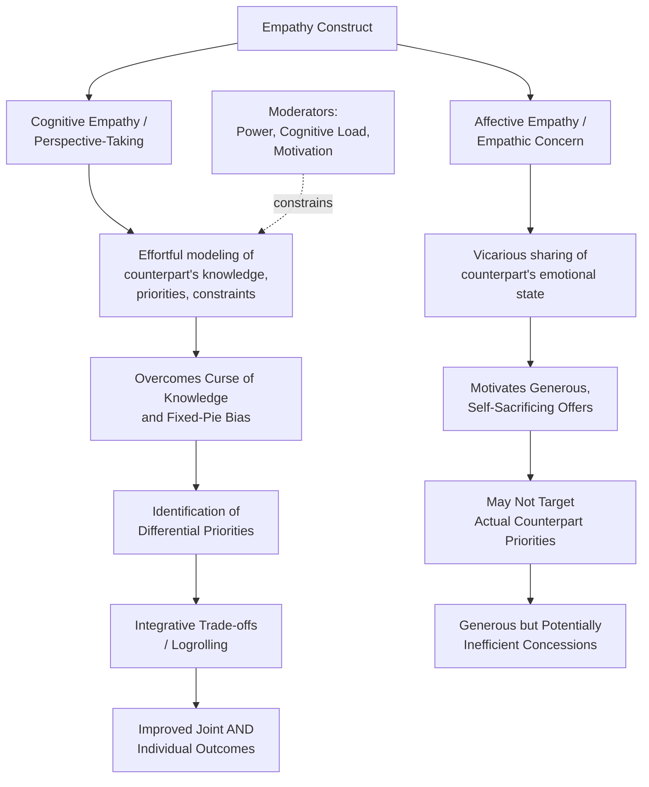

## Empathy and Perspective-Taking

### Definitions

**Perspective-taking** is a cognitive process involving the deliberate, effortful attempt to understand a situation from another person's point of view — modeling their knowledge, interests, priorities, and reasoning without necessarily sharing their emotional state. **Empathy**, by contrast, is typically decomposed in the psychological literature into two related but distinct components: **cognitive empathy** (understanding another's emotional state, closely overlapping with perspective-taking) and **affective/emotional empathy** (vicariously experiencing or sharing another's emotional state). This distinction — cognitive versus affective empathy — is foundational to negotiation research, since the two components have been shown to have **different, and at times opposing, effects on negotiation outcomes**.

The primary research program establishing this distinction's importance in negotiation is associated with Adam Galinsky, William Maddux, Debra Gilin, and Keith Sanfey (2008), among others, building on earlier general social-cognition research by Sara Hodges, Daniel Wegner, and others on perspective-taking's cognitive mechanisms.

### Theoretical Foundations

#### Cognitive Empathy / Perspective-Taking vs. Affective Empathy / Empathic Concern

- **Perspective-taking (cognitive empathy)**: An active, effortful, System-2-driven cognitive strategy of imagining the counterpart's point of view — specifically, modeling what the counterpart knows, wants, and is constrained by. This is functionally similar to constructing a "theory of mind" model of the counterpart, distinct from any emotional resonance with them.
- **Empathic concern (affective empathy)**: A feeling-based, emotional response involving concern, compassion, or sympathy for the counterpart's welfare, generated through vicarious emotional sharing rather than deliberate cognitive modeling.

[Inference] These two constructs are generally treated in the literature as psychometrically and neurally separable — supported in part by evidence that perspective-taking activates brain regions associated with cognitive/executive processing, while empathic concern activates regions more associated with affective/emotional processing — though in practice they frequently co-occur and can mutually influence one another in real social interaction.

#### Galinsky et al.'s Key Finding: Divergent Effects on Negotiation Performance

The central and most influential empirical finding in this literature (Galinsky, Maddux, Gilin, & White, 2008, and related work) is that **perspective-taking and empathic concern have distinguishable — and in some experimental designs, opposing — effects** on negotiation outcomes:

- **Perspective-taking** has been associated with improved ability to identify and construct **integrative (value-creating) agreements**, because accurately modeling the counterpart's actual priorities (as opposed to assuming a fixed-pie or projecting one's own priorities onto them) is a cognitive prerequisite for discovering non-obvious, mutually beneficial trade-offs.
- **Empathic concern**, in some of the same studies, was associated with **more generous, self-sacrificing offers that did not necessarily improve — and in some conditions reduced — the perspective-taker's own individual outcomes**, since an emotionally-driven concern for the counterpart's welfare can motivate concession-making independent of any accurate understanding of what trade-offs would actually be mutually beneficial (i.e., concern without accurate modeling can produce generous but not necessarily *efficient* concessions).

[Inference] This finding — that the "colder," more cognitively effortful strategy of perspective-taking can outperform the "warmer," affectively-driven strategy of empathic concern for maximizing *joint* integrative value specifically — is one of the more counterintuitive and frequently cited results in the negotiation-psychology literature, and it should be understood as pertaining specifically to the identification of integrative trade-offs and individual outcome performance in the study designs used, rather than as a general claim that empathic concern is unhelpful or undesirable in negotiation contexts overall (e.g., for relationship maintenance, trust-building, or ethical considerations, which were not necessarily the primary dependent variables in these specific studies).

#### Mechanism: Perspective-Taking as Interest Diagnosis

The mechanism by which perspective-taking improves integrative outcomes is generally explained through its function as an **interest-diagnosis tool**: by actively simulating the counterpart's likely priorities across multiple issues, a negotiator can identify **differential priorities** — issues the counterpart cares about intensely that the negotiator cares about less, and vice versa — which is the essential precondition for constructing value-creating trade-offs (logrolling). This directly counteracts the **fixed-pie bias** (the assumption that all issues are zero-sum), since accurate perspective-taking reveals where interests genuinely diverge in priority, even when positions superficially appear to conflict.

### Perspective-Taking and the Curse of Knowledge

A documented tension exists between perspective-taking as a *deliberate strategy* and the **curse of knowledge** (see related topic on heuristics and biases) as a *default cognitive failure*: possessing private information (about one's own true costs, constraints, or reservation price) makes it cognitively difficult to accurately simulate what a counterpart, lacking that private information, does or does not know or want. Effective perspective-taking, in this sense, requires **actively overriding** the default egocentric anchoring on one's own knowledge state — it is not merely "being nice" but a specific, effortful cognitive correction against a well-documented default bias.

### Boundary Conditions and Moderators

**Key Points**

- **Power and motivation**: [Inference] Some research suggests that negotiators in relatively higher-power positions may be less naturally motivated to engage in effortful perspective-taking (since their outcomes are less dependent on accurately modeling a less-powerful counterpart's interests), suggesting power asymmetry may function as a moderator of perspective-taking's spontaneous occurrence, independent of its demonstrated benefits when actually employed.
- **Cognitive load**: Because perspective-taking is an effortful, System-2-type cognitive process (unlike the more automatic affective-empathy response), it is more susceptible to disruption under high cognitive load, time pressure, or multitasking conditions — a boundary condition consistent with the broader dual-process and bounded-rationality literature.
- **Distinctness from strategic mimicry or manipulation**: Perspective-taking as studied in this literature refers to genuine interest-modeling for the purpose of identifying real trade-offs, and is conceptually distinct from — though sometimes confused with — purely strategic information-extraction tactics aimed at exploiting rather than accommodating the counterpart's actual interests; [Inference] the ethical and relational consequences of perspective-taking used for exploitative versus integrative purposes are generally treated as an important, if less thoroughly quantified, distinction in applied negotiation ethics discussions.
- **Combination effects**: Some subsequent research has explored whether combining perspective-taking (for accurate interest diagnosis) with a degree of empathic concern (for motivation to actually act on identified trade-offs generously rather than exploitatively) may produce outcomes superior to either strategy in isolation, though [Unverified] the specific conditions under which such combination effects are most pronounced, and their precise magnitude relative to perspective-taking alone, warrant verification against the specific studies addressing this question.

### Illustrative Example

**Example**

Two co-founders are negotiating an exit agreement after deciding to part ways in their startup, dividing intellectual property rights, remaining cash reserves, and continued use of the company name.

- **Empathic-concern-driven approach**: One founder, feeling genuine sympathy for the other's more precarious financial situation post-split, makes a broadly generous offer across all three issues — ceding more cash, more IP rights, and more naming rights than strictly necessary — driven by emotional concern rather than by any specific analysis of what the other founder most needs. This may produce a warm, relationally positive outcome, but it does not necessarily identify the most *efficient* allocation of value, and the generous founder may have unnecessarily conceded on an issue (e.g., the company name) that they in fact valued highly and that the other founder was actually indifferent to.
- **Perspective-taking-driven approach**: The same founder instead deliberately models the other founder's specific situation: recognizing that the departing founder urgently needs cash flow (given their financial precarity) but has relatively little attachment to the company name (having already mentally moved on to a new venture under a different name) or to specific IP components unrelated to their next venture's direction. Based on this modeled understanding, the founder proposes an agreement that concedes generously on **cash** (the departing founder's actual priority) while retaining the **company name** and **most IP rights** (which the departing founder does not, per the perspective-taking analysis, actually value highly) — an outcome that is more generous where it matters most to the counterpart while preserving more total value for the proposing founder, illustrating the integrative-value-identification advantage of perspective-taking over undifferentiated empathic generosity.

### Practical Strategies for Cultivating Effective Perspective-Taking

**Next Steps**

1. **Explicit "what do they know and want" exercises during preparation**: Before entering a negotiation, deliberately and systematically write out an estimate of the counterpart's likely priorities, constraints, and private information, distinct from and prior to formulating one's own opening position.
2. **Direct, curious questioning during the negotiation**: Rather than relying solely on inferential modeling, actively ask open-ended questions about the counterpart's priorities and constraints, and update one's perspective-taking model based on their actual responses rather than assumptions alone.
3. **Explicitly counteracting the curse of knowledge**: When one holds private information relevant to the negotiation, deliberately pause to ask "what would someone without this information reasonably assume or want here?" to counteract the natural tendency to over-assume shared understanding.
4. **Distinguishing interest-diagnosis from generosity**: Practitioners should be aware that accurately understanding what a counterpart wants (perspective-taking) is analytically separate from deciding how generously to act on that understanding (a values- and strategy-based choice) — conflating the two risks either withholding legitimate accommodation once interests are understood, or conceding indiscriminately without regard to actual counterpart priorities.
5. **Protecting perspective-taking capacity under pressure**: Given its documented vulnerability to cognitive load and time pressure, negotiators facing high-stakes or high-pressure negotiations may benefit from structured preparation time devoted specifically to perspective-taking analysis *before* entering time-pressured, real-time exchange, rather than attempting this effortful cognitive process only in the moment.

### Conceptual Diagram

### Related Topics

- Fixed-Pie Bias and Integrative Bargaining
- The Curse of Knowledge and Private Information Asymmetry
- Perception, Misperception, and Attribution Bias
- Emotion as Information in Negotiation (EASI Model)
- Bounded Rationality in Negotiated Decisions
- Trust Formation, Maintenance, and Repair
- Theory of Mind and Social Cognition in Strategic Interaction
- Logrolling and Multi-Issue Trade-Off Construction