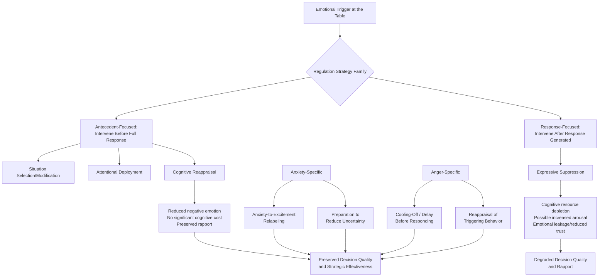

## Managing Anger, Anxiety, and Stress at the Table

### Overview

While the "Emotion as Information" and "Positive/Negative Affect" topics address how emotions function as diagnostic *signals* within a negotiation, this topic addresses the applied, self-regulatory question of how negotiators can **manage their own** anger, anxiety, and stress responses during live negotiation to preserve decision quality and strategic effectiveness. This body of work draws on **emotion regulation theory** (most centrally James Gross's process model of emotion regulation), stress-and-performance research (the Yerkes-Dodson law and its negotiation-specific extensions), and negotiation-specific experimental work on anxiety (notably Alison Wood Brooks) and anger (Keith Allred, Gerben van Kleef).

### Theoretical Foundations

#### Gross's Process Model of Emotion Regulation

James Gross's influential process model identifies distinct points in the emotion-generation timeline at which regulation can occur, commonly organized into two broad families with markedly different consequences:

1. **Antecedent-focused strategies** (intervening *before* an emotional response is fully generated):
   - **Situation selection/modification**: Choosing or altering the negotiation context itself (e.g., scheduling a high-stakes discussion for a time when one is well-rested, or requesting a change of venue for a tense discussion).
   - **Attentional deployment**: Directing attention away from emotionally provocative stimuli (e.g., not dwelling on a counterpart's insulting remark) or toward calming ones.
   - **Cognitive reappraisal**: Reinterpreting the meaning of a situation to alter its emotional impact (e.g., reframing a counterpart's aggressive tactic as a sign of their own anxiety or weak position, rather than as a personal affront) — this strategy is the most extensively researched and generally the most effective of Gross's antecedent-focused strategies.
2. **Response-focused strategies** (intervening *after* an emotional response has already been generated):
   - **Expressive suppression**: Inhibiting the outward behavioral expression of an already-felt emotion (e.g., maintaining a neutral facial expression while internally feeling anger).

#### Reappraisal vs. Suppression: A Critical Distinction for Negotiation

A robust and highly consequential finding across the broader emotion-regulation literature (extended specifically into negotiation contexts) is that **cognitive reappraisal and expressive suppression have markedly different downstream consequences**, despite both being viable short-term regulation tactics:

- **Reappraisal** is generally associated with reduced experienced negative emotion, no significant cognitive cost, and preserved or improved interpersonal functioning, since it addresses the emotional response at its source (its interpreted meaning) rather than merely masking its outward expression.
- **Suppression**, by contrast, is generally associated with a documented **cognitive cost** (consuming executive/working-memory resources needed for the suppression effort itself, which can degrade concurrent cognitive task performance — directly relevant to a negotiator's simultaneous need to track offers, calculate trade-offs, and formulate responses) and can paradoxically **increase physiological arousal** even while successfully masking outward expression, alongside documented negative effects on the *counterpart's* trust and rapport, since suppressed emotion can still "leak" through subtle nonverbal cues that observers pick up on (even without consciously identifying the specific cue), producing an ambient sense of inauthenticity or distance.

[Inference] Given this asymmetry, cognitive reappraisal is generally recommended over expressive suppression as the preferred *primary* emotion-regulation strategy at the negotiation table wherever feasible, with suppression treated as a useful but costlier fallback for situations where reappraisal has not been (or cannot be) successfully achieved in the moment — though brief, tactical suppression (e.g., maintaining composure for a few seconds while formulating a reappraisal) is not itself considered problematic; the documented costs are more associated with sustained, effortful suppression across an extended interaction.

#### The Yerkes-Dodson Law and Optimal Arousal

The classic **Yerkes-Dodson law** (1908) proposes an inverted-U relationship between physiological/psychological arousal and task performance: performance improves with increasing arousal up to an optimal point, beyond which further arousal degrades performance. [Inference] Applied to negotiation, this framework is generally used to suggest that a *moderate* level of engaged arousal (alertness, focus, appropriate stakes-awareness) supports effective negotiation performance, while both very low arousal (disengagement, insufficient preparation motivation) and very high arousal (panic, overwhelming anxiety, uncontrolled anger) degrade performance — though the precise location of the "optimal" point is task- and individual-dependent rather than a fixed universal threshold, and the original Yerkes-Dodson research itself was conducted on simpler perceptual-motor tasks in non-human subjects, making direct extrapolation to complex negotiation performance an analogical application rather than a directly validated finding.

### Anxiety-Specific Research and Management

**Key Points**

- **Documented effects of anxiety on negotiation performance**: Research associated with Alison Wood Brooks and colleagues has found that anxious negotiators tend to exhibit lower aspirations, make and accept less favorable first offers, exit negotiations earlier, and achieve worse economic outcomes than negotiators induced into a neutral or excited emotional state — with these effects generally found to operate independent of the negotiator's actual objective competence, suggesting anxiety degrades performance through an emotional-state channel rather than solely through impaired reasoning ability.
- **Anxiety-to-excitement reappraisal**: A specific reappraisal technique studied in this literature involves relabeling the physiological arousal associated with anxiety (elevated heart rate, alertness) as **excitement** rather than **anxiety** — since the two states share substantial physiological overlap (both being high-arousal states) but differ primarily in their valence-related cognitive interpretation. Brooks' research found that individuals instructed to reappraise pre-negotiation anxiety as excitement (e.g., through a simple verbal self-statement such as "I am excited") performed better on subsequent tasks than those who attempted to calm down or suppress the arousal, [Inference] suggesting that changing the arousal's valence label may be an easier and more effective regulation target than attempting to reduce the arousal itself, though the durability and generalizability of this specific technique across different negotiation contexts and populations should be considered alongside the broader reappraisal literature rather than as a uniformly guaranteed effect.
- **Preparation as anxiety mitigation**: Thorough pre-negotiation preparation (researching the counterpart, rehearsing responses to anticipated tactics, clearly establishing one's own BATNA and reservation point) is widely recommended as a practical anxiety-reduction strategy, on the general logic that a substantial component of negotiation anxiety stems from uncertainty and perceived unpreparedness, both of which are directly addressable through preparation.

### Anger-Specific Research and Management

**Key Points**

- **Documented dual-edged effects of anger**: As covered in the related "Emotion as Information" topic, a counterpart's displayed anger can, via the inferential route, sometimes extract concessions by signaling a firm position — however, the *anger-experiencer's own* internal anger (as distinct from anger displayed for strategic effect) has been documented to have largely negative consequences for the angry party's own decision-making: increased risk-taking, more impulsive and less analytically careful offers, and reduced accuracy in judging the counterpart's actual interests and constraints.
- **Anger's effect on trust and information processing**: Consistent with the "appraisal-tendency framework" (see related "Positive and Negative Affect" topic), anger is associated with appraisals of certainty and other-blame, which can prompt overconfident, insufficiently scrutinized judgments about a counterpart's culpability or bad faith — directly connecting to attribution-bias dynamics (see related "Perception, Misperception, and Attribution Bias" topic) and increasing vulnerability to escalatory misperception spirals.
- **Cooling-off and time-delay strategies**: Given anger's association with impulsive, poorly-considered decisions, a well-established practical recommendation is to build in a deliberate delay (a caucus, a break, an "I'll get back to you" pause) between the anger-triggering event and any consequential response or decision, allowing the acute physiological arousal associated with anger to subside before acting.
- **Reappraisal of the anger-triggering event**: Consistent with Gross's model, reinterpreting a counterpart's anger-triggering behavior (e.g., reframing a perceived insult as a negotiation tactic, a cultural communication-style difference, or a sign of the counterpart's own stress rather than a deliberate personal attack) can reduce the intensity of the resulting anger response before it drives behavior.

### General Stress-Management Strategies for the Negotiation Table

**Next Steps**

1. **Pre-negotiation cognitive reappraisal preparation**: Before high-stakes negotiations, deliberately identify likely provocations or stressors and pre-formulate alternative, less emotionally charged interpretations of them (e.g., "if they open aggressively, I will interpret this as a standard anchoring tactic rather than a personal insult"), so that reappraisal can be deployed quickly rather than constructed from scratch under live pressure.
2. **Physiological arousal relabeling**: For anxiety specifically, practicing the explicit relabeling of pre-negotiation arousal as excitement rather than dread, given the documented performance benefits of this specific reappraisal technique.
3. **Building in structural pauses**: Deliberately scheduling breaks, caucuses, or "let me consult and get back to you" delays at predictable intervals (rather than only reactively when already highly emotionally activated) normalizes the use of cooling-off periods and reduces the stigma or perceived weakness sometimes associated with pausing mid-negotiation.
4. **Preparation as a general stress-reduction lever**: Thorough substantive preparation (BATNA clarity, anticipated counterpart tactics, rehearsed responses) reduces the general uncertainty that underlies much negotiation-related anxiety, functioning as a broad-spectrum stress-management strategy beyond any single in-the-moment technique.
5. **Distinguishing strategic emotional display from genuine internal state management**: Practitioners should recognize that *managing one's own* anger or anxiety (the focus of this topic) is analytically distinct from *strategically displaying* emotion for effect (covered in the related "Emotion as Information" topic) — the former is about preserving one's own decision quality, while the latter is a separate, more ethically and strategically nuanced communicative choice.
6. **Physical/somatic regulation techniques**: General stress-physiology techniques (controlled breathing, brief physical movement during breaks) are commonly recommended as complements to cognitive reappraisal strategies, on the general logic that physiological arousal and cognitive/emotional state are mutually influencing, though [Unverified] the specific incremental benefit of somatic techniques *layered on top of* cognitive reappraisal specifically within negotiation contexts (as opposed to general stress-management contexts) warrants verification against negotiation-specific study designs rather than being assumed from the broader stress-management literature alone.

### Illustrative Example

**Example**

A project manager is negotiating a scope-and-budget dispute with a difficult client who has a history of aggressive, dismissive communication. As the meeting begins, the project manager notices physical symptoms of anxiety (elevated heart rate, tight chest) driven by anticipation of the client's likely hostility.

- **Antecedent reappraisal (pre-meeting)**: Beforehand, the project manager had explicitly reframed the anticipated hostility as "this is the client's standard opening posture in every negotiation, not a personal signal about how this particular conversation will go" — a cognitive reappraisal reducing the anticipatory anxiety's intensity before the meeting even begins.
- **In-the-moment arousal relabeling**: Noticing the physical arousal symptoms as the meeting starts, the project manager consciously relabels the sensation internally as "focused readiness" rather than "dread," consistent with the anxiety-to-excitement reappraisal technique.
- **Managing an anger trigger mid-negotiation**: When the client makes a dismissive remark about the project manager's competence, triggering a flash of anger, the project manager uses a brief structural pause ("Let me take a moment to look at these numbers") rather than responding immediately, allowing the acute anger response to subside and enabling a more considered, strategically calibrated response rather than an impulsive, potentially escalatory reaction.
- **Contrast with a suppression-based approach**: Had the project manager instead simply forced a neutral expression while internally seething (expressive suppression) without any reappraisal, the documented costs of suppression — cognitive resource depletion reducing capacity to track the actual budget figures under discussion, and possible "leakage" of underlying tension perceptible to the client — would likely have degraded both decision quality and relational rapport, even if the suppression were outwardly "successful" in masking visible anger.

### Conceptual Diagram

### Related Topics

- Emotion as Information in Negotiation (EASI Model)
- Positive and Negative Affect and Their Strategic Effects
- Perception, Misperception, and Attribution Bias
- Cognitive Reappraisal and Gross's Process Model of Emotion Regulation
- The Yerkes-Dodson Law and Arousal-Performance Relationships
- BATNA Preparation and Uncertainty Reduction
- Trust Formation, Maintenance, and Repair
- De-Escalation Techniques in Adversarial Negotiation