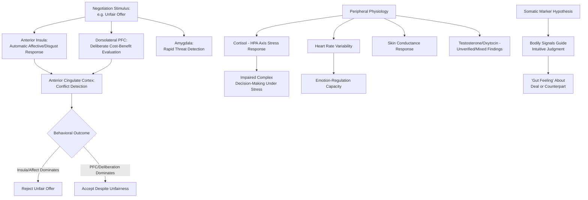

## Neuroscience and Physiology of Negotiated Decisions

### Overview

**Neuroeconomics** and the **social/affective neuroscience of decision-making** apply neuroimaging (primarily functional magnetic resonance imaging, fMRI), psychophysiological measurement (heart rate variability, skin conductance, cortisol assays), and lesion-study methodology to identify the neural and physiological substrates underlying negotiation-relevant judgments and behaviors — including fairness perception, risk and reward evaluation, emotional reactivity, trust, and self-control under strategic uncertainty. This field, substantially developed by researchers including Alan Sanfey, Colin Camerer, Ernst Fehr, Paul Zak, and George Loewenstein, provides a biological, mechanistic complement to the purely behavioral findings documented in the heuristics-and-biases and behavioral-game-theory literatures.

### Key Brain Regions Implicated in Negotiation-Relevant Processing

**Key Points**

- **Prefrontal cortex (PFC), particularly dorsolateral PFC (dlPFC)**: Broadly associated with executive function, deliberate/analytic (System 2-type) reasoning, working memory, and self-control — including the effortful override of automatic, emotionally-driven impulses (e.g., resisting an impulsive angry response, or overriding an automatic fairness-based rejection in favor of accepting an economically beneficial but unequal offer).
- **Anterior insula**: Consistently associated with the processing of disgust and negative emotional/interoceptive states; in the landmark Sanfey et al. (2003) ultimatum-game fMRI study, anterior insula activation in response to unfair offers was found to correlate with the likelihood of subsequently rejecting that offer, supporting an affect-driven (rather than purely deliberative) account of unfairness-based rejection (see related "Ultimatum and Dictator Games" topic).
- **Amygdala**: Central to rapid threat-detection and fear/anxiety processing; implicated in the fast, automatic emotional reactivity component of negotiation-relevant threat perception (e.g., an immediate visceral reaction to a perceived hostile or aggressive counterpart gesture), operating largely outside of deliberate conscious control.
- **Ventral striatum / nucleus accumbens**: Core components of the brain's reward-processing circuitry, associated with anticipated and experienced reward, including monetary gain in negotiation and economic-game contexts; activation in these regions has been studied in relation to the subjective value assigned to specific offers and outcomes.
- **Anterior cingulate cortex (ACC)**: Associated with conflict monitoring and detection of discrepancies (e.g., between an expected fair outcome and an actual unfair offer), functioning as a signal that recruits additional prefrontal cognitive control resources when a conflict or violation of expectation is detected.
- **Orbitofrontal cortex (OFC)**: Implicated in the representation of subjective value and reward valuation across different types of outcomes, relevant to how negotiators internally represent and compare the value of different possible negotiated outcomes.

[Inference] This region-by-function mapping is generally treated in the neuroeconomics literature as a useful organizing framework rather than a strict one-to-one correspondence — most of these regions operate as parts of interconnected networks rather than as fully independent, isolated modules, and the same region (e.g., the insula) can be implicated in multiple, only partially related, processing functions depending on task context.

### The Dual-Process Neural Architecture and Fairness Processing

The Sanfey et al. (2003) ultimatum-game neuroimaging paradigm remains the most frequently cited foundational study in this area, and its core interpretive framework directly parallels the behavioral dual-process (System 1/System 2) theory discussed in the "Heuristics and Biases" topic:

- **Anterior insula activation** (associated with negative affect/disgust) in response to unfair offers is interpreted as the neural substrate of the "gut reaction" against unfairness — an automatic, affectively-driven signal.
- **Dorsolateral prefrontal cortex activation** is interpreted as reflecting the competing, more deliberative, self-interest-oriented consideration (i.e., "some money is still better than none, from a purely economic standpoint").
- The relative balance of activation between these two regions, and their functional interaction, has been proposed as a neural mechanism underlying the behavioral finding that unfair-offer rejection reflects a genuine **competition between an automatic emotional reaction and a more deliberate cost-benefit calculation**, rather than either pure emotion or pure rational calculation alone.

[Inference] While this dual-process neural interpretation is widely cited and influential, it should be understood as one prominent interpretive framework within an active and still-developing research area — the precise causal role, generalizability across different unfairness contexts and magnitudes, and boundary conditions of this specific neural circuit account remain subjects of ongoing research and, at points, debate within neuroeconomics.

### Physiological (Peripheral) Measures in Negotiation Research

**Key Points**

- **Cortisol and the stress response**: Cortisol, the primary glucocorticoid stress hormone released via activation of the hypothalamic-pituitary-adrenal (HPA) axis, has been used in negotiation research as a biomarker of acute stress response; elevated cortisol has been associated in various studies with impaired complex decision-making and increased risk-averse or impulsive behavior, consistent with the broader stress-and-performance literature discussed in the related "Managing Anger, Anxiety, and Stress" topic.
- **Heart rate variability (HRV)**: A physiological measure reflecting autonomic nervous system regulation (the balance between sympathetic "fight-or-flight" and parasympathetic "rest-and-digest" activity); higher HRV is generally associated in the broader psychophysiology literature with better emotion-regulation capacity and more adaptive stress responses, and has been studied as a potential physiological correlate of negotiation performance and self-regulation under pressure.
- **Skin conductance response (SCR/galvanic skin response)**: A measure of sympathetic nervous system arousal via changes in sweat-gland activity, used in some negotiation and economic-game research as an index of emotional arousal in response to specific offers or events, including some research linking anticipatory SCR to risk-avoidant decision-making (drawing on the broader "somatic marker hypothesis" tradition associated with Antonio Damasio).
- **Testosterone and power/dominance behavior**: Some research has examined associations between testosterone levels and competitive, assertive, or dominance-oriented negotiation behavior, [Unverified] though findings in this specific area are mixed and the causal direction (whether hormonal levels drive behavior, behavior/context drives hormonal fluctuation, or both) is an active area of methodological debate; specific claims in this domain should be verified against current primary literature rather than treated as well-established.
- **Oxytocin and trust**: Paul Zak's research program has examined associations between oxytocin (a neuropeptide implicated in social bonding) and trust-related behavior in economic exchange games (notably the "trust game"), proposing that oxytocin release may facilitate trust-extension behavior; [Unverified] this line of research, particularly regarding intranasal oxytocin administration studies, has faced replication challenges and methodological critique in subsequent literature, and specific causal claims about oxytocin's role in real-world negotiation trust should be treated with particular caution pending further verification.

### The Somatic Marker Hypothesis and Intuitive Judgment

Antonio Damasio's **somatic marker hypothesis** proposes that emotional/bodily ("somatic") signals, often operating below full conscious awareness, guide decision-making by flagging certain options as advantageous or disadvantageous before deliberate conscious reasoning is complete — most famously demonstrated in patients with ventromedial prefrontal cortex (vmPFC) damage, who retain intact abstract reasoning ability but show impaired real-world decision-making, hypothesized to result from a disrupted capacity to generate and utilize these guiding somatic signals. [Inference] Applied to negotiation, this hypothesis provides a candidate mechanistic account for the well-documented behavioral finding that experienced negotiators often report reliable "gut feelings" about a deal or counterpart that prove diagnostically useful — suggesting such intuitions may reflect genuine, if not fully consciously articulable, integration of relevant experiential information via somatic-marker-like processes, though this remains an interpretive extension of the original clinical neuroscience findings rather than a directly negotiation-validated causal claim.

### Illustrative Example

**Example**

A researcher runs an fMRI-based ultimatum-game study in which participants, while in the scanner, receive a series of offers ranging from highly unfair (e.g., 90/10 splits against the participant) to fair (50/50 splits) from ostensible human proposers.

- For the highly unfair offers, elevated **anterior insula** activation is observed, and this activation level statistically predicts (across participants and offers) the likelihood of that specific offer being rejected — consistent with the Sanfey et al. framework, illustrating the neural correlate of the automatic aversive reaction to unfairness.
- Simultaneously, **dorsolateral prefrontal cortex** activation is observed across the same unfair-offer trials, and — in trials where the offer is ultimately *accepted* despite being unfair — dlPFC activation tends to be relatively higher, consistent with the interpretation that greater prefrontal engagement reflects a stronger deliberate override of the automatic insula-driven rejection impulse in favor of the economically self-interested choice to accept a positive, if unequal, payoff.
- Outside the scanner, a parallel behavioral-economics field study measuring participants' cortisol levels before a real high-stakes salary negotiation finds that participants with elevated pre-negotiation cortisol (indexing acute stress) achieve, on average, less favorable negotiated salary outcomes than lower-cortisol participants — an applied field-based illustration connecting the physiological-stress literature to the "Managing Anger, Anxiety, and Stress at the Table" topic's behavioral findings on anxiety and negotiation performance.

### Applications and Practical Implications

**Next Steps**

1. **Physiological self-monitoring as a stress-management input**: Awareness of one's own physiological stress indicators (elevated heart rate, shallow breathing) can serve as an early, actionable cue to deploy the emotion-regulation strategies discussed in the related "Managing Anger, Anxiety, and Stress" topic before acute stress meaningfully degrades decision quality.
2. **Recognizing the dual-process biological basis for "gut reactions" against unfairness**: Understanding that unfairness-driven rejection has a documented neural basis in automatic, affect-driven processing (not merely a consciously calculated punishment strategy) can help negotiators anticipate that counterparts may reject even economically "rational" low offers due to a genuine, partly involuntary aversive reaction, rather than assuming purely calculated strategic behavior.
3. **Interpreting intuitive "gut feelings" with informed caution**: While the somatic marker hypothesis provides a plausible mechanism for why experienced negotiators' intuitions can carry genuine diagnostic value, [Inference] this should generally be balanced against the well-documented overconfidence and heuristic-bias literature (see related topics) — an unverified "gut feeling" is not automatically more reliable than a deliberate analysis, and the two are generally considered most useful in combination (using intuition to flag areas for closer deliberate scrutiny) rather than as a substitute for careful analysis.
4. **Caution regarding hormonal and biomarker claims in applied practice**: Given the noted replication concerns and mixed findings regarding testosterone and oxytocin research specifically, practitioners should be cautious about over-applying popularized claims from this subfield (e.g., simplistic claims about hormonally "boosting trust" or "boosting dominance") without close attention to the current state of primary research and its limitations.

### Conceptual Diagram

### Related Topics

- Ultimatum and Dictator Games: Fairness and Costly Punishment
- Managing Anger, Anxiety, and Stress at the Table
- Emotion as Information in Negotiation (EASI Model)
- Overconfidence and the Illusion of Transparency
- Somatic Marker Hypothesis and Intuitive Decision-Making (Damasio)
- Heuristics and Biases in Judgment Under Uncertainty
- Trust Formation, Maintenance, and Repair (Oxytocin and Trust-Game Research)
- Dual-Process Theory (System 1 / System 2) in Real-Time Bargaining