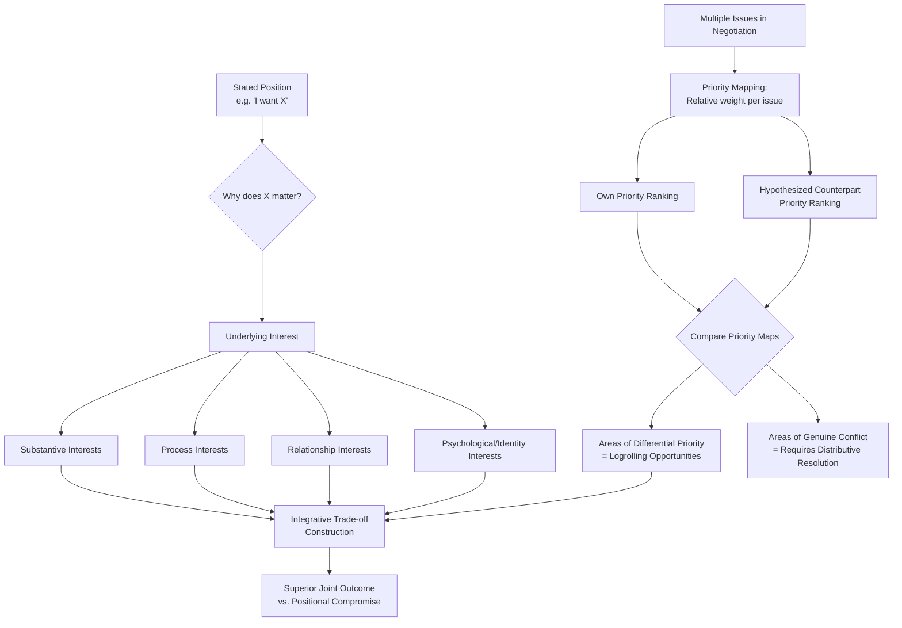

## Interest, Position, and Priority Mapping

### Definitions

**Positions** are the explicit, stated demands a party brings to a negotiation — the specific terms, numbers, or outcomes a party says they want (e.g., "I want a starting salary of $95,000"). **Interests** are the underlying needs, concerns, desires, or motivations that a given position is intended to satisfy (e.g., the salary demand might be motivated by underlying interests in financial security, perceived market fairness, or status/recognition). **Priorities** refer to the relative importance or weight a party assigns across multiple interests or issues in a multi-issue negotiation — not all interests are equally important to a given party, and accurately mapping this relative weighting is essential for identifying value-creating trade-offs.

This foundational distinction — most influentially articulated by Roger Fisher and William Ury in *Getting to Yes* (1981), and developed further within the broader **interest-based bargaining (IBB)** or **integrative negotiation** tradition associated with the Harvard Negotiation Project — is one of the most widely taught and applied frameworks in negotiation theory and practice.

### Theoretical Foundations

#### Why the Position-Interest Distinction Matters

The core theoretical claim underlying this framework is that **a single position can be satisfied by multiple different underlying interests, and a single interest can potentially be satisfied by multiple different positions** — meaning that negotiating rigidly over stated positions forecloses solution possibilities that become visible once underlying interests are surfaced.

- **Positional bargaining's limitations**: When negotiators argue only over stated positions, disagreements tend to resolve through **compromise** (splitting the difference) or through raw distributive contests of leverage, since positions, by construction, are typically framed as mutually exclusive claims on a fixed resource (e.g., "I want $95,000" vs. "We can offer $85,000" appears zero-sum on its face).
- **Interest-based bargaining's potential**: When the underlying interests behind each position are surfaced, negotiators frequently discover that their interests are **not actually in direct conflict**, or are conflicting only on some dimensions while being compatible or even complementary on others — enabling the construction of integrative agreements that satisfy both parties' interests more fully than any compromise on the original stated positions could achieve.

#### The Classic Illustrative Case: The Orange Dispute

The most frequently cited pedagogical illustration in this literature (originating in negotiation-training materials associated with the Harvard Negotiation Project) involves two parties disputing an orange, each demanding the whole orange (a positional conflict that appears zero-sum). Upon surfacing underlying interests, it emerges that one party wants the **peel** (for a recipe) while the other wants the **juice/pulp** (for consumption) — revealing that the positions, though superficially identical and conflicting, mask entirely compatible underlying interests, permitting a solution (each party receiving the entire portion relevant to their actual interest) that is superior to any compromise (e.g., splitting the orange in half) on the original stated positions.

#### Categories of Underlying Interests

Interest-mapping frameworks commonly distinguish several recurring categories of underlying interest that frequently motivate stated positions, useful as a diagnostic checklist during preparation:

1. **Substantive interests**: Direct, tangible interests in the resource or outcome itself (e.g., money, property, specific terms).
2. **Process interests**: Concerns about *how* the negotiation itself is conducted (e.g., being treated with respect, having adequate opportunity to be heard, procedural fairness) — independent of the substantive outcome.
3. **Relationship interests**: Concerns about the ongoing relationship with the counterpart, extending beyond the current transaction (e.g., preserving a long-term business partnership, maintaining family harmony in an inheritance dispute).
4. **Psychological/identity interests**: Concerns related to self-image, status, recognition, autonomy, or the need to avoid appearing weak or foolish, which can significantly influence position-taking independent of substantive stakes.

[Inference] It is generally recognized in the negotiation-practice literature that psychological and process interests are frequently underestimated or entirely overlooked by negotiators focused narrowly on substantive terms, and that surfacing these "softer" interest categories can sometimes unlock agreements that appeared substantively deadlocked when only tangible interests were considered.

### Priority Mapping and Multi-Issue Trade-Offs

**Key Points**

- **Differential priority as the engine of integrative bargaining**: Priority mapping specifically refers to identifying, across multiple negotiation issues, which issues each party weighs most heavily — since parties frequently place different relative priorities on the same set of issues (e.g., Party A cares intensely about delivery timeline but is relatively indifferent to payment terms, while Party B has the reverse priority structure), this differential weighting is the structural precondition for **logrolling**: trading concessions on low-priority issues in exchange for concessions on high-priority issues, producing outcomes superior to issue-by-issue compromise for both parties.
- **Priority elicitation techniques**: Because priorities are not always accurately self-reported (parties may strategically misrepresent priorities to gain leverage, or may not have fully articulated their own priorities even to themselves), techniques for eliciting genuine priority information include: direct questioning combined with cross-validation, **trade-off/conjoint-style questions** ("would you prefer A with worse B, or B with worse A?"), observing revealed preference through the pattern of concessions a counterpart is willing to make, and structured **multi-issue package proposals** that implicitly test relative priority weightings through the counterpart's reaction.
- **Priority instability and the risk of static mapping**: [Inference] Priorities are generally understood in the practice literature to be potentially dynamic rather than perfectly fixed — a counterpart's relative priorities can shift over the course of a negotiation as new information emerges, as external circumstances change, or as trust develops enabling more candid disclosure — meaning interest and priority maps constructed during preparation should generally be treated as a working hypothesis to be tested and updated during the negotiation itself, rather than as a fixed, one-time diagnostic exercise.

### The Interest-Position-Priority Mapping Process

A structured approach to conducting this analysis, synthesizing standard interest-based-bargaining preparation methodology, typically proceeds through the following stages:

1. **Identify your own stated position(s)** for each issue in the negotiation.
2. **Ask "why" iteratively for each position** — for each stated position, ask what underlying interest it serves, and continue probing ("why does that matter to me?") until reaching a genuinely foundational interest rather than a restated position.
3. **Categorize identified interests** across the substantive/process/relationship/psychological typology to ensure no category is overlooked.
4. **Rank your own interests by relative priority** across all issues in the negotiation, ideally using a forced-ranking or weighted-scoring method rather than treating all interests as equally important by default.
5. **Repeat the process from the counterpart's likely perspective**, using available information, prior interactions, industry norms, and reasonable inference (while remaining aware of the perspective-taking and curse-of-knowledge challenges discussed in related topics) to construct a working hypothesis of the counterpart's positions, interests, and priorities.
6. **Identify areas of differential priority** between your own and the counterpart's hypothesized priority maps — these are the candidate zones for integrative trade-offs (logrolling opportunities).
7. **Test and refine the hypothesized map during the actual negotiation** through direct questioning, trial proposals, and observation of the counterpart's actual responses, updating the working interest/priority model accordingly rather than treating the pre-negotiation map as final.

### Illustrative Example

**Example**

A software company (Vendor) and a mid-sized enterprise client (Client) are negotiating a multi-year licensing agreement, with stated positions clashing on price, contract length, and support-service levels.

- **Vendor's stated position**: A 3-year minimum contract term at a premium support tier.
- **Client's stated position**: A 1-year contract with basic support, citing budget constraints.

On the surface, this appears to be a straightforward distributive conflict over contract length and price. Applying interest mapping:

- **Vendor's underlying interests**: Revenue predictability for internal forecasting (a process/substantive interest) and reduced customer-churn risk (a substantive interest) — the *specific* 3-year term is a position serving these interests, not an end in itself.
- **Client's underlying interests**: Budget flexibility given uncertain future headcount growth (a substantive interest) and avoiding being locked into a vendor before proving the software's value internally (a risk-mitigation/psychological interest tied to internal credibility if the tool underperforms) — the *specific* 1-year term is a position serving these interests, not an intrinsic preference for short contracts as such.

Once these underlying interests are surfaced, an integrative solution becomes visible that neither original position directly offered: a **1-year initial term with an automatic-renewal clause locking in current pricing for years 2 and 3**, paired with a **usage-based support tier that scales with the client's actual headcount growth**. This solution satisfies the Vendor's actual interest in long-term revenue predictability (via the locked-in renewal pricing, which most clients would exercise if satisfied) and the Client's actual interest in budget flexibility and reduced initial-commitment risk (via the genuinely short initial term and scalable support cost) — an outcome superior to any compromise on the original stated positions (e.g., a rigid 2-year term as a "split the difference" compromise), illustrating the core value-add of interest-and-priority mapping over positional bargaining.

### Practical Applications and Preparation Templates

**Next Steps**

1. **Construct a structured interest-position-priority worksheet before the negotiation**: List each anticipated issue, the likely stated position (both one's own and the counterpart's hypothesized position), the underlying interest(s) each position serves, and a relative priority ranking — treating this as a living document to be updated as new information emerges.
2. **Explicitly probe for the counterpart's underlying interests during the negotiation**, using open-ended, non-positional questions ("what's driving the importance of that timeline for you?" rather than only "can you move on that date?") to surface interests that may not be volunteered spontaneously.
3. **Use trade-off questions to elicit genuine priority information**: Structured comparative questions (e.g., "if we could offer X, would that be more valuable to you than Y?") help validate or correct assumed priority rankings, reducing reliance on unverified inference alone.
4. **Watch for psychological and process interests, not only substantive ones**: Given the practice-literature observation that these categories are frequently under-surfaced, deliberately checking whether status, fairness-of-process, or relational concerns may be relevant underlying interests — even in seemingly purely transactional negotiations — is a useful diagnostic habit.
5. **Distinguish priority-mapping from purely distributive concession tracking**: Priority mapping is specifically aimed at identifying *differential* weighting across issues to enable trade-offs, which is analytically distinct from simply tracking how much each party has conceded on a single issue — conflating the two risks missing genuine logrolling opportunities in favor of simple issue-by-issue compromise.

### Conceptual Diagram

### Related Topics

- The Fixed-Pie Bias and Integrative (Value-Creating) Bargaining
- Logrolling and Multi-Issue Trade-Off Construction
- Empathy and Perspective-Taking
- BATNA and Reservation Price Estimation
- Interest-Based Bargaining (IBB) and the Harvard Negotiation Project Framework
- Package Bargaining vs. Sequential Issue-by-Issue Negotiation
- Bounded Rationality in Negotiated Decisions
- Conjoint Analysis and Trade-Off Elicitation Techniques