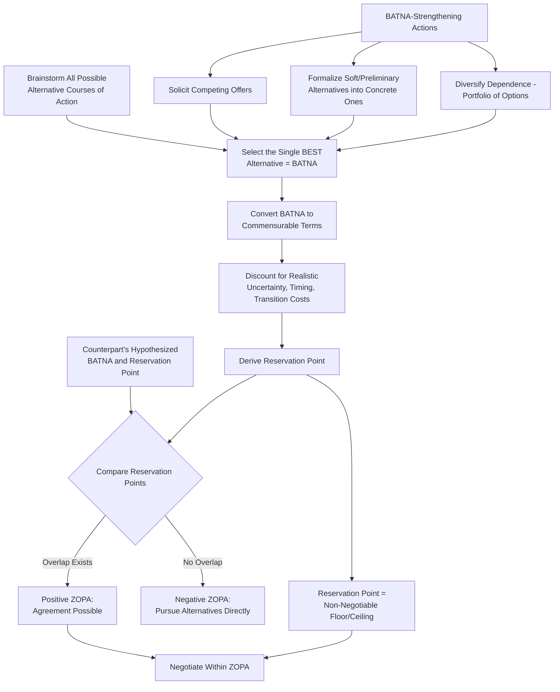

## Identifying and Strengthening Your BATNA

### Definition

**BATNA** — **Best Alternative to a Negotiated Agreement** — is the course of action a party will pursue if the current negotiation fails to produce an agreement. The concept was introduced by Roger Fisher and William Ury in *Getting to Yes* (1981) as the foundational benchmark against which any proposed agreement should be evaluated: a rational negotiator should accept a negotiated agreement only if it is better than their BATNA, and should walk away (pursuing the BATNA instead) if the best available negotiated terms fall short of it. BATNA is conceptually related to, and widely regarded as a direct negotiation-specific formalization of, the **comparison level for alternatives (CLalt)** construct from social exchange theory (see related topic).

### Theoretical Foundations

#### BATNA vs. Reservation Price/Point

A precise conceptual distinction, frequently blurred in casual usage, separates BATNA from the closely related concept of the **reservation price** (or reservation point):

- **BATNA** is the *actual alternative course of action* itself (e.g., "accepting a competing job offer," "using an alternative supplier," "pursuing litigation instead of settlement").
- **Reservation price/point** is the *minimum acceptable value* of the current negotiation that a party derives *from* their BATNA — the threshold below which the current deal is worse than simply walking away and pursuing the BATNA instead.

[Inference] The reservation point is generally understood in the literature as a *derived quantity*: it should be calculated by translating the BATNA into commensurable terms with the current negotiation (e.g., converting a competing job offer's total compensation package into a directly comparable figure), meaning that inaccurate or incomplete BATNA valuation directly produces an inaccurate reservation point, which in turn can lead to either premature concession (undervaluing one's BATNA) or unwarranted impasse (overvaluing one's BATNA) — connecting this topic directly to the overconfidence and overprecision biases discussed in earlier related topics.

#### Why BATNA Is the Central Source of Negotiating Power

Fisher and Ury's foundational insight is that a party's **negotiating power is derived primarily from the quality of their BATNA**, rather than from other factors sometimes assumed to be primary sources of leverage (aggressiveness, superior negotiating skill, or the objective size of the pie at stake). A party with a strong, well-developed BATNA can credibly walk away from an unfavorable proposed agreement, which:

1. Reduces that party's dependence on reaching agreement with this specific counterpart (directly connecting to the **power-dependence theory** construct discussed in the related "Reciprocity and Social Exchange Theory" topic — lower dependence confers structural power).
2. Provides genuine psychological confidence and reduces negotiation anxiety (connecting to the documented negative effects of anxiety on negotiation performance discussed in the related "Managing Anger, Anxiety, and Stress" topic), since a strong BATNA reduces the objective stakes of any single negotiation's failure.
3. Establishes a credible walk-away threat, which can itself function as leverage to extract better terms from a counterpart who is aware of (or can reasonably infer) the strength of that alternative.

#### ZOPA and the Role of BATNA in Defining the Bargaining Zone

The **Zone of Possible Agreement (ZOPA)** — the range of terms that would be acceptable to both parties, defined as the overlap (if any) between each party's reservation point — is directly determined by both parties' BATNAs. A **positive ZOPA** exists when the buyer's maximum acceptable price exceeds the seller's minimum acceptable price (each derived from their respective BATNAs); if no such overlap exists (a **negative ZOPA**), no mutually acceptable agreement is possible regardless of negotiating skill, and both parties are rationally better off pursuing their respective BATNAs directly. [Inference] Accurately assessing whether a positive ZOPA exists at all — before investing further negotiation effort — is generally considered an important, if sometimes overlooked, preparatory step, since negotiators can otherwise expend substantial effort attempting to bridge a gap that does not, in fact, admit of any mutually acceptable resolution given both parties' actual alternatives.

### Identifying Your BATNA: A Structured Process

**Key Points**

1. **Brainstorm the full range of alternative courses of action**, not merely the most obvious one — this includes both alternatives that involve no interaction with the current counterpart at all (e.g., an entirely different supplier, employer, or buyer) and alternatives that involve some modified continuation of engagement (e.g., partial agreement on some issues, phased implementation).
2. **Evaluate and select the single best alternative** among the brainstormed list — the BATNA is, by definition, the *best* of the available alternatives, not merely *an* alternative; conflating a mediocre fallback option with one's true best alternative will produce an inaccurately low reservation point and unnecessary concessions.
3. **Convert the selected BATNA into commensurable terms with the current negotiation**, to enable direct comparison — this often requires translating qualitatively different alternatives (e.g., "greater job security" vs. "higher immediate salary") into a common evaluative framework, which may require explicit weighting of multiple attributes rather than a single simple monetary figure.
4. **Account for realistic transition costs, timing, and probability of the alternative materializing** — a nominally attractive BATNA that is highly uncertain, will take a long time to realize, or carries substantial transition costs (e.g., litigation risk and delay, the time and effort of a new job search) should be discounted accordingly rather than treated as a fully certain, immediately available alternative at face value.
5. **Set the reservation point based on this realistically-discounted BATNA valuation**, and treat it as the non-negotiable floor (or ceiling, depending on the negotiator's role) below which walking away is the rational choice.

### Strengthening Your BATNA

**Key Points**

- **Actively developing alternatives before and during the negotiation**: Rather than treating BATNA as a fixed, pre-existing given, negotiators can proactively invest effort in developing genuinely stronger alternatives before entering (or even during) a negotiation — e.g., soliciting competing offers, identifying alternative suppliers or partners, or preparing a credible litigation or arbitration pathway — since a stronger BATNA directly improves the reservation point and negotiating power.
- **Timing considerations**: [Inference] BATNA-strengthening efforts are generally most effective when undertaken *before* a negotiation begins in earnest, since visibly scrambling to develop alternatives mid-negotiation can itself signal weakness to an attentive counterpart, though even mid-negotiation BATNA development (e.g., quietly pursuing a parallel alternative while continuing discussions) remains a legitimate and sometimes necessary practice.
- **Avoiding false or exaggerated BATNA claims**: While *communicating* the existence of a strong BATNA can be a legitimate tactic (see related topic on strategic emotional and informational signaling), fabricating or substantially exaggerating a BATNA's actual strength carries meaningful risk: if the exaggeration is exposed or called upon (e.g., the counterpart says "then go ahead and take that alternative"), the negotiator's actual leverage and credibility are severely damaged, potentially worse than if no claim had been made at all.
- **Portfolio approach to multiple concurrent negotiations**: In contexts involving simultaneous or sequential negotiations with multiple potential counterparts (e.g., job searching, competitive procurement, real estate), deliberately running parallel negotiation processes — rather than committing early and exclusively to a single counterpart — is a structural strategy for maintaining and strengthening one's BATNA throughout the process, since each additional credible parallel option directly improves the realistic alternative available if any single negotiation fails.
- **Reducing dependence through diversification**: At an organizational level, reducing structural dependence on any single counterparty (e.g., a single supplier, a single client representing a large share of revenue) is a longer-horizon strategic analog to BATNA-strengthening, directly improving negotiating power in future negotiations with that counterparty by reducing the switching costs and risks associated with walking away.

### Common Errors in BATNA Assessment

**Key Points**

- **Overconfidence in BATNA valuation (overprecision)**: As discussed in the related "Overconfidence" topic, negotiators frequently hold excessively narrow and optimistic confidence intervals around their BATNA's true value, leading to reservation points that are miscalibrated relative to the alternative's actual, realistically-discounted worth.
- **Failure to actually develop a BATNA before negotiating**: Entering a negotiation without having done the work to identify or develop genuine alternatives leaves a negotiator effectively without a real reservation-point anchor, increasing vulnerability to anchoring effects, time pressure, and the various heuristic and emotional biases discussed throughout this course, since there is no independently derived benchmark against which to evaluate an offer.
- **Conflating "no BATNA" with "weak BATNA"**: Even in situations that feel like there is "no alternative" (e.g., a sole-source supplier situation, a must-have job offer), some alternative course of action almost always exists (e.g., delaying the purchase, accepting a suboptimal but functional substitute, remaining in a current position) — explicitly identifying and valuing even a nominally weak alternative is generally preferable to negotiating without any articulated reservation point at all.
- **Misjudging the counterpart's BATNA**: Since ZOPA and relative bargaining power depend on *both* parties' BATNAs, failing to develop a reasoned estimate of the counterpart's likely BATNA (using available information, industry knowledge, and inference, while remaining aware of the perspective-taking challenges discussed in related topics) leaves a negotiator unable to accurately judge how much room genuinely exists for movement, or how credible the counterpart's own stated positions and threats are likely to be.

### Illustrative Example

**Example**

A mid-career professional is negotiating a job offer with Company A, currently offering a base salary of $110,000.

- **Identifying the BATNA**: The candidate's realistic alternatives include remaining in their current role (with a modest expected raise), a preliminary but not-yet-finalized offer from Company B, and continued job searching more broadly. Applying the structured BATNA-identification process, the candidate determines that the Company B preliminary offer, while not yet finalized, represents the strongest realistic alternative — but discounts its value somewhat to account for the genuine risk that it may not materialize on the stated terms or timeline (accounting for realistic probability, per the identification process above).
- **Converting to commensurable terms**: The candidate translates the current role's total compensation (including benefits, bonus structure, and job security) and the discounted Company B alternative into a single comparable figure, arriving at a realistic reservation point of approximately $105,000 in equivalent total compensation from Company A — accounting for the fact that Company A offers superior long-term career growth prospects the candidate also values (a qualitative factor folded into the commensurable comparison).
- **Strengthening the BATNA before finalizing negotiations**: Rather than passively waiting, the candidate proactively follows up with Company B to formalize their preliminary offer into a concrete, dated proposal, converting a soft, uncertain alternative into a firm, credible one — directly strengthening the actual BATNA (not merely the negotiator's confidence about it) before making any final decision regarding Company A's offer.
- **Outcome**: With a now-concrete, formalized alternative in hand, the candidate can credibly and confidently indicate to Company A that other opportunities are being seriously considered, using the genuinely strengthened BATNA as leverage to negotiate Company A's offer upward, rather than relying on a bluffed or exaggerated claim that carries the risks noted above.

### Practical Applications

**Next Steps**

1. **Complete a structured BATNA worksheet before every significant negotiation**: Systematically brainstorm alternatives, select the best one, and convert it to commensurable terms with realistic discounting for uncertainty and transition costs, rather than relying on an unexamined intuitive sense of one's alternatives.
2. **Proactively invest in BATNA development before negotiations begin**: Actively solicit competing offers, alternative suppliers, or other concrete alternatives well in advance, since a genuinely developed BATNA provides more durable leverage than one asserted only rhetorically.
3. **Develop a reasoned estimate of the counterpart's BATNA**: Use available market information, prior interactions, and structured inference to estimate the counterpart's likely alternatives and reservation point, enabling a more accurate assessment of the realistic ZOPA and of how much genuine room for movement likely exists.
4. **Avoid both under- and over-valuing your BATNA**: Apply explicit discounting for realistic uncertainty and timing rather than treating a nominal alternative at full face value, while also avoiding excessive pessimism that leads to premature, unnecessary concessions.
5. **Distinguish BATNA development from BATNA disclosure strategy**: Recognize that *building* a strong BATNA (a substantive preparation task) and *deciding whether and how to reveal* its existence or strength to the counterpart (a separate strategic/tactical decision, connected to broader questions of information disclosure and signaling) are distinct steps, each warranting its own deliberate consideration.

### Conceptual Diagram

### Related Topics

- Zone of Possible Agreement (ZOPA) and Bargaining Range Analysis
- Reciprocity and Social Exchange Theory (Comparison Level for Alternatives)
- Overconfidence and the Illusion of Transparency
- Interest, Position, and Priority Mapping
- Managing Anger, Anxiety, and Stress at the Table
- Power-Dependence Theory and Bargaining Power Analysis
- Strategic Disclosure and Signaling of Alternatives
- Anchoring Effects in Opening Offers and Counteroffers