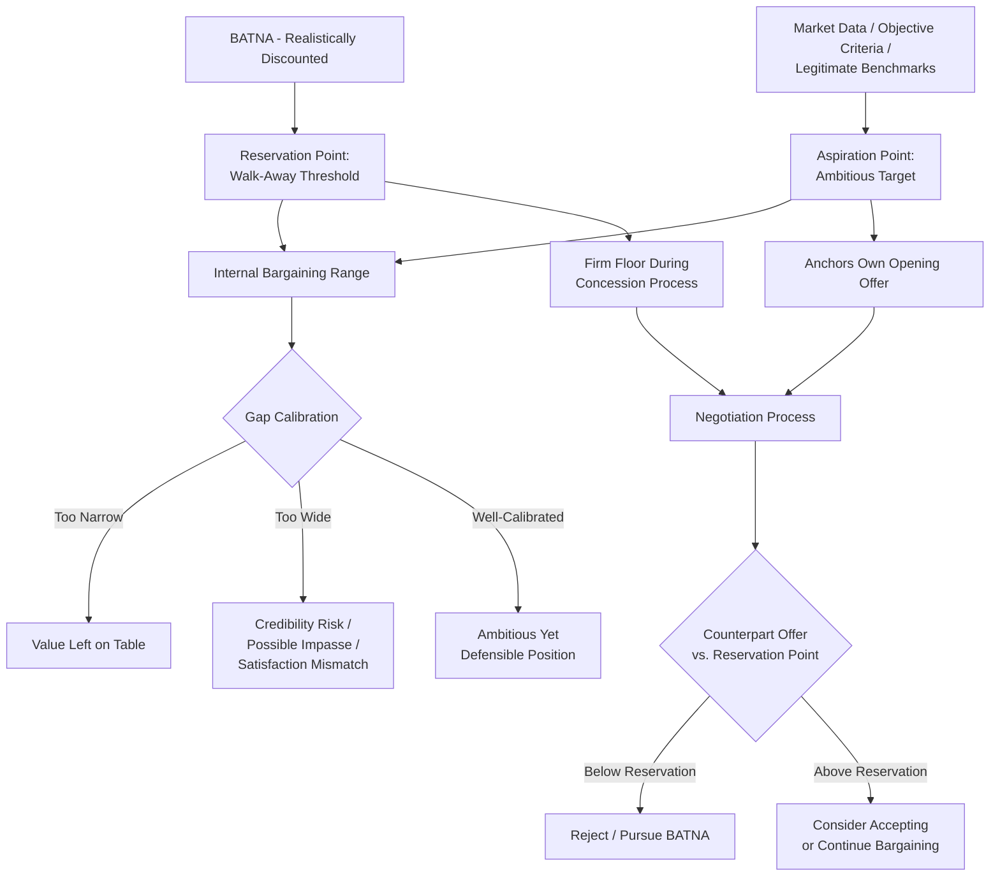

## Setting Aspiration and Reservation Points

### Definitions

The **reservation point** (or reservation price) is the threshold value at which a negotiator is indifferent between accepting a negotiated agreement and walking away to pursue their BATNA — any outcome worse than the reservation point is, by definition, inferior to the alternative and should be rejected; any outcome better than it represents a genuine improvement over walking away (see related "Identifying and Strengthening Your BATNA" topic for the derivation of this value).

The **aspiration point** (or aspiration level) is the specific, more ambitious target outcome a negotiator sets as their goal — the value they actively aim to achieve, which is typically set well above the reservation point to leave room for the concession process while still representing an outcome the negotiator would be genuinely satisfied to achieve. This distinction and its strategic function draw on Herbert Simon's original **aspiration-level** construct within bounded rationality theory (see related topic), as well as its specific elaboration for bilateral negotiation by Fisher, Ury, and by Bazerman and Neale.

### Theoretical Foundations

#### Why Two Distinct Anchor Points Are Necessary

Negotiation preparation frameworks generally emphasize that these two points serve **functionally distinct purposes** and should not be conflated:

- The **reservation point** functions as a **floor/ceiling constraint** — a hard boundary that should not be crossed regardless of in-the-moment pressure, persuasion, or emotional dynamics, since crossing it means accepting an outcome objectively worse than the available alternative.
- The **aspiration point** functions as a **performance target and anchor for one's own opening offer and concession behavior** — it shapes what a negotiator asks for, how they frame their opening position, and how much room they psychologically allow themselves for concessions during the bargaining process.

[Inference] A well-established finding in the negotiation literature, robustly connected to the broader goal-setting literature in organizational psychology (notably associated with Edwin Locke and Gary Latham's goal-setting theory), is that **negotiators who set higher, more specific aspiration levels tend to achieve better objective outcomes** than negotiators who set vague, low, or unspecified goals ("just do my best" framing) — this effect is generally attributed to higher aspirations shaping more ambitious opening offers, more persistent resistance to premature concession, and more selective interpretation of ambiguous information in a goal-consistent direction, though the effect is naturally bounded by the risk of setting aspirations so unrealistically high that they damage credibility or provoke impasse.

#### The Anchoring Function of Aspiration Levels

Aspiration levels interact directly with the **anchoring and adjustment heuristic** (see related "Heuristics and Biases" topic) in two connected ways:

1. A negotiator's own aspiration level functions as a **self-anchor**, shaping the ambition of their own opening offer, which in turn (per the anchoring literature) tends to correlate with the final settlement point.
2. Conversely, a negotiator without a clearly articulated aspiration level is more vulnerable to being anchored by the **counterpart's** opening offer instead, since in the absence of an independently-formed target, the counterpart's anchor becomes the primary available reference point shaping subsequent judgment.

This connection provides a direct mechanistic explanation for why deliberately setting an aspiration level *before* hearing the counterpart's opening offer is widely recommended practice: it inoculates the negotiator against being anchored entirely by the counterpart's potentially self-serving opening position.

#### Distinguishing Aspiration/Reservation Points From the Target/Resistance Point Terminology

[Inference] Different negotiation textbooks and training programs sometimes use varying terminology for closely related or identical constructs — "target point" is commonly used interchangeably with "aspiration point," and "resistance point" is commonly used interchangeably with "reservation point" — and readers/practitioners encountering multiple negotiation frameworks should generally expect this terminological variation rather than assuming these represent distinct additional constructs beyond the two core concepts defined above.

### Setting the Reservation Point

**Key Points**

- **Derivation from BATNA**: As detailed in the related "Identifying and Strengthening Your BATNA" topic, the reservation point should be derived by converting the realistically-discounted value of one's best alternative into terms directly comparable with the current negotiation, rather than being set arbitrarily or based on an unexamined sense of what "feels" acceptable.
- **Firmness as a discipline, not merely a number**: Because reservation points are most valuable as a genuine behavioral constraint under real-time pressure, negotiation practitioners generally emphasize that the reservation point should be explicitly written down and committed to *before* the negotiation begins, precisely because in-the-moment social pressure, reciprocity dynamics (see related "Reciprocity" topic), and emotional escalation (see related "Managing Anger, Anxiety, and Stress" topic) can otherwise erode a merely-intuitive sense of one's limit during live negotiation.
- **Private, not typically disclosed**: Unlike the aspiration point (which is often, though not always, reflected in the opening offer), the reservation point is generally treated as private information not to be disclosed to the counterpart, since revealing one's true walk-away threshold eliminates any incentive for the counterpart to offer terms better than that minimum.
- **Reassessing the reservation point if genuinely new information emerges**: While the reservation point should be a firm behavioral commitment resistant to in-the-moment pressure, it is not necessarily immutable across the entire negotiation timeline — if genuinely new, verifiable information emerges that changes the underlying BATNA valuation (e.g., an alternative offer falls through, or a new, better alternative materializes), a principled updating of the reservation point is distinct from an undisciplined erosion of it under mere social or emotional pressure; [Inference] distinguishing between these two cases (legitimate updating vs. pressure-driven erosion) is generally considered an important, if sometimes difficult-to-apply-in-the-moment, discipline.

### Setting the Aspiration Point

**Key Points**

- **Specific and ambitious, but not unrealistic**: Consistent with goal-setting theory's broader findings, aspiration points are generally recommended to be **specific** (a concrete number or outcome, not a vague range) and **ambitious** (stretching beyond what feels merely comfortable) while remaining within a plausible range that avoids severe credibility damage or unnecessary impasse risk if anchored on publicly.
- **Grounded in objective/legitimate criteria where possible**: Aspiration points that can be justified by reference to external, objective benchmarks (market rate data, comparable transactions, industry standards — connecting to the broader concept of **legitimacy/objective criteria** as a negotiation principle) tend to be more defensible and more resistant to reactive devaluation (see related topic) than aspiration points that appear to be arbitrary or purely self-serving.
- **Should account for, but not be limited by, the reservation point**: While the aspiration point must obviously exceed the reservation point (since aiming below one's walk-away threshold would be self-defeating), the gap between the two should generally be substantial enough to preserve genuine room for the concession process while not being so disconnected from realistic possible outcomes that it functions merely as an opening negotiating gambit rather than a genuine internal target.
- **Interacts with the "first-offer" decision**: The aspiration point commonly (though not universally) informs the specific value of a negotiator's opening offer, connecting this topic directly to the anchoring-effects literature — a well-calibrated, ambitious-but-defensible aspiration point provides a principled basis for formulating an assertive, well-anchored opening offer, rather than an arbitrary or purely intuitive one.

### The Gap Between Aspiration and Reservation: The Negotiator's Internal Bargaining Range

**Key Points**

- The space between a negotiator's own reservation point and aspiration point defines their **internal bargaining range** — distinct from the **ZOPA** (which is defined by the overlap between *both* parties' reservation points; see related "BATNA" topic).
- **Too narrow a gap** (aspiration set only modestly above reservation) risks leaving value on the table, since research on aspiration levels and anchoring suggests more ambitious targets tend to correlate with better outcomes, all else equal.
- **Too wide a gap** (an aspiration point far removed from any realistic assessment of the situation) risks damaging credibility if reflected in an opening offer perceived as absurd, and can also risk psychological disappointment or dissatisfaction even with an objectively strong outcome, if that outcome falls well short of an unrealistically calibrated aspiration (connecting to the broader finding in negotiation-satisfaction research that subjective satisfaction is influenced by the gap between an achieved outcome and one's aspiration, not merely by the outcome's objective value).

### Illustrative Example

**Example**

A freelance consultant is negotiating a new project engagement with a prospective client.

- **Deriving the reservation point**: The consultant's BATNA is continuing to fill their schedule with existing steady clients at an effective rate of $120/hour. After accounting for the new client's somewhat more prestigious portfolio value (a qualitative factor folded into the commensurable comparison, per BATNA-conversion methodology) but also its less certain long-term relationship potential, the consultant sets a reservation point of $110/hour — the threshold below which continuing to prioritize existing clients is clearly preferable.
- **Deriving the aspiration point**: Rather than setting an aspiration point merely a little above the reservation point, the consultant researches comparable market rates for consultants with similar experience and specialization (objective/legitimate criteria), finding a credible market range suggesting $150–160/hour is achievable and well-justified for this specific type of engagement. The consultant sets a specific aspiration point of $155/hour — ambitious, but grounded in verifiable external benchmarks rather than an arbitrary "ask for a lot and see what happens" approach.
- **Using the aspiration point to anchor the opening offer**: Rather than waiting to hear the client's opening offer (risking anchoring on a client-favorable figure), the consultant proactively opens the rate discussion at $155/hour, directly reflecting the researched aspiration point and providing the client with market-rate justification if questioned.
- **Applying the reservation point as a firm floor during concessions**: As the negotiation proceeds and the client counters at $100/hour (below the consultant's reservation point), the consultant recognizes — thanks to having the reservation point explicitly pre-established — that continued negotiation toward this range would represent a genuinely worse outcome than the existing BATNA, and responds by reiterating value justification and, if necessary, being prepared to decline the engagement rather than allowing in-the-moment social pressure or reciprocity dynamics (e.g., feeling obligated to "meet in the middle" simply because the client made a counteroffer) to erode below the pre-committed $110/hour floor.

### Practical Applications

**Next Steps**

1. **Write down both points explicitly before the negotiation begins**: Committing both the aspiration point and reservation point to writing, prior to any live negotiation interaction, helps preserve behavioral discipline against in-the-moment anchoring, reciprocity, and emotional pressures.
2. **Ground the aspiration point in externally verifiable criteria wherever possible**: Researching comparable market data, precedent transactions, or industry benchmarks provides a more defensible, credibility-preserving basis for an ambitious aspiration point than an arbitrary or purely self-serving figure.
3. **Treat the reservation point as a near-inviolable floor, distinct from a merely aspirational preference**: Maintain clear internal discipline distinguishing legitimate reservation-point updates (based on genuinely new information about one's BATNA) from erosion under mere social or emotional pressure.
4. **Avoid disclosing the reservation point to the counterpart**: Since the reservation point functions as private information whose disclosure would eliminate any incentive for the counterpart to offer better terms, maintain appropriate discretion around this figure even while being more open about the aspiration point or its underlying justification.
5. **Calibrate the aspiration-reservation gap deliberately**: Neither set an aspiration point so close to the reservation point that achievable value is left unclaimed, nor so far removed from realistic assessment that credibility or psychological satisfaction is put at risk — treat this gap-setting as its own deliberate calibration exercise rather than an afterthought.

### Conceptual Diagram

### Related Topics

- Identifying and Strengthening Your BATNA
- Zone of Possible Agreement (ZOPA) and Bargaining Range Analysis
- Anchoring Effects in Opening Offers and Counteroffers
- Bounded Rationality in Negotiated Decisions (Aspiration-Level Origins)
- Goal-Setting Theory and Negotiation Performance
- Managing Anger, Anxiety, and Stress at the Table
- Overconfidence and the Illusion of Transparency
- Objective Criteria and Legitimacy in Principled Negotiation