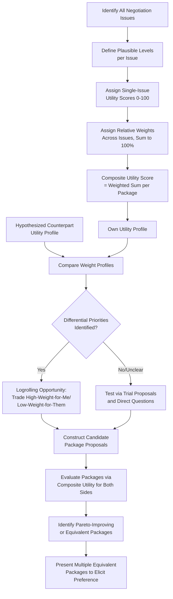

## Multi-Issue Trade-off and Utility Analysis

### Definition

**Multi-Issue Trade-off and Utility Analysis** refers to a family of structured preparation techniques for negotiations involving more than one issue, in which a negotiator formally quantifies the relative value (utility) of different possible outcomes across each issue, in order to systematically identify and evaluate potential trade-offs (**logrolling**), package proposals, and their relative attractiveness compared to a single-issue or unstructured approach. This methodology draws directly on **multi-attribute utility theory (MAUT)**, a formal decision-analysis framework originating in operations research and decision science (notably associated with Ralph Keeney and Howard Raiffa's foundational text *Decisions with Multiple Objectives*, 1976), adapted specifically for negotiation preparation and analysis.

### Theoretical Foundations

#### Multi-Attribute Utility Theory (MAUT) Applied to Negotiation

MAUT provides a formal structure for representing preferences across multiple, potentially competing objectives (issues) by decomposing overall preference into:

1. **Issues (attributes)**: The distinct dimensions of the negotiation (e.g., price, delivery timeline, warranty terms, payment schedule, exclusivity).
2. **Levels within each issue**: The specific possible values or outcomes for each issue (e.g., for "delivery timeline," possible levels might be 30 days, 60 days, or 90 days).
3. **Weights**: A numerical representation of the relative importance a party assigns to each issue, typically normalized so that all weights sum to 1 (or 100%).
4. **Single-issue utility scores**: A numerical scale (commonly 0–100 or 0–1) representing how favorably a party views each specific level within a given issue, independent of the other issues.
5. **Composite/total utility score**: Calculated for any complete package (a specific combination of levels across all issues) as the **weighted sum** of the single-issue utility scores:

$$U(\text{package}) = \sum_{i=1}^{n} w_i \cdot u_i(x_i)$$

where $w_i$ is the weight assigned to issue $i$, $u_i(x_i)$ is the single-issue utility of level $x_i$ on issue $i$, and $n$ is the total number of issues.

[Inference] This additive-weighted-sum formulation is the standard simplifying assumption used in most applied negotiation-preparation utility analysis, and it is generally considered a reasonable approximation for many practical negotiation contexts; however, formal MAUT theory recognizes that this additive form technically requires an assumption of **preferential independence** among attributes (i.e., that one's preference ordering on one issue does not depend on the specific level of another issue) — a condition that may not hold precisely in all real-world negotiations with strongly interdependent issues, in which case more complex multiplicative or interaction-term utility models would be technically more appropriate, though the added complexity of such models is not always practically justified relative to the simpler additive approximation.

#### The Core Purpose: Comparing Packages, Not Just Single Issues

The central analytical value of this framework is enabling **package-level comparison** rather than issue-by-issue evaluation. Because different packages can achieve the *same total utility score* through very different combinations of issue-level outcomes, this framework makes visible a set of **equivalent packages** (packages of identical or near-identical total value to a given party) that would not be apparent from sequential, issue-by-issue negotiation. This directly operationalizes the **logrolling** logic discussed in the related "Interest, Position, and Priority Mapping" topic: if two parties' weight profiles differ (each assigns different relative importance across the same set of issues), it becomes possible to construct a package that gives each party more of what they weight heavily and less of what they weight lightly, while remaining within each party's acceptable overall utility.

### Constructing a Multi-Issue Utility Analysis

**Key Points**

1. **Identify all relevant issues** to be negotiated (ideally as comprehensively as possible during preparation, since an issue omitted from the analysis cannot be leveraged for trade-offs).
2. **Identify the plausible range of levels for each issue** — from the most favorable realistically achievable outcome to the least favorable outcome still within the negotiation's plausible scope.
3. **Assign single-issue utility scores** to each level within each issue, typically anchoring the most-preferred level at 100 (or 1.0) and the least-preferred level at 0, with intermediate levels scored according to the negotiator's genuine relative preference (which is not necessarily linear — e.g., the utility difference between a 30-day and 45-day delivery timeline might be much larger than the difference between 75 and 90 days, reflecting a genuinely nonlinear underlying preference).
4. **Assign relative weights across issues**, reflecting how much each issue matters relative to the others, normalized to sum to 100% (or 1.0) — this step directly operationalizes the priority-mapping process discussed in the related topic.
5. **Calculate composite utility scores for candidate packages** using the weighted-sum formula, enabling direct, apples-to-apples comparison between qualitatively different package combinations.
6. **Repeat the process (at least approximately) for the hypothesized counterpart's weights and utilities**, using available information and reasoned inference (subject to the same perspective-taking caveats discussed in related topics), to identify where genuine differential-priority trade-off opportunities likely exist.

### Applications: Identifying Logrolling and Package Equivalence

**Key Points**

- **Efficient frontier identification**: By systematically comparing composite utility scores for both parties across many candidate packages, this analysis can help identify packages that lie on or near the **Pareto-efficient frontier** — combinations where no party's utility can be improved without decreasing the other party's utility — as distinct from inefficient compromise packages that leave unrealized joint value on the table.
- **"Package equivalence sets"**: For a given negotiator, this analysis can generate a set of qualitatively different packages that all score similarly on that negotiator's own utility function — providing flexibility to offer the counterpart a choice among several packages that are roughly equally acceptable to oneself but may differ substantially in their attractiveness to the counterpart (a technique sometimes referred to as offering "equivalent simultaneous packages" or using multiple equivalent offers to elicit counterpart priority information).
- **Quantifying the value of a proposed trade-off**: Rather than relying on intuitive judgment about whether a proposed trade (e.g., "we'll extend the warranty if you can move up the payment schedule") is favorable, the utility-weighted framework allows explicit before-and-after utility comparison, converting an intuitive judgment into a more precise, defensible quantitative assessment.
- **Sensitivity analysis**: Because weight and utility-score assignments in this framework are inherently somewhat subjective estimates (particularly regarding the counterpart's presumed weights), practitioners can test how sensitive the recommended package or trade-off conclusions are to reasonable variation in these input assumptions, providing a check against over-reliance on a single, potentially inaccurate point-estimate of the counterpart's priorities.

### Limitations and Caveats

**Key Points**

- **Subjectivity and precision illusion**: [Inference] While formal utility analysis introduces welcome analytical rigor compared to purely intuitive multi-issue trade-off judgment, it is generally recognized that the underlying weight and utility-score inputs remain subjective estimates — the numerical precision of the resulting composite scores should not be mistaken for objective certainty, and this framework is best understood as a *structuring and comparison aid* rather than as producing definitively "correct" trade-off values, particularly for the counterpart's hypothesized weights, which are subject to the same estimation-uncertainty concerns discussed in the overconfidence and perspective-taking literature.
- **Preferential independence assumption**: As noted above, the standard additive-weighted-sum model assumes issues can be evaluated independently of one another, which may not hold precisely for negotiations with genuinely interdependent issues (e.g., where the desirability of a longer contract term depends heavily on which specific support tier is also included) — in such cases, the simple additive model may understate or overstate true package utility, and analysts should be aware of this simplifying assumption's limits.
- **Static snapshot vs. dynamic negotiation**: A utility analysis constructed during preparation represents a snapshot of understood priorities at that point in time; consistent with the priority-instability point raised in the related "Interest, Position, and Priority Mapping" topic, this analysis should generally be treated as a living tool to be updated as genuine new information about the counterpart's actual priorities emerges during the negotiation itself, rather than as a fixed, one-time calculation.
- **Risk of appearing manipulative if overtly disclosed inappropriately**: While using this framework internally for one's own preparation and package construction is standard practice, directly revealing one's own numerical utility weights to a counterpart (as opposed to using the *conclusions* of the analysis to inform proposals) is a separate strategic and tactical decision with its own distinct considerations regarding information disclosure, not automatically implied by having constructed the analysis.

### Illustrative Example

**Example**

A manufacturer and a retailer are negotiating a supply agreement involving four issues: unit price, order volume commitment, payment terms, and exclusivity.

**Manufacturer's utility inputs** (weights sum to 100%):

| Issue | Weight | Most-Preferred Level (Utility 100) | Least-Preferred Level (Utility 0) |
| --- | --- | --- | --- |
| Unit Price | 40% | $12/unit | $9/unit |
| Order Volume Commitment | 30% | 50,000 units/year | 20,000 units/year |
| Payment Terms | 10% | Net-15 | Net-60 |
| Exclusivity | 20% | Full regional exclusivity | No exclusivity |

**Retailer's utility inputs** (hypothesized weights sum to 100%):

| Issue | Weight | Most-Preferred Level (Utility 100) | Least-Preferred Level (Utility 0) |
| --- | --- | --- | --- |
| Unit Price | 35% | $9/unit | $12/unit |
| Order Volume Commitment | 10% | 20,000 units/year (low commitment) | 50,000 units/year |
| Payment Terms | 35% | Net-60 | Net-15 |
| Exclusivity | 20% | No exclusivity (retains flexibility) | Full exclusivity |

Applying the composite-utility framework reveals a clear **differential priority structure**: the Manufacturer weights *order volume commitment* heavily (30%) but the Retailer weights it lightly (10%); conversely, the Retailer weights *payment terms* heavily (35%) while the Manufacturer weights it lightly (10%). This is a textbook **logrolling opportunity**: a package offering the Retailer favorable Net-60 payment terms (high Retailer utility, low Manufacturer utility cost) in exchange for a higher order volume commitment (high Manufacturer utility, low Retailer utility cost) would substantially increase **both parties' composite utility scores** relative to a package that compromised evenly across all four issues without regard to this differential weighting — a concrete, quantified illustration of a Pareto-superior trade-off that might not be obvious from unstructured, issue-by-issue negotiation alone.

### Practical Applications

**Next Steps**

1. **Construct a formal utility table during preparation for any negotiation involving three or more interacting issues**: The analytical benefit of this framework scales with the complexity of the multi-issue trade-off space; for very simple one- or two-issue negotiations, the formal structure may add more overhead than value.
2. **Explicitly estimate the counterpart's likely weight profile, and treat it as a testable hypothesis**: Use the structured estimate to identify candidate logrolling opportunities, but validate and refine these estimates through direct questions and trial proposals during the actual negotiation (connecting to the priority-elicitation techniques discussed in the related "Interest, Position, and Priority Mapping" topic).
3. **Use the framework to generate multiple equivalent packages**: Rather than proposing a single package, use the utility analysis to identify two or three packages of similar value to oneself but differing in composition, and present them together to elicit genuine counterpart priority information through their revealed preference among the options.
4. **Apply sensitivity analysis to guard against overconfidence in estimated counterpart weights**: Test how robust a proposed trade-off's apparent mutual benefit is to reasonable variation in the counterpart's assumed weights, rather than relying on a single point estimate.
5. **Treat the analysis as a preparation and internal-reasoning tool, not necessarily a disclosure document**: Use the framework's conclusions to inform proposal construction and evaluation, while separately and deliberately deciding what, if any, of the underlying reasoning to share directly with the counterpart.

### Conceptual Diagram

### Related Topics

- Interest, Position, and Priority Mapping
- Multi-Attribute Utility Theory (MAUT) in Decision Analysis
- Logrolling and Package Bargaining Strategies
- The Fixed-Pie Bias and Integrative (Value-Creating) Bargaining
- Setting Aspiration and Reservation Points
- Zone of Possible Agreement (ZOPA) and Bargaining Range Analysis
- Overconfidence and the Illusion of Transparency (Sensitivity Analysis Rationale)
- Pareto Efficiency and the Negotiator's Dilemma