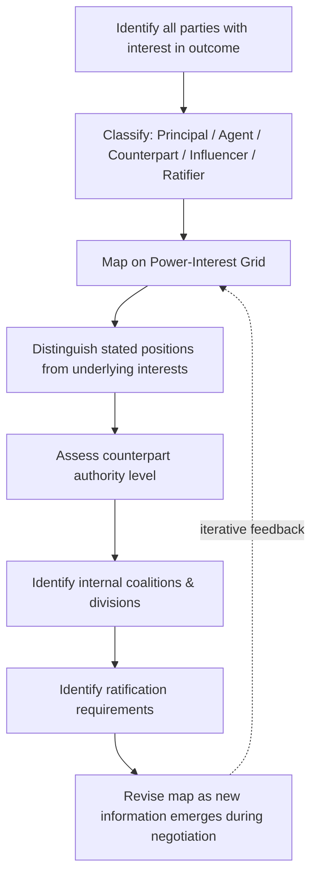

## Stakeholder and Counterpart Analysis

### Overview

Stakeholder and Counterpart Analysis is the preparatory discipline of systematically identifying who is involved in or affected by a negotiation, what each party's interests and power are, and how the counterpart's decision-making structure will shape the negotiation's dynamics. It extends negotiation preparation beyond the immediate person across the table to the full network of principals, agents, coalitions, and third parties whose interests, authority, or influence can determine whether and how an agreement is reached.

### Why This Analysis Precedes Tactics

Distributive and integrative tactics (anchoring, concession patterns, trade-offs) are only as effective as the accuracy of the underlying map of who holds interest, authority, and influence. Negotiating effectively with the wrong stakeholder, or misjudging a counterpart's true decision-maker, can render otherwise sound tactics useless. This analysis sits within the broader Preparation and Planning phase and typically precedes BATNA/ZOPA estimation for multi-party or organizational negotiations, since stakeholder mapping determines *whose* Reservation Price and interests actually matter.

### Core Distinction: Stakeholder vs. Counterpart

**Key Points**

- A **counterpart** is the individual or entity physically or formally negotiating opposite you at the table.
- A **stakeholder** is any individual or group with an interest in the outcome, whether or not they are present at the table — this includes principals, constituents, regulators, financiers, and internal factions on both sides.
- The counterpart is frequently an **agent** (a negotiator, lawyer, procurement officer, diplomat) representing a **principal** (a company, government, client, or board) whose interests may only partially align with the agent's own incentives — a dynamic formalized in principal-agent theory.
- Effective analysis requires mapping both dimensions simultaneously: who is at the table (counterpart), and who stands behind and around the table (stakeholders).

### Stakeholder Mapping Framework

**Dimensions to Assess**

| Dimension | Guiding Question |
| --- | --- |
| Interest | What outcome does this party want, and how intensely? |
| Power/Influence | How much capacity does this party have to affect the outcome? |
| Position | Do they support, oppose, or remain neutral toward the deal? |
| Alignment | Do their interests align with the primary counterpart's, or diverge? |
| Access | Can they be engaged directly, or only through an intermediary? |

**Power-Interest Grid**

A standard tool for prioritizing stakeholder engagement plots each stakeholder along two axes — power to affect the outcome, and interest in the outcome — yielding four management strategies.

<svg xmlns="http://www.w3.org/2000/svg" viewBox="0 0 640 460">
<text x="320" y="25" text-anchor="middle" font-size="16" font-weight="bold" fill="#1a1a1a">Power-Interest Grid (svg_diagram)</text>
<line x1="90" y1="400" x2="90" y2="60" stroke="#333" stroke-width="2" />
<line x1="90" y1="400" x2="580" y2="400" stroke="#333" stroke-width="2" />

<text x="50" y="230" text-anchor="middle" font-size="13" fill="#333" transform="rotate(-90 50 230)">Power to Influence</text>

<text x="335" y="430" text-anchor="middle" font-size="13" fill="#333">Level of Interest</text>

<line x1="335" y1="60" x2="335" y2="400" stroke="#999" stroke-width="1" stroke-dasharray="3,3" />
<line x1="90" y1="230" x2="580" y2="230" stroke="#999" stroke-width="1" stroke-dasharray="3,3" />
<rect x="90" y="60" width="245" height="170" fill="#f39c12" fill-opacity="0.15" />
<text x="212" y="100" text-anchor="middle" font-size="13" font-weight="bold" fill="#d68910">Keep Satisfied</text>
<text x="212" y="118" text-anchor="middle" font-size="11" fill="#7d6608">(monitor, meet needs,</text>
<text x="212" y="132" text-anchor="middle" font-size="11" fill="#7d6608">avoid alienating)</text>
<rect x="335" y="60" width="245" height="170" fill="#27ae60" fill-opacity="0.15" />
<text x="457" y="100" text-anchor="middle" font-size="13" font-weight="bold" fill="#1e8449">Manage Closely</text>
<text x="457" y="118" text-anchor="middle" font-size="11" fill="#145a32">(key players — engage</text>
<text x="457" y="132" text-anchor="middle" font-size="11" fill="#145a32">directly and often)</text>
<rect x="90" y="230" width="245" height="170" fill="#95a5a6" fill-opacity="0.15" />
<text x="212" y="270" text-anchor="middle" font-size="13" font-weight="bold" fill="#566573">Monitor</text>
<text x="212" y="288" text-anchor="middle" font-size="11" fill="#566573">(minimal effort,</text>
<text x="212" y="302" text-anchor="middle" font-size="11" fill="#566573">low priority)</text>
<rect x="335" y="230" width="245" height="170" fill="#2980b9" fill-opacity="0.15" />
<text x="457" y="270" text-anchor="middle" font-size="13" font-weight="bold" fill="#1a5276">Keep Informed</text>
<text x="457" y="288" text-anchor="middle" font-size="11" fill="#1a5276">(supportive allies —</text>
<text x="457" y="302" text-anchor="middle" font-size="11" fill="#1a5276">update regularly)</text>
</svg>

### Counterpart Analysis: Individual Level

**Key Points**

- **Authority assessment**: Determine whether the counterpart has full authority to agree, limited authority requiring ratification, or is a pure information-gathering agent with no binding authority — a common tactic ("I need to check with my manager") that can be genuine constraint or deliberate leverage.
- **Interests vs. positions**: Distinguish the counterpart's stated position (what they are asking for) from their underlying interests (why they want it) — the foundational move in the Fisher-Ury interest-based framework.
- **Negotiation style and culture**: Assess whether the counterpart favors a competitive, cooperative, or accommodating style, informed by prior interactions, reputation, organizational culture, and — in cross-border contexts — national negotiating norms (e.g., contrasts often described between low-context and high-context communication cultures).
- **Constraints and incentives**: Identify the counterpart's own performance incentives, internal deadlines, and reporting pressures, since an agent negotiating on behalf of a principal often has personal incentives (closing a deal for a commission, meeting a quota) that diverge from pure principal-interest maximization.
- **Relationship history**: Prior interactions, trust level, and reputation for reliability materially shape opening tactics and the degree of informational exchange in early rounds.

### Organizational and Coalition-Level Analysis

**Key Points**

- **Internal factions**: Large organizations rarely negotiate with a single unified interest; procurement, legal, finance, and operations units within the same counterpart organization often hold divergent internal priorities that the external negotiator must reconcile before or during the deal.
- **Ratification bodies**: Boards, shareholders, union memberships, legislatures, or regulatory bodies may need to approve an agreement post-negotiation — the "two-level game" problem, where a negotiator must satisfy both the counterpart at the table and their own ratifying body (formalized in Robert Putnam's two-level game theory of international negotiation).
- **Coalitions**: Multiple stakeholders may act jointly, pooling leverage; understanding coalition formation, cohesion, and potential fracture points is central to multiparty negotiation strategy.
- **Spoilers and blockers**: Identify stakeholders without formal negotiating authority who nonetheless hold veto-like power (e.g., a key employee whose departure would derail an M&A deal, a community group that can trigger regulatory delay).

### Practical Preparation Sequence

1. **List all parties** with any interest in the outcome, not only those physically present.
2. **Classify each as counterpart, principal, agent, influencer, or ratifier.**
3. **Map each on the Power-Interest Grid** to prioritize engagement effort.
4. **Distinguish stated positions from underlying interests** for each key party.
5. **Identify each party's likely BATNA and constraints**, to the extent inferable.
6. **Map internal coalitions and divisions** within both your own side and the counterpart's organization.
7. **Identify ratification requirements** — who must approve the deal after the table negotiation concludes.
8. **Update the map iteratively** as new information surfaces during the negotiation itself; stakeholder analysis is not a one-time exercise completed only in preparation.

### Stakeholder Analysis Process Flow

### Worked Example

A vendor negotiating a multi-year supply contract with a mid-size manufacturer identifies the following map:

| Party | Role | Interest | Power | Notes |
| --- | --- | --- | --- | --- |
| VP of Procurement | Counterpart/Agent | Cost reduction, personal KPI on savings | High (delegated authority up to a threshold) | Primary table contact |
| CFO | Principal/Ratifier | Cash-flow predictability, budget compliance | High (must approve above threshold) | Not present at table |
| Plant Operations Manager | Influencer | Supply reliability, minimal disruption | Medium | Can escalate concerns internally |
| Incumbent Competitor Vendor | External Influencer | Retaining the contract | Medium | Not at table but shapes procurement's leverage |
| Union Representative | Stakeholder | Job security tied to supply consistency | Low-Medium | Indirect, but can create internal political pressure |

Recognizing that the VP of Procurement's KPI incentives (cost reduction) may diverge from the CFO's actual priority (predictability) allows the vendor to frame proposals emphasizing long-term price stability — appealing to the ratifying principal's interest even where it is a secondary talking point with the table counterpart.

### Common Pitfalls

- **Treating the table counterpart as the sole relevant party**, ignoring principals who may reject or renegotiate what the agent agrees to.
- **Assuming stated authority is genuine**, without probing whether "I need approval" reflects real organizational process or is a tactical stalling device.
- **Failing to reassess the stakeholder map mid-negotiation**, when new information (e.g., discovery of an internal blocker) should trigger a revised strategy. [Inference — the degree to which real-world negotiators update their maps dynamically varies by preparation discipline and negotiation complexity.]
- **Overlooking low-power, high-interest stakeholders** who can nonetheless create reputational, legal, or coalition-based friction (e.g., community groups, minority shareholders).
- **Conflating position with interest** at the stakeholder level, not only the individual counterpart level — organizational stated positions often mask a more negotiable underlying interest.

**Related Topics**

- Interests vs. Positions (Fisher & Ury Framework)
- Principal-Agent Theory in Negotiation
- Two-Level Games (Putnam) and Multi-Party Ratification
- Coalition Formation and Multiparty Negotiation
- Cross-Cultural Negotiation Styles
- BATNA and Reservation Price Estimation for Counterparts