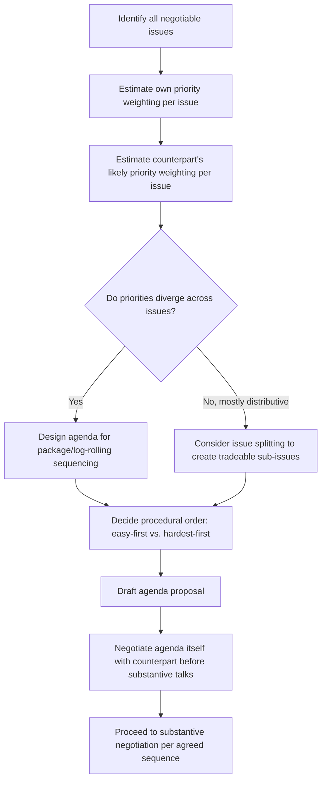

## Agenda Design and Issue Sequencing

### Overview

Agenda Design and Issue Sequencing is the preparatory practice of deciding which issues will be negotiated, how they will be defined and grouped, and in what order they will be addressed. The structure of an agenda is not a neutral administrative artifact — it materially shapes outcomes by determining what gets linked together for trade-offs, what precedent gets set early, and which party's priorities receive disproportionate early attention. This item builds directly on Stakeholder and Counterpart Analysis and BATNA/ZOPA estimation, since issue sequencing decisions should be informed by where the parties' priorities converge and diverge.

### Why Sequencing Matters

**Key Points**

- Early agreements create **anchoring and momentum effects**: an early concession or settled term can set a reference point that shapes expectations for all subsequent issues.
- Sequencing determines **whether issues are logrolled** — i.e., whether low-cost concessions on one issue can be traded for high-value gains on another, which is only possible if multiple issues are on the table simultaneously rather than settled one at a time in isolation.
- The order in which issues are raised affects **information revelation**: discussing lower-stakes issues first can build trust and reveal negotiating style before higher-stakes issues are addressed.
- Poor sequencing can produce **premature closure** on an issue that should have remained open for package-dealing with a later item.

### Core Sequencing Strategies

**1. Easy-Issues-First (Building Momentum)**

Address issues with high agreement-likelihood and low stakes before harder issues. This builds cooperative momentum and psychological commitment to reaching a deal before the parties confront their most divergent priorities.

**2. Hardest-Issue-First**

Address the most contentious issue immediately, on the premise that if the parties cannot resolve the central sticking point, the rest of the negotiation is moot and further time investment is wasted. This front-loads risk of impasse but avoids sunk-cost-driven agreements on minor points that later prove irrelevant if the core issue fails.

**3. Package/Simultaneous Sequencing**

Present multiple issues together as a bundle rather than resolving them sequentially, enabling trade-offs across issues (logrolling) based on each party's differing priority weighting. This is the preferred approach in integrative, multi-issue negotiations aiming to maximize joint value rather than settle issues independently.

**4. Issue Splitting/Fractionation**

Break a single large, seemingly indivisible issue (e.g., "price") into multiple sub-components (e.g., base price, payment terms, warranty period, delivery schedule) to create more variables for trade-off and expand the effective ZOPA beyond a single-dimension standoff.

**5. Log-Rolling Preparation**

Explicitly identify, before the negotiation, which issues each party likely weights differently (low cost to concede for one side, high value to the other) so the agenda can be structured to surface these asymmetries early enough to exploit them for mutual gain.

### Agenda Design Comparison

| Strategy | Best Used When | Primary Risk |
| --- | --- | --- |
| Easy-issues-first | Relationship-building is a priority; trust is low | Hard issues get less time/energy near session end |
| Hardest-issue-first | Deal is contingent on resolving one core issue | Early impasse can derail otherwise-viable smaller agreements |
| Package/simultaneous | Multiple issues exist with different priority weightings across parties | Requires more sophisticated tracking and higher cognitive load |
| Issue splitting | A single issue appears deadlocked or purely distributive | Can appear as stalling if overused |
| Log-rolling preparation | Priorities plausibly diverge across issues | Requires accurate priority information, which may be concealed |

### Agenda-Setting Process Flow

### Negotiating the Agenda Itself

**Key Points**

- The agenda is frequently a negotiated artifact in its own right, particularly in formal, multi-party, or diplomatic contexts — parties may spend significant preparatory time simply agreeing on what will be discussed and in what order, since this pre-shapes leverage.
- Proposing the agenda first, when accepted by the counterpart, grants a degree of **framing power**: the proposing party can define issue boundaries, labels, and implicit weighting (e.g., listing a favorable issue first signals its priority).
- A counterpart's resistance to a particular agenda structure can itself reveal information about their priorities — reluctance to discuss an issue early often signals higher sensitivity or stakes on that issue.
- In multiparty or diplomatic negotiations, "talks about talks" (pre-negotiation over agenda, format, and participants) can consume substantial time and is sometimes strategically prolonged by a party seeking to delay substantive engagement.

### Worked Example

A company negotiating a commercial lease renewal identifies four issues: **base rent**, **lease term length**, **renovation allowance**, and **early termination clause**.

**Priority estimation:**

| Issue | Tenant Priority | Landlord Priority |
| --- | --- | --- |
| Base rent | High | High |
| Lease term length | Medium | High |
| Renovation allowance | High | Low |
| Early termination clause | High | Medium |

Because renovation allowance is high-priority for the tenant but low-cost for the landlord to concede, and lease term length is high-priority for the landlord but only medium for the tenant, an agenda sequencing these two issues together (rather than settling base rent alone first) creates log-rolling potential: the tenant can trade agreement on a longer lease term for a larger renovation allowance, a trade invisible if each issue were negotiated and closed independently in isolation.

**Resulting agenda design**: Package sequencing (lease term + renovation allowance discussed jointly), followed by base rent, followed by early termination clause — reserving the tenant's next-highest priority for a point in the session where reciprocal goodwill from the earlier trade can be invoked.

### Common Pitfalls

- **Settling issues one at a time to closure**, foreclosing later logrolling opportunities once an issue is treated as "done."
- **Accepting the counterpart's proposed agenda uncritically**, without recognizing that agenda order itself carries framing power.
- **Failing to fractionate a deadlocked single issue**, when converting it into multiple sub-components could unlock movement.
- **Neglecting to estimate the counterpart's priority weighting**, which is a prerequisite for identifying log-rolling opportunities — sequencing decisions made without this estimate risk being arbitrary. [Inference — the practical accuracy of priority estimation depends heavily on information available during preparation and may require revision as the negotiation unfolds.]
- **Treating agenda-setting as purely administrative**, missing its strategic function as an early, low-visibility opportunity to shape the entire negotiation's trajectory.

**Related Topics**

- Logrolling and Multi-Issue Trade-offs
- Interests vs. Positions (Fisher & Ury Framework)
- Anchoring and First-Offer Effects
- Integrative vs. Distributive Bargaining
- Multiparty Negotiation and Coalition Dynamics
- Framing Effects in Negotiation