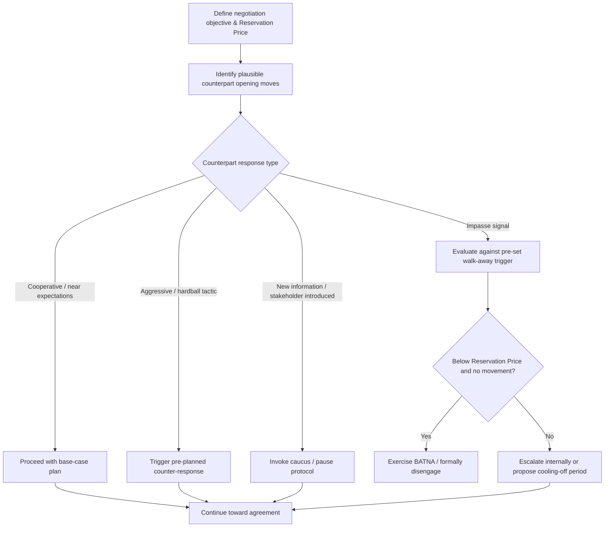

## Scenario Planning and Contingency Strategy

### Overview

Scenario Planning and Contingency Strategy is the preparatory discipline of anticipating how a negotiation could unfold across multiple plausible paths — including counterpart moves, external shocks, and impasse — and pre-committing to response plans for each. Where Stakeholder Analysis maps *who* is involved and Agenda Design determines *what order* issues are addressed, Scenario Planning addresses the dynamic, branching question of *what happens if* the negotiation deviates from the expected path, allowing a negotiator to respond deliberately rather than reactively under pressure.

### Rationale: Why Negotiators Plan for Contingencies

**Key Points**

- Live negotiations frequently deviate from the anticipated script — counterparts introduce unexpected demands, walk away temporarily, bring in new stakeholders, or reveal information that shifts the estimated ZOPA.
- Decision-making under time pressure and emotional activation (anger, anxiety, anchoring bias) tends to produce worse outcomes than decisions made calmly in advance; pre-committing to contingency responses reduces the cognitive load of in-the-moment strategic improvisation. [Inference — the magnitude of this effect varies by individual negotiator experience and the specific cognitive biases in play.]
- Scenario planning converts unknown unknowns into a bounded set of anticipated branches, each with a pre-considered response, reducing the likelihood of being caught unprepared by a foreseeable counterpart tactic.
- It provides a disciplined check against escalation of commitment — having pre-defined walk-away and de-escalation triggers makes it easier to recognize when a live negotiation has moved past the point of rational continuation.

### Core Components of Scenario Planning

**1. Best-Case, Likely-Case, Worst-Case Framing**

Standard scenario planning defines at minimum three branches:

- **Best case**: counterpart is highly cooperative, ZOPA is wide, agreement reached quickly and favorably.
- **Likely/base case**: counterpart behaves per available prior information, negotiation proceeds through expected friction points to a moderate outcome.
- **Worst case**: counterpart is highly competitive, adopts hardball tactics, or negotiation reaches impasse.

**2. Counterpart Move Trees**

Mapping the counterpart's plausible responses to a given opening move or offer, and pre-planning a response to each branch, structurally resembles a decision tree or extensive-form game in game theory, though it is typically applied heuristically rather than with formal payoff calculation in most practitioner contexts.

**3. Trigger-Based Contingency Rules**

Pre-defined "if-then" rules that specify a response in advance of a defined triggering event (e.g., "If the counterpart's opening offer is below X, respond with Y and hold firm on Z"; "If the counterpart introduces a new stakeholder mid-session, request a caucus before responding"). This reduces the risk of ad hoc, emotionally-driven reactions in the moment.

**4. Impasse and Walk-Away Protocols**

Explicit pre-commitment to what happens if no agreement is reached in the current session: whether to schedule a follow-up, invoke a cooling-off period, escalate to a different negotiator or forum, or formally exercise BATNA. This should be defined *before* the session, since in-session pressure tends to bias toward continued concession rather than a disciplined walk-away.

**5. Escalation and De-escalation Paths**

Planning for what internal or external escalation looks like if the negotiation stalls (e.g., involving a more senior decision-maker, bringing in a mediator, pausing for a cooling-off period) and what signals should trigger each path.

### Scenario Planning Decision Framework

### Contingency Planning Table (Illustrative Template)

| Trigger Event | Pre-Planned Response | Rationale |
| --- | --- | --- |
| Counterpart opens far below expected range | Do not immediately counter-anchor equally low; restate value basis and request justification for the offer | Avoids anchoring collapse toward an unjustified low reference point |
| Counterpart claims lack of authority to agree | Request timeline for ratification and consider provisional/contingent agreement | Prevents open-ended stalling while preserving momentum |
| New stakeholder introduced mid-session | Request a short caucus before responding substantively | Allows reassessment of stakeholder map before conceding ground |
| Negotiation reaches declared impasse | Compare best current offer against Reservation Price; if below, exercise BATNA | Prevents concession past the rational walk-away threshold |
| Counterpart uses emotional or aggressive tactics | Employ a pre-agreed pause/caucus rule rather than immediate reactive response | Reduces risk of decisions made under emotional activation |

### Worked Example

A procurement team preparing to negotiate a multi-year software licensing contract develops the following contingency set prior to the session:

- **If** the vendor's initial price exceeds the team's Aspiration Point by more than 20%, **then** open with a competitive benchmark citation rather than an immediate counter-number, to reset the anchor before further discussion.
- **If** the vendor introduces a bundled add-on service mid-negotiation, **then** treat this as a new issue requiring separate evaluation, not an automatic sweetener toward the current price point (avoiding an unplanned expansion of scope that dilutes focus on price).
- **If** the vendor's negotiator states they must "check with leadership," **then** request a specific date for a follow-up decision and propose a provisional term sheet to maintain momentum.
- **If** negotiations stall for more than one session with no movement toward the team's Reservation Price, **then** formally initiate parallel discussions with the identified BATNA vendor, and inform the counterpart that alternative options are being pursued.

This pre-planning allows the procurement team to respond immediately and consistently to each scenario rather than deliberating strategy live under time pressure.

### Relationship to Other Preparation Elements

Scenario Planning depends on and integrates outputs from prior preparatory work:

- Uses the **BATNA and Reservation Price** as the quantitative trigger for walk-away contingencies.
- Uses **Stakeholder Analysis** to anticipate which additional parties might be introduced mid-negotiation and how that should be handled.
- Uses **Agenda Design** assumptions to anticipate what happens if the counterpart resists the proposed issue sequencing.

### Common Pitfalls

- **Over-planning for the base case only**, leaving no prepared response for aggressive or unexpected counterpart tactics, which are common enough in practice to warrant explicit contingencies.
- **Treating walk-away triggers as flexible in the moment**, undermining the discipline that scenario planning is meant to provide — a pre-set Reservation Price threshold should not be renegotiated internally under table pressure without deliberate, conscious reconsideration.
- **Failing to update contingency plans as new information emerges** during the negotiation itself (e.g., a revised estimate of the counterpart's BATNA should trigger a revised contingency set, not just a one-time pre-session plan).
- **Excessive rigidity**: over-scripted contingency trees can reduce a negotiator's responsiveness to genuinely novel developments not captured in any pre-planned branch. [Inference — the right balance between structured pre-planning and in-session flexibility is context- and skill-dependent, and is not resolved uniformly in the literature.]
- **Neglecting internal-side contingencies**, focusing scenario planning solely on the counterpart's possible moves while ignoring how one's own team or authorizing principal might react to unexpected developments.

**Related Topics**

- BATNA and Reservation Price Estimation
- Decision Trees and Extensive-Form Game Analysis
- Hardball Tactics and Countermeasures
- Caucusing and Mediation Techniques
- Escalation of Commitment in Negotiation
- Emotional Regulation and Negotiator Psychology