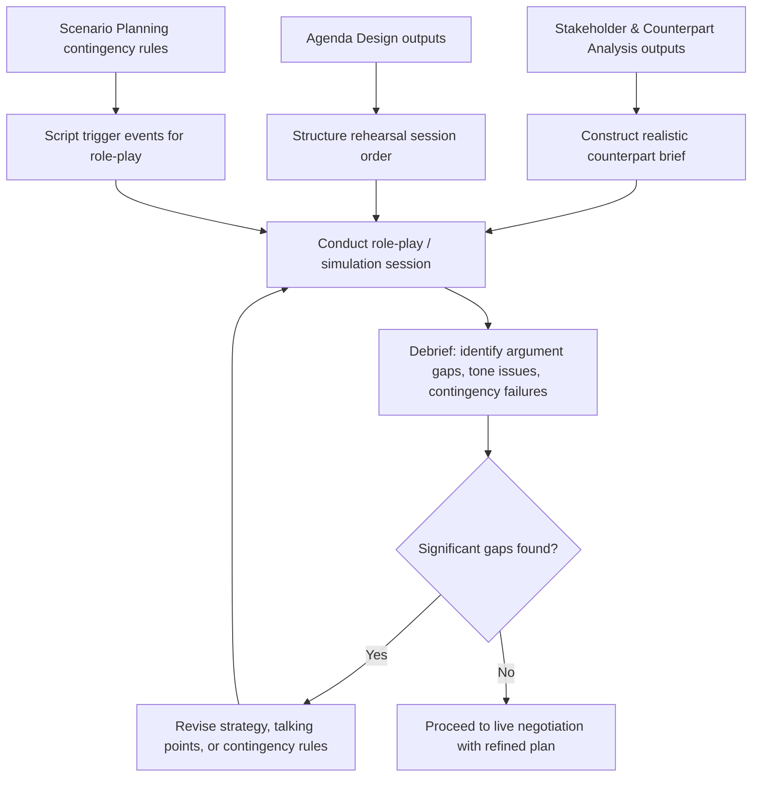

## Rehearsal and Simulation-Based Preparation

### Overview

Rehearsal and Simulation-Based Preparation is the practice of pre-enacting a negotiation — through role-play, structured dry runs, or formal simulation exercises — before the actual session, in order to test strategy, surface weaknesses in argumentation, and build the negotiator's behavioral fluency under conditions that approximate real interpersonal pressure. It operationalizes the analytical outputs of Stakeholder Analysis, Agenda Design, and Scenario Planning by converting written plans into rehearsed, embodied practice, closing the gap between having a strategy on paper and being able to execute it under live conditions.

### Rationale: Why Rehearsal Improves Outcomes

**Key Points**

- Strategic plans developed in the abstract (BATNA estimates, contingency trees, agenda sequencing) often reveal gaps only when tested against an active counterpart who deviates from expectations — rehearsal surfaces these gaps before they occur in the real session.
- Negotiation performance is affected by real-time factors not captured in written planning: tone modulation, pacing, non-verbal cues, and emotional regulation under pressure — skills that are trained through repetition rather than analysis alone.
- Role-play with a counter-negotiator playing devil's advocate can reveal unanticipated counterarguments, forcing the negotiator to develop responses in advance rather than improvising them live.
- Rehearsal builds familiarity with one's own opening language, key talking points, and numeric anchors, reducing hesitation or inconsistency that can undermine credibility in the actual session.

### Core Rehearsal Formats

**1. Dyadic Role-Play**

A colleague or coach plays the counterpart role, following a realistic brief constructed from the Stakeholder and Counterpart Analysis (interests, authority level, likely tactics). This is the most common and lowest-overhead rehearsal format.

**2. Devil's-Advocate Stress-Testing**

A reviewer is specifically tasked with attacking the negotiator's stated position and proposed arguments as aggressively and skeptically as plausible, surfacing weak points in the argument structure before the counterpart can exploit them live.

**3. Multi-Party Simulation**

For complex negotiations involving multiple stakeholders (per Stakeholder and Counterpart Analysis), a full simulation assigns participants to each principal, agent, and influencer role, allowing the negotiating team to observe coalition dynamics and internal counterpart tensions that a single-counterpart role-play cannot reveal.

**4. Scripted Scenario Walkthroughs**

Using the "if-then" contingency rules developed in Scenario Planning, a facilitator deliberately triggers each pre-defined scenario (aggressive opening, impasse signal, new stakeholder introduction) during rehearsal to test whether the negotiator's planned response is executable, not just theoretically sound.

**5. Video-Recorded Self-Review**

Recording a rehearsal session and reviewing it afterward (alone or with a coach) to assess non-verbal signals, pacing, filler language, and moments of visible discomfort — feedback that is difficult to self-assess in real time during the rehearsal itself.

### Rehearsal Preparation-to-Execution Pipeline

### Constructing a Realistic Counterpart Brief

**Key Points**

- The rehearsal partner playing the counterpart should be briefed using the outputs of Stakeholder and Counterpart Analysis: estimated interests, authority level, likely negotiating style, and probable BATNA.
- A rehearsal brief that is too favorable to the negotiator's own side (an easy, cooperative "counterpart") produces false confidence and fails to stress-test the strategy; the brief should authentically represent the counterpart's most plausible competitive posture, including likely hardball tactics if those are realistically anticipated.
- Where multiple plausible counterpart profiles exist (e.g., cooperative vs. highly competitive), running separate rehearsal passes against each profile tests the robustness of the strategy across the range of likely real-world variation, rather than optimizing narrowly for a single assumed counterpart type. [Inference — the value of multi-profile rehearsal scales with negotiation stakes and complexity; for low-stakes negotiations, a single rehearsal pass may be a reasonable trade-off against preparation time.]

### Debrief Structure

An effective rehearsal debrief typically evaluates:

| Dimension | Debrief Question |
| --- | --- |
| Argument strength | Which claims held up under counterargument, and which collapsed? |
| Anchoring execution | Was the planned opening anchor delivered clearly and confidently? |
| Contingency execution | When a scripted trigger event occurred, was the pre-planned response actually executable in real time? |
| Emotional regulation | Did the negotiator remain composed under simulated pressure, or show visible frustration/anxiety? |
| Information leakage | Did the negotiator inadvertently reveal Reservation Price or other sensitive information during the exchange? |
| Non-verbal signals | Did tone, pacing, or body language undermine or reinforce the stated position? |

### Worked Example

A team preparing for a high-stakes vendor contract renegotiation runs a two-pass rehearsal:

**Pass 1 — Cooperative counterpart profile**: A colleague plays a reasonable, collaborative vendor representative. The team confirms their integrative, package-based agenda sequencing functions smoothly and logrolling trades (per Agenda Design preparation) land as intended.

**Pass 2 — Competitive counterpart profile**: The same colleague, now briefed to play an aggressive vendor representative who opens with an anchored high price, claims limited authority to negotiate further, and introduces an unplanned late-session demand.

**Debrief findings**: The team's planned response to the "limited authority" contingency (per Scenario Planning) proves awkward in delivery — the negotiator hesitates and appears to accept the stalling tactic rather than executing the pre-planned request for a specific ratification timeline. This gap is identified and corrected before the actual session, where the same tactic is in fact used by the real vendor representative, and the team executes the refined response smoothly.

### Common Pitfalls

- **Rehearsing only the expected, cooperative scenario**, leaving the negotiator unprepared for the hardball tactics identified as plausible during Scenario Planning.
- **Selecting a rehearsal partner who is too agreeable or too unfamiliar with the counterpart's likely profile**, reducing the realism and diagnostic value of the exercise.
- **Treating rehearsal as a one-time formality rather than an iterative loop**, skipping the revise-and-repeat cycle after identifying gaps in the first pass.
- **Focusing debrief exclusively on substantive arguments while ignoring delivery, tone, and non-verbal execution**, which materially affect real-world negotiation outcomes but are easy to overlook in a purely content-focused review.
- **Over-rehearsing a single anticipated script**, producing brittleness if the live counterpart deviates meaningfully from the rehearsed scenario. [Inference — as with scenario planning generally, the appropriate balance between scripted rehearsal and adaptive flexibility training is context-dependent and not settled uniformly across the practitioner literature.]

**Related Topics**

- Scenario Planning and Contingency Strategy
- Stakeholder and Counterpart Analysis
- Emotional Regulation and Negotiator Psychology
- Hardball Tactics and Countermeasures
- Anchoring and First-Offer Effects
- Debriefing and Post-Negotiation Review Practices