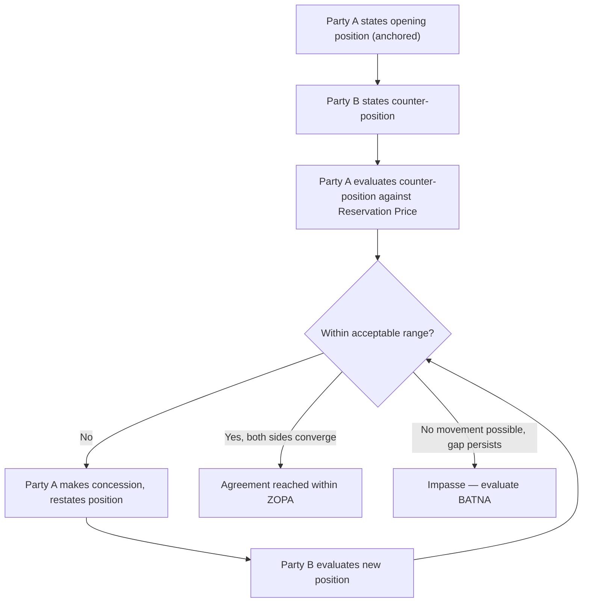

## Positional Bargaining Fundamentals

### Overview

Positional Bargaining is a negotiation approach in which each party stakes out and defends a sequence of positions — specific, stated demands — and moves toward agreement through a pattern of offers and counteroffers, typically converging somewhere within the ZOPA. It is the classical form of distributive, competitive negotiation and stands in explicit contrast to the interest-based approach popularized by Fisher and Ury, who used positional bargaining as the baseline against which their "principled negotiation" alternative was framed in *Getting to Yes*.

### Defining Characteristics

**Key Points**

- Parties open with an **anchored position** (a specific number or term) rather than an explanation of underlying interests, and defend that position through successive rounds.
- Negotiation proceeds through **incremental concessions**, with each party gradually moving from its opening position toward a mutually acceptable point, typically within the estimated ZOPA.
- The approach is fundamentally **distributive** in orientation: it treats the negotiation as a fixed-value contest over a single or small number of issues (most commonly price), where one party's gain is assumed to be the other's loss — the "fixed pie" framing.
- Positional bargaining relies heavily on **firmness and commitment signaling** — the credibility of a stated position often depends on the counterpart believing further movement is unlikely without reciprocal concession.

### Positional Bargaining vs. Interest-Based Negotiation

| Dimension | Positional Bargaining | Interest-Based Negotiation |
| --- | --- | --- |
| Focus | Stated positions/demands | Underlying interests/needs |
| Framing | Fixed-pie, distributive | Expandable-pie, integrative |
| Primary tactic | Anchoring, concession trading | Interest discovery, option generation |
| Typical outcome | Compromise within ZOPA | Potentially superior joint value via trade-offs |
| Relationship impact | Can strain relationship through adversarial framing | Tends to preserve or build relationship |
| Efficiency | Fast for simple, single-issue negotiations | Requires more time/information exchange |

Fisher and Ury's central critique of positional bargaining is that it is inefficient (parties waste effort defending arbitrary positions), risks damaging relationships through adversarial dynamics, and can produce agreements less favorable than what interest-based exploration might reveal, since positions can mask compatible underlying interests that a strict position-defense approach never surfaces. [Inference — this critique reflects the normative framework of the Harvard Negotiation Project literature; other schools of negotiation theory treat positional bargaining as simply one legitimate mode suited to certain contexts, such as purely distributive, one-shot, low-relationship-value transactions, rather than as a strategy to be generally avoided.]

### Core Mechanics

**1. Opening Position and Anchoring**

The first stated position sets a psychological reference point, per anchoring theory, that influences the range of subsequent offers regardless of its objective justification. Positional bargainers typically open at an extreme end of their perceived ZOPA to maximize room for concession while still landing favorably.

**2. Concession Patterns**

Movement from the opening position toward eventual agreement typically follows a **diminishing concession pattern** — each successive concession is smaller than the last, signaling to the counterpart that the current position is approaching a genuine limit (as opposed to constant-sized concessions, which suggest more room remains).

**3. Commitment Tactics**

Parties may explicitly or implicitly signal that a stated position is firm and non-negotiable (e.g., "this is our final offer"), a tactic intended to shift the burden of further movement onto the counterpart. The credibility of such commitments depends on reputation, the plausibility of the stated constraint, and the counterpart's ability to verify it.

**4. Convergence Toward the ZOPA Midpoint**

In the absence of strong asymmetric leverage or information, repeated positional bargaining rounds often converge toward a point within the ZOPA — though the actual settlement point depends heavily on relative BATNA strength, opening anchor extremity, and negotiator skill and patience, not on any guaranteed equal split.

### Positional Bargaining Sequence

### Worked Example

Two parties negotiate the sale price of a used commercial vehicle.

- **Seller's Reservation Price**: $18,000 (informed by their BATNA of selling to a wholesale buyer)
- **Buyer's Reservation Price**: $23,000 (informed by their BATNA of purchasing a comparable vehicle elsewhere)
- **ZOPA**: $18,000–$23,000

**Round 1**: Seller opens at $26,000 (an anchor above their Reservation Price, and even above the buyer's ceiling, to maximize room). Buyer counters at $16,000 (an anchor below their own Reservation Price, mirroring the same tactic).

**Round 2**: Seller concedes to $23,500. Buyer concedes to $18,500. Gap narrows from $10,000 to $5,000.

**Round 3**: Seller concedes to $21,500 (a smaller concession than the prior round, signaling approach to a limit). Buyer concedes to $19,500.

**Round 4**: Parties converge at $20,500 — a point within the $18,000–$23,000 ZOPA, reached through the diminishing concession pattern typical of positional bargaining, with neither party's Reservation Price ever disclosed to the other.

### Vulnerabilities of Positional Bargaining

**Key Points**

- **Fails on genuinely multi-issue negotiations**: because it frames the negotiation as a single-dimension contest, positional bargaining under-exploits log-rolling and trade-off opportunities available when priorities diverge across issues (see Agenda Design and Issue Sequencing).
- **Vulnerable to false anchoring**: a party can gain disproportionate advantage through an extreme, non-credible opening anchor, particularly against a counterpart without solid Reservation Price and market research.
- **Can produce impasse over ego or face-saving concerns**: because positions (rather than underlying interests) are being defended, parties may resist a mutually beneficial move purely to avoid the appearance of "losing" the positional contest.
- **Relationship cost**: sustained adversarial position-defense can damage trust and cooperation needed for future dealings, making positional bargaining comparatively less suited to negotiations with ongoing relationship value.

### When Positional Bargaining Remains Appropriate

Despite the critique from interest-based theorists, positional bargaining remains a rational and efficient choice in specific conditions:

- Single-issue, purely distributive transactions (e.g., a one-time commodity sale) where no additional issues exist to logroll.
- Low-relationship-value, one-shot transactions where preserving long-term rapport carries little weight.
- Contexts where time and information-exchange costs of interest-based exploration would exceed the marginal value gained from it.

### Common Pitfalls

- **Anchoring outside a credible range**, which can damage credibility and provoke a similarly extreme counter-anchor rather than productive movement.
- **Conceding in constant or increasing increments**, signaling continued flexibility and inviting the counterpart to hold firm for further movement.
- **Applying positional bargaining to inherently multi-issue negotiations**, forfeiting available integrative value that a package or interest-based approach could capture.
- **Revealing Reservation Price through concession pattern analysis**: a sophisticated counterpart can infer a party's floor/ceiling by observing the rate and size of successive concessions, even if the number itself is never explicitly stated.
- **Treating a stated "final offer" as always genuine**, when it may be a tactical commitment device rather than an actual limit — assessing credibility requires judgment informed by Counterpart Analysis rather than automatic acceptance. [Inference — the frequency of genuine versus tactical "final offer" claims in practice is not something the literature quantifies precisely; the appropriate skepticism level is context-dependent.]

**Related Topics**

- Anchoring and First-Offer Effects
- Concession Strategy and Reciprocity Norms
- Interests vs. Positions (Fisher & Ury Framework)
- Hardball Tactics and Countermeasures
- ZOPA and Reservation Price Estimation
- Integrative vs. Distributive Bargaining