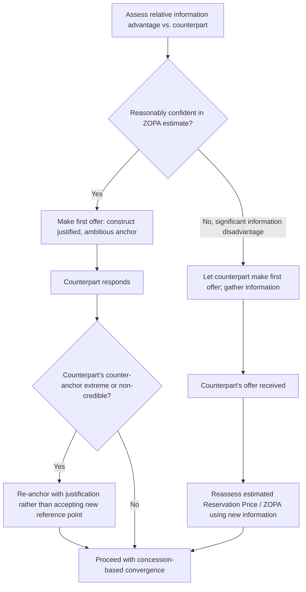

## First-Offer Strategy and Anchoring Tactics

### Overview

First-Offer Strategy and Anchoring Tactics examine the decision of whether, when, and how to make the opening offer in a negotiation, and the well-documented psychological mechanism — anchoring — through which that opening number disproportionately shapes the final settlement. This item formalizes a tactic already referenced throughout Positional Bargaining Fundamentals, treating anchoring as a distinct, evidence-based subject with its own decision rules and countermeasures.

### The Anchoring Effect: Psychological Basis

**Key Points**

- Anchoring is a cognitive bias, first documented systematically by Amos Tversky and Daniel Kahneman (1974), in which an initial numeric reference point disproportionately influences subsequent numeric judgments, even when the anchor is arbitrary or explicitly known to be uninformative.
- In negotiation contexts, the first offer functions as an anchor that shifts the counterpart's subsequent counteroffers and internal reference point toward the anchor's direction, even among experienced negotiators aware of the bias. [Inference — while the general anchoring effect is robustly replicated, its magnitude in specific negotiation contexts varies with negotiator expertise, information availability, and stakes; it is not a fixed, universally-sized effect.]
- The mechanism operates partly through **selective accessibility**: after exposure to an anchor, negotiators disproportionately recall and weight information consistent with that anchor when forming their counteroffer.
- Anchoring effects have been shown in experimental settings to persist even when the anchor is revealed to be randomly generated or clearly extreme, though the effect size is generally reduced under such conditions compared to a plausible, justified anchor.

### Should You Make the First Offer? The Research Debate

**Arguments for making the first offer:**

- Sets the anchor in a self-favorable direction, shifting the effective bargaining range and the counterpart's frame of reference before they have an opportunity to anchor the exchange themselves.
- Experimental and field research on anchoring generally finds that first offers correlate positively with final settlement values in the anchor's direction — i.e., making a high first offer as a seller tends to correlate with a higher final price, all else equal. [Inference — this is a directional research finding subject to boundary conditions (e.g., extreme or non-credible anchors can backfire, and the effect is attenuated when the counterpart has strong independent information about market value).]

**Arguments for letting the counterpart make the first offer:**

- Reduces the risk of "leaving value on the table" by anchoring too conservatively when the counterpart's actual Reservation Price is more favorable than the negotiator's own estimate.
- Allows the negotiator to gather information from the counterpart's offer about their likely priorities and Reservation Price before committing to a number.
- Preferred when the negotiator has significant information asymmetry disadvantage (i.e., substantially less market or valuation information than the counterpart), since anchoring without adequate information risks setting a self-defeating reference point.

**Synthesis**: The prevailing view in the negotiation literature is that making the first offer is generally advantageous when the negotiator has reasonably good information about the ZOPA and can justify the anchor credibly, while deferring the first offer is advantageous primarily under significant information disadvantage. [Inference — this synthesis reflects a commonly cited practitioner heuristic rather than a single unconditional research consensus; the optimal choice is context-dependent on relative information, stakes, and negotiator confidence.]

### Anchor Construction: Making an Effective First Offer

**Key Points**

- **Extremity**: an effective anchor is ambitious enough to shift the final settlement favorably but not so extreme as to appear non-credible, provoke a similarly extreme counter-anchor, or risk the counterpart disengaging from the negotiation entirely.
- **Justification**: anchors supported by external, verifiable reference points (market comparables, cost data, appraisals, precedent) are harder for the counterpart to dismiss and are less likely to damage the negotiator's credibility than an unsupported number.
- **Precision**: research on numeric cognition suggests that more precise anchors (e.g., $412,500 rather than $400,000) can be perceived as more credible and informed, potentially producing counteroffers closer to the precise anchor than a round-number anchor would. [Inference — this "precision effect" is a documented experimental finding, but its practical magnitude and consistency across real-world negotiation contexts is less firmly established than the core anchoring effect itself.]
- **Framing**: presenting the anchor alongside a rationale ("based on comparable properties in this area...") rather than as a bare number tends to reduce counterpart resistance and perceived arbitrariness.

### Anchoring and Counter-Anchoring Flow

### Countermeasures Against an Aggressive Counterpart Anchor

**Key Points**

- **Do not immediately counter with a proportionally adjusted number**, since doing so implicitly validates the counterpart's anchor as a legitimate reference point for the negotiation's range.
- **Re-anchor explicitly**: restate the negotiator's own independently-derived value estimate and justification, rather than treating the counterpart's number as the new baseline for calculation.
- **Request justification for the counterpart's anchor**: asking "how did you arrive at that number?" can expose a weakly supported anchor and reduce its psychological hold, while also surfacing useful information about the counterpart's reasoning or constraints.
- **Take a deliberate pause before responding**: research on anchoring suggests that effortful, deliberate counter-reasoning (as opposed to fast, intuitive processing) can partially mitigate anchor influence, making a brief pause before formulating a counteroffer a practical, evidence-informed tactic. [Inference — mitigation through deliberate processing is a documented direction in the cognitive bias literature, but complete immunity to anchoring effects through deliberation alone is not established.]

### Worked Example

A freelance consultant is negotiating a project fee with a new client.

- Consultant's Reservation Price (informed by BATNA of other available projects): $8,000
- Consultant's researched market rate for comparable scope: $11,000–$14,000
- Consultant has reasonably strong market information (comparable project rates from industry sources)

Given strong independent information, the consultant elects to make the first offer, anchoring at $14,000 with a stated rationale: "Based on the project scope and comparable engagements of this size in this sector, my rate for this work is $14,000." This anchor is at the top of the credible market range, ambitious but justified by external reference, and is offered with precision and rationale rather than as a bare round number.

The client counters at $9,000. Rather than treating $9,000 as the new floor for calculation, the consultant re-anchors: "I understand budget is a consideration, but based on the comparable scope of work I referenced, $9,000 is below the market range for this type of engagement." This response resists validating the client's counter-anchor as the new reference point, instead reasserting the original justification.

### Common Pitfalls

- **Making an unsupported, purely aspirational anchor**, which risks damaging credibility if the counterpart can easily identify it as unjustified by market or cost data.
- **Automatically countering an aggressive anchor with an equally extreme counter-anchor**, which can escalate into a wide, hard-to-bridge gap rather than productive convergence.
- **Failing to make a first offer out of excessive caution when the negotiator actually holds an information advantage**, forfeiting the anchoring benefit unnecessarily.
- **Treating anchoring effects as something skilled negotiators are immune to**: experimental evidence indicates the effect persists even among individuals aware of the bias, making explicit countermeasures (re-anchoring, deliberate pause, requesting justification) necessary rather than relying on awareness alone. [Inference — degree of persistence under awareness varies by study and negotiator expertise, and should not be treated as an absolute, unconditional finding.]
- **Ignoring the counterpart's likely information position**: an anchor that would be effective against an uninformed counterpart may fail against one with strong independent market data, since a well-informed counterpart is less susceptible to an unsupported reference point.

**Related Topics**

- Positional Bargaining Fundamentals
- Concession Strategy and Reciprocity Norms
- Cognitive Biases in Negotiation (Anchoring, Framing, Overconfidence)
- BATNA and Reservation Price Estimation
- Information Asymmetry and Signaling
- Hardball Tactics and Countermeasures