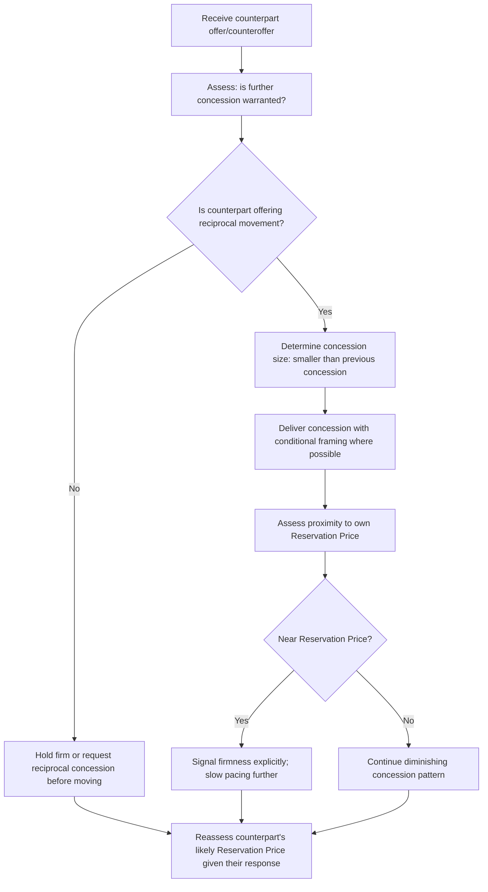

## Concession Patterns and Pacing

### Overview

Concession Patterns and Pacing examines the size, sequence, and timing of the movements a negotiator makes from their opening position toward eventual agreement. While First-Offer Strategy and Anchoring Tactics addresses the starting point of a distributive negotiation, this item addresses everything that happens between that anchor and final agreement — how much ground to give, how quickly, and what signals each concession sends to the counterpart about the negotiator's remaining flexibility and true limits.

### Why Concession Behavior Communicates Information

**Key Points**

- Every concession is simultaneously a substantive move (giving ground on value) and an **informational signal** — the size and pace of concessions are interpreted by the counterpart as evidence about how close the negotiator is to their true Reservation Price, whether or not that inference is accurate.
- Because Reservation Price is typically private information (per BATNA and Reservation Price fundamentals), concession pattern analysis is one of the primary channels through which a counterpart estimates it indirectly.
- Sophisticated counterparts track not just the current offer, but the **trend** across successive offers — the derivative, not just the level — to estimate how much room for further movement likely remains.

### The Diminishing Concession Principle

**Key Points**

- The dominant, well-established heuristic in distributive bargaining is that **concessions should decrease in magnitude** as the negotiation progresses (e.g., an initial concession of $2,000, followed by $1,200, then $600, then $200), signaling an approach toward a genuine limit.
- A diminishing pattern is more credible than a constant-sized pattern because it mimics the natural shape of approaching a hard floor or ceiling, whereas constant-sized concessions imply the party could plausibly continue conceding at the same rate indefinitely.
- **Increasing concessions** (each larger than the last) are widely regarded as a significant tactical error, since they signal to the counterpart that continued resistance will be rewarded with progressively larger gains, incentivizing the counterpart to hold out longer rather than settle.

### Concession Pattern Comparison

| Pattern Type | Description | Signal Sent to Counterpart |
| --- | --- | --- |
| Diminishing | Each concession smaller than the last | Approaching a genuine limit; further resistance yields little |
| Constant | Equal-sized concessions each round | Ambiguous; may invite continued pressure for more equal-sized moves |
| Increasing | Each concession larger than the last | Significant remaining flexibility; incentivizes continued holding out |
| Single large concession (early) | One substantial early move, then firmness | Can signal good faith, but risks appearing to concede a large ZOPA share quickly with little reciprocal information gained |
| Zero/firm-then-sudden | Extended firmness followed by an abrupt full concession | Ambiguous and risky; can appear either as a strong hard limit finally overridden by other factors, or as a capitulation under pressure |

### Illustrative Concession Curve

<svg xmlns="http://www.w3.org/2000/svg" viewBox="0 0 640 340">
<text x="320" y="25" text-anchor="middle" font-size="16" font-weight="bold" fill="#1a1a1a">Diminishing vs. Constant Concession Patterns (svg_diagram)</text>
<line x1="70" y1="290" x2="600" y2="290" stroke="#333" stroke-width="2" />
<line x1="70" y1="290" x2="70" y2="50" stroke="#333" stroke-width="2" />
<text x="335" y="320" text-anchor="middle" font-size="13" fill="#333">Negotiation Round</text>
<text x="35" y="170" text-anchor="middle" font-size="13" fill="#333" transform="rotate(-90 35 170)">Offer Value</text>
<polyline points="90,80 210,105 330,155 450,190 570,205" fill="none" stroke="#c0392b" stroke-width="3" />
<circle cx="90" cy="80" r="4" fill="#c0392b" />
<circle cx="210" cy="105" r="4" fill="#c0392b" />
<circle cx="330" cy="155" r="4" fill="#c0392b" />
<circle cx="450" cy="190" r="4" fill="#c0392b" />
<circle cx="570" cy="205" r="4" fill="#c0392b" />
<text x="580" y="205" font-size="11" fill="#c0392b">Diminishing</text>
<polyline points="90,80 210,130 330,180 450,230 570,280" fill="none" stroke="#2980b9" stroke-width="3" stroke-dasharray="6,4" />
<circle cx="90" cy="80" r="4" fill="#2980b9" />
<circle cx="210" cy="130" r="4" fill="#2980b9" />
<circle cx="330" cy="180" r="4" fill="#2980b9" />
<circle cx="450" cy="230" r="4" fill="#2980b9" />
<circle cx="570" cy="280" r="4" fill="#2980b9" />
<text x="580" y="280" font-size="11" fill="#2980b9">Constant</text>

<text x="90" y="70" text-anchor="middle" font-size="11" fill="#555">R1</text>

<text x="210" y="300" text-anchor="middle" font-size="11" fill="#555">R2</text>

<text x="330" y="300" text-anchor="middle" font-size="11" fill="#555">R3</text>

<text x="450" y="300" text-anchor="middle" font-size="11" fill="#555">R4</text>

<text x="570" y="300" text-anchor="middle" font-size="11" fill="#555">R5</text>

</svg>

### Pacing: Speed as a Signal

**Key Points**

- **Slow pacing** (extended time between offers, deliberate delays) tends to signal firmness, careful deliberation, or genuine constraint, and can pressure a counterpart who is more time-sensitive into moving further.
- **Fast pacing** (rapid concessions in quick succession) risks signaling either eagerness to close (weak BATNA or high urgency) or poor preparation, potentially inviting the counterpart to hold out for further quick gains.
- **Deadline effects**: negotiation research consistently finds that a disproportionate share of concessions and agreements cluster near a negotiation's deadline, as time pressure increases the perceived cost of continued impasse relative to further gains from holding firm. [Inference — the magnitude of deadline-driven concession clustering varies by negotiator, stakes, and the credibility of the deadline itself, but the general pattern is a widely replicated finding in negotiation and bargaining research.]
- Strategic use of pacing includes deliberately introducing or exploiting deadlines to accelerate a counterpart's concessions, and resisting the reciprocal pressure to speed one's own pacing merely because a counterpart signals urgency.

### The Reciprocity Norm in Concession Exchange

**Key Points**

- Concessions are frequently expected to be met with a **reciprocal concession** from the counterpart; a party that makes repeated unilateral concessions without corresponding movement from the other side risks signaling weakness and inviting further unreciprocated demands.
- A common tactical discipline is to **link concessions explicitly and conditionally** ("If you can move on the delivery timeline, I can revisit the price") rather than conceding unconditionally, which both preserves reciprocity and creates natural logrolling opportunities across issues (see Agenda Design and Issue Sequencing).
- Unconditional, unreciprocated concessions are among the most commonly cited tactical errors in distributive bargaining, since they surrender value without extracting corresponding movement or information from the counterpart.

### Concession Pacing Decision Flow

### Worked Example

Continuing the vehicle sale example from Positional Bargaining Fundamentals (Seller Reservation Price $18,000; Buyer Reservation Price $23,000; ZOPA $18,000–$23,000):

| Round | Seller Offer | Concession Size | Interpretation |
| --- | --- | --- | --- |
| 1 (opening) | $26,000 | — | Anchor above buyer's ceiling |
| 2 | $23,500 | $2,500 | Large early concession, signals initial flexibility |
| 3 | $21,500 | $2,000 | Slightly smaller, still substantial |
| 4 | $20,200 | $1,300 | Diminishing pattern established |
| 5 | $19,700 | $500 | Sharp reduction signals approach to genuine limit |
| 6 (final) | $19,500 | $200 | Minimal movement, strongly signals Reservation Price is near |

The buyer, tracking this diminishing trend, can reasonably infer the seller's Reservation Price is close to $19,000–$19,500 — information the seller has partially revealed through concession *pattern*, even without ever stating a number explicitly. This illustrates why concession pacing itself functions as an informational leak requiring deliberate management.

### Common Pitfalls

- **Conceding in increasing increments**, inadvertently signaling substantial remaining flexibility and incentivizing the counterpart to hold out longer.
- **Making unconditional concessions without requesting reciprocity**, surrendering value without extracting corresponding movement.
- **Moving too quickly early in the negotiation**, signaling urgency or a weak BATNA that a skilled counterpart can exploit for further concessions.
- **Failing to monitor one's own concession trend from the counterpart's likely perspective**, not recognizing that the pattern itself telegraphs proximity to the Reservation Price even when the number is withheld.
- **Ignoring deadline dynamics**, either by failing to leverage a counterpart's known deadline or by allowing one's own artificial urgency to drive premature, unreciprocated concessions. [Inference — the practical exploitability of deadline pressure depends on its credibility and on the relative time-sensitivity of each party, which varies by context.]

**Related Topics**

- First-Offer Strategy and Anchoring Tactics
- Positional Bargaining Fundamentals
- Reciprocity Norms and Social Exchange Theory
- Deadline Effects and Time Pressure in Negotiation
- BATNA and Reservation Price Estimation
- Hardball Tactics and Countermeasures