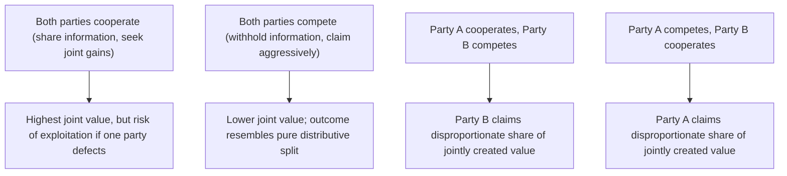

## Claiming Value Under Competitive Conditions

### Overview

Claiming Value Under Competitive Conditions synthesizes the distributive tactics covered across Positional Bargaining, First-Offer Strategy, and Concession Patterns into a unified framework for maximizing one's share of a fixed or largely fixed bargaining surplus. Where the preceding items examined individual tactical components in isolation, this item addresses claiming value as an integrated competitive discipline — including the specific hardball tactics competitive negotiators deploy, the ethical and strategic tensions this raises, and its relationship to the negotiator's dilemma that connects distributive and integrative negotiation theory.

### The Fixed-Pie Frame and Its Limits

**Key Points**

- "Claiming value" refers to the process of securing the largest possible share of the surplus available within the ZOPA, treating the total value on the table as effectively fixed for the purposes of the immediate tactical exchange.
- This framing is genuinely accurate for **purely distributive issues** (e.g., a single price term with no other negotiable dimensions), where any gain to one party is a corresponding loss to the other.
- The framing becomes a **liability** when applied to negotiations that in fact contain multiple issues with divergent priority weightings across parties, since treating all such negotiations as fixed-pie forecloses log-rolling and joint-value-creating trades that integrative approaches would capture (see Agenda Design and Issue Sequencing).
- Recognizing which issues within a given negotiation are genuinely distributive (to be claimed) versus which are integrative (to be jointly expanded) is itself a strategic judgment that precedes tactical execution.

### Core Value-Claiming Tactics

**1. Aggressive but Credible Anchoring**

As detailed in First-Offer Strategy, opening at the most favorable defensible point in the estimated ZOPA sets a reference point that shifts the likely settlement range in the anchoring party's favor.

**2. Diminishing, Reciprocity-Linked Concessions**

As detailed in Concession Patterns and Pacing, controlling the size and pace of concessions — and requiring reciprocal movement — preserves value that would otherwise be surrendered through unconditional or poorly signaled concessions.

**3. Information Control**

Withholding one's own Reservation Price and priority weighting while actively probing for the counterpart's, since asymmetric information is a direct source of value-claiming leverage — the party with better information about the true ZOPA boundaries can extract more of the surplus.

**4. Commitment Tactics**

Publicly or credibly committing to a position (e.g., "I cannot go below this number due to [constraint]") to shift the burden of further movement onto the counterpart. Credible commitment devices — external constraints, publicly stated limits, or delegated authority restrictions — can make a firm position more believable than a bare assertion.

**5. Deadline and Time-Pressure Tactics**

Introducing or exploiting a real or perceived deadline increases the counterpart's cost of continued impasse relative to conceding, often accelerating movement toward the anchoring party's preferred outcome (see deadline effects in Concession Patterns and Pacing).

**6. Hardball Tactics**

A cluster of more aggressive, ethically contested tactics including:

- **Good cop/bad cop**: alternating between an aggressive and a conciliatory negotiator on the same team to create relative relief and pressure the counterpart toward the "reasonable" party's terms.
- **Highball/lowball offers**: extreme opening anchors intended to shift the counterpart's reference point dramatically, discussed in depth under First-Offer Strategy.
- **Nibbling**: requesting small additional concessions after apparent agreement has been reached, exploiting the counterpart's psychological commitment to closing the deal.
- **Take-it-or-leave-it**: presenting a final offer as non-negotiable to force a binary accept/reject decision, foreclosing further concession requests.
- **Bogey tactic**: falsely claiming a particular issue is critically important in order to later "concede" it in exchange for a genuine concession on an issue that actually matters more.

### Value-Claiming Tactics Summary

| Tactic | Mechanism | Primary Risk |
| --- | --- | --- |
| Aggressive anchoring | Shifts reference point favorably | Non-credible anchor damages trust/credibility |
| Reciprocity-linked concessions | Preserves value per unit conceded | Counterpart may refuse reciprocity, stalling progress |
| Information control | Prevents counterpart from exploiting known Reservation Price | Excessive secrecy can block integrative discovery |
| Commitment tactics | Shifts movement burden to counterpart | Non-credible commitments can be called and damage standing |
| Deadline exploitation | Increases counterpart's cost of delay | Can backfire if deadline is discovered to be false |
| Hardball tactics (nibbling, bogey, etc.) | Extracts additional value post-agreement or via misdirection | Reputational and relationship damage; risk of counter-hardball escalation |

### The Negotiator's Dilemma

**Key Points**

- The **Negotiator's Dilemma**, a concept central to negotiation theory (notably articulated by David Lax and James Sebenius), describes the structural tension between **creating value** (cooperative, interest-based moves that expand joint gains) and **claiming value** (competitive moves that secure a larger individual share of the resulting surplus).
- Purely cooperative behavior risks being exploited by a competitive counterpart who claims a disproportionate share of any jointly created value; purely competitive behavior forecloses the joint-value-creation opportunities available in genuinely multi-issue negotiations.
- Effective negotiators are generally understood to require the judgment to shift between value-creating and value-claiming postures depending on the issue and phase of the negotiation, rather than applying either mode uniformly throughout. [Inference — the precise decision rule for when to shift postures is treated heuristically in the practitioner and academic literature rather than reduced to a single formal algorithm.]

### Negotiator's Dilemma Payoff Structure

### Ethical Considerations in Value-Claiming

**Key Points**

- Certain value-claiming tactics fall along a widely recognized ethical spectrum: aggressive but truthful anchoring and firm commitment are generally viewed as legitimate competitive tactics, while deliberate misrepresentation of fact (e.g., falsely claiming a competing offer that does not exist) is more broadly regarded as deceptive rather than merely competitive.
- The distinction between **strategic ambiguity or non-disclosure** (legitimately withholding one's Reservation Price) and **affirmative misrepresentation** (stating a false fact) is a recurring line in negotiation ethics literature — most frameworks treat the former as an accepted feature of competitive bargaining and the latter as a more serious ethical breach, though views on where hardball tactics like the bogey or false deadlines fall along this spectrum vary among practitioners and scholars. [Inference — this remains a genuinely contested normative question rather than one with a single settled resolution across the field.]
- Reputational consequences are a practical, non-normative check on aggressive tactics: a negotiator known for hardball or deceptive tactics may face reduced counterpart trust and cooperation in future interactions, particularly in relationship-value or repeat-game contexts.

### Countering Aggressive Value-Claiming Tactics

**Key Points**

- **Naming the tactic explicitly** ("It sounds like you're asking for one more concession after we'd reached agreement — that's a nibble, and I'd like to treat this as a new, separate discussion") can neutralize a hardball tactic by surfacing it, since many such tactics rely on the counterpart not recognizing what is happening.
- **Refusing to reciprocate escalation** while maintaining firmness on one's own Reservation Price avoids a downward spiral into mutual, increasingly aggressive competitive tactics that can produce impasse even within a positive ZOPA.
- **Requesting verification of claimed constraints** (e.g., a stated deadline or competing offer) can test the credibility of a commitment or deadline tactic without directly accusing the counterpart of dishonesty.
- **Maintaining a strong, well-researched Reservation Price and BATNA** is the most robust general defense against exploitation via any value-claiming tactic, since it bounds the negotiator's own worst-case exposure regardless of the counterpart's approach.

### Worked Example

A supplier negotiation reaches apparent agreement on a $50,000 annual contract. As the buyer's negotiator begins drafting the final terms, they add: "One more thing — we'll also need you to include quarterly on-site support visits at no additional cost." This is a textbook **nibble**: a small additional demand introduced after apparent closure, exploiting the seller's psychological commitment to finalizing the deal.

An effective counter: "I want to make sure we're both working from the same agreement — the $50,000 figure we agreed to did not include on-site support visits. I'm happy to discuss adding that as a new item, but it would need its own pricing discussion separate from what we've already settled." This response names the shift explicitly, declines to treat the request as a free addition to the closed agreement, and reopens it as a distinct, separately priced issue rather than an automatic concession.

### Common Pitfalls

- **Applying pure value-claiming tactics to negotiations that are actually multi-issue and integrative**, forfeiting joint-value-creation opportunities by treating the entire negotiation as a zero-sum contest.
- **Using deceptive tactics (false facts, fabricated competing offers) rather than legitimate strategic non-disclosure**, risking both ethical concerns and reputational damage if discovered.
- **Failing to recognize a hardball tactic in real time**, allowing tactics like nibbling or the bogey to extract value without a deliberate, informed response.
- **Escalating into a purely competitive spiral** when a counterpart initiates aggressive tactics, rather than maintaining firmness on one's own position without matching escalating aggression — a response that can produce worse outcomes for both sides than a more measured counter.
- **Underestimating reputational cost**, particularly in relationship-value or repeat-interaction contexts, where a reputation for hardball or deceptive tactics can reduce counterpart trust and cooperation well beyond the immediate negotiation. [Inference — the magnitude of reputational cost is highly context-dependent on industry, relationship structure, and the visibility of past tactics to future counterparts.]

**Related Topics**

- The Negotiator's Dilemma (Lax & Sebenius)
- Positional Bargaining Fundamentals
- First-Offer Strategy and Anchoring Tactics
- Concession Patterns and Pacing
- Ethics and Deception in Negotiation
- Integrative Negotiation and Value Creation