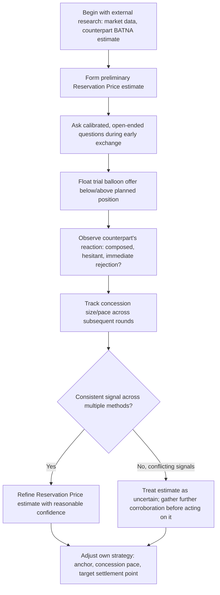

## Probing the Counterpart's Reservation Price

### Overview

Probing the Counterpart's Reservation Price addresses the specific information-gathering discipline of estimating a counterpart's undisclosed walk-away threshold during a live negotiation, using indirect questioning, behavioral observation, and inference rather than direct disclosure. Because Reservation Price is private information by default (per BATNA and Reservation Price fundamentals), and because knowledge of it is a direct source of value-claiming leverage (per Claiming Value Under Competitive Conditions), the ability to estimate a counterpart's Reservation Price accurately — without similarly revealing one's own — is a core distributive-negotiation skill.

### Why Reservation Price Is Concealed by Default

**Key Points**

- A counterpart who reveals their true Reservation Price surrenders significant bargaining leverage, since the other party can then offer only marginally better than that floor/ceiling and expect acceptance, capturing nearly the entire remaining ZOPA.
- Rational negotiators therefore have a structural incentive to conceal, understate, or misrepresent their Reservation Price, making direct questions about it ("what's the lowest you'll go?") generally ineffective as a sole information-gathering method.
- Because direct disclosure is disincentivized, probing relies on **indirect inference**: observing behavior, testing responses to hypothetical offers, and cross-referencing external information sources rather than expecting a truthful direct answer.

### Core Probing Techniques

**1. Calibrated Questions**

Open-ended, non-accusatory questions designed to elicit information indirectly rather than through a direct, easily-deflected ask. Examples include "What would make this work well for your side?" or "What constraints are you working within on this?" — questions that invite the counterpart to reveal underlying interests and constraints without directly asking for the Reservation Price itself.

**2. Trial Balloon Offers**

Floating a hypothetical or non-binding offer below the negotiator's actual planned position to observe the counterpart's reaction (immediate rejection, hesitation, counter-proposal), which provides directional information about where the counterpart's true floor or ceiling likely sits without committing to that offer.

**3. Behavioral and Reaction Observation**

Monitoring non-verbal and paralinguistic signals (pause length before responding, tone shifts, hesitation, changes in composure) when specific numbers are proposed, which can indicate proximity to a genuine constraint even when the counterpart's verbal response is composed. [Inference — the reliability of non-verbal cues as Reservation Price indicators varies significantly by individual and context, and should be treated as corroborating rather than conclusive evidence.]

**4. Concession Pattern Analysis**

As detailed in Concession Patterns and Pacing, tracking the size and trend of a counterpart's successive concessions provides an indirect estimate of proximity to their Reservation Price — a rapidly diminishing concession trend suggests the counterpart is nearing their limit, even without any explicit statement.

**5. External Research and Triangulation**

Independently researching information relevant to the counterpart's likely Reservation Price — market comparables, the counterpart's known BATNA or alternatives, industry benchmarks, public financial data, or prior negotiated agreements — to establish an estimate that does not depend solely on in-session behavioral inference.

**6. Third-Party and Network Information**

Gathering information from others who have previously negotiated with the same counterpart, industry contacts, or public reputation, to calibrate expectations about typical settlement patterns and negotiating style before or during the session — an application of the Counterpart Analysis conducted during preparation.

### Probing Technique Comparison

| Technique | Information Type Gathered | Reliability Consideration |
| --- | --- | --- |
| Calibrated questions | Interests, constraints, priorities | Moderate — depends on counterpart's openness and question framing |
| Trial balloon offers | Directional signal on floor/ceiling proximity | Moderate — reaction may be tactical rather than genuine |
| Behavioral observation | Proximity to genuine limit | Lower standalone reliability — best used as corroboration |
| Concession pattern analysis | Trend toward likely Reservation Price | Moderate-to-high, especially over multiple rounds |
| External research/triangulation | Objective, independently verifiable estimate | High, when good external data sources exist |
| Third-party/network information | Prior behavior pattern, negotiating style | Moderate — depends on comparability of prior contexts |

### Probing Process Flow

### Worked Example

A buyer is negotiating the acquisition price of a small business, with limited public information about the seller's true floor.

**External research**: The buyer identifies that comparable businesses in the sector have recently sold at 3–4x annual revenue, and learns through industry contacts that the seller has been informally exploring other potential buyers for several months, suggesting the seller's BATNA (continuing to operate, or a slower alternative sale process) may be relatively weak.

**Calibrated question**: The buyer asks, "What's driving the timeline on this for you?" The seller responds that they are hoping to close before the end of the fiscal year for personal tax planning reasons — revealing a time constraint that suggests urgency and a potentially lower effective Reservation Price than a seller without such a deadline.

**Trial balloon**: The buyer proposes an illustrative structure at 3.2x revenue "just to see how the numbers might work," below the top of the researched range. The seller's response is a counter-proposal at 3.8x rather than an outright rejection or walkout — indicating the seller's actual floor is plausibly within or near the researched 3–4x range, not dramatically above it.

**Concession tracking**: Over subsequent rounds, the seller's counter-offers move from 3.8x to 3.6x to 3.5x, a diminishing pattern suggesting a Reservation Price estimate in the 3.3–3.5x range.

**Synthesis**: Combining external research, the revealed time constraint, trial balloon response, and concession pattern, the buyer forms a reasonably confidence-weighted estimate that the seller's Reservation Price sits near 3.3x–3.4x revenue, informing the buyer's subsequent offer strategy.

### Defensive Counter-Probing: Protecting One's Own Reservation Price

**Key Points**

- **Avoid answering calibrated questions with specific numeric information**, redirecting toward interests and constraints that do not directly reveal the Reservation Price (e.g., responding to "what would make this work for you?" with priority-based rather than numeric information where appropriate).
- **Vary reaction to trial balloon offers deliberately**, avoiding a consistent, easily-readable behavioral pattern (e.g., visible relief or immediate counter-offer) that would signal proximity to a genuine limit.
- **Maintain a consistent, deliberately diminishing concession pattern regardless of actual internal proximity to the Reservation Price**, since an erratic or overly transparent concession trend is one of the most exploitable information leaks in a live negotiation (see Concession Patterns and Pacing).
- **Be aware that one's own external circumstances (public deadlines, known alternative options) may be independently researchable by the counterpart**, and consider whether such information should be actively managed or addressed proactively in the negotiation itself.

### Common Pitfalls

- **Relying on a single probing method in isolation**, particularly behavioral observation alone, which carries meaningfully lower standalone reliability than triangulated, multi-method estimation.
- **Treating a trial balloon rejection as conclusive** rather than as one data point requiring corroboration, since a rejection may reflect tactical positioning rather than a genuine limit.
- **Asking overly direct questions that trigger defensive, uninformative responses**, rather than calibrated, open-ended questions that invite genuine information disclosure.
- **Failing to update the Reservation Price estimate as new information emerges** across the negotiation, treating an early-session estimate as fixed rather than iteratively refined (consistent with the iterative principle established in Scenario Planning and Contingency Strategy).
- **Neglecting one's own defensive counter-probing posture** while focused entirely on probing the counterpart, leaving one's own Reservation Price vulnerable to the same techniques being applied in reverse. [Inference — the degree to which real-world negotiators successfully balance offensive probing with defensive information control varies substantially with experience and preparation quality.]

**Related Topics**

- BATNA and Reservation Price Estimation
- Concession Patterns and Pacing
- Stakeholder and Counterpart Analysis
- Information Asymmetry and Signaling
- Claiming Value Under Competitive Conditions
- Nonverbal Communication and Deception Detection in Negotiation