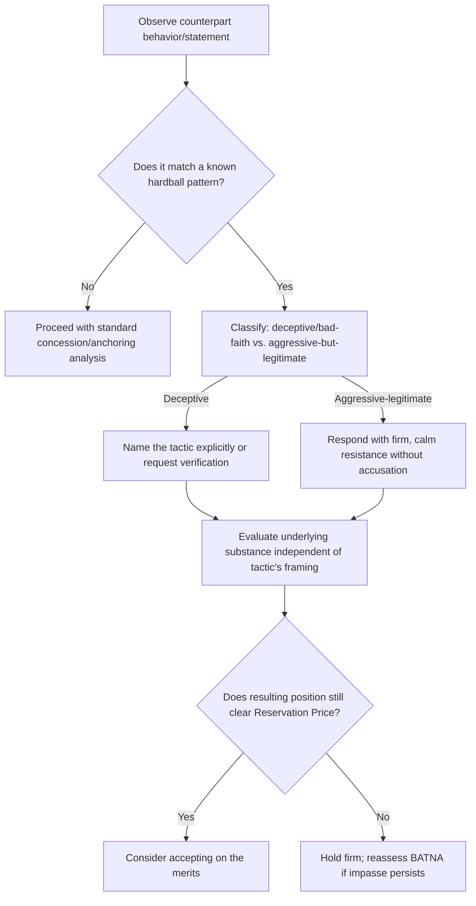

## Recognizing and Countering Hardball Tactics

### Overview

Recognizing and Countering Hardball Tactics consolidates the identification and defense side of aggressive competitive negotiation, building directly on the tactic inventory introduced in Claiming Value Under Competitive Conditions. Where that item surveyed hardball tactics as part of a broader value-claiming toolkit, this item treats tactic recognition and countermeasure selection as a standalone applied skill — since a negotiator's ability to protect their own interests depends heavily on identifying a tactic in real time and selecting an appropriate, proportionate response, rather than reacting reflexively or missing the tactic entirely.

### Why Tactic Recognition Is a Distinct Skill

**Key Points**

- Hardball tactics are generally designed to be effective specifically when the target does *not* recognize what is happening — many rely on the counterpart's natural social instincts (reciprocity norms, commitment to prior statements, discomfort with confrontation) rather than on the tactic's substantive merit.
- Naming a tactic explicitly ("this looks like a nibble") often neutralizes much of its effectiveness, since it converts an implicit social pressure into an explicit, examinable request that the target can evaluate on its merits rather than respond to automatically.
- Effective countering requires distinguishing between tactics that are genuinely deceptive or bad-faith (warranting a firmer, more explicit response) and those that are simply aggressive-but-legitimate competitive positioning (which may warrant only firm, calm resistance without requiring accusation).

### Catalog of Common Hardball Tactics

**1. Good Cop / Bad Cop**

Two negotiators on the same team alternate between aggressive and conciliatory postures, creating relative relief when the "reasonable" negotiator intervenes, which can pressure the counterpart into accepting the "reasonable" party's terms out of a desire to avoid further engagement with the aggressive one.

*Recognition signal*: A sudden shift in tone between team members addressing the same issue, especially when the "reasonable" position still favors the tactic-using side.

*Counter*: Address the tactic directly by responding to substance rather than relative tone — e.g., evaluate the "reasonable" party's offer purely on its own merits against the Reservation Price, without the artificial relief of comparison to the "bad cop" position.

**2. Highball/Lowball Offers**

An extreme, non-credible opening anchor intended to dramatically shift the counterpart's reference point (see First-Offer Strategy and Anchoring Tactics for the underlying mechanism).

*Recognition signal*: An opening offer far outside any plausible, externally justifiable range for the item or issue at hand.

*Counter*: Decline to treat the extreme anchor as a legitimate reference point for calculation; re-anchor with independently justified figures rather than incrementally adjusting from the extreme number.

**3. Nibbling**

A small additional demand introduced after apparent agreement has been reached, exploiting the counterpart's psychological commitment to closing the deal (detailed with a worked example in Claiming Value Under Competitive Conditions).

*Recognition signal*: A new request appearing after the substantive terms seem settled, often framed as minor ("just one more thing").

*Counter*: Treat the nibble as a new, separately priced item rather than an automatic addition to the already-agreed terms.

**4. Take-It-or-Leave-It (Boulwarism)**

Presenting a single, non-negotiable final offer intended to foreclose further discussion and force a binary decision.

*Recognition signal*: Explicit framing as final, often paired with urgency or an implied threat of walking away.

*Counter*: Test the credibility of the claimed finality — through a calibrated question or a modest counter-proposal — since take-it-or-leave-it framing is not always genuine; if the position proves genuinely firm and within an acceptable range relative to the Reservation Price, accepting may be rational, but capitulating to an untested claim of finality risks conceding unnecessarily.

**5. The Bogey**

Falsely claiming a particular issue is of critical importance in order to later "concede" it in exchange for a genuine concession on an issue that actually matters more to the tactic-using party.

*Recognition signal*: Disproportionate emphasis on an issue that does not align with independently gathered information about the counterpart's likely priorities (per Stakeholder and Counterpart Analysis).

*Counter*: Cross-reference the counterpart's stated priorities against external research and behavioral consistency; be cautious about "generously" conceding an issue in exchange for reciprocal movement without confirming the reciprocal issue's true value.

**6. False Deadlines**

Claiming an artificial time constraint to accelerate the counterpart's concessions under manufactured urgency.

*Recognition signal*: A deadline that lacks independent verification or corroboration, or that shifts suspiciously when tested.

*Counter*: Request specific, verifiable justification for the deadline where appropriate, and avoid making concessions driven purely by an unverified urgency claim.

**7. Emotional/Aggressive Tactics**

Displays of anger, feigned offense, or aggressive confrontation intended to pressure the counterpart into concessions to de-escalate discomfort, rather than through substantive argument.

*Recognition signal*: Emotional intensity disproportionate to the substantive stakes of the issue at hand.

*Counter*: Employ a deliberate pause or caucus (per Scenario Planning and Contingency Strategy) rather than responding reactively; avoid conceding as a means of ending discomfort rather than because the substantive case has changed.

**8. Escalating Authority Claims ("Limited Authority")**

Claiming inability to agree without further approval, used either as a genuine organizational constraint or as a tactical stalling and pressure device (see also Stakeholder and Counterpart Analysis on authority assessment).

*Recognition signal*: Repeated invocation of "checking with someone" at strategically convenient points in the negotiation.

*Counter*: Request a specific timeline for ratification and consider proposing a provisional or contingent agreement to maintain momentum rather than allowing indefinite stalling.

### Hardball Tactic Recognition and Response Flow

### General Countermeasure Principles

**Key Points**

- **Naming the tactic** converts an implicit social pressure into an explicit, examinable proposal, often reducing its effectiveness without requiring open accusation of bad faith.
- **Separating the tactic from the substance**: evaluate the actual terms being offered against the Reservation Price and interests independent of the pressure created by the tactic's framing — a good offer delivered via a hardball tactic is still a good offer, and a bad offer is still a bad offer regardless of relative relief created by a good-cop/bad-cop dynamic.
- **Testing credibility before capitulating**: many hardball tactics (false deadlines, take-it-or-leave-it framing, bogey issues) depend on the target not testing the claim; a calibrated question or modest counter-test often reveals whether the constraint is genuine.
- **Maintaining composure and refusing reciprocal escalation**: responding to emotional or aggressive tactics with matching aggression tends to escalate conflict rather than resolve it in the responding party's favor, whereas calm, substance-focused firmness denies the tactic its intended emotional leverage.
- **Preserving the relationship where it has ongoing value**: not every hardball tactic warrants a relationship-damaging confrontation; proportionality in response should reflect the negotiation's relationship stakes alongside the severity of the tactic. [Inference — the appropriate proportionality calculus is inherently context-dependent and is treated in the literature as a matter of negotiator judgment rather than a fixed rule.]

### Worked Example

A vendor negotiation encounters a combination of tactics in sequence:

1. **Opening**: The buyer opens with a price 40% below any plausible market comparable (a lowball anchor). The seller does not counter proportionally from this anchor, instead restating an independently justified market-based figure.
2. **Mid-negotiation**: The buyer's junior negotiator becomes visibly frustrated and states the seller is "not being reasonable" (an emotional tactic), while a senior colleague later intervenes with a "more reasonable" but still unfavorable figure (good cop/bad cop). The seller evaluates the senior colleague's figure purely against their Reservation Price rather than reacting to the relative relief of the tone shift, and finds it still insufficient.
3. **Near closing**: After reaching verbal agreement on a figure, the buyer adds a request for extended warranty coverage "as a formality" (a nibble). The seller responds by treating this as a new, separately priced item rather than an automatic inclusion.

By recognizing each tactic as it occurred and responding to substance rather than the social or emotional pressure each tactic was designed to create, the seller avoids conceding value at any of the three pressure points.

### Common Pitfalls

- **Failing to recognize a hardball tactic until after conceding to it**, at which point countering becomes substantially more difficult since a concession has already been made.
- **Responding to every firm or aggressive move as an accusation-worthy bad-faith tactic**, which can unnecessarily damage relationships in cases where the counterpart's firmness is legitimate rather than tactical.
- **Escalating emotional intensity in response to emotional tactics**, rather than using a deliberate pause or caucus to de-escalate and refocus on substance.
- **Accepting claimed constraints (deadlines, limited authority, critical priorities) without any verification**, when even a modest calibrated question could test their credibility at low cost.
- **Treating tactic recognition as sufficient on its own**, without following through to an actual countermeasure — identifying a nibble but still allowing it into the final agreement provides no practical protection against the tactic's effect.

**Related Topics**

- Claiming Value Under Competitive Conditions
- Concession Patterns and Pacing
- Probing the Counterpart's Reservation Price
- Ethics and Deception in Negotiation
- Emotional Regulation and Negotiator Psychology
- Stakeholder and Counterpart Analysis