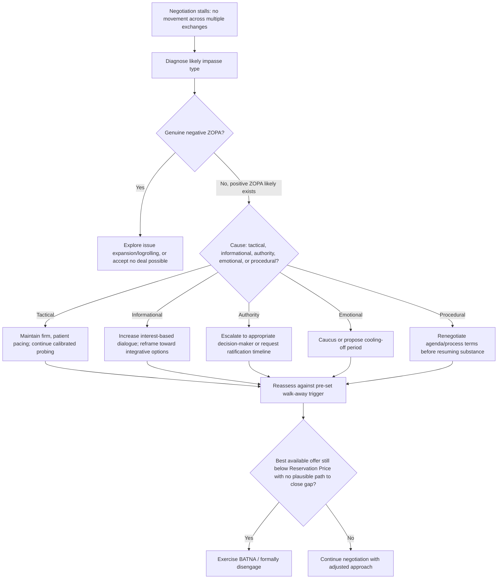

## Managing Impasse and Walk-Away Decisions

### Overview

Managing Impasse and Walk-Away Decisions addresses the point at which a negotiation stalls without agreement and the disciplined decision process for determining whether to continue, modify approach, or formally disengage in favor of one's BATNA. This item closes the Distributive Negotiation and Competitive Strategy chapter by returning to the foundational BATNA and Reservation Price concepts and applying them as live decision criteria, integrating the pre-planned protocols established in Scenario Planning and Contingency Strategy with the tactical realities of distributive bargaining, hardball tactics, and concession dynamics covered throughout the chapter.

### Defining Impasse

**Key Points**

- **Impasse** refers to a state in which the negotiation has stalled — no further movement is occurring, or the gap between parties' positions has not narrowed despite continued exchange — without either agreement or formal termination.
- Impasse is distinct from **negative ZOPA**, where no rational agreement can exist given current Reservation Prices; impasse can occur even within a positive ZOPA, due to tactical positioning, poor information, unresolved emotional dynamics, or process breakdowns rather than a genuine absence of possible agreement.
- Not all impasse is undesirable: a temporary impasse can serve a legitimate tactical function (signaling firmness, testing a counterpart's true limits, creating space for reassessment) and does not necessarily indicate negotiation failure.

### Diagnosing the Type of Impasse

Distinguishing the underlying cause of an impasse is a prerequisite for selecting an appropriate response, since different causes require different interventions.

| Impasse Type | Underlying Cause | Appropriate Response Direction |
| --- | --- | --- |
| Genuine negative ZOPA | Reservation Prices do not overlap | Explore issue expansion/logrolling, or accept no deal is possible |
| Tactical positioning | Parties strategically withholding movement to test resolve | Continue calibrated probing and firm, patient pacing |
| Information gap | Parties lack accurate understanding of counterpart's interests/constraints | Increase interest-based dialogue; consider integrative reframing |
| Authority/ratification block | Counterpart's table negotiator lacks power to agree | Escalate to appropriate decision-maker or request ratification timeline |
| Emotional/relational breakdown | Trust deficit, perceived bad faith, unresolved conflict | Caucus, cooling-off period, or third-party facilitation |
| Process/procedural disagreement | Disagreement over agenda, format, or sequencing itself | Renegotiate process terms before resuming substance |

### Impasse Diagnosis and Response Flow

### The Walk-Away Decision Rule

**Key Points**

- The core rational decision rule is straightforward in principle: walk away when the best currently available offer is worse than the value of the BATNA (i.e., worse than the Reservation Price), and no credible path to closing that gap is evident.
- In practice, this rule is complicated by **sunk cost effects** — time, effort, and relationship investment already made in the negotiation can create psychological pressure to continue past the point where continuing is rational, since disengaging can feel like "wasting" prior investment even though those costs are, by definition, unrecoverable regardless of the decision made now.
- Pre-committing to a specific walk-away trigger during preparation (per Scenario Planning and Contingency Strategy) is widely recommended precisely because in-session escalation of commitment and time pressure tend to bias real-time judgment toward continued concession rather than disciplined disengagement. [Inference — the degree to which pre-commitment successfully counteracts in-the-moment sunk cost pressure varies by individual negotiator and the specific psychological stakes involved; it is a mitigation, not a guarantee.]
- The walk-away decision should be reassessed, not treated as irreversibly fixed, if genuinely new information emerges (e.g., a previously unknown constraint on the counterpart's side, or a change in one's own BATNA) — but such reassessment should be a deliberate, conscious process rather than a gradual, unexamined drift away from the original threshold.

### Escalation of Commitment: The Central Psychological Risk

**Key Points**

- **Escalation of commitment** describes the tendency to increase investment in a chosen course of action (continuing to negotiate, making further concessions) as a way of justifying past investment, even when the additional investment is no longer rationally justified by the expected outcome.
- This bias is a well-documented phenomenon in behavioral decision research generally, and applies directly to negotiation contexts where extended time invested in a deal can create psychological resistance to walking away even after the deal has ceased to clear the Reservation Price.
- Practical countermeasures include: maintaining the pre-set Reservation Price as a fixed external reference point rather than relying on in-the-moment feeling; involving a third party (colleague, advisor) who was not present for the sunk investment to provide an outside assessment of whether continuing is still rational; and explicitly asking, at each juncture, "if I were evaluating this offer fresh, with no prior investment, would I accept it?"

### Tactical Uses of Temporary Impasse

**Key Points**

- A deliberate, controlled pause or apparent impasse can serve as a **credible commitment signal**, testing whether the counterpart's stated position has genuine additional flexibility.
- **Caucusing** — a temporary break from joint session to allow each side (or each internal faction) to reassess privately — can de-escalate emotional tension and allow reconsideration of position without the face-saving cost of appearing to concede in front of the counterpart directly.
- Strategic use of a **cooling-off period** allows both parties time to reassess without the artificial pressure of continuous, escalating in-session exchange, and can be proposed without necessarily signaling weakness if framed as a mutual process improvement rather than a unilateral retreat.
- Distinguishing a tactically useful pause from a genuine, deteriorating impasse requires ongoing diagnosis (per the impasse-type table above) rather than treating all pauses uniformly.

### Formal Disengagement: Executing the Walk-Away

**Key Points**

- When the walk-away decision is reached, communicating the decision clearly and without unnecessary hostility preserves the possibility of future re-engagement if circumstances change (a counterpart's constraints shift, new information emerges, or their BATNA weakens).
- Where appropriate, **leaving the door open explicitly** ("I don't think we can reach agreement on these terms today, but I'm open to revisiting this if circumstances change") differs materially from a hostile, final rejection, and preserves relationship value in contexts where future interaction remains possible.
- Formally exercising the BATNA (accepting the alternative course of action identified during preparation) should follow promptly once the walk-away decision is made, since delay can erode the BATNA's availability or value (e.g., a competing offer may expire, an alternative buyer may lose interest).

### Worked Example

A homebuyer has been negotiating the purchase of a house for several weeks, with an established Reservation Price of $540,000 (informed by a comparable available property as BATNA) and an Aspiration Point of $500,000.

After several rounds, the seller's offer stalls at $555,000 with no further movement across two consecutive exchanges. The buyer diagnoses this as likely **tactical positioning** rather than a genuine hard floor, given that the seller's concession pattern has been diminishing but has not yet flattened to a plausible final-limit pattern (per Concession Patterns and Pacing). The buyer maintains firm pacing and proposes a brief cooling-off period rather than immediately escalating or capitulating.

After the pause, the seller returns with a revised offer of $545,000 — still above the buyer's $540,000 Reservation Price. The buyer recognizes that continuing to invest further time in this specific negotiation, given weeks already spent, creates a sunk-cost pull toward simply accepting despite exceeding the pre-set Reservation Price. Applying the pre-committed decision rule rather than the in-the-moment pull of accumulated investment, the buyer declines, clearly states that $545,000 remains above their limit and that they are proceeding with the comparable alternative property, while noting they would remain open if the seller's position changes. The buyer formally proceeds to exercise the identified BATNA.

### Common Pitfalls

- **Allowing sunk cost and escalation of commitment to override a pre-set Reservation Price**, continuing to negotiate or eventually conceding past the rational threshold purely to avoid "wasting" prior time and effort invested in the deal.
- **Misdiagnosing tactical positioning as a genuine negative ZOPA**, prematurely walking away from a negotiation that in fact had room for further productive movement.
- **Misdiagnosing a genuine hard constraint as mere tactical positioning**, continuing to push for movement that is not actually available and risking relationship damage or wasted time.
- **Failing to reassess the walk-away trigger deliberately when genuinely new information emerges**, either rigidly ignoring relevant new information or, conversely, allowing the threshold to drift downward gradually and unconsciously under pressure.
- **Executing a hostile, relationship-damaging disengagement** when a more measured, door-left-open approach would have preserved future re-engagement value at no additional cost. [Inference — the appropriate tone and framing of disengagement depends heavily on the specific relationship stakes and likelihood of future interaction, which varies by context.]

**Related Topics**

- BATNA and Reservation Price Estimation
- Scenario Planning and Contingency Strategy
- Concession Patterns and Pacing
- Escalation of Commitment and Sunk Cost Bias
- Caucusing and Mediation Techniques
- Recognizing and Countering Hardball Tactics