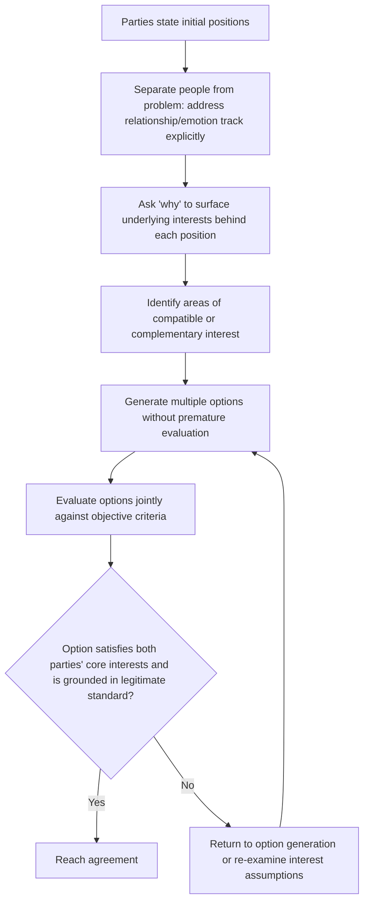

## Principled Negotiation: Interests Over Positions

### Overview

Principled Negotiation is the framework developed by Roger Fisher, William Ury, and Bruce Patton at the Harvard Negotiation Project, presented in *Getting to Yes* (1981), as an alternative to Positional Bargaining. Rather than treating negotiation as a contest between stated demands, principled negotiation reframes it as a joint problem-solving process centered on the parties' underlying interests, opening the door to the value-creating trades that Distributive Negotiation and Competitive Strategy largely treats as secondary to value-claiming. This item marks the transition point of the syllabus from distributive tactics to integrative, value-creating approaches.

### The Four Pillars of Principled Negotiation

Fisher and Ury organize the method around four core elements, each addressing a specific failure mode of positional bargaining.

**1. Separate the People from the Problem**

**Key Points**

- Negotiators are people first, with emotions, perceptions, and relationship histories that can become entangled with the substantive issues under discussion; principled negotiation recommends addressing relationship and communication dynamics explicitly and separately from the substantive terms.
- Attacking the counterpart personally or allowing personal friction to color substantive judgment tends to produce worse outcomes on both dimensions — the relationship and the deal — than treating them as distinct tracks to be managed in parallel.
- Practical techniques include active listening, acknowledging the counterpart's perspective and emotions explicitly without necessarily agreeing with their position, and framing disagreements in terms of the problem ("how do we solve this pricing gap") rather than the person ("you are being unreasonable").

**2. Focus on Interests, Not Positions**

**Key Points**

- A **position** is what a party says they want (a specific number, term, or demand); an **interest** is why they want it — the underlying need, concern, fear, or goal the position is intended to satisfy.
- Positions are often narrow and mutually exclusive (only one party's stated number can prevail), while underlying interests are frequently compatible or even complementary, and multiple different positions can often satisfy the same interest.
- Discovering interests — one's own and the counterpart's — typically requires explicitly asking "why" a position matters, rather than assuming the stated position is the only acceptable outcome.

**3. Invent Options for Mutual Gain**

**Key Points**

- Once underlying interests are understood, parties can jointly generate multiple possible solutions before evaluating or committing to any single one, rather than negotiating over a single pre-defined issue dimension.
- This stage explicitly separates **option generation** (brainstorming, expansive thinking) from **option evaluation and selection** (critical, narrowing judgment), since premature evaluation tends to suppress creative option generation.
- Effective option generation frequently benefits from identifying differences in priorities, risk tolerance, timing preferences, or forecasts between the parties, since these differences — rather than being obstacles — are frequently the raw material for mutually beneficial trades (the foundation of logrolling, covered under Agenda Design and Issue Sequencing and further developed in subsequent integrative negotiation items).

**4. Insist on Using Objective Criteria**

**Key Points**

- Rather than resolving differences through a pure contest of will (whoever concedes least or holds firmest), principled negotiation recommends grounding proposed terms in externally legitimate, objective standards — market value, precedent, expert opinion, industry norms, or replacement cost.
- Objective criteria provide a face-saving basis for movement: a party can concede toward a legitimate external standard without appearing to simply capitulate to the counterpart's pressure or will.
- Where parties disagree about which objective standard applies, the disagreement itself can often be resolved through joint reference to a mutually acceptable third-party standard or procedure, rather than reverting to a pure contest of positional firmness.

### Principled Negotiation Process Flow

### The Interests-vs-Positions Iceberg

<svg xmlns="http://www.w3.org/2000/svg" viewBox="0 0 640 380">
<text x="320" y="25" text-anchor="middle" font-size="16" font-weight="bold" fill="#1a1a1a">Positions vs. Interests (svg_diagram)</text>
<rect x="60" y="60" width="520" height="90" fill="#3498db" fill-opacity="0.2" stroke="#3498db" stroke-width="1.5" />
<text x="320" y="95" text-anchor="middle" font-size="14" font-weight="bold" fill="#1a5276">Visible: Stated Positions</text>
<text x="320" y="115" text-anchor="middle" font-size="12" fill="#1a5276">("I want \$50,000" / "I need it delivered by Friday")</text>
<text x="320" y="132" text-anchor="middle" font-size="12" fill="#1a5276">Narrow, often mutually exclusive</text>
<polygon points="60,150 580,150 500,340 140,340" fill="#95a5a6" fill-opacity="0.2" stroke="#7f8c8d" stroke-width="1.5" />
<text x="320" y="185" text-anchor="middle" font-size="14" font-weight="bold" fill="#4d5656">Hidden: Underlying Interests</text>
<text x="320" y="210" text-anchor="middle" font-size="12" fill="#4d5656">Financial security, risk aversion,</text>
<text x="320" y="228" text-anchor="middle" font-size="12" fill="#4d5656">reputation, timing pressure,</text>
<text x="320" y="246" text-anchor="middle" font-size="12" fill="#4d5656">relationship preservation,</text>
<text x="320" y="264" text-anchor="middle" font-size="12" fill="#4d5656">precedent-setting concerns</text>
<text x="320" y="290" text-anchor="middle" font-size="12" fill="#4d5656">Often compatible or complementary</text>
<text x="320" y="308" text-anchor="middle" font-size="12" fill="#4d5656">across parties, even when positions clash</text>
</svg>

### Worked Example: The Classic Orange Illustration

A frequently cited illustrative case in the principled negotiation literature involves two parties disputing a single orange, each demanding the whole fruit — a purely positional standoff that appears zero-sum on its face.

**Positional framing**: Each party's stated position is "I want the whole orange," which are mutually exclusive; a positional resolution can only split the orange in half, satisfying neither party fully.

**Interest-based inquiry**: Asking "why" reveals that one party wants the orange's juice for a recipe, while the other wants only the peel's zest for a different purpose.

**Option generation and outcome**: Once these distinct interests are surfaced, a solution exists that fully satisfies both parties simultaneously — one party receives the entire juiced fruit, the other the entire peel — an outcome not discoverable while negotiation remained confined to the positional level ("who gets the orange").

This illustrates the central premise of principled negotiation: positions that appear as a zero-sum, fixed-pie contest can conceal underlying interests that are fully compatible, and surfacing those interests can produce outcomes superior to any compromise available at the purely positional level.

### Principled Negotiation vs. Positional Bargaining

| Dimension | Positional Bargaining | Principled Negotiation |
| --- | --- | --- |
| Central question | "What number/term will each side accept?" | "What does each side actually need, and why?" |
| Relationship handling | Often entangled with substantive dispute | Explicitly separated and managed independently |
| Option development | Narrow range around stated positions | Expansive brainstorming before evaluation |
| Basis for agreement | Relative concession/firmness | Objective, externally legitimate criteria |
| Typical outcome | Compromise within perceived ZOPA | Potentially superior joint value via interest alignment |

### Practical Techniques for Interest Discovery

**Key Points**

- **Ask "why" and "why not" repeatedly**: probing beneath a stated position to understand the underlying concern, and testing whether an alternative approach could satisfy that concern equally well.
- **Consider multiple interests behind a single position**: a stated demand often reflects several underlying interests simultaneously (e.g., a price demand may reflect both a genuine cost concern and a desire to avoid appearing to have "lost" the negotiation), and addressing only one may leave the position substantively unmoved.
- **Recognize that the most powerful interests are often basic human concerns**: security, recognition, belonging, autonomy, and control frequently underlie stated positions even in seemingly purely transactional negotiations, and acknowledging these can unlock movement that purely substantive counter-arguments cannot. [Inference — the relative weight of such basic interests versus purely substantive/economic interests varies considerably by negotiation type and context, and is not uniformly dominant across all negotiations.]

### Common Pitfalls

- **Treating "interests" as synonymous with "being nice" or "conceding easily"**: principled negotiation is explicitly compatible with firm advocacy for one's own interests — Fisher and Ury describe the approach as "hard on the merits, soft on the people," not a general softening of the negotiator's substantive position.
- **Skipping directly from position statement to option evaluation**, without genuinely surfacing interests first — this collapses the method back into disguised positional bargaining even while using interest-based language superficially.
- **Assuming all positional disputes conceal fully compatible interests**, as in the orange example — some negotiations are genuinely, at least partially, distributive even after full interest discovery (e.g., both parties may have a genuine, irreducible interest in the same scarce resource), and principled negotiation does not eliminate the need for distributive skills in such residual zones.
- **Failing to separate option generation from evaluation**, allowing premature critical judgment to suppress creative, potentially superior options before they are fully articulated.
- **Applying an objective criterion selectively or inconsistently** (favoring whichever standard happens to support one's preferred outcome in the moment), which undermines the legitimacy and face-saving function that objective criteria are meant to provide.

**Related Topics**

- Positional Bargaining Fundamentals
- Interest Mapping and Prioritization Techniques
- Logrolling and Multi-Issue Trade-offs
- Objective Criteria and Legitimacy in Negotiation
- The Negotiator's Dilemma (Lax & Sebenius)
- Active Listening and Communication Techniques in Negotiation