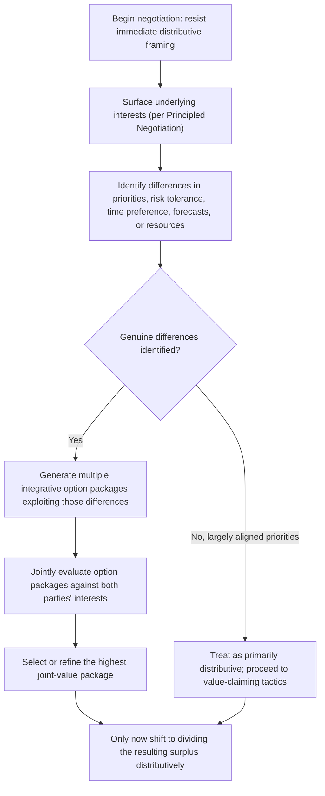

## Expanding the Pie Before Dividing It

### Overview

Expanding the Pie Before Dividing It is the core strategic sequencing principle of integrative negotiation: negotiators should first work to increase the total value available to be distributed — through joint problem-solving, information sharing, and creative option generation — before shifting into the distributive task of allocating that value between parties. This item operationalizes the "Invent Options for Mutual Gain" pillar from Principled Negotiation into a concrete sequencing discipline, and directly counters the fixed-pie assumption underlying much of the Distributive Negotiation and Competitive Strategy chapter.

### The Fixed-Pie Assumption and Its Costs

**Key Points**

- The **fixed-pie assumption** is the (often implicit and inaccurate) belief that a negotiation's total available value is a fixed quantity, such that any gain to one party necessarily comes at the other's expense — a premise that is accurate for genuinely single-issue distributive negotiations but frequently false for negotiations involving multiple issues or divergent priorities.
- Negotiation research has repeatedly documented that even experienced negotiators tend to systematically assume a fixed pie by default, failing to identify available integrative trade-offs even when they exist and could benefit both parties. [Inference — while this default bias is a well-replicated experimental finding, the degree to which it persists among highly experienced or trained negotiators, versus being substantially mitigated by expertise, varies across the literature.]
- Premature pie-dividing — moving directly into distributive bargaining over a single dimension (usually price) before exploring whether other issues could be introduced or traded — forecloses value that a more patient, exploratory approach could have captured for both sides.

### Sources of Integrative Potential

Pie expansion is possible specifically when parties differ along one or more of the following dimensions — genuine sameness of priorities and valuations leaves little room for integrative gain, making difference-identification the central diagnostic task.

**1. Differing Priorities Across Issues**

When one party values Issue A more than Issue B, and the other values Issue B more than Issue A, trading concessions across those issues (logrolling) can leave both parties better off than either could achieve through a single-issue distributive split (see Agenda Design and Issue Sequencing for how this is structured procedurally).

**2. Differing Risk Tolerance**

If one party is more risk-averse and the other more risk-tolerant regarding an uncertain future outcome, structuring the agreement around a contingent term (e.g., an earn-out, a risk-sharing clause, or a guarantee) can allocate the risk to the party better positioned to bear it, creating value neither party could capture through a simple fixed-term agreement.

**3. Differing Time Preferences**

When one party needs value sooner and the other can accept deferred value (or prefers it, for tax or cash-flow reasons), structuring payment timing, phased delivery, or deferred compensation can satisfy both parties' preferences simultaneously rather than forcing a single compromise timeline.

**4. Differing Forecasts or Beliefs**

When parties genuinely disagree about a future contingency (e.g., whether a business will hit a performance target), a contingent contract (paying more if the target is met, less if not) can allow both parties to feel they are getting a favorable deal relative to their own belief, rather than requiring one party to simply accept the other's forecast as the basis for a fixed term.

**5. Differing Resource Endowments or Cost Structures**

Where one party can provide something at low cost to itself but high value to the counterpart (e.g., an underused asset, spare capacity, or specialized expertise), trading that resource can create value exceeding what either party could realize independently.

### Pie-Expansion Diagnostic Framework

| Difference Type | Diagnostic Question | Integrative Structure |
| --- | --- | --- |
| Priorities | Does each party rank issues differently? | Logroll: trade low-cost-to-concede issues for high-value issues |
| Risk tolerance | Does one party bear risk more easily than the other? | Risk-sharing terms, guarantees, earn-outs |
| Time preference | Does one party need value sooner than the other? | Phased payments, deferred terms, installment structures |
| Forecasts/beliefs | Do parties disagree about a future contingency? | Contingent contracts tied to the disputed outcome |
| Cost/resource asymmetry | Can one party provide something cheaply that the other values highly? | Direct resource or capability trade |

### Sequencing: Expand Before You Divide

### Distinguishing "Expanding" from "Dividing" as Sequential Phases

**Key Points**

- Attempting to expand and divide the pie simultaneously tends to undermine both processes: parties who suspect that information shared for pie-expansion purposes (true priorities, constraints, forecasts) will immediately be used against them in the subsequent distributive phase have a rational incentive to withhold that information, collapsing the negotiation back toward pure positional bargaining — this is the practical, real-time expression of the Negotiator's Dilemma introduced under Claiming Value Under Competitive Conditions.
- A disciplined sequencing approach — explicitly bracketing an initial phase for joint option generation before any party commits to a distributive claim on the resulting value — can partially mitigate this dynamic, though it does not eliminate the underlying strategic tension, since a party could still behave opportunistically once genuine information has been shared.
- Practical techniques for managing this tension include: proposing multiple equally-preferred packages rather than a single option (reducing the risk that revealing a preference immediately concedes distributive ground), and using neutral third parties or structured processes to gather information without direct party-to-party exposure in adversarial or low-trust contexts.

### Worked Example: Business Sale Negotiation

A founder is negotiating the sale of their company to a strategic acquirer, and initial discussion centers entirely on a single headline purchase price — a classic fixed-pie framing.

**Interest discovery reveals differences**:

- The founder has a strong preference for near-term liquidity for personal financial planning reasons, while the acquirer prefers to preserve near-term cash for integration costs (a **time preference** difference).
- The founder is confident about the business's near-term revenue growth, while the acquirer is more skeptical of that specific forecast (a **forecast/belief** difference).
- The acquirer places high value on retaining the founder's specialized customer relationships for a transition period, while the founder places comparatively low personal cost on remaining involved part-time for that period (a **cost/resource asymmetry**).

**Resulting integrative package**: Rather than settling on a single fixed purchase price, the parties structure the deal as a lower upfront cash payment (satisfying the acquirer's near-term cash preference) combined with an **earn-out** tied to revenue performance over the following two years (satisfying the founder's confidence in the forecast, since the founder captures more value if their forecast proves correct) and a **consulting retainer** for the founder's continued involvement (satisfying the acquirer's interest in relationship continuity at a cost the founder considers low relative to its value to the acquirer).

This structure produces a total value package plausibly exceeding what either party could have achieved through a single-number price negotiation, precisely because it was built by exploiting genuine differences rather than treating the deal as a single fixed quantity to be split.

### Limits of Pie Expansion

**Key Points**

- Not all negotiations contain meaningful integrative potential: where parties' priorities, risk tolerance, time preferences, and forecasts are genuinely aligned (or the negotiation involves only a single, truly indivisible issue), the pie may be close to genuinely fixed, and distributive skill remains the primary determinant of outcome.
- Pie expansion should not be used as a rhetorical cover for avoiding legitimate distributive claims — once genuine integrative value has been created and captured through a well-structured package, the resulting surplus still must be divided, and value-claiming skill (per the Distributive Negotiation and Competitive Strategy chapter) remains relevant to that final allocation step.
- Excessive time spent searching for integrative trades that do not genuinely exist can itself be a costly and ultimately unproductive use of negotiation time and goodwill. [Inference — the appropriate amount of time to invest in pie-expansion exploration before concluding a negotiation is primarily or purely distributive is a matter of practitioner judgment rather than a fixed rule in the literature.]

### Common Pitfalls

- **Defaulting to fixed-pie framing without actively testing for genuine differences**, missing available integrative trades due to the well-documented default bias toward assuming a single-dimension, zero-sum contest.
- **Attempting to divide the pie before fully expanding it**, prematurely committing to a distributive split that forecloses subsequent logrolling or trade-off opportunities.
- **Sharing sensitive interest and priority information without any reciprocal disclosure or process safeguard**, exposing oneself to the Negotiator's Dilemma risk of a counterpart claiming disproportionate value from unilaterally revealed information.
- **Assuming integrative potential exists where it genuinely does not**, wasting negotiation time and goodwill searching for trades in a negotiation that is substantively single-issue and distributive.
- **Treating pie expansion as eliminating the need for distributive skill**, when in fact the final allocation of jointly created surplus still requires the value-claiming competencies covered in the preceding chapter.

**Related Topics**

- Principled Negotiation: Interests Over Positions
- Logrolling and Multi-Issue Trade-offs
- The Negotiator's Dilemma (Lax & Sebenius)
- Contingent Contracts and Risk-Sharing Structures
- Agenda Design and Issue Sequencing
- Claiming Value Under Competitive Conditions