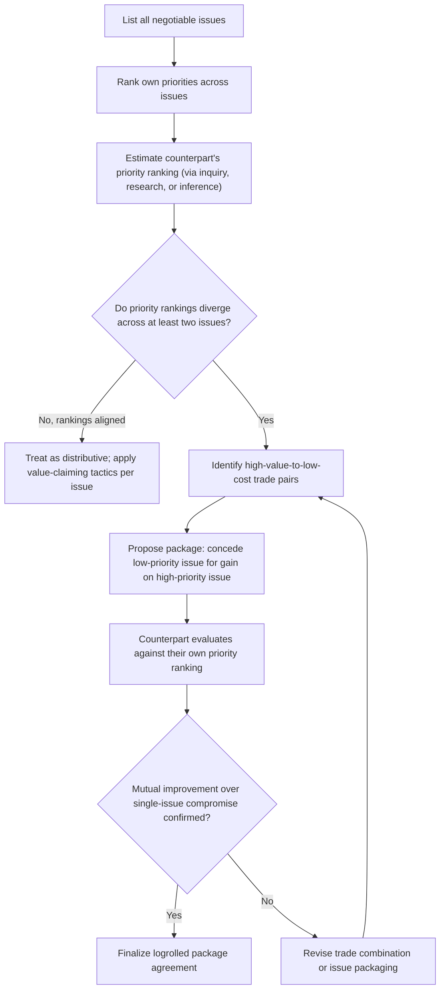

## Logrolling and Cross-Issue Trade-offs

### Overview

Logrolling is the specific integrative technique of trading concessions across two or more issues based on differing priority weightings, so that each party concedes on issues they value less in exchange for gains on issues they value more. Where Expanding the Pie Before Dividing It established the general principle that genuine differences between parties are the raw material for joint value creation, Logrolling is the concrete mechanical technique for converting priority differences specifically into executable trades, and represents the most direct practical application of that broader principle.

### Defining Logrolling

**Key Points**

- The term originates from legislative bargaining (where lawmakers historically traded votes across unrelated bills), and was adapted into negotiation theory to describe any cross-issue trade in which each party sacrifices low-priority ground in exchange for high-priority gains.
- Logrolling requires, at minimum, **two or more issues** and **differing priority rankings** between the parties across those issues — it is structurally impossible on a genuinely single-issue negotiation, and offers no benefit when both parties rank all issues identically, since there is no priority asymmetry to exploit.
- A successful logroll should leave **both** parties better off than a corresponding single-dimension compromise would have, which is the defining test distinguishing a genuine logroll from a disguised distributive trade that merely relabels a concession.

### The Mechanics of a Logroll

**Key Points**

- **Step 1 — Priority mapping**: each party (ideally through interest-based inquiry per Principled Negotiation) identifies which issues matter most and least to them, and estimates the counterpart's priority ranking as well.
- **Step 2 — Identify divergence**: a logroll opportunity exists specifically where Party A ranks Issue 1 higher than Issue 2, while Party B ranks Issue 2 higher than Issue 1 — the classic "crossed priorities" pattern.
- **Step 3 — Construct the trade**: Party A concedes on Issue 2 (low priority for A, high priority for B) in exchange for movement on Issue 1 (high priority for A, low priority for B).
- **Step 4 — Verify mutual improvement**: confirm the resulting package leaves both parties with a combination of outcomes preferable to the single-issue compromise each could have achieved independently.

### Priority Matrix and Logroll Identification

| Issue | Party A Priority | Party B Priority | Logroll Potential |
| --- | --- | --- | --- |
| Delivery timeline | High | Low | A concedes little value by pushing for fast delivery; B concedes little by accommodating it |
| Payment terms | Low | High | A can offer flexible payment terms cheaply; highly valuable to B |
| Warranty length | Medium | Medium | Limited logroll potential — priorities aligned, likely distributive |
| Exclusivity clause | High | Low | A gains significant value; low cost to B to grant |

In this illustrative matrix, delivery timeline and exclusivity are high-value trades for Party A at low cost to Party B, while payment terms represent the reverse — a textbook multi-issue logroll opportunity, whereas warranty length (aligned priorities) offers little integrative potential and likely remains a distributive sub-negotiation.

### Logroll Construction Flow

### Distinguishing Genuine Logrolling from Disguised Concessions

**Key Points**

- A genuine logroll requires that the conceding party's sacrifice be **genuinely low-cost to them** and **genuinely high-value to the counterpart** — if a party frames a costly concession as a "trade" without a correspondingly valuable gain in return, this is simply an unreciprocated concession mislabeled as integrative, not an actual logroll.
- The **bogey tactic** (covered in Claiming Value Under Competitive Conditions) exploits this distinction adversarially — falsely claiming high priority on an issue specifically in order to "generously" concede it later in exchange for a genuine concession, simulating the appearance of a logroll without the underlying genuine value asymmetry.
- Verifying that a proposed trade is a genuine logroll, rather than a disguised one-sided concession or a bogey-based manipulation, generally requires independent judgment about the plausibility of the counterpart's stated priorities — cross-referenced against external research and behavioral consistency (per Probing the Counterpart's Reservation Price and Stakeholder and Counterpart Analysis) — since the counterpart's self-reported priorities alone are not fully reliable evidence, particularly under adversarial conditions.

### Package Deals vs. Sequential Issue-by-Issue Settlement

**Key Points**

- Logrolling structurally requires **package-based negotiation** — issues must remain open and linked until a mutually acceptable combination is found — rather than sequential settlement, where each issue is resolved and closed individually before moving to the next (a sequencing choice already discussed under Agenda Design and Issue Sequencing).
- Settling issues sequentially forecloses logrolling because once an issue is closed, it is no longer available as a bargaining chip to trade against a subsequently discussed issue — this is one of the most direct practical costs of poor agenda sequencing in a multi-issue negotiation.
- Practical package construction often involves proposing multiple alternative complete packages simultaneously (rather than a single package) to reduce the risk that the counterpart anchors on individual line items rather than evaluating the trade-off holistically, and to reduce the "single-item bias" where a counterpart resists any concession-labeled item regardless of its position within a superior overall package.

### Worked Example

Two companies negotiate a joint venture agreement covering four issues: **equity split**, **board control**, **intellectual property ownership**, and **exit timeline**.

**Priority mapping:**

| Issue | Company A Priority | Company B Priority |
| --- | --- | --- |
| Equity split | Medium | Medium |
| Board control | Low | High |
| IP ownership | High | Low |
| Exit timeline | High | Low |

Company A cares most about retaining IP ownership (for use in other product lines) and having a defined exit timeline (for its own investor return planning), while placing relatively low value on board control. Company B cares most about board control (for governance and operational reasons) but places relatively low value on IP ownership and exit timeline specifics.

**Resulting logroll**: Company A concedes majority board control to Company B (low cost to A, high value to B) in exchange for retaining full IP ownership rights and securing its preferred exit timeline structure (high value to A, low cost to B). Equity split — where priorities are roughly aligned — remains a smaller, more purely distributive sub-negotiation settled on more conventional terms.

This combination leaves both companies better off than a hypothetical alternative in which each issue was negotiated and closed independently without reference to the others, since neither party would have had the same incentive or visibility to make the board-control-for-IP trade in isolation.

### Common Pitfalls

- **Attempting to logroll on genuinely aligned-priority issues**, where no real value asymmetry exists to exploit — this simply produces an ordinary distributive negotiation mislabeled as integrative.
- **Failing to verify the counterpart's stated priorities independently**, risking exploitation via the bogey tactic, where a counterpart fabricates high priority on an issue specifically to extract a disguised one-sided concession.
- **Settling issues sequentially rather than as a package**, foreclosing logroll opportunities that require multiple issues to remain simultaneously open for trade.
- **Proposing only a single package rather than multiple alternative packages**, increasing the risk that the counterpart anchors on and resists individual unfavorable-seeming line items rather than evaluating the trade holistically.
- **Confusing an unreciprocated concession with a genuine logroll**, particularly under pressure to appear cooperative — a trade is only a logroll if both sides' priority asymmetry is genuine and the resulting package leaves both parties better off than the single-issue alternative. [Inference — verifying "genuinely better off" in practice depends on accurate, and not always fully verifiable, estimates of the counterpart's true utility across issues.]

**Related Topics**

- Expanding the Pie Before Dividing It
- Agenda Design and Issue Sequencing
- Principled Negotiation: Interests Over Positions
- Claiming Value Under Competitive Conditions (Bogey Tactic)
- Multi-Issue Package Negotiation
- Stakeholder and Counterpart Analysis