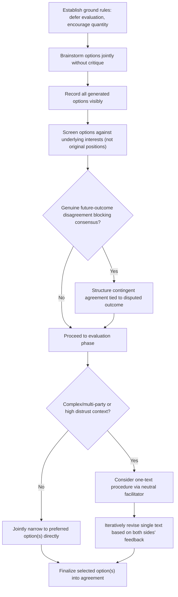

## Joint Problem-Solving Techniques

### Overview

Joint Problem-Solving Techniques comprise the specific facilitation and process methods that enable parties to move from adversarial positioning into genuine collaborative option generation. Where Logrolling and Cross-Issue Trade-offs addressed the mechanical structure of exchanging value across issues, and Principled Negotiation established the "invent options for mutual gain" principle, this item addresses the practical *how* — the concrete techniques, facilitation structures, and process disciplines that make collaborative option generation actually work in a live negotiation, rather than collapsing back into positional exchange.

### The Core Challenge: Enabling Genuine Collaboration

**Key Points**

- Parties entering a negotiation typically default to an evaluative, defensive posture — reflexively judging and critiquing proposals as they are made — which suppresses the free-ranging idea generation that joint problem-solving requires.
- Genuine collaboration requires temporarily suspending the adversarial stance without abandoning advocacy for one's own interests entirely — a balance Fisher and Ury describe as being "hard on the merits, soft on the people" (per Principled Negotiation: Interests Over Positions).
- Because parties may be wary that information shared during collaborative problem-solving will later be used against them distributively (the Negotiator's Dilemma, introduced under Claiming Value Under Competitive Conditions), joint problem-solving techniques typically incorporate explicit structural safeguards to reduce this risk and encourage genuine disclosure.

### Core Techniques

**1. Brainstorming with Separated Evaluation**

**Key Points**

- Generate the widest possible range of options before any critical evaluation begins, deferring judgments of feasibility, fairness, or acceptability to a distinct, later phase.
- Explicitly ground rules (no criticism during generation, quantity over quality initially, building on others' ideas) help counteract the natural tendency to evaluate ideas as they arise, which experimental and practitioner literature both associate with reduced option quantity and creativity when evaluation and generation are not separated. [Inference — the general finding that premature evaluation suppresses brainstorming output is well established in organizational and cognitive research broadly; its specific magnitude within negotiation contexts specifically is less precisely quantified.]
- Recording all generated options visibly (e.g., on a shared list or board) before discussing any of them individually helps enforce the separation and prevents the discussion from narrowing prematurely to the first plausible idea raised.

**2. One-Text Procedure**

**Key Points**

- A neutral party (a mediator, a jointly-trusted facilitator, or occasionally one of the negotiators acting in a facilitative capacity) drafts a single proposed agreement text based on both parties' stated interests, which is then iteratively revised based on feedback from each side — rather than each party drafting and defending competing proposals.
- This technique reduces the psychological commitment-escalation risk associated with each party defending their own drafted proposal (since neither party "owns" the single text), and was notably used in a modified form during the Camp David Accords negotiations mediated by the United States.
- Because parties respond to a single shared document rather than exchanging competing counter-proposals, the one-text procedure tends to reduce the positional anchoring dynamics that repeated proposal-counterproposal exchange can otherwise reinforce.

**3. Contingent Agreements for Unresolved Disagreements**

**Key Points**

- When parties cannot agree because they hold genuinely different beliefs about a future event or outcome (a forecast disagreement, per Expanding the Pie Before Dividing It), structuring the agreement to be contingent on that future outcome allows both parties to accept the deal without either side needing to concede their underlying belief.
- This converts an apparently intractable belief-based disagreement into a jointly acceptable structural solution, since each party can rationally accept the contingent term precisely because they each expect it to favor them if their own forecast proves correct.

**4. Interest-Based Option Screening Criteria**

**Key Points**

- Rather than evaluating generated options purely against each party's stated position, screen them against the previously identified underlying interests (per Principled Negotiation) — asking of each option, "does this address the core concern that made the original position important?"
- This screening step prevents the negotiation from defaulting back to evaluating options solely by how closely they match the original positional demand, which would effectively discard the benefit of having done interest discovery in the first place.

**5. Structured Caucusing for Joint Problem-Solving**

**Key Points**

- Periodic breaks into separate private sessions (caucusing, also referenced in Managing Impasse and Walk-Away Decisions) can allow each side to consult internally, reassess options generated jointly, and return with refined proposals without the face-saving pressure of real-time evaluation in front of the counterpart.
- In multi-party or complex negotiations, caucusing can also allow a facilitator to shuttle information and test option feasibility with each side privately before proposing it jointly (a technique closely associated with formal mediation practice).

### Joint Problem-Solving Process Flow

### Technique Selection Guide

| Technique | Best Suited For | Primary Benefit |
| --- | --- | --- |
| Brainstorming with separated evaluation | Early-stage option generation, most negotiations | Surfaces creative options suppressed by premature judgment |
| One-text procedure | High-distrust, complex, or multi-party negotiations | Reduces positional anchoring and drafting-ownership escalation |
| Contingent agreements | Genuine forecast/belief disagreements | Converts intractable belief conflict into acceptable structure |
| Interest-based screening | Any negotiation post-brainstorming | Keeps evaluation anchored to real needs, not surface positions |
| Structured caucusing | Complex, multi-party, or emotionally charged negotiations | Allows internal consultation and reduced face-saving pressure |

### Worked Example: Neighboring Business Dispute

Two adjacent small business owners are in dispute over shared parking access, with initial positions sharply opposed: one wants exclusive use of a small lot during business hours, the other insists on unrestricted shared access at all times.

**Interest discovery** (per Principled Negotiation) reveals that the first owner's core concern is guaranteed customer parking during their peak lunch rush (11am–2pm), while the second owner's core concern is having reliable access for deliveries, which occur primarily in early morning hours.

**Brainstorming with separated evaluation** generates a wide range of options without initial judgment: time-based lot division, alternating days, a shared reservation system, physical lot resizing, staggered hour arrangements, and a rotating priority schedule — recorded without immediate critique.

**Interest-based screening**: Evaluating these options against the actual underlying interests (peak-lunch guarantee vs. early-morning delivery access) rather than the original all-or-nothing positions quickly narrows the field — a time-based division allocating exclusive lunch-hour access to the first owner and exclusive early-morning access to the second directly satisfies both parties' genuine concerns, while several other generated options (e.g., lot resizing, which was costly and addressed neither core concern precisely) are set aside.

**Resulting agreement**: A time-segmented access schedule is adopted, fully satisfying both owners' actual underlying interests — an outcome the original all-or-nothing positional framing would never have surfaced, since it never distinguished the actual time-based nature of each party's real need.

### Common Pitfalls

- **Allowing evaluation to intrude during the brainstorming phase**, causing participants to self-censor and reducing the range of options actually generated before any judgment is applied.
- **Screening generated options against original stated positions rather than underlying interests**, effectively discarding the value of prior interest discovery work.
- **Using a one-text procedure without genuine facilitator neutrality**, undermining the trust the technique depends on if either party suspects the drafter favors the counterpart.
- **Treating contingent agreements as applicable to any disagreement**, when they are specifically suited to genuine forecast/belief divergence — applying them to a dispute rooted in incompatible fixed preferences (rather than differing predictions) does not resolve the underlying conflict.
- **Neglecting structural safeguards against information exploitation**, proceeding with open joint problem-solving in a low-trust context without any process protection, risking that genuinely shared interest information is later used distributively against the disclosing party. [Inference — the appropriate degree of structural safeguarding needed varies with the specific trust level and stakes of the negotiation, and is a matter of practitioner judgment rather than a fixed formula.]

**Related Topics**

- Principled Negotiation: Interests Over Positions
- Expanding the Pie Before Dividing It
- Logrolling and Cross-Issue Trade-offs
- Mediation and Third-Party Facilitation Techniques
- Contingent Contracts and Risk-Sharing Structures
- The Negotiator's Dilemma (Lax & Sebenius)