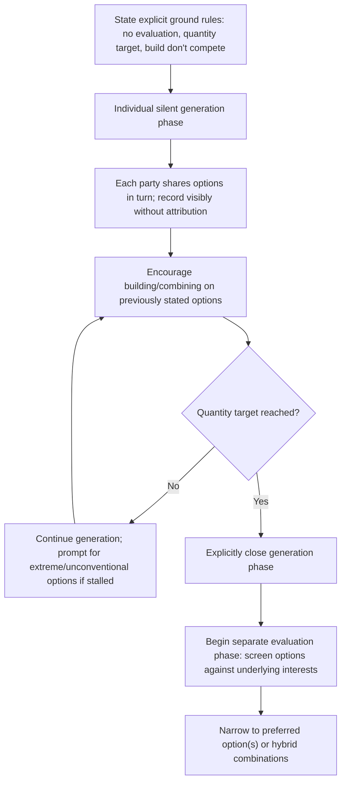

## Structured Brainstorming and Option Generation

### Overview

Structured Brainstorming and Option Generation is the disciplined, rule-governed variant of idea generation applied specifically to negotiation contexts, distinguishing itself from unstructured "brainstorming" as a loose term by specifying concrete facilitation rules, sequencing, and group techniques that reliably produce a wider and higher-quality option set than ad hoc discussion. Where Joint Problem-Solving Techniques introduced brainstorming with separated evaluation as one of several collaborative methods, this item provides the detailed mechanics of the technique itself — the specific rules, formats, and facilitation choices that determine whether structured brainstorming succeeds or merely simulates collaboration while quietly reverting to positional exchange.

### Why Structure Matters More Than Willingness

**Key Points**

- Simply agreeing to "brainstorm" without explicit rules does not reliably produce the benefits associated with the technique — unstructured group idea generation is well documented in organizational and psychological research to underperform structured approaches, often due to production blocking (only one person can voice an idea at a time), evaluation apprehension (fear of criticism suppressing idea contribution), and social loafing within groups. [Inference — this general finding on unstructured versus structured group brainstorming is well established in organizational behavior research broadly; its precise magnitude specifically within negotiation contexts (as opposed to general organizational creativity tasks) is less directly measured.]
- Negotiation-specific structured brainstorming must additionally manage a risk not present in purely internal organizational brainstorming: the participants are not on the same team, and information shared during generation could be used adversarially in a subsequent distributive phase (the Negotiator's Dilemma). Structure must therefore address both general group-creativity failures and negotiation-specific trust and disclosure risks simultaneously.

### Core Structural Rules

**1. Explicit Separation of Generation and Evaluation**

**Key Points**

- No option raised during the generation phase may be criticized, judged for feasibility, or committed to during that phase — evaluation is deferred entirely to a distinct, clearly demarcated later phase.
- This separation should be stated explicitly and enforced actively by whoever facilitates the session (which may be one of the negotiators themselves, acting temporarily in a facilitative role, or a neutral third party), since the default social tendency is to evaluate ideas as they are spoken.

**2. Quantity-Oriented Generation Target**

**Key Points**

- Setting an explicit numeric target for the number of options to generate (e.g., "let's get to at least fifteen possible approaches before we discuss any of them") counteracts the tendency to stop generating once a single plausible-seeming option appears, which tends to truncate exploration prematurely.
- Encouraging even implausible or extreme options during generation can serve as useful raw material — an unworkable option frequently contains a genuinely useful partial element that can be recombined with other ideas during a later synthesis step.

**3. Building and Combining Rather Than Competing**

**Key Points**

- Participants are encouraged to build on or modify previously stated options rather than only introducing entirely new, unrelated ones, which tends to produce hybrid options combining useful elements from multiple initial ideas.
- This "building" dynamic is more naturally achievable when both parties feel the exercise is genuinely collaborative rather than a covert extension of positional advocacy, reinforcing the importance of the trust and disclosure safeguards discussed below.

**4. Visible, Attributable-Free Recording**

**Key Points**

- Recording every generated option visibly (a shared whiteboard, document, or list) — ideally without permanently attributing each option to whichever party proposed it — reduces the risk that a later evaluation phase implicitly favors options based on which side raised them rather than on their actual merit.
- Visible recording also prevents the group from losing track of earlier options as the session progresses, which is a common failure mode of unstructured discussion where promising ideas raised early are simply forgotten by the time evaluation begins.

**5. Silent or Individual Generation Phases**

**Key Points**

- Incorporating a brief period of individual, private idea generation (each party silently listing their own options before sharing) before open group discussion can mitigate production blocking and evaluation apprehension, and has been associated in general creativity research with higher total idea output than purely verbal, real-time group brainstorming alone. [Inference — this "brainwriting" or nominal-group finding is well documented in general creativity and organizational behavior literature; direct negotiation-specific studies isolating this effect are less extensive.]

### Structured Brainstorming Facilitation Sequence

### Trust and Disclosure Safeguards for Negotiation Contexts

**Key Points**

- Because negotiation brainstorming occurs between parties with potentially divergent interests (unlike internal organizational brainstorming among aligned colleagues), structured sessions benefit from explicit safeguards: agreeing in advance that options raised during generation are non-binding and cannot be treated as an offer or concession if the negotiation does not conclude in agreement.
- Where trust is low, using a neutral facilitator to gather and anonymize option contributions (structurally similar to the one-text procedure introduced under Joint Problem-Solving Techniques) can reduce the risk that a party withholds genuinely valuable options out of fear of adversarial exploitation.
- Explicitly stating that generation-phase disclosure will not be used to identify a party's Reservation Price or priorities in a subsequent distributive phase can encourage more complete information sharing, though the credibility of such a stated commitment depends on the broader trust context and cannot be taken as self-enforcing. [Inference — the actual behavioral effect of such stated commitments on disclosure willingness likely varies by relationship history and the perceived reputational cost of violating them, rather than being a fixed, universal effect.]

### Comparison: Unstructured Discussion vs. Structured Brainstorming

| Dimension | Unstructured Discussion | Structured Brainstorming |
| --- | --- | --- |
| Evaluation timing | Immediate, interspersed with generation | Explicitly deferred to separate phase |
| Idea volume | Typically lower; stops at first plausible option | Higher, driven by explicit quantity target |
| Idea ownership | Options tied to whoever raised them | Recorded neutrally, reducing attribution bias |
| Group dynamics risk | Production blocking, evaluation apprehension | Partially mitigated via silent/individual phase |
| Negotiation-specific risk | High — disclosure feels immediately exploitable | Partially mitigated via non-binding, safeguarded framing |

### Worked Example

Two departments within the same organization are negotiating how to allocate a shared, limited software licensing budget between their respective teams, with initial positions sharply opposed (each department requesting the full budget for its own priority tool).

**Structured session**: A facilitator (a neutral internal program manager) sets an explicit rule: no evaluation during generation, target of at least twelve distinct allocation approaches, and all ideas recorded on a shared document without department attribution. Each department first privately lists potential approaches individually before sharing them aloud.

**Generation output** includes a range of options — full allocation to one side with reciprocal favor owed on other budget items, a percentage split, a phased approach with reallocation reviewed quarterly, a tiered tool selection prioritizing lower-cost licenses for broader coverage, and a hybrid combining a base allocation for each department's minimum need with a competitive process for remaining discretionary funds.

**Evaluation phase**: Screening against previously identified underlying interests (Department A's core interest is meeting an external client deadline requiring specific software capability; Department B's core interest is broad team-wide access rather than a specific tool) surfaces the hybrid tiered option as best addressing both genuine needs, an option unlikely to have surfaced or been taken seriously without the explicit generation-then-evaluation structure separating idea creation from immediate positional defense.

### Common Pitfalls

- **Announcing brainstorming rules but failing to enforce them actively**, allowing evaluative comments ("that would never work") to creep back in during generation and suppress subsequent contributions.
- **Skipping the individual/silent generation phase entirely**, defaulting to purely verbal group discussion and reintroducing the production-blocking and evaluation-apprehension effects the technique is designed to mitigate.
- **Failing to address negotiation-specific trust concerns**, treating negotiation brainstorming as identical to internal organizational brainstorming and neglecting the adversarial disclosure risk unique to multi-party negotiation contexts.
- **Attributing options to their originating party during recording**, reintroducing positional and relational bias into what should be a merit-based evaluation phase.
- **Stopping generation prematurely upon finding one workable option**, forfeiting the higher-quality, potentially superior options that a genuine quantity-oriented generation phase is more likely to surface. [Inference — the degree of quality improvement from continued generation past the first workable option is not something the literature quantifies precisely for negotiation contexts specifically; the general creativity research recommendation to avoid premature stopping is the basis for this practice.]

**Related Topics**

- Joint Problem-Solving Techniques
- Principled Negotiation: Interests Over Positions
- The Negotiator's Dilemma (Lax & Sebenius)
- Logrolling and Cross-Issue Trade-offs
- Mediation and Third-Party Facilitation Techniques
- Group Decision-Making Biases in Negotiation