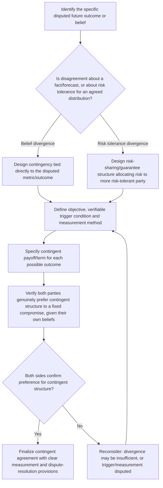

## Contingent Contracts and Future-Based Agreements

### Overview

Contingent Contracts are agreements whose terms are explicitly conditioned on a future, currently uncertain event or outcome, structured so that different parties receive different results depending on how that uncertainty resolves. Introduced briefly under both Expanding the Pie Before Dividing It (as a technique exploiting differing forecasts) and Joint Problem-Solving Techniques (as a resolution method for belief-based disagreement), this item provides the dedicated technical treatment of contingent contracts as a distinct integrative negotiation instrument — covering their structural logic, design patterns, and the specific conditions under which they create genuine value rather than merely deferring conflict.

### The Core Logic: Betting on Divergent Beliefs

**Key Points**

- A contingent contract is only value-creating when the parties hold **genuinely divergent beliefs or forecasts** about the future event in question — if both parties agree on the expected outcome, structuring a contingency achieves nothing beyond the risk-allocation function, since neither side gains an information or belief-based advantage from the structure.
- Each party can rationally accept a contingent term specifically because each expects the contingency to resolve in their own favor — this allows an agreement to be reached despite the parties never actually agreeing on the disputed fact itself.
- This mechanism converts a disagreement that would otherwise require one party to simply accept the other's forecast (a purely distributive concession of belief) into a structure both parties can accept while retaining their own belief, sidestepping an otherwise potentially intractable standoff.

### Distinguishing Contingent Contracts from Simple Risk-Sharing

**Key Points**

- Contingent contracts specifically address **belief divergence** (parties disagree about what will happen), whereas general risk-sharing terms (e.g., insurance-like provisions, guarantees) primarily address **risk tolerance divergence** (parties agree on the probability distribution of outcomes but differ in their willingness to bear that risk) — both were introduced as distinct integrative sources under Expanding the Pie Before Dividing It, and the design of the contract should reflect which underlying divergence is actually being addressed.
- In practice, real negotiations frequently involve some combination of both belief divergence and risk-tolerance divergence simultaneously, and a well-designed contingent structure may need to account for both dimensions rather than assuming a pure, single-source divergence.

### Common Contingent Contract Structures

**1. Earn-Outs**

A portion of a transaction's total value (typically in an acquisition or business sale context) is paid contingent on the acquired business achieving specified future performance targets (revenue, profit, user growth) over a defined post-closing period.

*Applicable divergence*: Seller typically more optimistic about future performance than buyer; earn-out allows seller to capture more value if their more optimistic forecast proves correct, while limiting buyer's downside if it does not.

**2. Performance-Based Compensation and Bonuses**

Compensation structured with a variable, outcome-contingent component (commission, bonus tied to milestones) rather than a single fixed figure, allowing an employee confident in their own future performance to accept variable compensation they expect to exceed a fixed alternative, while an employer uncertain about that performance is protected from overpaying for underperformance.

**3. Most-Favored-Nation and True-Up Clauses**

Terms guaranteeing that if a party later obtains more favorable terms elsewhere (a more favorable price from another customer, for instance), the current counterpart's terms will be adjusted to match, addressing uncertainty about future market conditions without requiring either party to commit to a single, fixed prediction of those conditions today.

**4. Conditional Approval or Regulatory Contingencies**

Agreement terms that take effect only upon a specified future condition being met (regulatory approval, financing being secured, a third-party consent being obtained), allowing parties to proceed with a deal despite genuine uncertainty about whether a necessary precondition will ultimately be satisfied.

**5. Escrow and Milestone-Based Release**

Value is held by a neutral third party and released incrementally as specified future milestones are verified, addressing situations where one party is confident in future performance but the counterpart reasonably wants verification before releasing full value.

### Contingent Contract Design Framework

### Design Requirements for a Well-Constructed Contingent Contract

**Key Points**

- **Objective, verifiable trigger conditions**: the contingency must be tied to a metric or event that can be measured and verified without ongoing dispute, since a vaguely defined trigger simply relocates the negotiation's conflict to a future measurement dispute rather than resolving it.
- **Clear measurement methodology and timing**: specifying precisely how, when, and by whom the triggering condition will be assessed (e.g., audited financial statements, a specified third-party verifier, a defined measurement window) reduces the risk of later disagreement about whether the contingency was actually met.
- **Dispute-resolution provisions for the contingency itself**: because contingent contracts introduce a new potential source of future conflict (disagreement over whether the trigger was met), well-designed agreements typically specify a mechanism (arbitration, expert determination, escrow-based verification) for resolving such disputes without requiring a full renegotiation.
- **Downside protection where appropriate**: particularly in earn-out and performance-based structures, provisions addressing scenarios where one party's post-agreement actions could influence whether the contingency is met (e.g., a buyer deliberately underinvesting in a business subject to an earn-out) help prevent the contingent structure from creating perverse incentives.

### Worked Example: Startup Acquisition Earn-Out

A larger company is acquiring a startup, and the two sides hold genuinely divergent beliefs about the startup's near-term revenue trajectory: the founders are confident in continued rapid growth based on a recent product launch, while the acquirer is more skeptical, viewing the recent growth as potentially unsustainable.

**Fixed-price alternative**: A single, fixed purchase price would require one side to essentially accept the other's forecast — either the founders accept a lower price reflecting the acquirer's skepticism, or the acquirer accepts a higher price reflecting the founders' optimism, with one side likely feeling they got a worse deal than their true belief justified.

**Contingent structure**: The parties instead agree to a lower upfront payment combined with an earn-out that pays additional consideration if the startup's revenue exceeds specified thresholds over the following 18 months, measured via agreed accounting methodology and verified by an independent auditor, with a defined dispute-resolution process specified for any measurement disagreement.

**Outcome logic**: The founders accept a lower guaranteed upfront amount because they are confident the earn-out thresholds will be met, expecting to capture the additional earn-out value; the acquirer accepts the deal because their downside is limited if the founders' optimistic forecast does not materialize. Both parties can rationally accept the same contract despite never actually agreeing on the underlying revenue forecast — each believes the structure favors them given their own genuinely held belief.

### Limits and Risks of Contingent Contracts

**Key Points**

- **Measurement disputes can recreate the original conflict**: if the trigger condition is not suffiently objective or well-specified, the parties may simply relitigate their original disagreement at the measurement stage instead of at signing, undermining the structure's intended benefit.
- **Moral hazard and incentive distortion**: a party whose actions can influence whether the contingency is met (e.g., an acquirer controlling post-acquisition investment decisions that affect an earn-out's revenue target) may have an incentive to act in ways that affect the measured outcome, a risk requiring explicit contractual safeguards rather than being resolved automatically by the contingent structure itself.
- **Not a universal solution to belief divergence**: contingent contracts are best suited to disagreements about objectively verifiable future events; they are poorly suited to disputes rooted in subjective value judgments or preferences that cannot be resolved by any future factual outcome (e.g., a dispute over which of two designs is more aesthetically appropriate is not amenable to a contingent contract structure). [Inference — the boundary between "objectively verifiable" and "subjective" future outcomes is not always sharp in practice, and some real-world contingent structures attempt to operationalize partially subjective outcomes through proxy metrics, with mixed reliability.]

### Common Pitfalls

- **Specifying a vague or easily disputed trigger condition**, effectively deferring rather than resolving the underlying conflict to a future measurement dispute.
- **Failing to address moral hazard where one party can influence the contingent outcome**, creating perverse incentives that a plain contingent structure does not automatically prevent.
- **Applying a contingent structure to a risk-tolerance divergence rather than a genuine belief divergence** (or vice versa), designing a contract that does not actually address the true underlying source of disagreement.
- **Omitting a dispute-resolution mechanism for the contingency itself**, leaving the parties without a defined process if disagreement arises later about whether the trigger condition was met.
- **Assuming contingent contracts can resolve any disagreement**, when they are specifically suited to objectively verifiable future events and are poorly matched to disputes rooted in subjective preference or values rather than factual uncertainty.

**Related Topics**

- Expanding the Pie Before Dividing It
- Joint Problem-Solving Techniques
- Logrolling and Cross-Issue Trade-offs
- Risk Allocation and Guarantee Structures
- Mediation and Third-Party Verification Mechanisms
- The Negotiator's Dilemma (Lax & Sebenius)