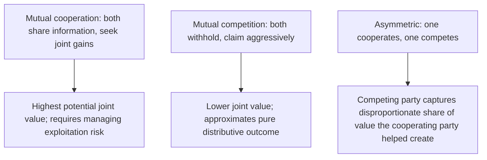

## Balancing Value Creation With Value Claiming

### Overview

Balancing Value Creation With Value Claiming is the synthesis item that closes the Integrative Negotiation and Value Creation chapter by directly confronting the tension the chapter has referenced throughout but not yet resolved as its own subject: the Negotiator's Dilemma. Every technique covered in this chapter — Principled Negotiation, pie expansion, logrolling, joint problem-solving, structured brainstorming, and contingent contracts — depends on genuine information disclosure and collaborative behavior, yet that same disclosure creates exploitable vulnerability in the presence of a competitive counterpart. This item provides the integrated decision framework for managing that tension deliberately, rather than defaulting unreflectively to either pure cooperation or pure competition.

### Restating the Negotiator's Dilemma

**Key Points**

- First introduced under Claiming Value Under Competitive Conditions, the Negotiator's Dilemma (Lax and Sebenius) describes the structural conflict between value-creating moves (sharing information, generating joint options, exploring interests) and value-claiming moves (withholding information, anchoring aggressively, extracting maximum individual share).
- The dilemma is not resolved by simply choosing one mode and applying it uniformly: pure cooperation risks exploitation by a competitive counterpart who accepts the value created but claims a disproportionate share of it, while pure competition forecloses the joint value that genuinely differing priorities, risk tolerances, and forecasts make available (per Expanding the Pie Before Dividing It).
- Every technique in this chapter carries this same exposure — a joint brainstorming session (per Joint Problem-Solving Techniques) reveals interests that could be exploited distributively; a proposed logroll (per Logrolling and Cross-Issue Trade-offs) reveals priority information that a competitive counterpart could use to extract additional concessions rather than reciprocate fairly.

### The Core Payoff Structure, Revisited

The four-quadrant structure introduced under Claiming Value Under Competitive Conditions provides the underlying logic this item now operationalizes into a practical decision process:

### Diagnostic Signals for Calibrating Posture

Rather than committing to a fixed cooperative or competitive stance before the negotiation begins, an integrated approach continuously reassesses posture based on observable signals.

**Key Points**

- **Reciprocity of disclosure**: if a party shares interest and priority information and the counterpart responds with genuine reciprocal disclosure (per the calibrated-question techniques from Probing the Counterpart's Reservation Price), this supports continued cooperative investment; if disclosure is met with silence or apparent exploitation, this signals a need to recalibrate toward more guarded behavior.
- **Consistency between stated interests and behavior**: a counterpart whose proposed options and concession patterns (per Concession Patterns and Pacing) align with their stated interests is providing behavioral corroboration of good-faith engagement; significant inconsistency is a warning signal warranting increased caution.
- **Presence of verifiable objective criteria**: negotiations grounded in externally verifiable standards (per Principled Negotiation's fourth pillar) provide a natural check against purely exploitative claims, since proposed terms can be evaluated against legitimate external benchmarks rather than relying solely on trust.
- **Relationship value and repeat-game context**: negotiations with high ongoing relationship value or repeated future interaction create natural incentives against exploitative behavior (reputational cost), supporting a more cooperative default posture than a genuinely one-shot, anonymous transaction would warrant.

### An Incremental, Reciprocal Disclosure Strategy

**Key Points**

- Rather than fully disclosing all interests and priorities unconditionally at the outset (high exploitation risk) or withholding all information throughout (foreclosing integrative value), a widely recommended practical approach is **incremental, reciprocal disclosure**: share a modest amount of interest information, observe whether the counterpart reciprocates genuinely, and calibrate further disclosure based on that observed response.
- This approach resembles a **tit-for-tat** dynamic familiar from game-theoretic analysis of repeated cooperation dilemmas — beginning cooperatively, then mirroring the counterpart's demonstrated level of cooperation or competition in subsequent exchanges, adjusting the pace and depth of joint problem-solving investment accordingly.
- Structural safeguards discussed under Joint Problem-Solving Techniques and Structured Brainstorming (non-binding generation-phase framing, neutral facilitation, one-text procedures) function precisely as risk-reducing mechanisms that allow greater disclosure with lower associated exploitation risk, making cooperative investment more viable even in moderate-trust contexts.

### Sequencing the Balance: Phase-Based Posture

**Key Points**

- A practical resolution many negotiation practitioners adopt is **phase separation**: dedicate an explicit early phase primarily to value-creating activity (interest discovery, joint option generation, pie expansion) before transitioning to a later phase focused on value-claiming (dividing the resulting surplus) — the same sequencing logic introduced under Expanding the Pie Before Dividing It, now framed explicitly as the dilemma's practical resolution mechanism.
- Within the value-claiming phase, the tactics covered in the Distributive Negotiation and Competitive Strategy chapter (anchoring, concession pacing, hardball tactic recognition) remain fully applicable — phase separation does not eliminate the need for distributive skill in dividing jointly created value, it only sequences when that skill is primarily deployed.
- This phase-based approach is not a perfect solution: a sophisticated counterpart may attempt to extend the "value-creating" phase indefinitely while extracting information, or may transition to aggressive claiming abruptly once sufficient information has been gathered — underscoring why the diagnostic signals above must be monitored continuously rather than assumed to hold automatically once a cooperative phase has been declared. [Inference — the actual prevalence and effectiveness of such extended-extraction tactics in real-world negotiation is not something the literature quantifies with precision, and remains a matter of practitioner caution rather than a formally established risk rate.]

### Posture Calibration Framework

| Signal Observed | Interpretation | Recommended Posture Adjustment |
| --- | --- | --- |
| Genuine reciprocal disclosure | Good-faith cooperative engagement likely | Continue/increase cooperative investment |
| Silence or non-reciprocation after disclosure | Possible exploitation risk | Reduce further unilateral disclosure; increase verification |
| Behavior consistent with stated interests | Corroborated good faith | Maintain cooperative posture |
| Behavior inconsistent with stated interests | Possible bad-faith signaling (e.g., bogey tactic) | Increase skepticism; cross-verify via external research |
| Strong relationship/repeat-game context | Natural incentive against exploitation | Support more cooperative default posture |
| Low-trust, one-shot, high-stakes context | Limited natural check against exploitation | Favor structural safeguards (neutral facilitation, phased disclosure) |

### Worked Example

Two companies begin a complex joint venture negotiation. In the first working session, Company A shares detailed information about its production cost structure and timeline flexibility, hoping to establish a foundation for the kind of integrative trade-offs described in Logrolling and Cross-Issue Trade-offs.

**Observed signal**: Company B responds not with reciprocal disclosure of its own priorities, but instead uses the disclosed cost information to immediately propose a price point near Company A's revealed cost floor — a response pattern consistent with exploitative use of unilaterally disclosed information rather than genuine reciprocal engagement.

**Recalibration**: Recognizing this signal, Company A shifts its posture for subsequent sessions — declining to disclose further detailed cost information unilaterally, instead proposing a neutral-facilitator-mediated joint option generation process (per Joint Problem-Solving Techniques) that allows exploration of integrative trades without direct, unprotected disclosure to Company B. Company A also begins independently verifying Company B's stated priorities against external research (per Probing the Counterpart's Reservation Price) rather than accepting them unconditionally.

**Contrast scenario**: Had Company B instead responded to the initial disclosure with genuine reciprocal information about its own cost and timeline priorities, revealing a genuine logroll opportunity, Company A's calibration would have supported continued and expanded cooperative disclosure, consistent with the tit-for-tat dynamic described above.

### Common Pitfalls

- **Adopting a single fixed posture (purely cooperative or purely competitive) for the entire negotiation**, rather than continuously recalibrating based on observed reciprocity and behavioral signals.
- **Disclosing all interest and priority information unconditionally at the outset**, without incremental testing of the counterpart's reciprocal engagement, creating unnecessary exploitation exposure.
- **Withholding all information indefinitely out of excessive caution**, foreclosing genuine integrative value that could have been captured through calibrated, incremental disclosure.
- **Failing to use available structural safeguards** (neutral facilitation, non-binding brainstorming framing, phased sequencing) that could enable greater value-creating investment at reduced risk.
- **Assuming a declared "cooperative phase" is self-enforcing**, without continuing to monitor for signals that a counterpart is extracting information while privately intending to shift into aggressive value-claiming once sufficient information has been gathered.

**Related Topics**

- The Negotiator's Dilemma (Lax & Sebenius)
- Claiming Value Under Competitive Conditions
- Expanding the Pie Before Dividing It
- Joint Problem-Solving Techniques
- Probing the Counterpart's Reservation Price
- Reciprocity Norms and Tit-for-Tat Strategies in Repeated Games