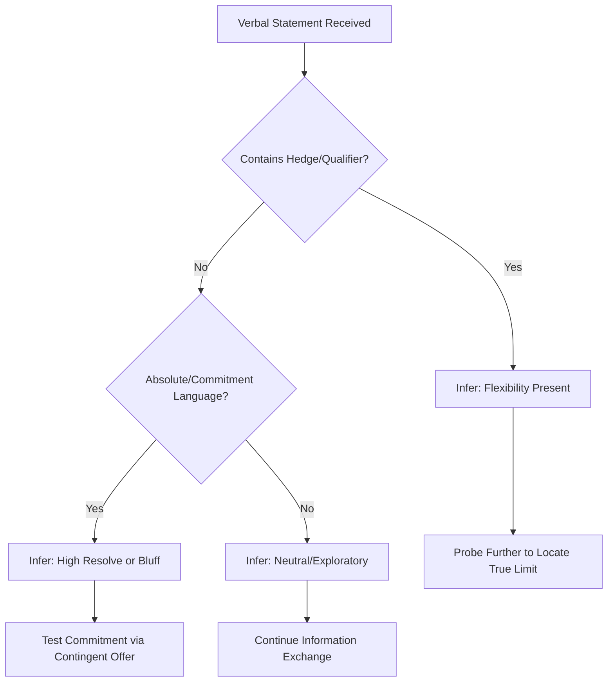

## Verbal and Nonverbal Signals in Negotiation

### Overview

Verbal and nonverbal signals constitute the observable channel through which negotiators convey intentions, assess counterpart positions, and manage the interpersonal dynamics of a negotiation. This domain sits at the intersection of communication theory, behavioral psychology, and negotiation strategy: negotiators rarely have direct access to a counterpart's true reservation price, priorities, or willingness to concede, so they rely on inference from language patterns, vocal cues, and body language to update their beliefs about the other party's position. Mastery of this domain has two symmetrical components: **signal reading** (interpreting a counterpart's cues) and **signal management** (controlling one's own emissions to avoid unintended disclosure or to strategically project a desired image).

### Theoretical Foundations

**Communication-as-Information Model**

Negotiation can be modeled as a game of incomplete information (per Harsanyi's framework), where each party holds private information about their reservation value, alternatives (BATNA), and priorities. Verbal and nonverbal signals function as imperfect, noisy channels that leak this private information. Because leakage is costly to the discloser but valuable to the counterpart, signals are frequently strategic rather than transparent — this is the basis of "cheap talk" theory in game theory, where signals are only credible when they are costly to fake or verifiable.

**Nonverbal Communication Channels (Mehrabian's Framework)**

Albert Mehrabian's often-cited (and frequently overapplied) research on communication of feelings and attitudes proposed a breakdown of message components in narrow emotional-inconsistency contexts. [Unverified — this ratio is frequently misapplied outside its original narrow experimental scope of communicating feelings/attitudes, and should not be read as a universal law of all communication] The commonly cited proportions are:

- Verbal content (words): ~7%
- Vocal tone/paralanguage: ~38%
- Body language/facial expression: ~55%

While the specific percentages are contested and domain-limited, the underlying principle — that tone and body language carry substantial affective information beyond literal words — is broadly supported in negotiation communication literature.

**Leakage Theory**

Nonverbal cues are considered harder to consciously control than verbal statements, particularly under cognitive load or emotional arousal (a core premise in deception research, e.g., Ekman's work on micro-expressions). In negotiation, this implies that nonverbal "leakage" — involuntary cues — can be more diagnostic of true internal states (stress, deception, discomfort with an offer) than the explicit verbal claims accompanying them.

### Verbal Signals

**Categories of Verbal Signals**

| Signal Type | Function | Example |
| --- | --- | --- |
| Anchors | Establish reference point | "Our budget is capped at $50,000" |
| Hedges/Qualifiers | Signal flexibility or uncertainty | "That's *roughly* our target," "We're *generally* firm on..." |
| Commitment Language | Signal resolve | "This is our final offer," "We cannot move on this" |
| Trial Balloons | Test reactions without commitment | "What if we were to consider X?" |
| Reframing Statements | Shift the interpretive frame | "This isn't about price, it's about long-term value" |
| Silence/Pauses | Create pressure, invite concession | Deliberate pause after an offer |
| Questions | Extract information, signal interest | "Help me understand how you arrived at that figure" |

**Key Linguistic Markers**

- **Hedged language** ("maybe," "possibly," "I think," "around") often signals a negotiator has room to move — an unhedged, absolute statement ("Our price is $500, period") signals higher resolve or a harder constraint.
- **Conditional framing** ("If you could do X, we might be able to do Y") signals contingent flexibility and functions as an implicit offer of exchange (a hallmark of integrative/principled negotiation per Fisher & Ury's *Getting to Yes*).
- **First-offer language** — research by Galinsky and Mussweiler (2001) on anchoring in negotiations found that the party who makes the first offer typically shifts the final settlement point toward that anchor, making the linguistic framing of an opening offer strategically significant.
- **Pronoun usage**: shifts from "I" to "we" language can signal movement from individual to collective/relational framing, a marker studied in linguistic accommodation research.

**Verbal Tactics and Their Signal Value**

**Example**

Counterpart states: "Honestly, $120,000 is close to what we need, but there might be some room depending on the terms."

- **Analysis**: "close to" and "might be some room" are hedges signaling the stated figure is not a hard anchor. "Depending on the terms" signals openness to multi-issue trade-offs rather than a single-issue price negotiation.
- **Response strategy**: Probe the "terms" dimension explicitly (e.g., payment schedule, warranty, delivery timeline) to identify concession opportunities that don't require moving on headline price — an application of logrolling within integrative bargaining.

### Nonverbal Signals

**Major Nonverbal Channels**

1. **Kinesics (body movement and posture)**
   - Open posture (uncrossed arms, forward lean) is commonly associated with engagement and receptivity.
   - Closed posture (crossed arms, leaning back, angled body) is commonly associated with defensiveness or disagreement.
   - Mirroring/mimicry of a counterpart's posture is linked in social psychology (e.g., the "chameleon effect," Chartrand & Bargh, 1999) to rapport-building and can be used deliberately as a rapport tactic.
2. **Oculesics (eye behavior)**
   - Sustained eye contact is often associated with confidence or assertion in many Western business contexts. [Inference — norms vary significantly across cultures; sustained eye contact can signal aggression or disrespect in other cultural contexts]
   - Gaze aversion during a specific claim (e.g., stating a cost figure) is sometimes interpreted as a deception cue, though this association is empirically weaker and more context-dependent than popular belief suggests. [Unverified as a reliable individual-level deception indicator — deception research shows gaze behavior is a poor standalone lie-detection cue]
3. **Paralanguage (vocal cues independent of words)**
   - Pitch elevation, speech rate increase, and vocal tremor are commonly associated with stress or arousal.
   - Pause duration before responding to an offer can signal deliberation, discomfort, or (strategically) manufactured hesitation to imply reluctance.
   - Tone flattening or monotone delivery on a stated position can signal rehearsed or scripted content, which itself may be a tell for a fixed corporate policy rather than a personally negotiable stance.
4. **Facial Expressions / Micro-expressions**
   - Ekman's Facial Action Coding System (FACS) identifies brief (typically <0.5 second), often involuntary facial movements that can leak an emotion inconsistent with the verbal message (e.g., a flash of a contempt or surprise expression immediately following an offer).
   - Reliable detection of micro-expressions in real time requires substantial training; anecdotal "read the room" claims by untrained negotiators have low empirical reliability. [Unverified for untrained observers — professional-level micro-expression reading typically requires structured training and is not a skill reliably acquired informally]
5. **Proxemics (use of space)**
   - Distance maintained across a negotiating table, seating arrangement choice (adversarial face-to-face vs. side-by-side collaborative seating), and object placement (e.g., pushing a document across the table) all carry signal value about the relational frame being invoked.
6. **Haptics and Physical Contact**
   - Handshake firmness/duration and other culturally-sanctioned touch at negotiation openings/closings are commonly studied as trust and rapport signals, though norms are highly culture- and context-dependent.

**Nonverbal Signal Map (svg_diagram)**

<svg xmlns="http://www.w3.org/2000/svg" viewBox="0 0 760 460">
<text x="380" y="30" font-family="Arial, sans-serif" font-size="18" font-weight="bold" text-anchor="middle" fill="#1a1a2e">Nonverbal Signal Channels in Negotiation (svg_diagram)</text>
<circle cx="380" cy="240" r="70" fill="#4a5b8c" opacity="0.9" />
<text x="380" y="235" font-family="Arial, sans-serif" font-size="14" font-weight="bold" text-anchor="middle" fill="#ffffff">Negotiator</text>
<text x="380" y="252" font-family="Arial, sans-serif" font-size="14" font-weight="bold" text-anchor="middle" fill="#ffffff">State</text>

<line x1="380" y1="170" x2="380" y2="90" stroke="#555555" stroke-width="2" />
<rect x="290" y="40" width="180" height="50" rx="8" fill="#8c4a4a" />
<text x="380" y="60" font-family="Arial, sans-serif" font-size="13" font-weight="bold" text-anchor="middle" fill="#ffffff">Kinesics</text>
<text x="380" y="78" font-family="Arial, sans-serif" font-size="11" text-anchor="middle" fill="#ffffff">Posture, gestures</text>

<line x1="440" y1="195" x2="580" y2="120" stroke="#555555" stroke-width="2" />
<rect x="580" y="90" width="160" height="50" rx="8" fill="#4a8c6b" />
<text x="660" y="110" font-family="Arial, sans-serif" font-size="13" font-weight="bold" text-anchor="middle" fill="#ffffff">Oculesics</text>
<text x="660" y="128" font-family="Arial, sans-serif" font-size="11" text-anchor="middle" fill="#ffffff">Eye contact, gaze</text>

<line x1="450" y1="240" x2="590" y2="240" stroke="#555555" stroke-width="2" />
<rect x="590" y="215" width="160" height="50" rx="8" fill="#8c7a4a" />
<text x="670" y="235" font-family="Arial, sans-serif" font-size="13" font-weight="bold" text-anchor="middle" fill="#ffffff">Paralanguage</text>
<text x="670" y="253" font-family="Arial, sans-serif" font-size="11" text-anchor="middle" fill="#ffffff">Tone, pace, pitch</text>

<line x1="440" y1="285" x2="580" y2="355" stroke="#555555" stroke-width="2" />
<rect x="580" y="330" width="170" height="50" rx="8" fill="#6b4a8c" />
<text x="665" y="350" font-family="Arial, sans-serif" font-size="13" font-weight="bold" text-anchor="middle" fill="#ffffff">Facial Expression</text>
<text x="665" y="368" font-family="Arial, sans-serif" font-size="11" text-anchor="middle" fill="#ffffff">Micro-expressions</text>

<line x1="320" y1="285" x2="180" y2="355" stroke="#555555" stroke-width="2" />
<rect x="20" y="330" width="170" height="50" rx="8" fill="#4a6b8c" />
<text x="105" y="350" font-family="Arial, sans-serif" font-size="13" font-weight="bold" text-anchor="middle" fill="#ffffff">Proxemics</text>
<text x="105" y="368" font-family="Arial, sans-serif" font-size="11" text-anchor="middle" fill="#ffffff">Space, seating</text>

<line x1="320" y1="240" x2="180" y2="240" stroke="#555555" stroke-width="2" />
<rect x="10" y="215" width="160" height="50" rx="8" fill="#8c4a7a" />
<text x="90" y="235" font-family="Arial, sans-serif" font-size="13" font-weight="bold" text-anchor="middle" fill="#ffffff">Haptics</text>
<text x="90" y="253" font-family="Arial, sans-serif" font-size="11" text-anchor="middle" fill="#ffffff">Touch, handshake</text>

<line x1="320" y1="195" x2="180" y2="120" stroke="#555555" stroke-width="2" />
<rect x="20" y="90" width="170" height="50" rx="8" fill="#4a8c8c" />
<text x="105" y="110" font-family="Arial, sans-serif" font-size="13" font-weight="bold" text-anchor="middle" fill="#ffffff">Silence/Pauses</text>
<text x="105" y="128" font-family="Arial, sans-serif" font-size="11" text-anchor="middle" fill="#ffffff">Timing, latency</text>

<text x="380" y="430" font-family="Arial, sans-serif" font-size="11" font-style="italic" text-anchor="middle" fill="`#555555`">Each channel independently modulated; congruence across channels increases signal reliability</text>

</svg>

### Congruence and Incongruence Analysis

A central analytical technique is assessing **congruence** between verbal claims and nonverbal channels:

- **Congruent signal**: Verbal statement ("We're comfortable with this arrangement") accompanied by open posture, steady tone, and relaxed facial affect → higher confidence the stated position reflects genuine internal state.
- **Incongruent signal**: Same verbal statement accompanied by crossed arms, gaze aversion, and elevated pitch → flags a discrepancy worth probing, but does **not** by itself confirm deception. [Inference — incongruence indicates internal conflict, discomfort, or arousal, which has multiple possible causes (deception, stress, cultural display norms, unrelated anxiety) and should be treated as a prompt for further inquiry rather than a definitive tell]

**Practical diagnostic heuristic**: treat single-channel cues as weak, probabilistic evidence; treat multi-channel, temporally-clustered incongruence (e.g., voice pitch shift + gaze break + posture shift occurring together immediately after a specific question) as stronger — though still not conclusive — evidence warranting a follow-up probe rather than an accusation.

### Cultural Variation

Nonverbal signal interpretation is not universal. Key dimensions of variation relevant to negotiation, drawn from cross-cultural communication research (e.g., Hall's high-context/low-context framework):

- **High-context cultures** (e.g., many East Asian, Middle Eastern contexts) tend to rely more heavily on nonverbal and contextual cues, with indirect verbal communication; silence may signal thoughtful consideration rather than disagreement or discomfort.
- **Low-context cultures** (e.g., many North American, Northern European contexts) tend toward explicit verbal statement of positions, with silence sometimes interpreted as awkwardness or an impasse signal.
- Eye contact, physical distance, acceptable touch, and emotional expressiveness norms vary substantially by culture; a signal reliably indicating discomfort in one cultural context may be entirely neutral in another.
- **Practical implication**: negotiators operating cross-culturally should calibrate signal interpretation against the counterpart's cultural baseline rather than a single universal rubric, and should be cautious about exporting home-culture nonverbal heuristics into unfamiliar contexts.

### Signal Management (Self-Presentation Strategy)

Beyond reading counterparts, negotiators must manage their own verbal/nonverbal output:

**Key Points**

- **Consistency discipline**: Aligning verbal claims with controlled nonverbal delivery (steady tone, neutral/confident posture) reduces unintended leakage of true reservation values.
- **Strategic ambiguity**: Deliberate use of hedged verbal language to preserve flexibility while nonverbal delivery remains confident, avoiding the appearance of weakness.
- **Emotional regulation**: Techniques from affective science (e.g., cognitive reappraisal) to prevent stress-linked paralinguistic leakage (pitch elevation, speech rate increase) during high-stakes moments (e.g., receiving an unexpectedly aggressive counteroffer).
- **Deliberate use of silence**: Withholding immediate verbal response after an offer to avoid signaling eagerness and to place implicit pressure on the counterpart to elaborate or concede.
- **Calibrated first offers**: Because anchoring effects are well-documented (Galinsky & Mussweiler, 2001), the verbal framing and delivery confidence of an opening offer materially affects its anchoring power.

### Integration with Broader Negotiation Frameworks

- **Distributive vs. Integrative Negotiation**: Verbal/nonverbal signal reading is used differently across paradigms — in distributive (win-lose) contexts, signals are mined primarily to locate a counterpart's walk-away point; in integrative (win-win) contexts, signals are used to surface underlying interests for mutual value creation (Fisher & Ury's principled negotiation).
- **Emotional Intelligence (Goleman)**: Accurate signal reading depends substantially on self-awareness and social-awareness competencies; negotiators with higher emotional intelligence are generally better positioned to both decode counterpart signals and regulate their own.
- **Active Listening**: Techniques such as paraphrasing, labeling emotions ("It sounds like timing is a real concern for you"), and calibrated questions (associated with FBI hostage-negotiation methodology, e.g., Chris Voss's *Never Split the Difference*) function partly to elicit further verbal/nonverbal signal from the counterpart under lower defensive posture.

### Common Pitfalls

- **Overreliance on single cues**: Treating one nonverbal behavior (e.g., crossed arms) as a definitive tell, ignoring base-rate individual variation (some people habitually cross arms regardless of emotional state).
- **Cultural misattribution**: Applying home-culture nonverbal norms to interpret counterparts from different cultural backgrounds, producing systematically biased inferences.
- **Confirmation bias in signal reading**: Selectively noticing cues that confirm a pre-existing belief about the counterpart's position while discounting disconfirming cues.
- **Neglecting channel congruence**: Reacting to verbal content alone without cross-checking against paralinguistic and kinesic cues, or vice versa.

### Practical Exercise Framework

1. Record (with consent) or role-play a mock negotiation.
2. Independently code verbal signals (hedges, commitments, questions) and nonverbal signals (posture shifts, pause durations, vocal pitch changes) on a shared timeline.
3. Identify congruence/incongruence clusters and correlate with negotiation outcome points (offers made, concessions granted).
4. Debrief on which signals preceded significant strategic shifts (e.g., a concession) to build a personalized, context-specific signal-reading calibration rather than relying on generic heuristics.

**Related Topics**

- Anchoring and First-Offer Strategy
- BATNA and Reservation Price Analysis
- Active Listening and Calibrated Questioning (Voss Method)
- Cross-Cultural Negotiation Frameworks (Hall, Hofstede)
- Emotional Intelligence in Negotiation
- Deception Detection and Its Limits in Applied Settings
- Distributive vs. Integrative Bargaining Strategy
- Framing Effects and Prospect Theory in Offer Construction