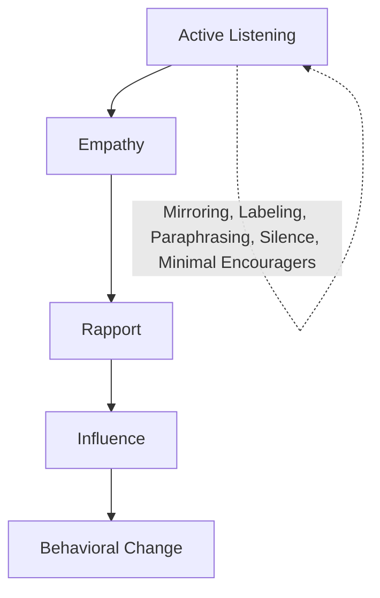
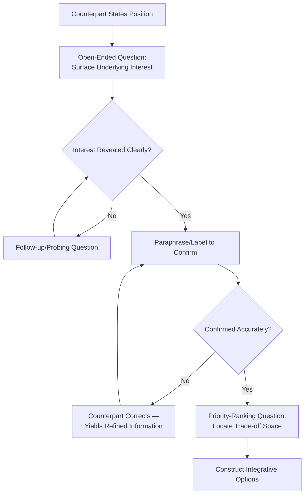

## Active Listening and Diagnostic Questioning

### Overview

Active listening and diagnostic questioning together form the primary information-elicitation apparatus of negotiation communication. Where signal reading (verbal/nonverbal analysis) is a largely observational technique, active listening and diagnostic questioning are **interventionist** techniques: the negotiator deliberately shapes the conversational structure to surface a counterpart's underlying interests, constraints, and priorities that would not otherwise be volunteered. This domain draws heavily from clinical/counseling psychology (Carl Rogers' client-centered therapy), crisis negotiation methodology (FBI/law enforcement hostage negotiation training), and principled negotiation theory (Fisher & Ury).

### Theoretical Foundations

**Rogerian Active Listening**

Carl Rogers and Richard Farson's original formulation of active listening (1957) defined it as a discipline requiring the listener to genuinely absorb and reflect the speaker's message, both content and feeling, without premature evaluation or interjection of the listener's own perspective. The core mechanism is that feeling *understood* reduces a speaker's defensiveness, which increases the volume and candor of information disclosed — a mechanism directly transferable to negotiation contexts where defensiveness normally suppresses interest disclosure.

**Interests vs. Positions (Fisher & Ury)**

Active listening and diagnostic questioning are the primary tools for executing the core prescription of *Getting to Yes*: separate stated **positions** ("I need delivery by Friday") from underlying **interests** ("I'm penalized by my client if the shipment is late, and Friday gives me a buffer"). A position is a single proposed solution; an interest is the need the position is meant to satisfy. Diagnostic questioning is the mechanism for excavating interests that positions conceal.

**Information Asymmetry and the "Diagnostic" Frame**

Framing questioning as *diagnostic* (borrowed from medical/clinical reasoning) emphasizes that the negotiator is not simply gathering ammunition for argument, but building a structured model of the counterpart's constraint set — analogous to differential diagnosis, where each question is chosen to maximally discriminate between competing hypotheses about the counterpart's true position, priorities, and flexibility.

### Components of Active Listening

**1. Attending Behavior**

Nonverbal and paraverbal signals that demonstrate engagement: sustained appropriate eye contact, open posture, minimal encouragers ("mm-hm," "I see"), and absence of interrupting or multitasking behavior. Attending behavior is a precondition for the counterpart's willingness to disclose further information — it does not itself extract information but establishes the conditions for disclosure.

**2. Paraphrasing**

Restating the counterpart's message in the listener's own words to confirm understanding and to signal that the message was received accurately.

**Example**

> Counterpart: "We can't commit to a fixed price because our raw material costs have been swinging wildly this quarter."
>
> Negotiator (paraphrase): "So the concern isn't the price level itself, it's the risk of being locked into a number that might not reflect your actual costs by the time we deliver."

Paraphrasing serves two functions simultaneously: it verifies the listener's model of the speaker's message (error-correction), and it often prompts the speaker to elaborate or correct nuance, yielding additional information.

**3. Labeling (Emotional Reflection)**

A technique emphasized in Chris Voss's *Never Split the Difference* (drawing on FBI Behavioral Change Stairway Model), labeling names the emotion or state the negotiator perceives in the counterpart, typically prefaced with tentative language ("It seems like...", "It sounds like...") to avoid the appearance of presumption.

**Example**

> "It sounds like there's real frustration about how the last vendor handled changes to this contract."

Labeling functions to (a) demonstrate empathic accuracy, which lowers defensiveness, and (b) invite confirmation or correction, which is itself diagnostic — a counterpart's correction ("It's not frustration, it's more that we got burned financially") reveals more precise interest information than the original vague statement.

**4. Summarizing**

Periodic consolidation of multiple prior statements into a coherent restatement, typically used at transition points (e.g., before moving from one issue to the next) to confirm mutual understanding and surface any unaddressed threads.

**5. Reflective Silence**

Deliberate withholding of immediate verbal response after a counterpart finishes speaking, which frequently prompts the counterpart to continue speaking and disclose additional, often less-guarded, information — a well-documented conversational phenomenon sometimes termed the "silence effect" in negotiation and interviewing literature.

### The Behavioral Change Stairway Model (BCSM)

Originating from FBI crisis negotiation training, this model sequences active listening techniques toward behavioral influence:

[Inference — the BCSM was developed for crisis/hostage negotiation contexts involving high emotional distress; its direct transfer to routine commercial or interpersonal negotiation is a widely-cited adaptation in negotiation training literature, but the model's stage sequence has not been rigorously validated as a causal pathway in business negotiation settings specifically]

### Diagnostic Questioning: Taxonomy

**Question Types by Function**

| Type | Purpose | Example |
| --- | --- | --- |
| Open-ended | Elicit broad, unconstrained information | "What's driving the timeline on your end?" |
| Closed/confirming | Verify a specific fact | "So the $10,000 figure includes installation?" |
| Calibrated ("How/What") | Extract information while granting counterpart perceived control | "How can we make this work for both of us?" |
| Probing/follow-up | Deepen a prior answer | "What happens if that deadline slips?" |
| Hypothetical | Test flexibility without commitment | "What if we extended payment terms — would that change your position on price?" |
| Interest-excavating | Surface the "why" behind a position | "Help me understand why that specific structure matters to you" |
| Priority-ranking | Identify relative importance across issues | "Between price, timeline, and payment terms, which matters most if you had to choose?" |

**Calibrated Questions (Voss Framework)**

Calibrated questions are open-ended questions beginning with "What" or "How" (deliberately avoiding "Why," which tends to trigger defensiveness by implying the counterpart must justify themselves) designed to:

- Elicit information the negotiator needs
- Give the counterpart the subjective experience of control, reducing resistance
- Implicitly transfer the burden of problem-solving onto the counterpart

**Example**

> Instead of: "Why can't you go lower on price?"
>
> Calibrated form: "What would need to be true for this price to work on your end?"

This reframing shifts the counterpart from a defensive posture (justifying a position) to a problem-solving posture (identifying conditions for agreement), which is more likely to surface actionable interest information.

**Diagnostic Questioning Flow**

### Common Pitfalls in Active Listening and Questioning

- **Premature problem-solving**: Jumping to propose solutions before interests are fully surfaced, which tends to anchor the conversation prematurely on the negotiator's framing rather than the counterpart's actual needs.
- **Leading questions**: Framing questions in a way that presupposes an answer ("You'd agree that timing isn't really the issue, right?"), which contaminates the diagnostic value of the response.
- **Why-questions triggering defensiveness**: As noted above, "why" framings can be perceived as accusatory, reducing disclosure; "what" and "how" framings are generally preferred in calibrated questioning frameworks.
- **Pseudo-listening**: Performing attending behaviors (nodding, eye contact) while mentally rehearsing a rebuttal rather than genuinely processing the counterpart's message — often detectable to the counterpart via subtle timing and content mismatches in the listener's response.
- **Over-summarizing without new inquiry**: Repeatedly paraphrasing without advancing to new diagnostic questions, which can stall information-gathering and feel performative rather than genuine.
- **Interrogation-style questioning**: A rapid sequence of closed questions can feel adversarial and suppress disclosure; interspersing open-ended and reflective techniques maintains a collaborative frame.

### Integration with Negotiation Strategy

- **Interest Mapping**: Diagnostic questioning output feeds directly into an interest map — a structured inventory of each party's underlying needs — which is the foundational input for integrative bargaining and logrolling (trading across issues of differing value to each party).
- **BATNA Assessment**: Careful questioning (e.g., "What's your timeline if this deal doesn't come together?") can yield indirect signals about a counterpart's alternatives without directly asking them to disclose their BATNA, which they would rarely do voluntarily.
- **Trust-Building**: Sustained, genuine active listening functions as a relationship-building mechanism independent of its information-extraction value, supporting long-term negotiation relationships (repeated-game contexts) where reputation and trust have compounding value.
- **De-escalation**: In high-conflict or emotionally charged negotiations, labeling and reflective listening are used specifically to reduce affective arousal before substantive bargaining resumes, consistent with crisis-negotiation applications of the BCSM.

### Practical Application Framework

1. **Preparation**: Draft 3-5 open-ended diagnostic questions targeting suspected interest gaps before the negotiation begins.
2. **Opening**: Use broad open-ended questions to map the counterpart's overall situation before narrowing to specific issues.
3. **Mid-negotiation**: Apply calibrated questions when encountering resistance or an impasse, shifting the counterpart into a collaborative problem-solving frame.
4. **Confirmation loop**: After each significant disclosure, paraphrase or label to confirm accuracy — treat corrections as high-value information rather than a communication failure.
5. **Closing**: Summarize the full set of surfaced interests and priorities before moving to option-generation, ensuring both parties share a common understanding of the problem space.

**Related Topics**

- Verbal and Nonverbal Signals in Negotiation
- Interests vs. Positions (Principled Negotiation)
- Calibrated Questioning and the Voss Method
- BATNA and Reservation Price Analysis
- Integrative Bargaining and Logrolling
- Emotional Intelligence in Negotiation
- Framing Effects and Prospect Theory in Offer Construction
- Trust-Building in Repeated Negotiation Contexts